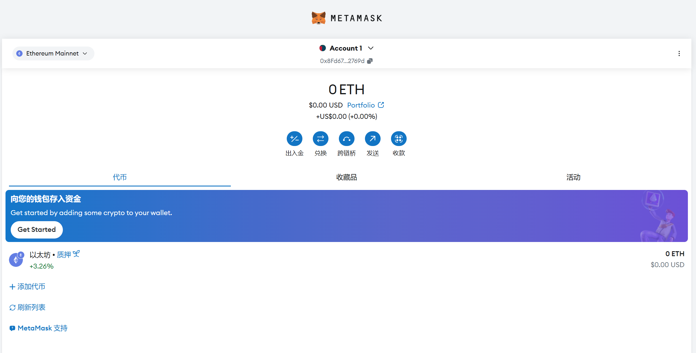

本节作者：[@愚指导](https://x.com/yudao1024)、[@小符](https://x.com/smallfu666)、[@simple](https://x.com/0xsimpleth)

连接钱包是 DApp 中最重要的交互，这一讲我们会引导你通过 [wagmi](https://wagmi.sh) 和 [Ant Design Web3](https://web3.ant.design) 来实现连接钱包的功能。

## DApp 如何连接钱包

在 DApp 中，我们需要连接钱包来获取用户的钱包地址，以及进行一些需要用户签名的操作，比如发送交易、签名消息等。连接钱包有多种方式，通常在以太坊中有如下三种方式：

- 通过浏览器插件建立连接。
- 通过在钱包 App 中访问 DApp 建立连接。
- 通过 WalletConnect 协议建立连接。

其中前面两种对于 DApp 来说都是通过钱包注入到浏览器运行环境中的接口来实现的，而 WalletConnect 则是通过服务端中转的方式来实现的。而钱包注入接口也有两种方式，一种是通过 [EIP-1193](https://eips.ethereum.org/EIPS/eip-1193) 来实现的，另一种是通过 [EIP-6963](https://eips.ethereum.org/EIPS/eip-6963) 来实现的。EIP-1193 是一个早期的协议，也比较简单，接下来我们先尝试用这种方式来和钱包建立连接。

## 注册 MetaMask 钱包

[MetaMask](https://metamask.io/) 是目前以太坊生态中用户最多的钱包插件，它提供了一个简单的方式，让用户在浏览器中管理自己的以太坊资产，同时也是 DApp 与以太坊网络交互的桥梁。如果你还没有使用过，可以在[这里下载](https://metamask.io/download/)安装，并参考官网的教程完成初始的配置。当然，你也可以使用其它钱包。比如 [TokenPocket](https://www.tokenpocket.pro/)、[imToken](https://token.im/) 等。

完成安装钱包后，可以看到如下的页面：



## 配置 MetaMask 钱包

我们以 [MetaMask](https://metamask.io/) 为例，看一下如何和 MetaMask 钱包建立连接。

```diff
import { http } from "wagmi";
- import { Mainnet, WagmiWeb3ConfigProvider } from '@ant-design/web3-wagmi';
+ import { Mainnet, WagmiWeb3ConfigProvider, MetaMask } from '@ant-design/web3-wagmi';
- import { Address, NFTCard } from "@ant-design/web3";
+ import { Address, NFTCard, Connector, ConnectButton } from "@ant-design/web3";

export default function Web3() {
  return (
    <WagmiWeb3ConfigProvider
      chains={[Mainnet]}
      transports={{
        [Mainnet.id]: http(),
      }}
+     wallets={[MetaMask()]}
    >
      <Address format address="0xEcd0D12E21805803f70de03B72B1C162dB0898d9" />
      <NFTCard
        address="0xEcd0D12E21805803f70de03B72B1C162dB0898d9"
        tokenId={641}
      />
+     <Connector>
+       <ConnectButton />
+     </Connector>
    </WagmiWeb3ConfigProvider>
  );
};
```

其中引入的内容说明如下：

- MetaMask：代表小狐狸钱包，Ant Design Web3 支持多款[钱包](https://github.com/ant-design/ant-design-web3/blob/main/packages/wagmi/src/wallets/index.ts)，方便根据需要进行配置。
- [Connector](https://web3.ant.design/components/connector-cn)：连接器，Connector 提供了一个完整的连接钱包的 UI 。
- [ConnectButton](https://web3.ant.design/components/connect-button-cn)：连接区块链钱包的按钮，配合 `Connector` 组件一起使用。

这样就完成了连接钱包的功能，点击 Connect Wallet，可以看到如下的页面：


连接完成后，可以看到如下的页面：


使用 Ant Design Web3 提供的组件可以快速的实现 DApp 的基础功能，恭喜你，我们已经实现了连接钱包的功能。

