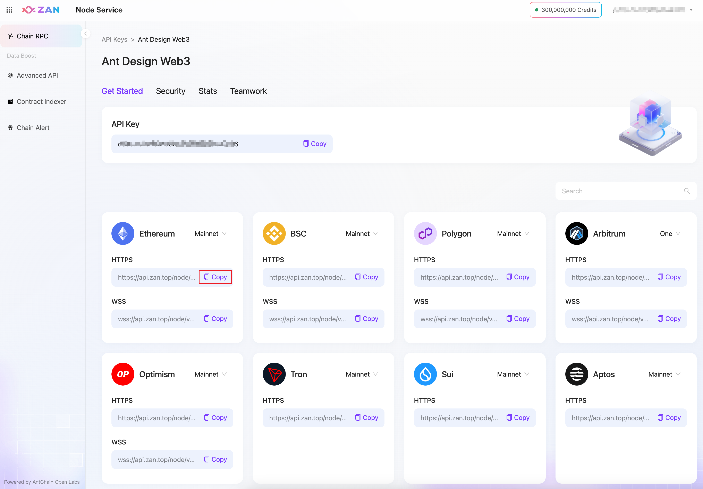

本节作者：[@愚指导](https://x.com/yudao1024)、[@小符](https://x.com/smallfu666)

节点服务是 DApp 开发必不可少的服务。这一讲，我们介绍节点服务的概念，并引导你在项目中配置好节点服务，以及通过水龙头准备好一些 Sepolia 测试网的 ETH。

## 什么是节点服务

节点服务是 DApp 开发必不可少的服务。它是一个运行在区块链网络上的服务，它可以帮助你与区块链网络进行交互。在 DApp 开发中，我们需要通过节点服务来获取区块链的数据，发送交易等。

在以太坊网络中，我们可以通过 [ZAN](https://zan.top?chInfo=wtf)、[Infura](https://infura.io/)、[Alchemy](https://www.alchemy.com/) 等服务商来获取节点服务。这些服务商都提供了免费的节点服务，当然，它们也提供了付费的服务，如果你的 DApp 需要更高的性能，你可以考虑使用它们的付费服务。

## 配置节点服务

这里以 [ZAN 的节点服务](https://zan.top/home/node-service?chInfo=wtf)为例，指引你如何配置节点服务。

首先注册并登录 [https://zan.top](https://zan.top?chInfo=wtf) 之后进入到节点服务的控制台 [https://zan.top/service/apikeys](https://zan.top/service/apikeys?chInfo=wtf) 创建一个 Key，每个 Key 都有默认的免费额度，对于微型项目来说够用了，但是对于生产环境的项目来说，请结合实际情况购买节点服务。

创建成功后你会看到如下的页面：



选择以太坊主网的节点服务地址，并将复制的地址添加到 `WagmiWeb3ConfigProvider`  的 `http()` 方法中。如下：

```diff
 <WagmiWeb3ConfigProvider
  chains={[Mainnet]}
  transports={{
-   [mainnet.id]: http(),
+   [Mainnet.id]: http('https://api.zan.top/node/v1/eth/mainnet/{YourZANApiKey}'),
  }}
 >
```

上面代码中的 `YourZANApiKey` 需要替换成你自己的 Key。另外在实际的项目中，为了避免你的 Key 被滥用，建议你将 Key 放到后端服务中，然后通过后端服务来调用节点服务，或者在 ZAN 的控制台中设置域名白名单来降低被滥用的风险。当然，在教程中你也可以继续直接使用 `http()`，使用 wagmi 内置的默认的实验性的节点服务。

同样，如果你使用的是 Infura 或者 Alchemy 的节点服务，你也可以将它们的节点服务地址添加到 `WagmiWeb3ConfigProvider` 的 `http()` 方法中。

## 从水龙头获取测试网 ETH

除了节点服务，用于测试的 ETH 也是开发中必不可少的部分。通常，我们可以通过水龙头服务来获取。水龙头（Faucet）是一种在线服务，用于提供免费的测试网加密货币（通常是小额的代币），用于在开发环境中进行测试。这些服务通常由测试网官方、开发者社区、节点服务技术供应商等提供。

比如你可以通过 [ZAN 的水龙头服务](https://zan.top/faucet?chInfo=wtf) 来获取一定量的 Sepolia 测试网 ETH 用于测试。


请在上图示意的水龙头网页中填入Sepolia测试网地址，领取适量的测试网SepoliaETH，我们在后面的课程中可能会用到。

本次领取0.01SepoliaETH


