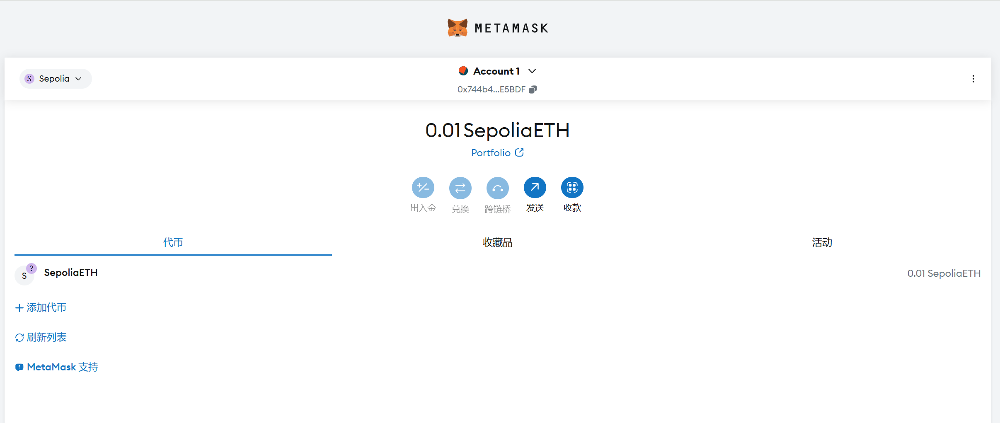
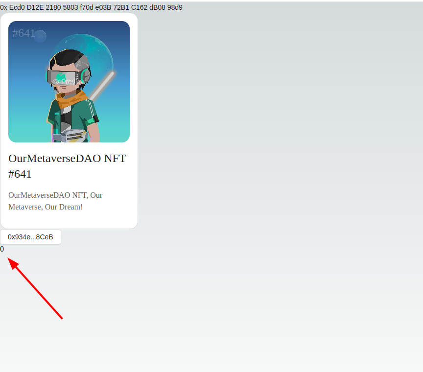

本节作者：[@愚指导](https://x.com/yudao1024)、[@小符](https://x.com/smallfu666)

DApp 的前端网站部分区别于传统 App 的地方在于，它需要和区块链进行交互。而区块链的交互主要是通过调用智能合约来实现的。在这一讲中，我们将会学习如何调用智能合约。

## DApp 如何调用智能合约

我们以 Ethereum 举例，当智能合约被部署到区块链上后，我们可以通过构建以太坊交易（Transaction），调用合约中的相应方法，前提是知道合约的 ABI 文件和合约的 HASH 地址。

> ABI 是 Application Binary Interface 的缩写，是一种二进制接口标准，用于定义智能合约的函数和参数，合约 HASH 是合约在区块链上的地址，它们都可以在部署智能合约时获得。

通过 DApp 调用合约方法一般有两种方式：通过钱包插件连接、通过节点 RPC 直接连接，我们主要介绍第一种方式。

### 通过 MetaMask 钱包

我们在前面的课程中已经安装完成 MetaMask 钱包，并领取了 0.01 SepoliaETH，在钱包中切换到 Sepolia 测试网络可以看到余额：

这里需要把钱包的网络先切换到测试网络



MetaMask 钱包安装完成后，我们可以在浏览器的右上角看到 MetaMask 的图标，同时它也会给每一个页面注入 `window.ethereum` 对象，这个对象是 DApp 与以太坊网络交互的接口，我们可以通过它来调用以太坊的 API。比如我们可以可以发起一个 `eth_chainId` 的 RPC 请求，获取当前网络的 ID：

```js
await window.ethereum.request({ method: "eth_chainId" }); // 0x1 代表以太坊主网
```

我们也可以通过下面这段代码，获取当前钱包的账户地址和其他信息：

```js
async function getAccount() {
  const accounts = await window.ethereum
    .request({ method: "eth_requestAccounts" })
    .catch((err) => {
      if (err.code === 4001) {
        // EIP-1193 userRejectedRequest error
        // If this happens, the user rejected the connection request.
        console.log("Please connect to MetaMask.");
      } else {
        console.error(err);
      }
    });
  const account = accounts[0];
  return account;
}

await getAccount(); // 你的账户地址
```

更多的钱包 RPC 和 API 可以参考 [MetaMask 官方文档](https://docs.metamask.io/guide/rpc-api.html#other-rpc-methods)。

### 通过节点 RPC

通过前面的学习，我们了解到区块链是一个去中心化的网络，我们可以通过访问其中一个节点来获取数据。以太坊网络中有很多节点，我们可以通过 [ZAN](https://zan.top/)、[Infura](https://infura.io/) 等节点服务提供商来获取 RPC 接口。

在 zan.top 提供的[文档](https://docs.zan.top/reference/eth-accounts)中，我们可以方便的测试 RPC，以及通过 RPC 调用智能合约的方法。


## 在 DApp 中实现相关代码

从 DApp 编码的角度来说，调用一个合约方法通常需要以下几个步骤：

1. 构造交易数据
2. 通过唤起钱包授权将交易数据添加签名
3. 将签名后的交易数据通过节点服务发送到区块链网络

> 注：调用只读接口时，因为不需要向区块链写入数据，所以也不需要对交易签名，可以直接通过节点服务读取到链上数据。

### 调用智能合约的读方法

配置好节点服务后，我们就可以开始调用合约了。我们使用 wagmi 提供的 [useReadContract](https://wagmi.sh/react/api/hooks/useReadContract) Hook 来读取合约数据。示例代码如下：

```diff
- import { http } from "wagmi";
+ import { http, useReadContract } from "wagmi";
import { Mainnet, WagmiWeb3ConfigProvider, MetaMask } from '@ant-design/web3-wagmi';
- import { Address, NFTCard, ConnectButton, Connector } from "@ant-design/web3";
+ import { Address, NFTCard, ConnectButton, Connector, useAccount } from "@ant-design/web3";


+ const CallTest = () => {
+  const { account } = useAccount();
+  const result = useReadContract({
+    abi: [
+      {
+        type: 'function',
+        name: 'balanceOf',
+        stateMutability: 'view',
+        inputs: [{ name: 'account', type: 'address' }],
+        outputs: [{ type: 'uint256' }],
+      },
+    ],
+    address: '0xEcd0D12E21805803f70de03B72B1C162dB0898d9',
+    functionName: 'balanceOf',
+    args: [account?.address as `0x${string}`],
+   });
+   return (
+     <div>{result.data?.toString()}</div>
+   );
+ }

export default function Web3() {
  return (
    <WagmiWeb3ConfigProvider
      chains={[Mainnet]}
      transports={{
        [Mainnet.id]: http(),
      }}
	  wallets={[MetaMask()]}
    >
      <Address format address="0xEcd0D12E21805803f70de03B72B1C162dB0898d9" />
      <NFTCard
        address="0xEcd0D12E21805803f70de03B72B1C162dB0898d9"
        tokenId={641}
      />
      <Connector>
        <ConnectButton />
      </Connector>
+     <CallTest />
    </WagmiWeb3ConfigProvider>
  );
}
```

参考以上的代码添加调用合约的 `balanceOf` 方法，我们新建了一个 `CallTest` 组件，然后在 `WagmiWeb3ConfigProvider` 内添加了这个组件。
因为 `useReadContract` 必须在 `WagmiWeb3ConfigProvider` 内部才能正常工作，所以我们不能在 `export default function Web3() {` 这一行代码下面直接使用 `useReadContract`。
在实际的项目中 `WagmiWeb3ConfigProvider` 通常应该在你项目组件的最外层，这样确保你的项目所有组件中都可以正常使用相关的 Hooks。

`balanceOf` 是用来获取某一个地址下有多少个这个合约 NFT 的方法。所以我们还需要用到 `@ant-design/web3` 提供的 `useAccount` Hook 来获取当前连接的账户地址。然后将账户地址作为 `balanceOf` 方法的参数传入，这样就可以获取到当前账户地址下有多少个 NFT 了。如果不出意外，你会得到 `0` 的结果。



代码中的 abi 字段定义了方法的类型，这样 wagmi 才能知道如何处理方法的入参和返回，把 JavaScript 中的对象转换的区块链的交易信息。通常 abi 都是通过合约代码自动生成的，我们会在下一章讲到这一部分。

### 调用智能合约的写方法

仅仅是读取合约还不够，一个真正的 DApp，肯定会涉及到向智能合约写入数据。向智能合约写入数据通常都是通过在区块链上执行智能合约的方法，方法执行过程中会改写合约中的数据。

接下来我们尝试调用下一本课程使用合约的 [mint](https://etherscan.io/address/0xEcd0D12E21805803f70de03B72B1C162dB0898d9#writeContract#F6) 方法，`mint` 方法并不是 ERC721 规范中的方法，它是该合约自行定义的。在本合约中，调用 `mint` 方法需要消耗 GAS 以及至少 `0.01ETH` 的费用来获取 NFT。

需要改动的代码如下：

```diff
+ import { parseEther } from "viem";
+ import { Button, message } from "antd";
- import { http, useReadContract } from "wagmi";
+ import { http, useReadContract, useWriteContract } from "wagmi";
import { Mainnet, WagmiWeb3ConfigProvider, MetaMask } from '@ant-design/web3-wagmi';
import { Address, NFTCard, ConnectButton, Connector, useAccount } from "@ant-design/web3";

const CallTest = () => {

// ...
+ const { writeContract } = useWriteContract();

  return (
    <div>
      {result.data?.toString()}
+      <Button
+        onClick={() => {
+          writeContract(
+            {
+              abi: [
+                {
+                  type: "function",
+                  name: "mint",
+                  stateMutability: "payable",
+                  inputs: [
+                    {
+                      internalType: "uint256",
+                      name: "quantity",
+                      type: "uint256",
+                    },
+                  ],
+                  outputs: [],
+                },
+              ],
+              address: "0xEcd0D12E21805803f70de03B72B1C162dB0898d9",
+              functionName: "mint",
+              args: [BigInt(1)],
+              value: parseEther("0.01"),
+            },
+            {
+              onSuccess: () => {
+                message.success("Mint Success");
+              },
+              onError: (err) => {
+                message.error(err.message);
+              },
+            }
+          );
+        }}
+      >
+        mint
+      </Button>
    </div>
  );
};

// ...
```

在上面的代码中，我们用到了 `viem` 这个库，它是 `wagmi` 底层依赖的一个库，你需要在项目中安装它：

```bash
npm i viem --save
```

这段代码中，我们实现了点击 `mint` 按钮后调用合约的 `mint` 方法，传入参数 `1`，在该合约的实现逻辑中，这代表要铸造一个 NFT。由于每个 NFT 铸造的价格是 `0.01 ETH`，所以我们还需要在交易中发送 `0.01 ETH` 的费用，这样才能成功铸造 NFT。所以上面会在调用合约中配置 `value: parseEther("0.01")`。在以太坊的合约方法执行中，合约并不能直接提取调用者的 ETH，所以我们需要在调用合约的时候主动发送 ETH 给合约，这是合约安全设计上的考虑。

合约调用成功和失败会有对应的提示，如果还未连接账号会抛出未连接账号的错误。所以你需要先点击我们在上一节课程中实现的连接按钮连接你的账户地址。

如果你的账户没有足够的 GAS，那么点击后会出现类似如下的错误弹窗：


如果你的账户有足够的 ETH，那么点击后会出现类似如下的授权弹窗：


点击 **拒绝** 后，不会执行合约调用，不会消耗你的任何 ETH。在下一章中，我们会指引你部署一个测试合约，在测试环境中体验完整的流程。当然如果你很富有，你也可以点击确认，这样就会执行合约调用，消耗你的 ETH，得到一个 NFT。
