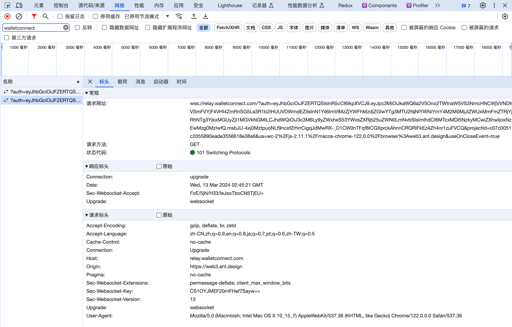

本节作者：[@愚指导](https://x.com/yudao1024)

这一讲将会介绍如何使用 [WalletConnect](https://walletconnect.com/) 来连接移动端 APP 钱包，这对提升 DApp 的用户体验至关重要。

---

## 什么是 WalletConnect

我们在之前的课程中实现了在 DApp 连接浏览器插件形式的钱包，但是很多时候用户希望使用手机上的钱包应用来连接电脑上打开的 DApp，又或者希望在手机浏览器访问 DApp 的时候也可以连接上手机上的钱包。

这种场景因为不在 PC 的浏览器中，所以无法通过浏览器插件的方式来连接钱包，而 WalletConnect 协议则是一种通过服务端中转的方式来实现钱包和 DApp 建立连接。

WalletConnect 是由同名非盈利组织 WalletConnect 基金会支持开发的一套开源协议，通过这个协议，用户可以用手机钱包应用连接 DApp，不需要安装浏览器插件。

## WalletConnect 的原理是什么

我们先来看看 WalletConnect 的协议是什么样的，它其实背后也对应了一个 EIP 的协议 [EIP-1328](https://eips.ethereum.org/EIPS/eip-1328)。

```
request       = "wc" ":" topic [ "@" version ][ "?" parameters ]
topic         = STRING
version       = 1*DIGIT
parameters    = parameter *( "&" parameter )
parameter     = key "=" value
key           = STRING
value         = STRING
```

这是一个 URI 的规范，具体内容上，1.0 和 2.0 的参数不同。

2.0 的参数如下：

- `symKey`：用于通过中继加密消息的对称密钥
- `methods`：支持的 jsonrpc 方法
- `relay-protocol`：用于中继消息服务的传输协议
- `relay-data(可选)`：用于中继消息协议的数据，可能是一些协议需要的配置信息
- `expiryTimestamp(可选)`：配对过期时的时间，通常就是中继服务对称密钥的过期时间

一个具体的样例如下：

```
wc:02c2d94b12d9fde35a149a3620544892b98ea14d45832c9bbd903af9d57d3ea9@2?expiryTimestamp=1710298160&relay-protocol=irn&symKey=8327616fa992557f5d125fe5397116c73ace7f368ac6183724052b1bcb917414
```

其中 `relay-protocol` 代表使用什么协议，通常就是 `irn`。它代表 WalletConnect 定义的一个[协议](https://specs.walletconnect.com/2.0/specs/servers/relay/relay-server-rpc)。我们来试试基于这个协议连接钱包会发生什么。

如果你观察通过 WalletConnect 连接时的 DApp 网络请求，你会发现浏览器会像 `wss://relay.walletconnect.com` 地址发送请求。



这个请求是通过 WebSocket 协议发送的，它是一个双向通信协议，所以可以实现双向通信。这个请求是通过 WalletConnect 的中继服务器来转发的，这样就实现了钱包和 DApp 之间的连接。`wss://relay.walletconnect.com` 地址是 `irn` 协议默认的地址。你也可以参考 WalletConnect 的官方文档构建自己的中继服务器。

从 [EIP-1328](https://eips.ethereum.org/EIPS/eip-1328) 定义的角度来看，WalletConnect 2.0 是一个很灵活的协议，它只是简单定义了一个 URI 的规范。但是具体的 `irn` 协议就包含了更多的细节，比如消息的格式，消息的加密方式，消息的传输协议等等。目前大部分的钱包也都是支持 `irn` 协议，所以通常来说我们也是使用该协议建立连接。但是当我们提到 WalletConnect 协议的时候，可能往往包含了 `irn` 协议的内容。协议本身比较复杂，但是对于 DApp 来说，通常不需要关心，接下来让我们看看在 DApp 中如何支持 WalletConnect。

## 如何使用 WalletConnect

接下来我们引导你在本课程的 DApp 中使用 WalletConnect 来连接钱包。

在 wagmi 中通过[集成 WalletConnect 的 SDK](https://wagmi.sh/core/api/connectors/walletConnect) 内置支持了 WalletConnect，我们结合 Ant Design Web3 提供的 [ConnectModal](https://web3.ant.design/components/connect-modal-cn) 组件可以简单的接入 WalletConnect。

首先我们需要在 wagmi 的配置中添加 `walletConnect`。

```diff
- import { injected } from "wagmi/connectors";
+ import { injected, walletConnect } from "wagmi/connectors";

const config = createConfig({
  chains: [mainnet],
  transports: {
    [mainnet.id]: http(),
  },
  connectors: [
    injected({
      target: "metaMask",
    }),
+    walletConnect({
+      projectId: 'c07c0051c2055890eade3556618e38a6',
+      showQrModal: false,
+    }),
  ],
});
```

上面代码中的 `projectId` 是 Ant Design Web3 提供的测试项目 ID，实际项目中你需要在 [https://cloud.walletconnect.com/](https://cloud.walletconnect.com/) 申请自己的 ID。`showQrModal` 配置是为了关闭 ConnectModal 的默认弹窗，避免出现重复的弹窗。

添加了 `walletConnect` 之后其实就可以直接使用了，Ant Design Web3 会自动检测到钱包是否支持 WalletConnect，如果支持的话就会在未安装插件钱包的情况下在 ConnectModal 中显示二维码出来，供用户扫码连接。


你也可以继续添加一个单独的 WalletConnect 的钱包选择：

```diff
import {
  Address,
  ConnectButton,
  Connector,
  NFTCard,
  useAccount,
} from "@ant-design/web3";
import {
  MetaMask,
  WagmiWeb3ConfigProvider,
+  WalletConnect,
} from "@ant-design/web3-wagmi";
import { Button, message } from "antd";
import { parseEther } from "viem";
import { createConfig, http, useReadContract, useWriteContract } from "wagmi";
import { mainnet } from "wagmi/chains";
import { injected, walletConnect } from "wagmi/connectors";

//...

export default function Web3() {
  return (
    <WagmiWeb3ConfigProvider
      config={config}
-      wallets={[MetaMask()]}
+      wallets={[MetaMask(), WalletConnect()]}
    >
      <Address format address="0xEcd0D12E21805803f70de03B72B1C162dB0898d9" />
      <NFTCard
        address="0xEcd0D12E21805803f70de03B72B1C162dB0898d9"
        tokenId={641}
      />
      <Connector>
        <ConnectButton />
      </Connector>
      <CallTest />
    </WagmiWeb3ConfigProvider>
  );
}
```

完整的代码你可以在 [web3.tsx](./web3.tsx) 中找到。


