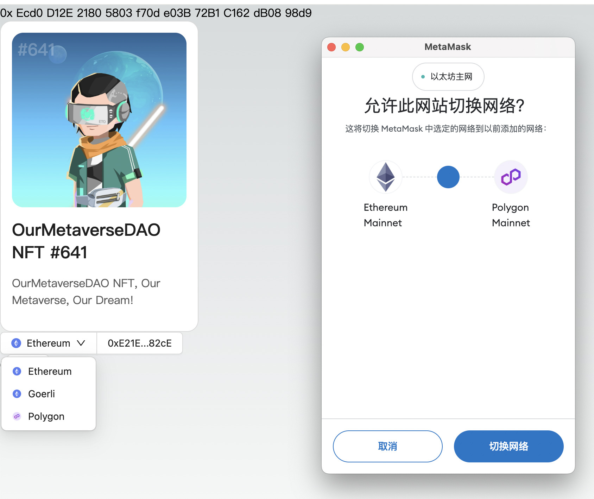

以太坊除了有主网和测试网以外还有丰富的 L2 生态，对于有的 DApp 来说可能需要连接不同的链。这一讲将会指引开发者如何在 DApp 中连接多条链。

---

## 多链

DApp 支持多链是指能够在多个区块链平台上运行或与之交互。这意味着 DApp 不仅限于单一的区块链生态系统，而是可以跨越不同的区块链，利用各个平台的特点和优势，以提供更广泛的功能、更好的用户体验或更高的效率。可以使用户利用在一个区块链上的资产，在另一个区块链上进行操作。例如，用户可以将某区块链上的代币通过跨链技术（如区块链桥）转移到另一个区块链上， DApp 可以在这两个链上识别并使用这些资产。不同的区块链平台具有不同的技术特性和优势，比如交易速度、费用等。每个链都有其自身的用户社区，支持多链也可以帮助 DApp 将这些不同社区的用户聚集起来。

### 实现

实现 DApp 支持多链通常需要开发者使用一些特定的技术和工具，比如跨链桥、智能合约多版本管理、以及可能的链间通讯协议等。虽然这可能会增加开发和维护的复杂性，但鉴于其带来的多元化和扩展性优势，越来越多的 DApp 选择支持多个区块链。

### 代码

我们以一个多链的 NFT 合约为例，为了使 NFT 支持多链，通常需要使用以下几种技术或方法：

1. 跨链桥：这是最常见的方法之一，跨链桥允许不同区块链之间的资产转移。通过这样的桥，NFT可以从一个链“包装”并转移到另一个链，用户可以在目标链上使用对应的“包装”资产。
2. 侧链：侧链是主链的辅助链，可用于扩展主链的功能。NFT可以在主链和它的侧链之间转移，从而在多个相关联的区块链之间实现流动性。
3. 跨链协议：跨链协议例如Cosmos或Polkadot，旨在不同区块链之间创建可互操作的生态系统。通过这些协议，NFT可以在兼容的区块链网络之间轻松地移动。
4. 多链智能合约：某些NFT项目开发了能在多个区块链上运行的智能合约。这些合约确保即便NFT在不同的区块链上，其属性和所有权记录仍然是一致的。
5. 分散式身份和元数据存储服務：例如使用IPFS（InterPlanetary File System）等分散式文件存储系统来存储NFT的元数据或内容。这样可以确保尽管NFT代币本身可能在不同的区块链上存在，其链接的内容却是统一和持久的。

在前边的 [第四讲](./04_CallContract/readme.md) 和 [第五讲](./05_Events/readme.md) 中我们已经学习过了合约的调用和事件监听，那我们就在这个基础上继续学习支持多链，改造代码如下：
``` diff
import { createConfig, http, useReadContract, useWriteContract } from "wagmi";
- import { mainnet, goerli } from "wagmi/chains";
+ import { mainnet, goerli, polygon } from "wagmi/chains";
import {
  WagmiWeb3ConfigProvider,
  MetaMask,
  Goerli,
+ Polygon
} from "@ant-design/web3-wagmi";
import {
  Address,
  NFTCard,
  Connector,
  ConnectButton,
  useAccount,
+ useProvider
} from "@ant-design/web3";
import { injected } from "wagmi/connectors";
import { Button, message } from "antd";
import { parseEther } from "viem";

const config = createConfig({
- chains: [mainnet, goerli],
+ chains: [mainnet, goerli, polygon],
  transports: {
    [mainnet.id]: http(),
    [goerli.id]: http(),
+   [polygon.id]: http(),
  },
  connectors: [
    injected({
      target: "metaMask",
    }),
  ],
});

+ const contractInfo = [
+  {
+    id:1,
+    name: "Ethereum",
+    contractAddress: "0xEcd0D12E21805803f70de03B72B1C162dB0898d9"
+  }, {
+    id:5,
+    name: "Goerli",
+    contractAddress: "0x418325c3979b7f8a17678ec2463a74355bdbe72c"
+  }, {
+    id:137,
+    name: "Polygon",
+    contractAddress: "0x418325c3979b7f8a17678ec2463a74355bdbe72c"
+  }
+ ]

const CallTest = () => {
  const { account } = useAccount();
+ const { chain } = useProvider();
  const result = useReadContract({
    abi: [
      {
        type: "function",
        name: "balanceOf",
        stateMutability: "view",
        inputs: [{ name: "account", type: "address" }],
        outputs: [{ type: "uint256" }],
      },
    ],
-   // Goerli test contract 0x418325c3979b7f8a17678ec2463a74355bdbe72c
-   address: "0xEcd0D12E21805803f70de03B72B1C162dB0898d9",
+   address: contractInfo.find((item) => item.id === chain?.id)?.contractAddress as `0x${string}`,
    functionName: "balanceOf",
    args: [account?.address as `0x${string}`],
  });
  const { writeContract } = useWriteContract();

  return (
    <div>
      {result.data?.toString()}
      <Button
        onClick={() => {
          writeContract(
            {
              abi: [
                {
                  type: "function",
                  name: "mint",
                  stateMutability: "payable",
                  inputs: [
                    {
                      internalType: "uint256",
                      name: "quantity",
                      type: "uint256",
                    },
                  ],
                  outputs: [],
                },
              ],
-             address: "0xEcd0D12E21805803f70de03B72B1C162dB0898d9",
+             address: contractInfo.find((item) => item.id === chain?.id)?.contractAddress as `0x${string}`,
              functionName: "mint",
              args: [1],
              value: parseEther("0.01"),
            },
            {
              onSuccess: () => {
                message.success("Mint Success");
              },
              onError: (err) => {
                message.error(err.message);
              },
            }
          );
        }}
      >
        mint
      </Button>
    </div>
  );
};

export default function Web3() {
  return (
    <WagmiWeb3ConfigProvider
      config={config}
-     chains={[Goerli]}
+     chains={[Goerli, Polygon]}
      wallets={[MetaMask()]}
    >
      <Address format address="0xEcd0D12E21805803f70de03B72B1C162dB0898d9" />
      <NFTCard
        address="0xEcd0D12E21805803f70de03B72B1C162dB0898d9"
        tokenId={641}
      />
      <Connector>
        <ConnectButton />
      </Connector>
      <CallTest />
    </WagmiWeb3ConfigProvider>
  );
}
```
当我们点击链切换为 `Polygon` 时，就可以看到如下弹窗：



`@ant-design/web3` 提供的 `useProvider` 能力，则可以拿到当前链的信息，我们通过切换的链ID去找到我们在 `contractInfo` 里存的不同链的合约地址，去获取余额和点击 `mint` 按钮发到不同的链和相应的合约地址。
