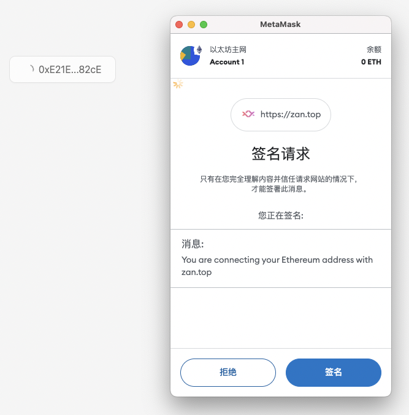
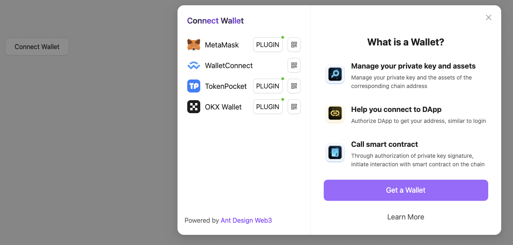

签名和验签是重要的功能，这一讲会介绍如何在客户端实现签名，并在服务端验证它。

---

## 签名

在 DApp 中，通常是基于区块链地址来构建用户体系的，一个区块链地址代表一个用户。传统的应用我们通常用密码、手机验证码等方式来验证用户。那么在 DApp 中，我们如何来验证操作者确实是某个区块链地址的所有者呢？

我们在前面的课程中实现了通过唤起用户的钱包来连接某个区块链地址，这样在 DApp 中就可以获取这个地址信息了。这样可以证明用户有用这个地址吗？我们可以在链接上用户地址后就允许用户操作 DApp 中的相关资产吗？

如果资产是在区块链上，那或许是可以的，因为智能合约的调用都需要地址对应的私钥签名认证。但是并非所有的资产都是在链上，如果你的 DApp 需要操作传统数据库中的用户资产，那么必须要确保当前操作的用户拥有相关权限。

然而只是连接上钱包是不可靠的，因为调用钱包获取到地址的接口可能会被客户端伪造。所以我们需要让用户通过签名来验证身份，用户通过他的私钥对某一条消息进行签名，DApp 的服务端通过公钥进行验证，这样才能确保用户的操作权限。

签名的作用仅仅是验证你的身份。只知道地址并不能验证你真的是你，因为这是可以被冒充的。签名的过程只是通过私钥对一些信息进行加密，然后服务器去解密，对结果进行对比。

### 实现

通常用于实现的方式有签名一条固定的消息或者随机字符串等等，如果是随机字符串，前端通过接口获取随机字符串，然后对其随机字符串进行签名，将签名后的字符串和地址作为参数提交给后台去进行验证。下面是一般的UI效果：



### 代码

我们通过 [Ant Design Web3](https://web3.ant.design/) 先进行 [连接钱包](../03_ConnectWallet/readme.md)



把逻辑处理收进 `DemoInner` 统一处理：

``` diff
import React from 'react';
- import { Address, ConnectButton, Connector, NFTCard } from "@ant-design/web3";
import { MetaMask, WagmiWeb3ConfigProvider } from "@ant-design/web3-wagmi";
import { createConfig, http } from 'wagmi';
import { mainnet } from 'wagmi/chains';
+ import DemoInner from './DemoInner';


const config = createConfig({
  chains: [mainnet],
  transports: {
    [mainnet.id]: http(),
  },
  connectors: [
    injected({
      target: "metaMask",
    }),
  ],
});
const Demo:React.FC = () => {
  return (
    <WagmiWeb3ConfigProvider config={config} wallets={[MetaMask()]}>
+       <DemoInner />
-           <Address format address="0xEcd0D12E21805803f70de03B72B1C162dB0898d9" />
-           <NFTCard
-             address="0xEcd0D12E21805803f70de03B72B1C162dB0898d9"
-             tokenId={641}
-           />
-           <Connector>
-         <ConnectButton />
-      </Connector>
    </WagmiWeb3ConfigProvider>
  );
}
export default Demo;

```

在 `DemoInner` 组件内写入方法

``` tsx
import React from 'react';
import { ConnectButton, Connector } from '@ant-design/web3';
import { useAccount, useSignMessage } from 'wagmi';
import { message } from 'antd';
import { useLatest } from 'ahooks';

const DemoInner:React.FC = () => {
  const { signMessageAsync } = useSignMessage();
  const { address } = useAccount();
  const addressRef = useLatest(address);
  const [signLoading, setSignLoading] = React.useState<boolean>(false);

  const doSignature = async () => {
    setSignLoading(true);
    try {
      const signature = await signMessageAsync({
        message: 'You are connecting your Ethereum address with zan.top',
      });
      await runConnectEthAddress({
        chainAddress: addressRef.current,
        signature,
      });
    } catch (error: any) {
      message.error(`Signature failed: ${error.message}`);
    }
    setSignLoading(false);
  };

  const runConnectEthAddress = async (params: { chainAddress?: string; signature: string }) => {
    try {
      const response = await fetch('/api/submitInfo', {
        method: 'POST',
        headers: { 'Content-Type': 'application/json' },
        body: JSON.stringify(params),
      })
      const result = await response.json();
      if (result.data) {
        message.success('Signature success');
      } else {
        message.error('Signature failed');
      }
    } catch (error) {
      message.error('An error occurred');
    }
  }
  return (
    <div>
      <Connector
        onConnected={doSignature}
        modalProps={{
          group: false,
        }}
      >
        <ConnectButton loading={signLoading} />
      </Connector>
    </div>
  );
}
export default DemoInner;
```
在 `Connector` 里写入 `onConnected` 当我们连接钱包成功之后就会调起 `doSignature` 方法，在这里我们用到了 `wagmi` 的 `useSignMessage` 的hooks。当执行 `signMessageAsync` 后可以得到已经签名过的固定的消息，`signature: 0xf7960a0d29b9771e67c3070dd371444f4c37e35e11395877a1f36f93a8065117512d57148b0f4d4d56ec17383818ddf70347c76df9e414b7aaab3ed81ab955111b` 和 地址信息 `address: 0xE21E97Ad8B527acb90F0b148EfaFbA46625382cE`.

然后我们就把签名得到的结果和我们登录的地址一起通过接口在 `runConnectEthAddress` 方法里发给后端同学。

## 验签
关于后端的验签，一般依赖 `wagmi` 或者 `ethers` 等库。

如 `wagmi` 实现： 
``` ts
// /app/api/submitInfo.ts
import { NextRequest, NextResponse } from "next/server";
import { verifyMessage } from '@wagmi/core'

export async function POST(req: NextRequest, res: NextResponse) {
  try {
    const body = await req.json();
    const result = await verifyMessage(config, {
      address: body.chainAddress,
      message: 'You are connecting your Ethereum address with zan.top',
      signature: body.signature
    })
    return NextResponse.json({ data: result });
  } catch (err) {
    return NextResponse.error();
  }
}
```
如果更擅长 `ethers` 可以换成以下代码实现：
``` tsx
const verifyMessage = async (signerAddress, signature) => {
  const recoveredAddress = ethers.utils.verifyMessage('You are connecting your Ethereum address with zan.top', signature);
  return recoveredAddress === signerAddress;
};
```

对于 `DApp` 或者 `Web3` 的开发，设计的用户验证通常的机制就是通过签名消息来实现。你学会了吗～
