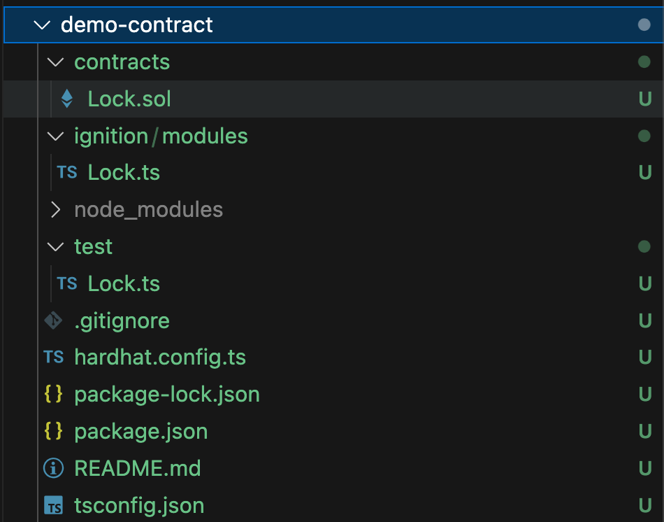
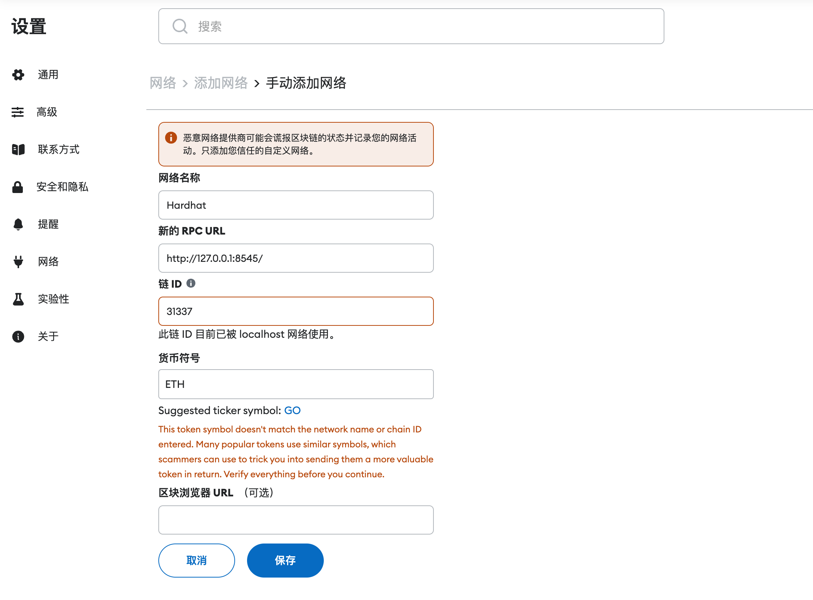

在前面的课程中，我们基于 Remix 尝试了通过 CloudIDE 进行合约开发。在本地开发环境中，我们可以使用更多的工具来提高开发效率，比如使用 Git 来进行版本管理。这一讲将会引导大家在本地开发和调试合约，以及编写单元测试来验证智能合约的逻辑。

---

## 初始化项目

以太坊的生态有着丰富的开发工具，比如 [Hardhat](https://hardhat.org/)、[Foundry](https://getfoundry.sh/) 等。这里我们将使用 Hardhat 来搭建本地开发环境，将本课程之前开发的合约迁移到本地环境中。

我们参考 [hardhat 的快速开始文档](https://hardhat.org/hardhat-runner/docs/getting-started) 执行如下命令快速初始化一个项目：

```bash
mkdir demo-contract
cd demo-contract
npx hardhat@2.22.3 init
```

和[第一章](../01_QuickStart/readme.md)初始化 NextJS 项目类似，`npx` 是安装完成 NodeJS 后自带的命令，如上命令会自动下载 [hardhat npm 包](https://www.npmjs.com/package/hardhat) 并执行 `init` 命令。使用 `2.22.3` 版本是因为它是本课程编写时的最新版本，这样可以保证你的环境和本课程一致。当然你也可以去掉版本号使用最新版。

我们选择第三项，使用 Typescript + viem，和我们之前课程的技术栈保持一致。


创建完成后你会得到如下的目录结构：



每一部分文件的作用如下：

- `contracts`：存放 Solidity 合约代码。
- `test`：存放测试代码。
- `ignition`：合约部署脚本，比如定义合约部署的参数等。
- `hardhat.config.ts`：Hardhat 配置文件。

## 本地开发和调试

初始化项目时会自动安装依赖，如果没有安装，可以执行 `npm i` 重试。安装完成后执行下面命令即可编译合约：

```bash
npx hardhat compile
```

执行下面命令可以执行测试样例：

```bash
npx hardhat test
```

然后执行下面命令在本地启动一个用于调试的测试网络：

```bash
npx hardhat node
```

启动之后你会看到会默认给你分配一些地址用于调试，接下来你可以将合约部署到本地节点上：

```bash
npx hardhat ignition deploy ./ignition/modules/Lock.ts --network localhost
```

部署成功后你可以在本地的测试网络日志中看到相关交易信息：


至此，我们本地的环境就搭建好了，接下来我们试试把之前写的 NFT 放到本地环境并调试。

## 迁移合约

我们将之前课程的合约代码 [MyToken.sol](../07_ContractDev/MyToken.sol) 复制过来，放到 `contracts` 目录下，删掉原有的 `Lock.sol` 示例代码。

合约中依赖了 `@openzeppelin/contracts`，我们需要安装这个依赖：

```bash
npm install @openzeppelin/contracts --save
```

我们参考 `test/Lock.ts` 也写一个测试文件 `test/MyToken.ts`，内容如下：

```ts
import { loadFixture } from "@nomicfoundation/hardhat-toolbox-viem/network-helpers";
import { expect } from "chai";
import hre from "hardhat";

describe("MyToken", function () {
  async function deployFixture() {
    const token = await hre.viem.deployContract("MyToken");
    return {
      token,
    };
  }

  describe("ERC721", function () {
    describe("name", function () {
      it("Get NFT name", async function () {
        const { token } = await loadFixture(deployFixture);
        expect(await token.read.name()).to.equal("MyToken");
      });
    });
  });
});
```

该测试样例调用了合约的 `name` 方法获取 NFT 的名称。`name` 是在 ERC721 规范中定义的 NFT 合约的的方法。

我们继续新增 `ignition/modules/MyToken.ts` 用于部署，内容如下：

```ts
import { buildModule } from "@nomicfoundation/hardhat-ignition/modules";

const MyTokenModule = buildModule("MyTokenModule", (m) => {
  const lock = m.contract("MyToken");

  return { lock };
});

export default MyTokenModule;
```

执行 `npx hardhat test` 测试合约，这个过程会自动执行合约编译。

然后我们执行下面命令部署合约：

```bash
npx hardhat ignition deploy ./ignition/modules/MyToken.ts --network localhost
```

部署成功后我们尝试在之前的 NFT 项目中调用合约，请先参考之前的课程启动 NextJS 的前端项目。

在代码中添加一个 `Hardhat` 网络：

```diff
- import { mainnet, goerli, polygon } from "wagmi/chains";
+ import { mainnet, goerli, polygon, hardhat } from "wagmi/chains";

// ...

const config = createConfig({
-  chains: [mainnet, goerli, polygon],
+  chains: [mainnet, goerli, polygon, hardhat],
  transports: {
    [mainnet.id]: http(),
    [goerli.id]: http(),
    [polygon.id]: http(),
+    [hardhat.id]: http("http://127.0.0.1:8545/"),
  },
  connectors: [
    injected({
      target: "metaMask",
    }),
    walletConnect({
      projectId: "c07c0051c2055890eade3556618e38a6",
      showQrModal: false,
    }),
  ],
});

const contractInfo = [
  {
    id: 1,
    name: "Ethereum",
    contractAddress: "0xe7f1725E7734CE288F8367e1Bb143E90bb3F0512",
  },
  {
    id: 5,
    name: "Goerli",
    contractAddress: "0x418325c3979b7f8a17678ec2463a74355bdbe72c",
  },
  {
    id: 137,
    name: "Polygon",
    contractAddress: "0x418325c3979b7f8a17678ec2463a74355bdbe72c",
  },
+  {
+    id: hardhat.id,
+    name: "Hardhat",
+    contractAddress: "0x5FbDB2315678afecb367f032d93F642f64180aa3", // 这里需要替换为你本地部署后获得的地址
+  },
];

// ...

export default function Web3() {
  return (
    <WagmiWeb3ConfigProvider
      config={config}
      wallets={[MetaMask(), WalletConnect()]}
      eip6963={{
        autoAddInjectedWallets: true,
      }}
      chains={[
        Goerli,
        Polygon,
+        {
+          ...Goerli,
+          name: "Hardhat",
+          id: hardhat.id,
+        },
      ]}
    >
      <Address format address="0xEcd0D12E21805803f70de03B72B1C162dB0898d9" />
      <NFTCard
        address="0xEcd0D12E21805803f70de03B72B1C162dB0898d9"
        tokenId={641}
      />
      <Connector>
        <ConnectButton />
      </Connector>
      <CallTest />
    </WagmiWeb3ConfigProvider>
  );
}
```

对应的你需要在 MetaMask 中添加该网络：



你可以用 `npx hardhat node` 启动时控制台显示的私钥导入测试账号到 MetaMask，感受一下拥有 10000ETH 的快乐。

然后打开本地启动的前端页面 [http://localhost:3000/web3](http://localhost:3000/web3)，切换网络到 Hardhat，就可以愉快的 Mint NFT 了。


需要注意的是，如果你重启了本地的 Hardhat 测试网络，可能会看到 MetaMask 连接本地 RPC 是出现类似 `Received invalid block tag 1. Latest block number is 0` 这样的错误，你需要在 MetaMask 的账号高级设置中点击 `清除活动和 nonce 数据` 来修复该问题。
