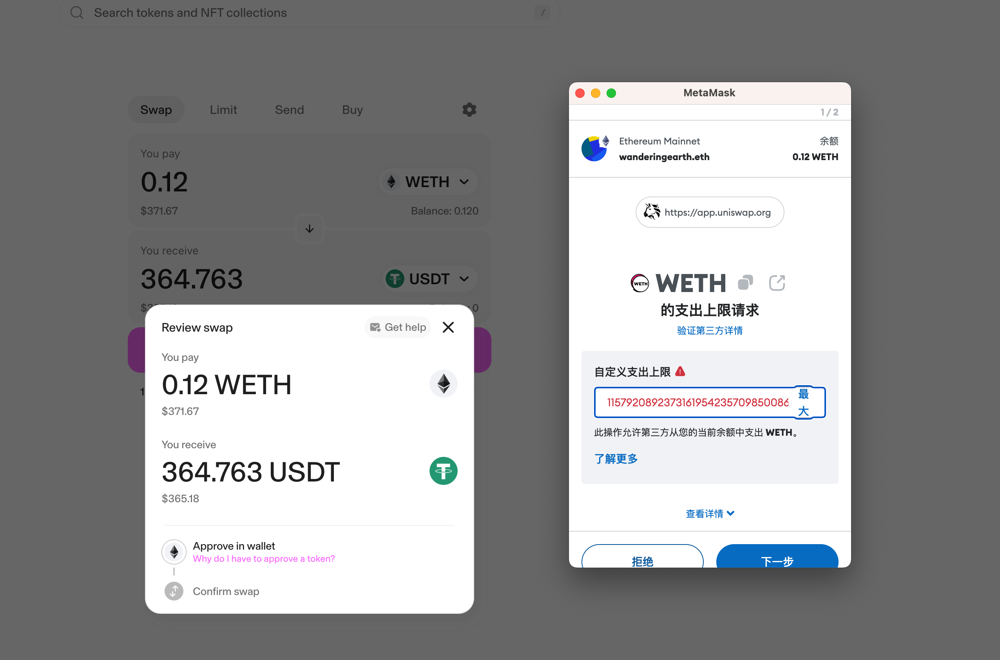
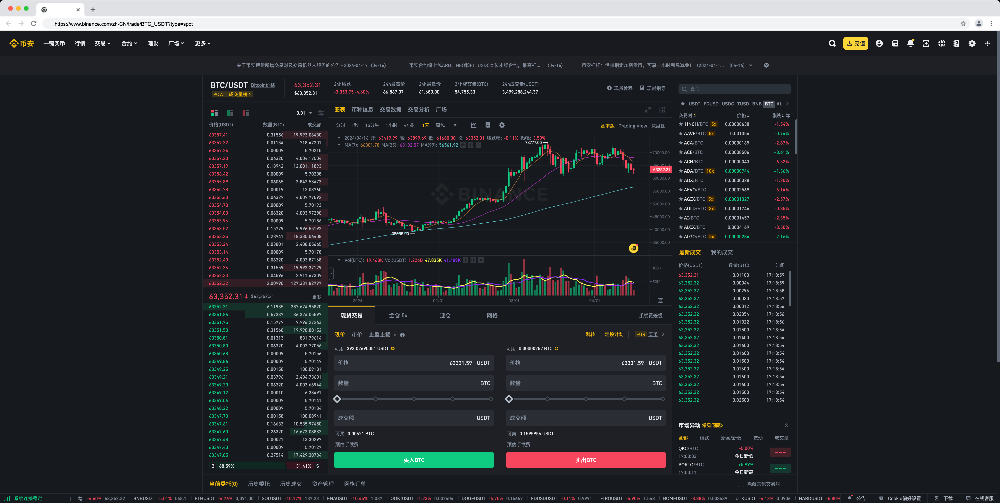

这一讲我们会介绍什么是去中心化交易所（DEX），以及它的一些关键特质和相关概念，让你可以从产品逻辑上理解 DEX，为后面的开发实战做好概念上的认识。

---

## 什么是去中心化交易所（DEX）？

[Uniswap](https://app.uniswap.org/) 和 [Blur](https://blur.io/) 就是典型的两个去中心化交易所。前者主要用于交易代币, 后者主要用于交易 NFT。当然，这并不是绝对的，比如 Uniswap 现在也可以用于交易 NFT。

为什么说它们是去中心化交易所呢？这是如何判断的呢？

其中最简单的判断方法就是看交易是否是通过智能合约处理，而不是通过中心化的服务器处理。如果是通过智能合约处理，那么这个交易所就是去中心化交易所。

当你通过 Uniswap 来交易代币时，网站会请求你连接钱包，然后通过钱包来签名交易，最后通过智能合约来完成交易。这个过程中，Uniswap 并没有自己的服务器来处理交易，而是通过智能合约来处理交易。即便是 Uniswap 的网站服务器挂了，或者某一天 Uniswap 的所有员工突然穿越到古埃及捡贝壳去了，你依然可以通过调用自动合约来完成交易。

如上图所示，当你在 Uniswap 上面发起交易时，本质上就是调用合约，Uniswap 的网站仅仅是一个用户界面，用来帮助你调用合约。所以理论上来说你也可以搭建一个自己的网站，然后调用 Uniswap 的合约来完成交易。

和去中心化相对应的便是类似[币安](https://www.binance.com/zh-CN)、[OKX](https://www.okx.com/zh-hans) 这样的中心化交易所。

上图是币安交易页面的截图，你通过邮箱注册、实名认证、绑定手机、设置密码等一系列操作，然后通过币安的服务器来完成交易。这个过程中，币安的服务器是中心化的，如果币安的服务器挂了，那么你就无法完成交易。

当然，目前来看中心化的交易所似乎功能更强大，速度和效率也更快，那为什么还要去中心化呢？除了避免服务器挂掉的问题，去中心化交易所的优势是什么呢？

很多人可能想到的第一点就是安全性，资产在中心化的交易所中更安全。当然，这是一个重要的优势，但不是唯一的优势。接下来就让我们来继续看看为什么我们需要去中心化交易所。

## 为什么需要去中心化交易所

2022 年 11 月，全球第二大加密货币交易所 FTX 破产，引发全行业震动。美国证券交易委员会（SEC）调查后发现，自 FTX 创立以来，其创始人就开始挪用客户资金。

除了中心化控制可能带来的安全性问题之外，在中心化交易所掌控的交易体系下，利率和手续费的控制也都是中心化交易所的弊端。这一点不仅仅是对于交易所而言，对于各种金融服务其实也有类似的问题。大的银行和机构可能会对金融实现一定程度的控制，这也是为什么 DeFi（去中心化金融）受到欢迎的原因之一。而去中心化交易所正是 DeFi 中的一个重要组成部分。

此外，去中心化交易所还更高效。它 24 小时不间断运作，交易公开透明。也更容易和其他 DeFi 项目进行整合，比如和借贷协议整合，实现更多的金融服务。而这些服务都是通过开放的、透明的智能合约来实现的。这就使得搭建这些金融服务的成本变得更低，效率更高。

比如，假设某个项目想要发行自己的资产供用户交易。如果是传统的交易所，那么你可能需要和交易所签订合同，需要研发人员对接系统，这样的流程繁琐而不可靠。然而在去中心化交易所中，你需要两步即可。第一步是讲自己的资产通过智能合约发布到链上，第二步是将自己的资产加入到去中心化交易所的流动性池中，这样就可以实现用户交易了。

我们可以想象到，未来伴随着 DeFi 的发展，金融服务会变得越来越便捷，区块链技术将会重塑金融服务的格局。而去中心化交易所也会越来越重要，它是整个去中心化的金融体系下的重要基础设施。

## 实现一个去中心化交易所需要考虑的问题

那实现一个去中心化的交易所需要做到什么呢？

显然，除了用户操作页面外，最重要的就是智能合约了。智能合约是去中心化交易所的核心，它负责处理用户的交易请求，保证交易的安全和透明。对于一个要处理交易的智能合约来说，最重要的无疑就是怎么做到各种资产**在合适的时间以合适的价格安全地完成交易**。

对于 Blur 这样的 NFT（非同质化代币） 交易所来说这一点要简单一些，卖方指定一个价格，授权合约出售，买方再授权合约购买，合约完成交易。或者反过来买家出价，卖家售出。逻辑通过智能合约保障，在交易过程中不需要三方担保，而是由智能合约来管理资金和资产。

但是这种交易模式对于 FT（同质化代币）交易来说就不够了，因为它非常低效，流动性很差。NFT 因为每一个资产都是独一无二的，更偏收藏属性，对流动性和交易效率要求不高（当然这也不是绝对的，伴随 NFT 的发展，NFT 的流动性要求也越来越高）。**但是 FT 的交易就不一样了，因为 FT 的交易是大量的，流动性要求很高，这就需要一个更高效的交易模式。这就好像艺术品交易和股票交易的区别一样，前者是高价值低流动性，后者是低价值高流动性。**在后面的课程中，如果没有做特别说明，我们说的去中心化交易所也就是指的后者。也就是类似 Uniswap 这样的交易所，课程也是围绕这个展开。

所以针对这样的去中心化代币交易所，我们需要一个更高效的交易模式，这就是 AMM（自动化做市商）。从技术上来讲，AMM 其实就是智能合约要实现的交易逻辑，它要负责处理用户的交易请求，去管理资金池，去计算价格，去保证有足够的流动性去完成交易。

简单来说，我们可以通过引入流动性提供者（Liquidity Provider），它们可以将一对资产存入资金池，并给出一个初始定价。对于交易者来说，他不用像 NFT 交易一样等待买家，而是可以在这个流动性池子中随时买卖，而资产价格的变化则由持续的交易行为来决定。而 LP（流动性提供者）在这个过程中者可以获得激励。如下图所示，LP 提供了 ETH 和 USDT 的流动性，把资产存入 DEX 的智能合约，智能合约负责计算价格，用户可以在任何时间以合适的价格完成交易。

所以接下来的课程中我们需要实现的逻辑有：

- LP 提供并管理流动性的功能，包括合约和前端页面的设计和实现。
- 用户交易的逻辑和页面的设计和实现。
- AMM 的算法，这里会设计到较多细节，如何保障 LP 和交易用户的利益，需要考虑众多的内容，我们会在后面的课程逐步展开。
