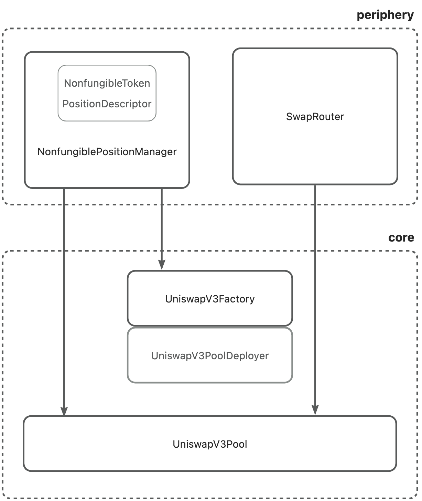
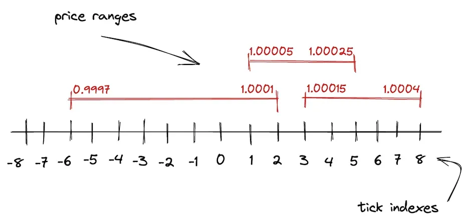
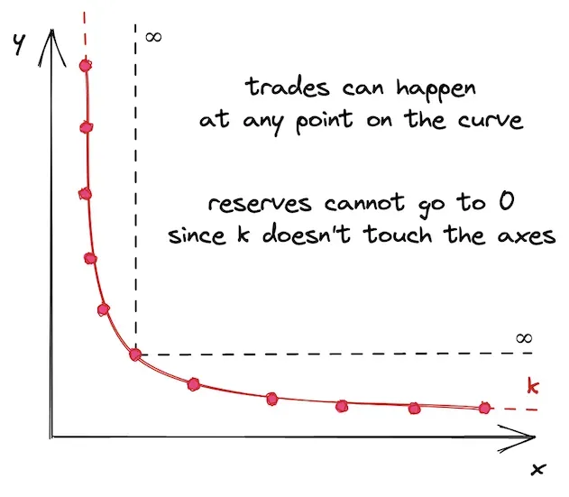
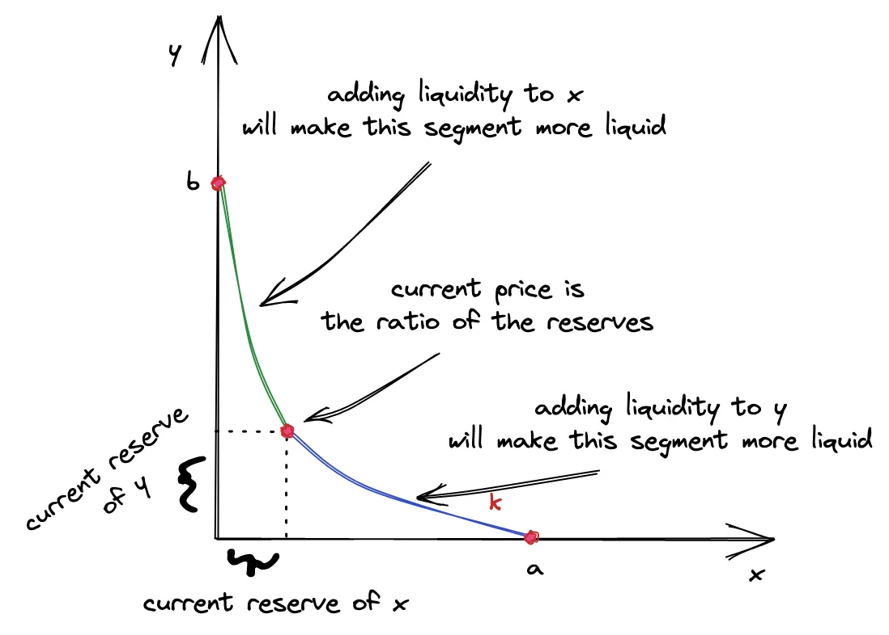
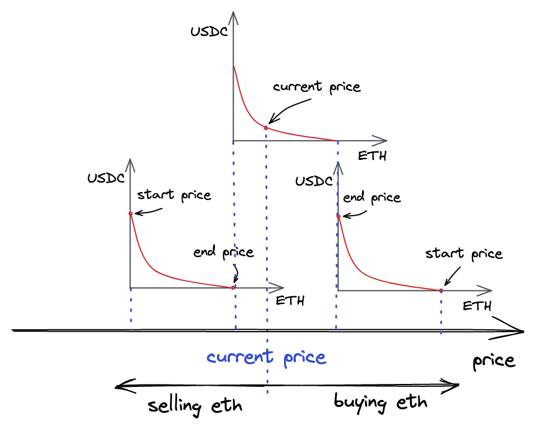

这一讲我们正式走进 Uniswap 的代码解析，准确来说是 Uniswap V3，通过阅读本节，你可以了解到：
1. 什么是 Uniswap，Uniswap 推出了哪些版本，为什么要解析 V3 版本；
2. Uniswap V3 由哪些合约构成，每个合约的主要功能和核心流程的解析。
   
解析 Uniswap 的代码可以帮助我们更好的理解后续的课程，当然你也可以直接跳转到后面的实战开发中，需要的时候再来查阅这一讲，但是我们还是建议你可以花一些时间学习一下 Uniswap 的代码实现，为后续的课程做准备。

---

## Uniswap 基本介绍

Uniswap 是以太坊上最大的去中心化交易所（DEX），我们在上一讲中提到了，Uniswap 这样的去中心化交易所采用的不是订单薄交易的方式，而是由 LP 提供流动性来交易，这个流动性池子中的代币如何定价则成为了去中心化交易所的关键。Uniswap 在其在流动性池上构建了一种特定的自动做市商（AMM）机制。称为恒定乘积做市商（Constant Product Market Makers，CPMM）。顾名思义，其核心是一个非常简单的乘积公式：

$$x∗y=k$$

流动性池是一个持有两种不同 token 的合约， $x$ 和 $y$ 分别代表 token0 的数目和 token1 的数目， $k$ 是它们的乘积，当 swap 发生时，token0 和 token1 的数量都会发生变化，但二者乘积保持不变，仍然为 $k$ 。

另外，我们一般说的 token0 的价格是指在流动性池中相对于 token1 的价格，价格与数量互为倒数，因此公式为：

$$P = y/x$$

就比如说我作为 LP 在池子中放了 1 个 ETH(token0) 和 3000 个 USDT(token1)，那么 k 就是 1*3000=3000，ETH 价格就是 3000/1 = 3000U。那你作为交易方就可以把大概 30 USDT 放进去，拿出来 0.01 个 ETH。然后池子里面就变成了 3030 个 USDT 和 0.99 个 ETH，价格变 3030/0.99≈3030U。ETH 涨价了，这样是不是就解决了定价的问题，有人要换 ETH，ETH 变得稀缺，所以涨价了，下次要换 ETH 就需要更多的 USDT，只要保证池子中的 ETH * USDT 等于一个常量，这样自然就会此消彼长，当 ETH 变少时，你要通过 USDT 换取 ETH 时候就需要消耗更多 USDT，反之亦然。

当然上面的例子没有考虑滑点、手续费、取整等细节，实际合约实现时也有很多细节需要考虑。这里只是为了让大家理解基础逻辑，具体的细节会在后面展开。

Uniswap 到目前已经迭代了好几个版本，下面是各个版本的发展历程：

2018 年 11 月 Uniswap V1 发布，创新性地采用了上述 CPMM，支持 ERC-20 和 ETH 的兑换，为后续版本的 Uniswap 奠定了基础，并成为其他 AMM 协议的启示；

2020 年 5 月 Uniswap V2 发布， 在 V1 的基础上引入了 ERC-20 之间的兑换，以及时间加权平均价格（TWAP）预言机，增加交易对的灵活性，巩固了 Uniswap 在 DEX 的领先地位；

2021 年 5 月 Uniswap V3 发布，引入了集中流动性（Concentrated Liquidity），允许 LP 在交易对中定义特定的价格范围，以实现更精确的价格控制，提升了 LP 的资产利用率；


2023 年 6 月 Uniswap V4 公开了白皮书的草稿版本，引入了 Hook、Singleton、Flash Accounting 和原生ETH 等多个优化，其中 Hook 是最重要的创新机制，给开发者提供了高度自定义性。

由于 Uniswap V4 截止目前（2024.05.11）尚未上线主网，并且其代码在 BSL 1.1 的许可下发布，该许可证将持续四年，并限制协议仅供经过治理批准的实体使用。虽然 V3 也使用 BSL 1.1 ，但许可证已于 2023 年 4 月 到期，因此本课程使用 V3 版本。

## Uniswap V3 代码解析

如上所说，Uniswap 核心就是要基于 CPMM 来实现一个自动化做市商，除了用户调用的交易合约外，还需要有提供给 LP 管理流动性池子的合约，以及对流动性的管理。这些功能在不同的合约中实现，在 Uniswap 的架构中，Uniswap V3 的合约大概被分为两类，分别存储在不同的仓库中：



* [Uniswap v3-periphery](https://github.com/Uniswap/v3-periphery)：面向用户的接口代码，如头寸管理、swap 路由等功能，Uniswap 的前端界面与 periphery 合约交互，主要包含三个合约：
  * NonfungiblePositionManager.sol：对应头寸管理功能，包含交易池（又称为流动性池或池子，后文统一用交易池表示）创建以及流动性的添加删除；
  * NonfungibleTokenPositionDescriptor.sol：对头寸的描述信息；
  * SwapRouter.sol：对应 swap 路由的功能，包含单交易池 swap 和多交易池 swap。
* [Uniswap v3-core](https://github.com/Uniswap/v3-core)：Uniswap v3 的核心代码，实现了协议定义的所有功能，外部合约可直接与 core 合约交互，主要包含三个合约；
  * UniswapV3Factory.sol：工厂合约，用来创建交易池，设置 Owner 和手续费等级；
  * UniswapV3PoolDeployer.sol：工厂合约的基类，封装了部署交易池合约的功能；
  * UniswapV3Pool.sol：交易池合约，持有实际的 Token，实现价格和流动性的管理，以及在当前交易池中 swap 的功能。

我们主要解析核心流程，包括以下：
1. 部署交易池；
2. 创建/添加/减少流动性；
3. swap。

其中 1 和 2 都是合约提供给 LP 操作的功能，通过部署交易池和管理流动性来提供和管理流动性。而 3 者是提供给普通用户使用 Uniswap 的核心功能（甚至可以说是唯一的功能）swap，也就是交易。接下来我们讲依次讲解 Uniswap 中的相关代码。

### 部署交易池

在 Uniswap V3 中，通过合约 [UniswapV3Pool](https://github.com/Uniswap/v3-core/blob/main/contracts/UniswapV3Pool.sol#L30) 来定义一个交易池子，Uniswap 最核心的交易功能在最底层就是调用了该合约的 [swap]([https://github.com/Uniswap/v3-core/blob/main/contracts/UniswapV3Pool.sol#L596](https://github.com/Uniswap/v3-core/blob/main/contracts/UniswapV3Pool.sol#L596]%E6%96%B9%E6%B3%95%E6%98%AF%E4%BA%A4%E6%98%93%E5%AF%B9)) 方法。

而不同的交易对，以及不同的费率和价格区间（后面会具体讲到 tickSpacing）都会部署不同的 `UniswapV3Pool` 合约实例来负责交易。部署交易池则是针对某一对 token 以及指定费率的和价格区间来部署一个对应的交易池，当部署完成后再次出现同样条件下的交易池则不再需要重复部署了。

部署交易池调用的是 `NonfungiblePositionManager` 合约的 [createAndInitializePoolIfNecessary](https://github.com/Uniswap/v3-periphery/blob/main/contracts/base/PoolInitializer.sol#L13)，参数为：
* token0：token0 的地址，需要小于 token1 的地址且不为零地址；
* token1：token1 的地址；
* fee：以 1,000,000 为基底的手续费费率，Uniswap v3 前端界面支持四种手续费费率（0.01%，0.05%、0.30%、1.00%），对于一般的交易对推荐 0.30%，fee 取值即 3000；
* sqrtPriceX96：当前交易对价格的算术平方根左移 96 位的值，目的是为了方便合约中的计算。
  
代码为：

```solidity
/// @inheritdoc IPoolInitializer
function createAndInitializePoolIfNecessary(
    address token0,
    address token1,
    uint24 fee,
    uint160 sqrtPriceX96
) external payable override returns (address pool) {
    require(token0 < token1);
    pool = IUniswapV3Factory(factory).getPool(token0, token1, fee);

    if (pool == address(0)) {
        pool = IUniswapV3Factory(factory).createPool(token0, token1, fee);
        IUniswapV3Pool(pool).initialize(sqrtPriceX96);
    } else {
        (uint160 sqrtPriceX96Existing, , , , , , ) = IUniswapV3Pool(pool).slot0();
        if (sqrtPriceX96Existing == 0) {
            IUniswapV3Pool(pool).initialize(sqrtPriceX96);
        }
    }
}
```

逻辑非常直观，首先将 token0，token1 和 fee 作为三元组取出交易池的地址 pool，如果取出的是零地址则创建交易池然后初始化，否则继续判断是否初始化过（当前价格），未初始化过则初始化。

我们分别看创建交易池的方法和初始化交易池的方法。

#### 创建交易池

创建交易池调用的是 `UniswapV3Factory` 合约的 [createPool](https://github.com/Uniswap/v3-core/blob/main/contracts/UniswapV3Factory.sol#L35)，参数为：
* tokenA：token0 的地址
* tokenB 地址：token1 的地址；
* fee：手续费费率。

代码为：

```solidity
/// @inheritdoc IUniswapV3Factory
function createPool(
    address tokenA,
    address tokenB,
    uint24 fee
) external override noDelegateCall returns (address pool) {
    require(tokenA != tokenB);
    (address token0, address token1) = tokenA < tokenB ? (tokenA, tokenB) : (tokenB, tokenA);
    require(token0 != address(0));
    int24 tickSpacing = feeAmountTickSpacing[fee];
    require(tickSpacing != 0);
    require(getPool[token0][token1][fee] == address(0));
    pool = deploy(address(this), token0, token1, fee, tickSpacing);
    getPool[token0][token1][fee] = pool;
    // populate mapping in the reverse direction, deliberate choice to avoid the cost of comparing addresses
    getPool[token1][token0][fee] = pool;
    emit PoolCreated(token0, token1, fee, tickSpacing, pool);
}
```

通过 fee 获取对应的 tickSpacing，要解释 tickSpacing 必须先解释 tick。 

```solidity
int24 tickSpacing = feeAmountTickSpacing[fee];
```

tick 是 V3 中价格的表示，如下图所示：



在 V3，整个价格区间由离散的、均匀分布的 ticks 进行标定。因为在 Uniswap V3 中 LP 添加流动性时时都会提供一个价格的范围（为了 LP 可以更好的管理头寸），要让不同价格范围的流动性可以更好的管理和利用，需要 ticks 来将价格划分为一个一个的区间，每个 tick 有一个 index 和对应的价格：

$$P(i) = 1.0001^i$$

$P(i)$ 即为 tick 在 i 位置的价格. 后一个价格点的价格是前一个价格点价格基础上浮动万分之一。我们可以得到关于 i 的公式：

$$i = \log_{1.0001}(P(i))$$

V3 规定只有被 tickSpacing 整除的 tick 才允许被初始化，tickSpacing 越大，每个 tick 流动性越多，tick 之间滑点越大，但会节省跨 tick 操作的 gas。

随后确认对应的交易池合约尚未被创建，调用 [deploy](https://github.com/Uniswap/v3-core/blob/main/contracts/UniswapV3PoolDeployer.sol#L27)，参数为工厂合约地址，`token0` 地址，`token1` 地址，`fee`，以及上面提到的 `tickSpacing`。

```solidity
pool = deploy(address(this), token0, token1, fee, tickSpacing);
```

`deploy` 的代码如下：

```solidity
/// @dev Deploys a pool with the given parameters by transiently setting the parameters storage slot and then
/// clearing it after deploying the pool.
/// @param factory The contract address of the Uniswap V3 factory
/// @param token0 The first token of the pool by address sort order
/// @param token1 The second token of the pool by address sort order
/// @param fee The fee collected upon every swap in the pool, denominated in hundredths of a bip
/// @param tickSpacing The spacing between usable ticks
function deploy(
    address factory,
    address token0,
    address token1,
    uint24 fee,
    int24 tickSpacing
) internal returns (address pool) {
    parameters = Parameters({factory: factory, token0: token0, token1: token1, fee: fee, tickSpacing: tickSpacing});
    pool = address(new UniswapV3Pool{salt: keccak256(abi.encode(token0, token1, fee))}());
    delete parameters;
}
```

`deploy` 方法会先临时存储交易池合约初始化参数 parameters ，临时存储 parameters 的目的是为了让交易池合约的[构造方法](https://github.com/Uniswap/v3-core/blob/main/contracts/UniswapV3Pool.sol#L117)反向获取工厂合约的 parameters 变量从而完成参数的传递。

交易池合约的构造方法代码如下：

```solidity
constructor() {
    int24 _tickSpacing;
    (factory, token0, token1, fee, _tickSpacing) = IUniswapV3PoolDeployer(msg.sender).parameters();
    tickSpacing = _tickSpacing;

    maxLiquidityPerTick = Tick.tickSpacingToMaxLiquidityPerTick(_tickSpacing);
}
```

回到 `deploy`，然后使用 `new` 方法中传递 salt 参数实现 `CREATE2` 操作码创建交易池合约，使用 `CREATE2` 的目的是确保相同 token0，token1 和 fee 能计算出相同且唯一的地址。

最后，保存交易池合约地址到 `getPool` 变量中：

```solidity
getPool[token0][token1][fee] = pool;
// populate mapping in the reverse direction, deliberate choice to avoid the cost of comparing addresses
getPool[token1][token0][fee] = pool;
```

至此完成了交易池合约的创建。

#### 初始化交易池

初始化交易池调用的是 `UniswapV3Factory` 合约的 [initialize](https://github.com/Uniswap/v3-core/blob/main/contracts/UniswapV3Pool.sol#L271)，参数为当前价格 sqrtPriceX96，含义上面已经介绍过了。

代码如下：

```solidity
/// @inheritdoc IUniswapV3PoolActions
/// @dev not locked because it initializes unlocked
function initialize(uint160 sqrtPriceX96) external override {
    require(slot0.sqrtPriceX96 == 0, 'AI');

    int24 tick = TickMath.getTickAtSqrtRatio(sqrtPriceX96);

    (uint16 cardinality, uint16 cardinalityNext) = observations.initialize(_blockTimestamp());

    slot0 = Slot0({
        sqrtPriceX96: sqrtPriceX96,
        tick: tick,
        observationIndex: 0,
        observationCardinality: cardinality,
        observationCardinalityNext: cardinalityNext,
        feeProtocol: 0,
        unlocked: true
    });

    emit Initialize(sqrtPriceX96, tick);
}
```

首先从 sqrtPriceX96 换算出 tick 的值。

```solidity
int24 tick = TickMath.getTickAtSqrtRatio(sqrtPriceX96);
```

然后初始化预言机，cardinality 表示当前预言机的观测点数组容量， cardinalityNext 表示预言机扩容后的观测点数组容量，这里不详细解释。

```solidity
(uint16 cardinality, uint16 cardinalityNext) = observations.initialize(_blockTimestamp());
```

最后初始化 slot0 变量，用于记录交易池的全局状态，这里主要就是记录价格和预言机的状态。

```solidity
slot0 = Slot0({
    sqrtPriceX96: sqrtPriceX96,
    tick: tick,
    observationIndex: 0,
    observationCardinality: cardinality,
    observationCardinalityNext: cardinalityNext,
    feeProtocol: 0,
    unlocked: true
});
```

[Slot0](https://github.com/Uniswap/v3-core/blob/main/contracts/UniswapV3Pool.sol#L56)结构如下，源码中已经有了详细的注释。

```solidity
struct Slot0 {
    // the current price
    uint160 sqrtPriceX96;
    // the current tick
    int24 tick;
    // the most-recently updated index of the observations array
    uint16 observationIndex;
    // the current maximum number of observations that are being stored
    uint16 observationCardinality;
    // the next maximum number of observations to store, triggered in observations.write
    uint16 observationCardinalityNext;
    // the current protocol fee as a percentage of the swap fee taken on withdrawal
    // represented as an integer denominator (1/x)%
    uint8 feeProtocol;
    // whether the pool is locked
    bool unlocked;
}
```

至此完成了交易池合约的初始化。

### 创建/添加/减少流动性

创建/添加/减少流动性也就是对应 Uniswap 的 UI 中 https://app.uniswap.org/pool 这部分页面的操作内容，是提供给 LP 管理流动性的功能。

#### 创建流动性

创建流动性调用的是 `NonfungiblePositionManager` 合约的 [mint](https://github.com/Uniswap/v3-periphery/blob/main/contracts/NonfungiblePositionManager.sol#L128)。

参数如下：

```solidity
struct MintParams {
    address token0; // token0 地址
    address token1; // token1 地址
    uint24 fee; // 费率
    int24 tickLower; // 流动性区间下界
    int24 tickUpper; // 流动性区间上界
    uint256 amount0Desired; // 添加流动性中 token0 数量
    uint256 amount1Desired; // 添加流动性中 token1 数量
    uint256 amount0Min; // 最小添加 token0 数量
    uint256 amount1Min; // 最小添加 token1 数量
    address recipient; // 头寸接受者的地址
    uint256 deadline; // 过期的区块号
}
```

代码如下：

```solidity
/// @inheritdoc INonfungiblePositionManager
function mint(MintParams calldata params)
    external
    payable
    override
    checkDeadline(params.deadline)
    returns (
        uint256 tokenId,
        uint128 liquidity,
        uint256 amount0,
        uint256 amount1
    )
{
    IUniswapV3Pool pool;
    (liquidity, amount0, amount1, pool) = addLiquidity(
        AddLiquidityParams({
            token0: params.token0,
            token1: params.token1,
            fee: params.fee,
            recipient: address(this),
            tickLower: params.tickLower,
            tickUpper: params.tickUpper,
            amount0Desired: params.amount0Desired,
            amount1Desired: params.amount1Desired,
            amount0Min: params.amount0Min,
            amount1Min: params.amount1Min
        })
    );

    _mint(params.recipient, (tokenId = _nextId++));

    bytes32 positionKey = PositionKey.compute(address(this), params.tickLower, params.tickUpper);
    (, uint256 feeGrowthInside0LastX128, uint256 feeGrowthInside1LastX128, , ) = pool.positions(positionKey);

    // idempotent set
    uint80 poolId =
        cachePoolKey(
            address(pool),
            PoolAddress.PoolKey({token0: params.token0, token1: params.token1, fee: params.fee})
        );

    _positions[tokenId] = Position({
        nonce: 0,
        operator: address(0),
        poolId: poolId,
        tickLower: params.tickLower,
        tickUpper: params.tickUpper,
        liquidity: liquidity,
        feeGrowthInside0LastX128: feeGrowthInside0LastX128,
        feeGrowthInside1LastX128: feeGrowthInside1LastX128,
        tokensOwed0: 0,
        tokensOwed1: 0
    });

    emit IncreaseLiquidity(tokenId, liquidity, amount0, amount1);
}
```

梳理下整体逻辑，首先是 `addLiquidity` 添加流动性，然后调用 `_mint` 发送凭证（NFT）给头寸接受者，接着计算一个自增的 poolId，跟交易池地址互相索引，最后将所有信息记录到头寸的结构体中。

`addLiquidity` 方法定义在[这里](https://github.com/Uniswap/v3-periphery/blob/main/contracts/base/LiquidityManagement.sol#L51)，核心是计算出 liquidity 然后调用交易池合约 `mint` 方法。

```solidity
(amount0, amount1) = pool.mint(
    params.recipient,
    params.tickLower,
    params.tickUpper,
    liquidity,
    abi.encode(MintCallbackData({poolKey: poolKey, payer: msg.sender}))
);
```

liquidity ，即流动性，跟 tick 一样，也是 V3 中的重要概念。

在 V2 中，如果我们设定乘积 $k = L^2$， $L$ 就是我们常说的流动性，得出如下公式：

$$L = \sqrt{x*y}$$

V2 流动性池的流动性是分布在 0 到正无穷，如下图所示：



在 v3 中，每个头寸提供了一个价格区间，假设 token0 的价格在价格上界 a 和价格下界 b 之间波动，为了实现集中流动性，那么曲线必须在x/y轴进行平移，使得a/b点和x/y轴重合，如下图：



我们忽略推导过程，直接给出数学公式：

$$(x + {L / \sqrt{Pb}}) * (y + {L * \sqrt{Pa}}) = L ^ 2$$

我们将图中的曲线分为两部分：起始点左边和起始点右边。在`swap`过程中，当前价格会朝着某个方向移动：升高或降低。对于价格的移动，仅有一种 token 会起作用：当前价格升高时，`swap`仅需要 token0；当前价格降低时，`swap`仅需要 token1。

当流动性提供者提供了 $\Delta{x}$ 个 token0 时，意味着向起始点左边添加了如下流动性：

$$L = \Delta{x}\sqrt{Pb*Pc}/(\sqrt{Pb}-\sqrt{Pc})$$

当流动性提供者提供了 `△y`个 token1 时，意味着向起始点右边添加了如下流动性：

$$L = \Delta{y}/(\sqrt{Pc}-\sqrt{Pa})$$

如果当前价格超过价格区间属于只能添加单边流动性的情况。

当前价格小于下界 b 时，只有$\Delta{y}$个 token1 起作用，意味着向 b 点右边添加了如下流动性：

$$L = \Delta{y}/(\sqrt{Pb}-\sqrt{Pa})$$

当前价格大于上界 a 时，只有$\Delta{x}$个 token0 起作用，，意味着向 a 点左边添加了如下流动性：

$$L = \Delta{x}\sqrt{Pb*Pa}/(\sqrt{Pb}-\sqrt{Pa})$$

回到代码，计算 liquidity 的步骤如下：
1. 如果价格在价格区间内，分别计算出两边流动性然后取最小值；
2. 如果当前价格超过价格区间则是计算出单边流动性。

交易池合约的 [mint](https://github.com/Uniswap/v3-core/blob/main/contracts/UniswapV3Pool.sol#L457)方法。

参数为：
* recipient：头寸接收者地址
* tickLower：流动性区间下界
* tickUpper：流动性区间上界
* amount：流动性数量
* data：回调参数

代码为：

```solidity
/// @inheritdoc IUniswapV3PoolActions
/// @dev noDelegateCall is applied indirectly via _modifyPosition
function mint(
    address recipient,
    int24 tickLower,
    int24 tickUpper,
    uint128 amount,
    bytes calldata data
) external override lock returns (uint256 amount0, uint256 amount1) {
    require(amount > 0);
    (, int256 amount0Int, int256 amount1Int) =
        _modifyPosition(
            ModifyPositionParams({
                owner: recipient,
                tickLower: tickLower,
                tickUpper: tickUpper,
                liquidityDelta: int256(amount).toInt128()
            })
        );

    amount0 = uint256(amount0Int);
    amount1 = uint256(amount1Int);

    uint256 balance0Before;
    uint256 balance1Before;
    if (amount0 > 0) balance0Before = balance0();
    if (amount1 > 0) balance1Before = balance1();
    IUniswapV3MintCallback(msg.sender).uniswapV3MintCallback(amount0, amount1, data);
    if (amount0 > 0) require(balance0Before.add(amount0) <= balance0(), 'M0');
    if (amount1 > 0) require(balance1Before.add(amount1) <= balance1(), 'M1');

    emit Mint(msg.sender, recipient, tickLower, tickUpper, amount, amount0, amount1);
}
```

首先调用 `_modifyPosition` 方法修改当前价格区间的流动性，这个方法相对复杂，放到后面专门讲。其返回的 amount0Int 和 amount1Int 表示 amount 流动性对应的 token0 和 token1 的代币数量。

调用 `mint` 方法的合约需要实现 `IUniswapV3MintCallback` 接口完成代币的转入操作：

```solidity
IUniswapV3MintCallback(msg.sender).uniswapV3MintCallback(amount0, amount1, data);
```

`IUniswapV3MintCallback` 的实现在 periphery 仓库的 LiquidityManagement.sol 中。目的是通知调用方向交易池合约转入 amount0 个 token0 和 amount1 个 token2。

```solidity
/// @inheritdoc IUniswapV3MintCallback
    function uniswapV3MintCallback(
        uint256 amount0Owed,
        uint256 amount1Owed,
        bytes calldata data
    ) external override {
        MintCallbackData memory decoded = abi.decode(data, (MintCallbackData));
        CallbackValidation.verifyCallback(factory, decoded.poolKey);

        if (amount0Owed > 0) pay(decoded.poolKey.token0, decoded.payer, msg.sender, amount0Owed);
        if (amount1Owed > 0) pay(decoded.poolKey.token1, decoded.payer, msg.sender, amount1Owed);
    }
```

回调完成后会检查交易池合约的对应余额是否发生变化，并且增量应该大于 amount0 和 amount1：这意味着调用方确实转入了所需的资产。

```solidity
if (amount0 > 0) require(balance0Before.add(amount0) <= balance0(), 'M0');
if (amount1 > 0) require(balance1Before.add(amount1) <= balance1(), 'M1');
```

至此完成了流动性的创建。

#### 添加流动性

添加流动性调用的是 `NonfungiblePositionManager` 合约的 [increaseLiquidity](https://github.com/Uniswap/v3-periphery/blob/main/contracts/NonfungiblePositionManager.sol#L198)。

参数如下：

```solidity
struct IncreaseLiquidityParams {
    uint256 tokenId; // 头寸 id
    uint256 amount0Desired; // 添加流动性中 token0 数量
    uint256 amount1Desired; // 添加流动性中 token1 数量
    uint256 amount0Min; // 最小添加 token0 数量
    uint256 amount1Min; // 最小添加 token1 数量
    uint256 deadline; // 过期的区块号
}
```

代码如下：

```solidity
/// @inheritdoc INonfungiblePositionManager
function increaseLiquidity(IncreaseLiquidityParams calldata params)
    external
    payable
    override
    checkDeadline(params.deadline)
    returns (
        uint128 liquidity,
        uint256 amount0,
        uint256 amount1
    )
{
    Position storage position = _positions[params.tokenId];

    PoolAddress.PoolKey memory poolKey = _poolIdToPoolKey[position.poolId];

    IUniswapV3Pool pool;
    (liquidity, amount0, amount1, pool) = addLiquidity(
        AddLiquidityParams({
            token0: poolKey.token0,
            token1: poolKey.token1,
            fee: poolKey.fee,
            tickLower: position.tickLower,
            tickUpper: position.tickUpper,
            amount0Desired: params.amount0Desired,
            amount1Desired: params.amount1Desired,
            amount0Min: params.amount0Min,
            amount1Min: params.amount1Min,
            recipient: address(this)
        })
    );

    bytes32 positionKey = PositionKey.compute(address(this), position.tickLower, position.tickUpper);

    // this is now updated to the current transaction
    (, uint256 feeGrowthInside0LastX128, uint256 feeGrowthInside1LastX128, , ) = pool.positions(positionKey);

    position.tokensOwed0 += uint128(
        FullMath.mulDiv(
            feeGrowthInside0LastX128 - position.feeGrowthInside0LastX128,
            position.liquidity,
            FixedPoint128.Q128
        )
    );
    position.tokensOwed1 += uint128(
        FullMath.mulDiv(
            feeGrowthInside1LastX128 - position.feeGrowthInside1LastX128,
            position.liquidity,
            FixedPoint128.Q128
        )
    );

    position.feeGrowthInside0LastX128 = feeGrowthInside0LastX128;
    position.feeGrowthInside1LastX128 = feeGrowthInside1LastX128;
    position.liquidity += liquidity;

    emit IncreaseLiquidity(params.tokenId, liquidity, amount0, amount1);
}
```

整体逻辑跟 `mint` 类似，先从 tokeinId 拿到头寸，然后 `addLiquidity` 添加流动性，返回添加成功的流动性 liquidity，所消耗的 amount0 和 amount1，以及交易池合约 pool。根据 pool 对象里的最新头寸信息，更新头寸状态。

#### 减少流动性

减少流动性调用的是 `NonfungiblePositionManager` 合约的 [decreaseLiquidity](https://github.com/Uniswap/v3-periphery/blob/main/contracts/NonfungiblePositionManager.sol#L257)。

参数如下：

```solidity
struct DecreaseLiquidityParams {
    uint256 tokenId; // 头寸 id
    uint128 liquidity; // 减少流动性数量
    uint256 amount0Min; // 最小减少 token0 数量
    uint256 amount1Min; // 最小减少 token1 数量
    uint256 deadline; // 过期的区块号
}
```

代码如下：

```solidity
/// @inheritdoc INonfungiblePositionManager
function decreaseLiquidity(DecreaseLiquidityParams calldata params)
    external
    payable
    override
    isAuthorizedForToken(params.tokenId)
    checkDeadline(params.deadline)
    returns (uint256 amount0, uint256 amount1)
{
    require(params.liquidity > 0);
    Position storage position = _positions[params.tokenId];

    uint128 positionLiquidity = position.liquidity;
    require(positionLiquidity >= params.liquidity);

    PoolAddress.PoolKey memory poolKey = _poolIdToPoolKey[position.poolId];
    IUniswapV3Pool pool = IUniswapV3Pool(PoolAddress.computeAddress(factory, poolKey));
    (amount0, amount1) = pool.burn(position.tickLower, position.tickUpper, params.liquidity);

    require(amount0 >= params.amount0Min && amount1 >= params.amount1Min, 'Price slippage check');

    bytes32 positionKey = PositionKey.compute(address(this), position.tickLower, position.tickUpper);
    // this is now updated to the current transaction
    (, uint256 feeGrowthInside0LastX128, uint256 feeGrowthInside1LastX128, , ) = pool.positions(positionKey);

    position.tokensOwed0 +=
        uint128(amount0) +
        uint128(
            FullMath.mulDiv(
                feeGrowthInside0LastX128 - position.feeGrowthInside0LastX128,
                positionLiquidity,
                FixedPoint128.Q128
            )
        );
    position.tokensOwed1 +=
        uint128(amount1) +
        uint128(
            FullMath.mulDiv(
                feeGrowthInside1LastX128 - position.feeGrowthInside1LastX128,
                positionLiquidity,
                FixedPoint128.Q128
            )
        );

    position.feeGrowthInside0LastX128 = feeGrowthInside0LastX128;
    position.feeGrowthInside1LastX128 = feeGrowthInside1LastX128;
    // subtraction is safe because we checked positionLiquidity is gte params.liquidity
    position.liquidity = positionLiquidity - params.liquidity;

    emit DecreaseLiquidity(params.tokenId, params.liquidity, amount0, amount1);
}
```

跟 `increaseLiquidity` 是反向操作，核心逻辑是调用交易池合约的 `burn` 方法。

```solidity
(amount0, amount1) = pool.burn(position.tickLower, position.tickUpper, params.liquidity);
```

[burn](https://github.com/Uniswap/v3-core/blob/main/contracts/UniswapV3Pool.sol#L517) 的参数为流动性区间下界 tickLower，流动性区间上界 tickUpper 和流动性数量 amount，代码如下：

```solidity
/// @inheritdoc IUniswapV3PoolActions
/// @dev noDelegateCall is applied indirectly via _modifyPosition
function burn(
    int24 tickLower,
    int24 tickUpper,
    uint128 amount
) external override lock returns (uint256 amount0, uint256 amount1) {
    (Position.Info storage position, int256 amount0Int, int256 amount1Int) =
        _modifyPosition(
            ModifyPositionParams({
                owner: msg.sender,
                tickLower: tickLower,
                tickUpper: tickUpper,
                liquidityDelta: -int256(amount).toInt128()
            })
        );

    amount0 = uint256(-amount0Int);
    amount1 = uint256(-amount1Int);

    if (amount0 > 0 || amount1 > 0) {
        (position.tokensOwed0, position.tokensOwed1) = (
            position.tokensOwed0 + uint128(amount0),
            position.tokensOwed1 + uint128(amount1)
        );
    }

    emit Burn(msg.sender, tickLower, tickUpper, amount, amount0, amount1);
}
```

也是调用 `_modifyPosition` 方法修改当前价格区间的流动性，返回的 amount0Int 和 amount1Int 表示 amount 流动性对应的 token0 和 token1 的代币数量，position 表示用户的头寸信息，在这里主要作用是用来记录待取回代币数量。

```solidity
if (amount0 > 0 || amount1 > 0) {
    (position.tokensOwed0, position.tokensOwed1) = (
        position.tokensOwed0 + uint128(amount0),
        position.tokensOwed1 + uint128(amount1)
    );
}
```

用户可以通过主动调用 `collect` 方法取出自己头寸信息记录的 tokensOwed0 数量的 token0 和 tokensOwed1 数量对应的 token1。

`collect` 方法在下一节展开。

#### `collect`

取出待领取代币调用的是 `NonfungiblePositionManager` 合约的 [collect](https://github.com/Uniswap/v3-periphery/blob/main/contracts/NonfungiblePositionManager.sol#L309)。

参数如下：

```solidity
struct CollectParams {
    uint256 tokenId; // 头寸 id
    address recipient; // 接收者地址
    uint128 amount0Max; // 最大 token0 数量
    uint128 amount1Max; // 最大 token1 数量
}
```

代码如下：

```solidity
/// @inheritdoc INonfungiblePositionManager
function collect(CollectParams calldata params)
    external
    payable
    override
    isAuthorizedForToken(params.tokenId)
    returns (uint256 amount0, uint256 amount1)
{
    require(params.amount0Max > 0 || params.amount1Max > 0);
    // allow collecting to the nft position manager address with address 0
    address recipient = params.recipient == address(0) ? address(this) : params.recipient;

    Position storage position = _positions[params.tokenId];

    PoolAddress.PoolKey memory poolKey = _poolIdToPoolKey[position.poolId];

    IUniswapV3Pool pool = IUniswapV3Pool(PoolAddress.computeAddress(factory, poolKey));

    (uint128 tokensOwed0, uint128 tokensOwed1) = (position.tokensOwed0, position.tokensOwed1);

    // trigger an update of the position fees owed and fee growth snapshots if it has any liquidity
    if (position.liquidity > 0) {
        pool.burn(position.tickLower, position.tickUpper, 0);
        (, uint256 feeGrowthInside0LastX128, uint256 feeGrowthInside1LastX128, , ) =
            pool.positions(PositionKey.compute(address(this), position.tickLower, position.tickUpper));

        tokensOwed0 += uint128(
            FullMath.mulDiv(
                feeGrowthInside0LastX128 - position.feeGrowthInside0LastX128,
                position.liquidity,
                FixedPoint128.Q128
            )
        );
        tokensOwed1 += uint128(
            FullMath.mulDiv(
                feeGrowthInside1LastX128 - position.feeGrowthInside1LastX128,
                position.liquidity,
                FixedPoint128.Q128
            )
        );

        position.feeGrowthInside0LastX128 = feeGrowthInside0LastX128;
        position.feeGrowthInside1LastX128 = feeGrowthInside1LastX128;
    }

    // compute the arguments to give to the pool#collect method
    (uint128 amount0Collect, uint128 amount1Collect) =
        (
            params.amount0Max > tokensOwed0 ? tokensOwed0 : params.amount0Max,
            params.amount1Max > tokensOwed1 ? tokensOwed1 : params.amount1Max
        );

    // the actual amounts collected are returned
    (amount0, amount1) = pool.collect(
        recipient,
        position.tickLower,
        position.tickUpper,
        amount0Collect,
        amount1Collect
    );

    // sometimes there will be a few less wei than expected due to rounding down in core, but we just subtract the full amount expected
    // instead of the actual amount so we can burn the token
    (position.tokensOwed0, position.tokensOwed1) = (tokensOwed0 - amount0Collect, tokensOwed1 - amount1Collect);

    emit Collect(params.tokenId, recipient, amount0Collect, amount1Collect);
}
```

首先获取待取回代币数量，如果该头寸含有流动性，则触发一次头寸状态的更新，这里调用了交易池合约的`burn`方法，但是传入的流动性参数为 0。这是因为 V3 只在 `mint` 和 `burn` 时才更新头寸状态，而 `collect` 方法可能在 `swap` 之后被调用，可能会导致头寸状态不是最新的。最后调用了交易池合约的 `collect` 方法取回代币。

```solidity
// the actual amounts collected are returned
(amount0, amount1) = pool.collect(
    recipient,
    position.tickLower,
    position.tickUpper,
    amount0Collect,
    amount1Collect
);
```

交易池合约的 [collect](https://github.com/Uniswap/v3-core/blob/main/contracts/UniswapV3Pool.sol#L490) 的逻辑比较简单，这里就不展开了，参数 amount0Requested 为请求取回 token0 的数量，amount1Requested 即请求取回 token1 的数量。如果 amount0Requested 大于 position.tokensOwed0，则取回所有的 token0，取回 token1 也同理。

#### `_modifyPosition`

[_modifyPosition](https://github.com/Uniswap/v3-core/blob/main/contracts/UniswapV3Pool.sol#L306) 方法是 `mint` 和 `burn` 的核心方法。

参数如下：

```solidity
struct ModifyPositionParams {
    // the address that owns the position
    address owner;
    // the lower and upper tick of the position
    int24 tickLower;
    int24 tickUpper;
    // any change in liquidity
    int128 liquidityDelta;
}
```

代码如下：

```solidity
/// @dev Effect some changes to a position
/// @param params the position details and the change to the position's liquidity to effect
/// @return position a storage pointer referencing the position with the given owner and tick range
/// @return amount0 the amount of token0 owed to the pool, negative if the pool should pay the recipient
/// @return amount1 the amount of token1 owed to the pool, negative if the pool should pay the recipient
function _modifyPosition(ModifyPositionParams memory params)
    private
    noDelegateCall
    returns (
        Position.Info storage position,
        int256 amount0,
        int256 amount1
    )
{
    checkTicks(params.tickLower, params.tickUpper);

    Slot0 memory _slot0 = slot0; // SLOAD for gas optimization

    position = _updatePosition(
        params.owner,
        params.tickLower,
        params.tickUpper,
        params.liquidityDelta,
        _slot0.tick
    );

    if (params.liquidityDelta != 0) {
        if (_slot0.tick < params.tickLower) {
            // current tick is below the passed range; liquidity can only become in range by crossing from left to
            // right, when we'll need _more_ token0 (it's becoming more valuable) so user must provide it
            amount0 = SqrtPriceMath.getAmount0Delta(
                TickMath.getSqrtRatioAtTick(params.tickLower),
                TickMath.getSqrtRatioAtTick(params.tickUpper),
                params.liquidityDelta
            );
        } else if (_slot0.tick < params.tickUpper) {
            // current tick is inside the passed range
            uint128 liquidityBefore = liquidity; // SLOAD for gas optimization

            // write an oracle entry
            (slot0.observationIndex, slot0.observationCardinality) = observations.write(
                _slot0.observationIndex,
                _blockTimestamp(),
                _slot0.tick,
                liquidityBefore,
                _slot0.observationCardinality,
                _slot0.observationCardinalityNext
            );

            amount0 = SqrtPriceMath.getAmount0Delta(
                _slot0.sqrtPriceX96,
                TickMath.getSqrtRatioAtTick(params.tickUpper),
                params.liquidityDelta
            );
            amount1 = SqrtPriceMath.getAmount1Delta(
                TickMath.getSqrtRatioAtTick(params.tickLower),
                _slot0.sqrtPriceX96,
                params.liquidityDelta
            );

            liquidity = LiquidityMath.addDelta(liquidityBefore, params.liquidityDelta);
        } else {
            // current tick is above the passed range; liquidity can only become in range by crossing from right to
            // left, when we'll need _more_ token1 (it's becoming more valuable) so user must provide it
            amount1 = SqrtPriceMath.getAmount1Delta(
                TickMath.getSqrtRatioAtTick(params.tickLower),
                TickMath.getSqrtRatioAtTick(params.tickUpper),
                params.liquidityDelta
            );
        }
    }
}
```

先通过 `_updatePosition` 更新头寸信息，接着分别计算出 liquidityDelta 流动性需要提供的 token0 数量 amount0 和 token1 数量 amount1，流动性的计算公式在创建流动性时已经介绍了。

[_updatePosition](https://github.com/Uniswap/v3-core/blob/main/contracts/UniswapV3Pool.sol#L379) 方法代码如下：

```solidity
/// @dev Gets and updates a position with the given liquidity delta
/// @param owner the owner of the position
/// @param tickLower the lower tick of the position's tick range
/// @param tickUpper the upper tick of the position's tick range
/// @param tick the current tick, passed to avoid sloads
function _updatePosition(
    address owner,
    int24 tickLower,
    int24 tickUpper,
    int128 liquidityDelta,
    int24 tick
) private returns (Position.Info storage position) {
    position = positions.get(owner, tickLower, tickUpper);

    uint256 _feeGrowthGlobal0X128 = feeGrowthGlobal0X128; // SLOAD for gas optimization
    uint256 _feeGrowthGlobal1X128 = feeGrowthGlobal1X128; // SLOAD for gas optimization

    // if we need to update the ticks, do it
    bool flippedLower;
    bool flippedUpper;
    if (liquidityDelta != 0) {
        uint32 time = _blockTimestamp();
        (int56 tickCumulative, uint160 secondsPerLiquidityCumulativeX128) =
            observations.observeSingle(
                time,
                0,
                slot0.tick,
                slot0.observationIndex,
                liquidity,
                slot0.observationCardinality
            );

        flippedLower = ticks.update(
            tickLower,
            tick,
            liquidityDelta,
            _feeGrowthGlobal0X128,
            _feeGrowthGlobal1X128,
            secondsPerLiquidityCumulativeX128,
            tickCumulative,
            time,
            false,
            maxLiquidityPerTick
        );
        flippedUpper = ticks.update(
            tickUpper,
            tick,
            liquidityDelta,
            _feeGrowthGlobal0X128,
            _feeGrowthGlobal1X128,
            secondsPerLiquidityCumulativeX128,
            tickCumulative,
            time,
            true,
            maxLiquidityPerTick
        );

        if (flippedLower) {
            tickBitmap.flipTick(tickLower, tickSpacing);
        }
        if (flippedUpper) {
            tickBitmap.flipTick(tickUpper, tickSpacing);
        }
    }

    (uint256 feeGrowthInside0X128, uint256 feeGrowthInside1X128) =
        ticks.getFeeGrowthInside(tickLower, tickUpper, tick, _feeGrowthGlobal0X128, _feeGrowthGlobal1X128);

    position.update(liquidityDelta, feeGrowthInside0X128, feeGrowthInside1X128);

    // clear any tick data that is no longer needed
    if (liquidityDelta < 0) {
        if (flippedLower) {
            ticks.clear(tickLower);
        }
        if (flippedUpper) {
            ticks.clear(tickUpper);
        }
    }
}
```

ticktickCumulative 和 secondsPerLiquidityCumulativeX128 是预言机观察点相关的两个变量，这里不详细解释。

```solidity
(int56 tickCumulative, uint160 secondsPerLiquidityCumulativeX128) =
    observations.observeSingle(
        time,
        0,
        slot0.tick,
        slot0.observationIndex,
        liquidity,
        slot0.observationCardinality
    );
```

接着使用 `ticks.update` 分别更新价格区间低点和价格区间高点的状态。如果对应 tick 的流动性从从无到有，或从有到无，则表示该 tick 需要被翻转。

```solidity
flippedLower = ticks.update(
    tickLower,
    tick,
    liquidityDelta,
    _feeGrowthGlobal0X128,
    _feeGrowthGlobal1X128,
    secondsPerLiquidityCumulativeX128,
    tickCumulative,
    time,
    false,
    maxLiquidityPerTick
);
flippedUpper = ticks.update(
    tickUpper,
    tick,
    liquidityDelta,
    _feeGrowthGlobal0X128,
    _feeGrowthGlobal1X128,
    secondsPerLiquidityCumulativeX128,
    tickCumulative,
    time,
    true,
    maxLiquidityPerTick
);
```

随后计算该价格区间的累积的流动性手续费。

```solidity
(uint256 feeGrowthInside0X128, uint256 feeGrowthInside1X128) =
    ticks.getFeeGrowthInside(tickLower, tickUpper, tick, _feeGrowthGlobal0X128, _feeGrowthGlobal1X128);
```

最后更新头寸信息，并判断是否 tick 被翻转，如果 tick 被翻转则调用 `ticks.clear` 清空 tick 状态。

```solidity
position.update(liquidityDelta, feeGrowthInside0X128, feeGrowthInside1X128);
// clear any tick data that is no longer needed
if (liquidityDelta < 0) {
    if (flippedLower) {

    }
    if (flippedUpper) {
        ticks.clear(tickUpper);
    }
}
```

至此完成更新头寸流程。

### swap

swap 也就指交易，是 Uniswap 中最常用的也是最核心的功能。对应 https://app.uniswap.org/swap 中的相关操作，接下来让我们看看 Uniswap 的合约是如何实现 swap 的。

`SwapRouter` 合约包含了以下四个交换代币的方法：
* `exactInput`：多池交换，用户指定输入代币数量，尽可能多地获得输出代币；
* `exactInputSingle`：单池交换，用户指定输入代币数量，尽可能多地获得输出代币；
* `exactOutput`：多池交换，用户指定输出代币数量，尽可能少地提供输入代币；
* `exactOutputSingle`：单池交换，用户指定输出代币数量，尽可能少地提供输入代币。
  
这里分成"指定输入代币数量"和"指定输出代币数量"分别介绍。

#### 指定输入代币数量

[exactInput](https://github.com/Uniswap/v3-periphery/blob/main/contracts/SwapRouter.sol#L132) 方法负责多池交换，指定 swap 路径以及输入代币数量，尽可能多地获得输出代币。

参数如下：

```solidity
struct ExactInputParams {
    bytes path; // swap 路径，可以解析成一个或多个交易池
    address recipient; // 接收者地址
    uint256 deadline; // 过期的区块号
    uint256 amountIn; // 输入代币数量
    uint256 amountOutMinimum; // 最少输出代币数量
}
```

代码如下：

```solidity
/// @inheritdoc ISwapRouter
function exactInput(ExactInputParams memory params)
    external
    payable
    override
    checkDeadline(params.deadline)
    returns (uint256 amountOut)
{
    address payer = msg.sender; // msg.sender pays for the first hop

    while (true) {
        bool hasMultiplePools = params.path.hasMultiplePools();

        // the outputs of prior swaps become the inputs to subsequent ones
        params.amountIn = exactInputInternal(
            params.amountIn,
            hasMultiplePools ? address(this) : params.recipient, // for intermediate swaps, this contract custodies
            0,
            SwapCallbackData({
                path: params.path.getFirstPool(), // only the first pool in the path is necessary
                payer: payer
            })
        );

        // decide whether to continue or terminate
        if (hasMultiplePools) {
            payer = address(this); // at this point, the caller has paid
            params.path = params.path.skipToken();
        } else {
            amountOut = params.amountIn;
            break;
        }
    }

    require(amountOut >= params.amountOutMinimum, 'Too little received');
}
```

在多池 swap 中，会按照 swap 路径，拆成多个单池 swap，循环进行，直到路径结束。如果是第一步 swap。payer 为合约调用方，否则 payer 为当前 `SwapRouter` 合约。

[exactInputSingle](https://github.com/Uniswap/v3-periphery/blob/main/contracts/SwapRouter.sol#L115)方法负责单池交换，指定输入代币数量，尽可能多地获得输出代币。

参数如下，指定了输入代币地址和输出代币地址：

```solidity
struct ExactInputSingleParams {
    address tokenIn; // 输入代币地址
    address tokenOut; // 输出代币地址
    uint24 fee; // 手续费费率
    address recipient; // 接收者地址
    uint256 deadline; // 过期的区块号
    uint256 amountIn; // 输入代币数量
    uint256 amountOutMinimum; // 最少输出代币数量
    uint160 sqrtPriceLimitX96; // 限定价格，值为0则不限价
}
```

代码如下：

```solidity
/// @inheritdoc ISwapRouter
function exactInputSingle(ExactInputSingleParams calldata params)
    external
    payable
    override
    checkDeadline(params.deadline)
    returns (uint256 amountOut)
{
    amountOut = exactInputInternal(
        params.amountIn,
        params.recipient,
        params.sqrtPriceLimitX96,
        SwapCallbackData({path: abi.encodePacked(params.tokenIn, params.fee, params.tokenOut), payer: msg.sender})
    );
    require(amountOut >= params.amountOutMinimum, 'Too little received');
}
```

实际调用 [exactInputInternal](https://github.com/Uniswap/v3-periphery/blob/main/contracts/SwapRouter.sol#L87)，代码如下：

```solidity
/// @dev Performs a single exact input swap
function exactInputInternal(
    uint256 amountIn,
    address recipient,
    uint160 sqrtPriceLimitX96,
    SwapCallbackData memory data
) private returns (uint256 amountOut) {
    // allow swapping to the router address with address 0
    if (recipient == address(0)) recipient = address(this);

    (address tokenIn, address tokenOut, uint24 fee) = data.path.decodeFirstPool();

    bool zeroForOne = tokenIn < tokenOut;

    (int256 amount0, int256 amount1) =
        getPool(tokenIn, tokenOut, fee).swap(
            recipient,
            zeroForOne,
            amountIn.toInt256(),
            sqrtPriceLimitX96 == 0
                ? (zeroForOne ? TickMath.MIN_SQRT_RATIO + 1 : TickMath.MAX_SQRT_RATIO - 1)
                : sqrtPriceLimitX96,
            abi.encode(data)
        );

    return uint256(-(zeroForOne ? amount1 : amount0));
}
```

如果没有指定接收者地址，则默认为当前 `SwapRouter` 合约地址。这个目的是在多池交易中，将中间代币保存在 `SwapRouter` 合约中。

```solidity
if (recipient == address(0)) recipient = address(this);
```

接着解析出交易路由信息 tokenIn，tokenOut 和 fee。并比较 tokenIn 和 tokenOut 的地址得到 zeroForOne，表示在当前交易池是否是 token0 交换 token1。

```solidity
(address tokenIn, address tokenOut, uint24 fee) = data.path.decodeFirstPool();

bool zeroForOne = tokenIn < tokenOut;
```

最后调用交易池合约的 `swap` 方法，获取完成本次交换所需的 amount0 和 amount1，再根据 zeroForOne 返回 amountOut，进一步判断 amountOut 满足最少输出代币数量的要求，完成 swap。`swap` 方法相对复杂，放到后面专门讲。

#### 指定输出代币数量

[exactOutput](https://github.com/Uniswap/v3-periphery/blob/main/contracts/SwapRouter.sol#L224) 方法负责多池交换，指定 swap 路径以及输出代币数量，尽可能少地提供输入代币。

参数如下：

```solidity
struct ExactOutputParams {
    bytes path; // swap 路径，可以解析成一个或多个交易池
    address recipient; // 接收者地址
    uint256 deadline; // 过期的区块号
    uint256 amountOut; // 输出代币数量
    uint256 amountInMaximum; // 最多输入代币数量
}
```

代码如下：

```solidity
/// @inheritdoc ISwapRouter
function exactOutput(ExactOutputParams calldata params)
    external
    payable
    override
    checkDeadline(params.deadline)
    returns (uint256 amountIn)
{
    // it's okay that the payer is fixed to msg.sender here, as they're only paying for the "final" exact output
    // swap, which happens first, and subsequent swaps are paid for within nested callback frames
    exactOutputInternal(
        params.amountOut,
        params.recipient,
        0,
        SwapCallbackData({path: params.path, payer: msg.sender})
    );

    amountIn = amountInCached;
    require(amountIn <= params.amountInMaximum, 'Too much requested');
    amountInCached = DEFAULT_AMOUNT_IN_CACHED;
}
```

在多池 swap 中，会按照 swap 路径，拆成多个单池 swap，循环进行，直到路径结束。如果是第一步 swap。payer 为合约调用方，否则 payer 为当前 `SwapRouter` 合约。

[exactOutputSingle](https://github.com/Uniswap/v3-periphery/blob/main/contracts/SwapRouter.sol#L203)方法负责单池交换，指定输出代币数量，尽可能少地提供输入代币。

参数如下，指定了输入代币地址和输出代币地址：

```solidity
struct ExactOutputSingleParams {
    address tokenIn; // 输入代币地址
    address tokenOut; // 输出代币地址
    uint24 fee; // 手续费费率
    address recipient; // 接收者地址
    uint256 deadline; // 过期的区块号
    uint256 amountOut; // 输出代币数量
    uint256 amountInMaximum; // 最多输入代币数量
    uint160 sqrtPriceLimitX96; // 限定价格，值为0则不限价
}
```

代码如下：

```solidity
/// @inheritdoc ISwapRouter
function exactOutputSingle(ExactOutputSingleParams calldata params)
    external
    payable
    override
    checkDeadline(params.deadline)
    returns (uint256 amountIn)
{
    // avoid an SLOAD by using the swap return data
    amountIn = exactOutputInternal(
        params.amountOut,
        params.recipient,
        params.sqrtPriceLimitX96,
        SwapCallbackData({path: abi.encodePacked(params.tokenOut, params.fee, params.tokenIn), payer: msg.sender})
    );

    require(amountIn <= params.amountInMaximum, 'Too much requested');
    // has to be reset even though we don't use it in the single hop case
    amountInCached = DEFAULT_AMOUNT_IN_CACHED;
}
```

实际调用 [exactOutputInternal](https://github.com/Uniswap/v3-periphery/blob/main/contracts/SwapRouter.sol#L169)，代码如下：

```solidity
/// @dev Performs a single exact output swap
function exactOutputInternal(
    uint256 amountOut,
    address recipient,
    uint160 sqrtPriceLimitX96,
    SwapCallbackData memory data
) private returns (uint256 amountIn) {
    // allow swapping to the router address with address 0
    if (recipient == address(0)) recipient = address(this);

    (address tokenOut, address tokenIn, uint24 fee) = data.path.decodeFirstPool();

    bool zeroForOne = tokenIn < tokenOut;

    (int256 amount0Delta, int256 amount1Delta) =
        getPool(tokenIn, tokenOut, fee).swap(
            recipient,
            zeroForOne,
            -amountOut.toInt256(),
            sqrtPriceLimitX96 == 0
                ? (zeroForOne ? TickMath.MIN_SQRT_RATIO + 1 : TickMath.MAX_SQRT_RATIO - 1)
                : sqrtPriceLimitX96,
            abi.encode(data)
        );

    uint256 amountOutReceived;
    (amountIn, amountOutReceived) = zeroForOne
        ? (uint256(amount0Delta), uint256(-amount1Delta))
        : (uint256(amount1Delta), uint256(-amount0Delta));
    // it's technically possible to not receive the full output amount,
    // so if no price limit has been specified, require this possibility away
    if (sqrtPriceLimitX96 == 0) require(amountOutReceived == amountOut);
}
```

跟 `exactInputInternal` 的逻辑几乎完全一致，除了因为指定输出代币数量，调用交易池合约 `swap` 方法使用 -amountOut.toInt256() 作为参数。

```solidity
(int256 amount0Delta, int256 amount1Delta) =
    getPool(tokenIn, tokenOut, fee).swap(
        recipient,
        zeroForOne,
        -amountOut.toInt256(),
        sqrtPriceLimitX96 == 0
            ? (zeroForOne ? TickMath.MIN_SQRT_RATIO + 1 : TickMath.MAX_SQRT_RATIO - 1)
            : sqrtPriceLimitX96,
        abi.encode(data)
    );
```

返回的 amount0Delta 和 amount1Delta 为完成本次 swap 所需的 token0 数量和实际输出的 token1 数量，进一步判断 amountOut 满足最少输出代币数量的要求，完成 swap。

#### `swap`

一个通常的 V3 交易池存在很多互相重叠的价格区间的头寸，如下图所示：



每个交易池都会跟踪当前的价格，以及所有包含现价的价格区间提供的总流动性 liquidity。在每个区间的边界的 tick 上记录下 $\Delta{L}$，当价格波动，穿过某个 tick 时，会根据价格波动方向进行流动性的增加或者减少。例如价格从左到右穿过区间，当穿过区间的第一个 tick 时，流动性需要增加 $\Delta{L}$，穿出最后一个 tick 时，流动性需要减少 $\Delta{L}$，中间的 tick 则流动性保持不变。

在一个 tick 内的流动性是常数， swap 公式如下：

$$\sqrt{P_{target}}-\sqrt{P_{current}}=\Delta{y}/L$$

$$\sqrt{1/P_{target}}-\sqrt{1/P_{current}}=\Delta{x}/L$$

$P_{current}$是 swap 前的价格， $P_{target}$是 swap 后的价格，`L`是 tick 内的流动性。

从上面公式，可以通过输入 token1 的数量 $\Delta{y}$推导出目标价格 $P_{target}$，进而推导出输出 token0 的数量 $\Delta{x}$；或者通过输入 token0 的数量 $\Delta{x}$推导出目标价格 $P_{target}$，进而推导出输出 token1 的数量 $\Delta{y}$。

如果是跨 tick 交易则需要拆解成多个 tick 内的交易：如果当前 tick 的流动性不能满足要求，价格会移动到当前区间的边界处。此时，使离开的区间休眠，并激活下一个区间。并且会开始下一个循环并且寻找下一个有流动性的 tick，直到用户需求的数量被满足。

讲完理论，回到代码。swap[https://github.com/Uniswap/v3-core/blob/main/contracts/UniswapV3Pool.sol#L596] 方法是交易对 swap 最核心的方法，也是最复杂的方法。

参数为：
* recipient：接收者的地址；
* zeroForOne：如果从 token0 交换 token1 则为 true，从 token1 交换 token0 则为 false；
* amountSpecified：指定的代币数量，指定输入的代币数量则为正数，指定输出的代币数量则为负数；
* sqrtPriceLimitX96：限定价格，如果从 token0 交换 token1 则限定价格下限，从 token1 交换 token0 则限定价格上限；
* data：回调参数。

代码为：

```solidity
/// @inheritdoc IUniswapV3PoolActions
function swap(
    address recipient,
    bool zeroForOne,
    int256 amountSpecified,
    uint160 sqrtPriceLimitX96,
    bytes calldata data
) external override noDelegateCall returns (int256 amount0, int256 amount1) {
    require(amountSpecified != 0, 'AS');

    Slot0 memory slot0Start = slot0;

    require(slot0Start.unlocked, 'LOK');
    require(
        zeroForOne
            ? sqrtPriceLimitX96 < slot0Start.sqrtPriceX96 && sqrtPriceLimitX96 > TickMath.MIN_SQRT_RATIO
            : sqrtPriceLimitX96 > slot0Start.sqrtPriceX96 && sqrtPriceLimitX96 < TickMath.MAX_SQRT_RATIO,
        'SPL'
    );

    slot0.unlocked = false;

    SwapCache memory cache =
        SwapCache({
            liquidityStart: liquidity,
            blockTimestamp: _blockTimestamp(),
            feeProtocol: zeroForOne ? (slot0Start.feeProtocol % 16) : (slot0Start.feeProtocol >> 4),
            secondsPerLiquidityCumulativeX128: 0,
            tickCumulative: 0,
            computedLatestObservation: false
        });

    bool exactInput = amountSpecified > 0;

    SwapState memory state =
        SwapState({
            amountSpecifiedRemaining: amountSpecified,
            amountCalculated: 0,
            sqrtPriceX96: slot0Start.sqrtPriceX96,
            tick: slot0Start.tick,
            feeGrowthGlobalX128: zeroForOne ? feeGrowthGlobal0X128 : feeGrowthGlobal1X128,
            protocolFee: 0,
            liquidity: cache.liquidityStart
        });

    // continue swapping as long as we haven't used the entire input/output and haven't reached the price limit
    while (state.amountSpecifiedRemaining != 0 && state.sqrtPriceX96 != sqrtPriceLimitX96) {
        StepComputations memory step;

        step.sqrtPriceStartX96 = state.sqrtPriceX96;

        (step.tickNext, step.initialized) = tickBitmap.nextInitializedTickWithinOneWord(
            state.tick,
            tickSpacing,
            zeroForOne
        );

        // ensure that we do not overshoot the min/max tick, as the tick bitmap is not aware of these bounds
        if (step.tickNext < TickMath.MIN_TICK) {
            step.tickNext = TickMath.MIN_TICK;
        } else if (step.tickNext > TickMath.MAX_TICK) {
            step.tickNext = TickMath.MAX_TICK;
        }

        // get the price for the next tick
        step.sqrtPriceNextX96 = TickMath.getSqrtRatioAtTick(step.tickNext);

        // compute values to swap to the target tick, price limit, or point where input/output amount is exhausted
        (state.sqrtPriceX96, step.amountIn, step.amountOut, step.feeAmount) = SwapMath.computeSwapStep(
            state.sqrtPriceX96,
            (zeroForOne ? step.sqrtPriceNextX96 < sqrtPriceLimitX96 : step.sqrtPriceNextX96 > sqrtPriceLimitX96)
                ? sqrtPriceLimitX96
                : step.sqrtPriceNextX96,
            state.liquidity,
            state.amountSpecifiedRemaining,
            fee
        );

        if (exactInput) {
            state.amountSpecifiedRemaining -= (step.amountIn + step.feeAmount).toInt256();
            state.amountCalculated = state.amountCalculated.sub(step.amountOut.toInt256());
        } else {
            state.amountSpecifiedRemaining += step.amountOut.toInt256();
            state.amountCalculated = state.amountCalculated.add((step.amountIn + step.feeAmount).toInt256());
        }

        // if the protocol fee is on, calculate how much is owed, decrement feeAmount, and increment protocolFee
        if (cache.feeProtocol > 0) {
            uint256 delta = step.feeAmount / cache.feeProtocol;
            step.feeAmount -= delta;
            state.protocolFee += uint128(delta);
        }

        // update global fee tracker
        if (state.liquidity > 0)
            state.feeGrowthGlobalX128 += FullMath.mulDiv(step.feeAmount, FixedPoint128.Q128, state.liquidity);

        // shift tick if we reached the next price
        if (state.sqrtPriceX96 == step.sqrtPriceNextX96) {
            // if the tick is initialized, run the tick transition
            if (step.initialized) {
                // check for the placeholder value, which we replace with the actual value the first time the swap
                // crosses an initialized tick
                if (!cache.computedLatestObservation) {
                    (cache.tickCumulative, cache.secondsPerLiquidityCumulativeX128) = observations.observeSingle(
                        cache.blockTimestamp,
                        0,
                        slot0Start.tick,
                        slot0Start.observationIndex,
                        cache.liquidityStart,
                        slot0Start.observationCardinality
                    );
                    cache.computedLatestObservation = true;
                }
                int128 liquidityNet =
                    ticks.cross(
                        step.tickNext,
                        (zeroForOne ? state.feeGrowthGlobalX128 : feeGrowthGlobal0X128),
                        (zeroForOne ? feeGrowthGlobal1X128 : state.feeGrowthGlobalX128),
                        cache.secondsPerLiquidityCumulativeX128,
                        cache.tickCumulative,
                        cache.blockTimestamp
                    );
                // if we're moving leftward, we interpret liquidityNet as the opposite sign
                // safe because liquidityNet cannot be type(int128).min
                if (zeroForOne) liquidityNet = -liquidityNet;

                state.liquidity = LiquidityMath.addDelta(state.liquidity, liquidityNet);
            }

            state.tick = zeroForOne ? step.tickNext - 1 : step.tickNext;
        } else if (state.sqrtPriceX96 != step.sqrtPriceStartX96) {
            // recompute unless we're on a lower tick boundary (i.e. already transitioned ticks), and haven't moved
            state.tick = TickMath.getTickAtSqrtRatio(state.sqrtPriceX96);
        }
    }

    // update tick and write an oracle entry if the tick change
    if (state.tick != slot0Start.tick) {
        (uint16 observationIndex, uint16 observationCardinality) =
            observations.write(
                slot0Start.observationIndex,
                cache.blockTimestamp,
                slot0Start.tick,
                cache.liquidityStart,
                slot0Start.observationCardinality,
                slot0Start.observationCardinalityNext
            );
        (slot0.sqrtPriceX96, slot0.tick, slot0.observationIndex, slot0.observationCardinality) = (
            state.sqrtPriceX96,
            state.tick,
            observationIndex,
            observationCardinality
        );
    } else {
        // otherwise just update the price
        slot0.sqrtPriceX96 = state.sqrtPriceX96;
    }

    // update liquidity if it changed
    if (cache.liquidityStart != state.liquidity) liquidity = state.liquidity;

    // update fee growth global and, if necessary, protocol fees
    // overflow is acceptable, protocol has to withdraw before it hits type(uint128).max fees
    if (zeroForOne) {
        feeGrowthGlobal0X128 = state.feeGrowthGlobalX128;
        if (state.protocolFee > 0) protocolFees.token0 += state.protocolFee;
    } else {
        feeGrowthGlobal1X128 = state.feeGrowthGlobalX128;
        if (state.protocolFee > 0) protocolFees.token1 += state.protocolFee;
    }

    (amount0, amount1) = zeroForOne == exactInput
        ? (amountSpecified - state.amountSpecifiedRemaining, state.amountCalculated)
        : (state.amountCalculated, amountSpecified - state.amountSpecifiedRemaining);

    // do the transfers and collect payment
    if (zeroForOne) {
        if (amount1 < 0) TransferHelper.safeTransfer(token1, recipient, uint256(-amount1));

        uint256 balance0Before = balance0();
        IUniswapV3SwapCallback(msg.sender).uniswapV3SwapCallback(amount0, amount1, data);
        require(balance0Before.add(uint256(amount0)) <= balance0(), 'IIA');
    } else {
        if (amount0 < 0) TransferHelper.safeTransfer(token0, recipient, uint256(-amount0));

        uint256 balance1Before = balance1();
        IUniswapV3SwapCallback(msg.sender).uniswapV3SwapCallback(amount0, amount1, data);
        require(balance1Before.add(uint256(amount1)) <= balance1(), 'IIA');
    }

    emit Swap(msg.sender, recipient, amount0, amount1, state.sqrtPriceX96, state.liquidity, state.tick);
    slot0.unlocked = true;
}
```

整体逻辑由一个 while 循环组成，将 swap 过程分解成多个小步骤，一点点的调整当前的 tick，直到满足用户所需的交易量或者价格触及限定价格（此时会部分成交）。

```solidity
while (state.amountSpecifiedRemaining != 0 && state.sqrtPriceX96 != sqrtPriceLimitX96) {
```

使用 `tickBitmap.nextInitializedTickWithinOneWord`` 来找到下一个已初始化的 tick

```solidity
(step.tickNext, step.initialized) = tickBitmap.nextInitializedTickWithinOneWord(
    state.tick,
    tickSpacing,
    zeroForOne
);
```

使用 `SwapMath.computeSwapStep` 进行 tick 内的 swap。这个方法会计算出当前区间可以满足的输入数量 amountIn，如果它比 amountRemaining 要小，我们会说现在的区间不能满足整个交易，因此下一个 sqrtPriceX96 就是当前区间的上界/下界，也就是说，我们消耗完了整个区间的流动性。如果 amountIn 大于 amountRemaining，我们计算的 sqrtPriceX96 仍然在现在区间内。

```solidity
// compute values to swap to the target tick, price limit, or point where input/output amount is exhausted
(state.sqrtPriceX96, step.amountIn, step.amountOut, step.feeAmount) = SwapMath.computeSwapStep(
    state.sqrtPriceX96,
    (zeroForOne ? step.sqrtPriceNextX96 < sqrtPriceLimitX96 : step.sqrtPriceNextX96 > sqrtPriceLimitX96)
        ? sqrtPriceLimitX96
        : step.sqrtPriceNextX96,
    state.liquidity,
    state.amountSpecifiedRemaining,
    fee
);
```

保存本次交易的 amountIn 和 amountOut：
* 如果是指定输入代币数量。amountSpecifiedRemaining 表示剩余可用输入代币数量，amountCalculated表示已输出代币数量（以负数表示）；
* 如果是指定输出代币数量。amountSpecifiedRemaining 表示剩余需要输出的代币数量（初始为负值，因此每次交换后需要加上 step.amountOut，直到为0），amountCalculated 表示已使用的输入代币数量。

```solidity
if (exactInput) {
    state.amountSpecifiedRemaining -= (step.amountIn + step.feeAmount).toInt256();
    state.amountCalculated = state.amountCalculated.sub(step.amountOut.toInt256());
} else {
    state.amountSpecifiedRemaining += step.amountOut.toInt256();
    state.amountCalculated = state.amountCalculated.add((step.amountIn + step.feeAmount).toInt256());
}
```

如果本次 swap 后的价格达到目标价格，如果该 tick 已经初始化，则通过 `ticks.cross` 方法穿越该 tick，返回新增的净流动性 liquidityNet 更新可用流动性state.liquidity，移动当前 tick 到下一个 tick。

如果本次 swap 后的价格达到目标价格，但是又不等于初始价格，即表示此时 swap 结束，使用 swap 后的价格计算最新的 tick 值。

```solidity
if (state.sqrtPriceX96 == step.sqrtPriceNextX96) {
    // if the tick is initialized, run the tick transition
    if (step.initialized) {
        // check for the placeholder value, which we replace with the actual value the first time the swap
        // crosses an initialized tick
        if (!cache.computedLatestObservation) {
            (cache.tickCumulative, cache.secondsPerLiquidityCumulativeX128) = observations.observeSingle(
                cache.blockTimestamp,
                0,
                slot0Start.tick,
                slot0Start.observationIndex,
                cache.liquidityStart,
                slot0Start.observationCardinality
            );
            cache.computedLatestObservation = true;
        }
        int128 liquidityNet =
            ticks.cross(
                step.tickNext,
                (zeroForOne ? state.feeGrowthGlobalX128 : feeGrowthGlobal0X128),
                (zeroForOne ? feeGrowthGlobal1X128 : state.feeGrowthGlobalX128),
                cache.secondsPerLiquidityCumulativeX128,
                cache.tickCumulative,
                cache.blockTimestamp
            );
        // if we're moving leftward, we interpret liquidityNet as the opposite sign
        // safe because liquidityNet cannot be type(int128).min
        if (zeroForOne) liquidityNet = -liquidityNet;

        state.liquidity = LiquidityMath.addDelta(state.liquidity, liquidityNet);
    }

    state.tick = zeroForOne ? step.tickNext - 1 : step.tickNext;
} else if (state.sqrtPriceX96 != step.sqrtPriceStartX96) {
    // recompute unless we're on a lower tick boundary (i.e. already transitioned ticks), and haven't moved
    state.tick = TickMath.getTickAtSqrtRatio(state.sqrtPriceX96);
}
```

重复上述步骤，直到 swap 完全结束。

完成 swap 后，更新 slot0 的状态和全局流动性。

```solidity
// update tick and write an oracle entry if the tick change
if (state.tick != slot0Start.tick) {
    (uint16 observationIndex, uint16 observationCardinality) =
        observations.write(
            slot0Start.observationIndex,
            cache.blockTimestamp,
            slot0Start.tick,
            cache.liquidityStart,
            slot0Start.observationCardinality,
            slot0Start.observationCardinalityNext
        );
    (slot0.sqrtPriceX96, slot0.tick, slot0.observationIndex, slot0.observationCardinality) = (
        state.sqrtPriceX96,
        state.tick,
        observationIndex,
        observationCardinality
    );
} else {
    // otherwise just update the price
    slot0.sqrtPriceX96 = state.sqrtPriceX96;
}

// update liquidity if it changed
if (cache.liquidityStart != state.liquidity) liquidity = state.liquidity;
```

最后，计算本次 swap 需要的具体 amount0 和 amount1，调用 `IUniswapV3SwapCallback` 接口。在回调之前已经把输出的 token 发送给了 recipient。

```solidity
// do the transfers and collect payment
if (zeroForOne) {
    if (amount1 < 0) TransferHelper.safeTransfer(token1, recipient, uint256(-amount1));

    uint256 balance0Before = balance0();
    IUniswapV3SwapCallback(msg.sender).uniswapV3SwapCallback(amount0, amount1, data);
    require(balance0Before.add(uint256(amount0)) <= balance0(), 'IIA');
} else {
    if (amount0 < 0) TransferHelper.safeTransfer(token0, recipient, uint256(-amount0));

    uint256 balance1Before = balance1();
    IUniswapV3SwapCallback(msg.sender).uniswapV3SwapCallback(amount0, amount1, data);
    require(balance1Before.add(uint256(amount1)) <= balance1(), 'IIA');
}
```

`IUniswapV3SwapCallback` 的实现在 periphery 仓库的 SwapRouter.sol 中，负责支付输入的 token。

```solidity
/// @inheritdoc IUniswapV3SwapCallback
function uniswapV3SwapCallback(
    int256 amount0Delta,
    int256 amount1Delta,
    bytes calldata _data
) external override {
    require(amount0Delta > 0 || amount1Delta > 0); // swaps entirely within 0-liquidity regions are not supported
    SwapCallbackData memory data = abi.decode(_data, (SwapCallbackData));
    (address tokenIn, address tokenOut, uint24 fee) = data.path.decodeFirstPool();
    CallbackValidation.verifyCallback(factory, tokenIn, tokenOut, fee);

    (bool isExactInput, uint256 amountToPay) =
        amount0Delta > 0
            ? (tokenIn < tokenOut, uint256(amount0Delta))
            : (tokenOut < tokenIn, uint256(amount1Delta));
    if (isExactInput) {
        pay(tokenIn, data.payer, msg.sender, amountToPay);
    } else {
        // either initiate the next swap or pay
        if (data.path.hasMultiplePools()) {
            data.path = data.path.skipToken();
            exactOutputInternal(amountToPay, msg.sender, 0, data);
        } else {
            amountInCached = amountToPay;
            tokenIn = tokenOut; // swap in/out because exact output swaps are reversed
            pay(tokenIn, data.payer, msg.sender, amountToPay);
        }
    }
}
```

至此，完成了整体 swap 流程。
