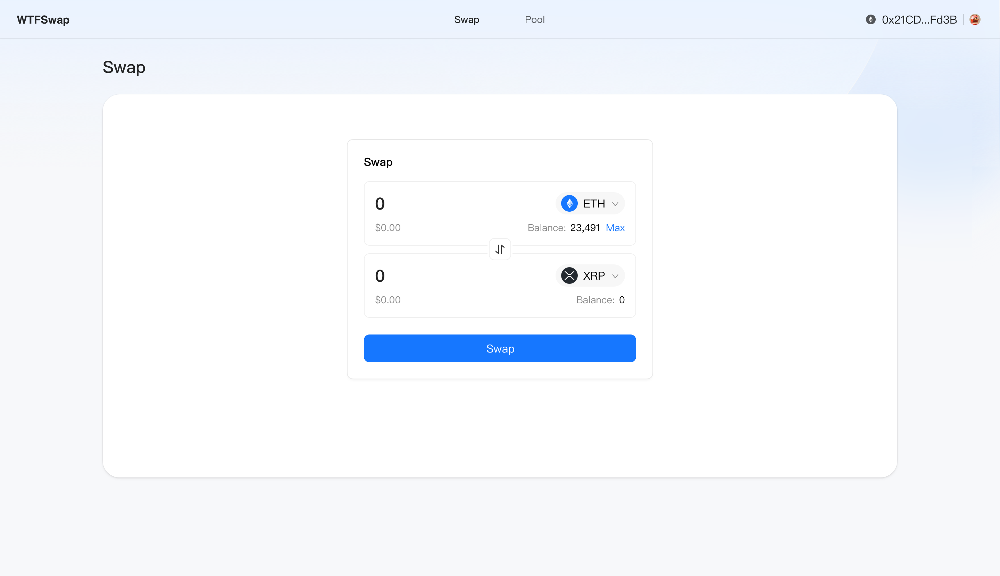
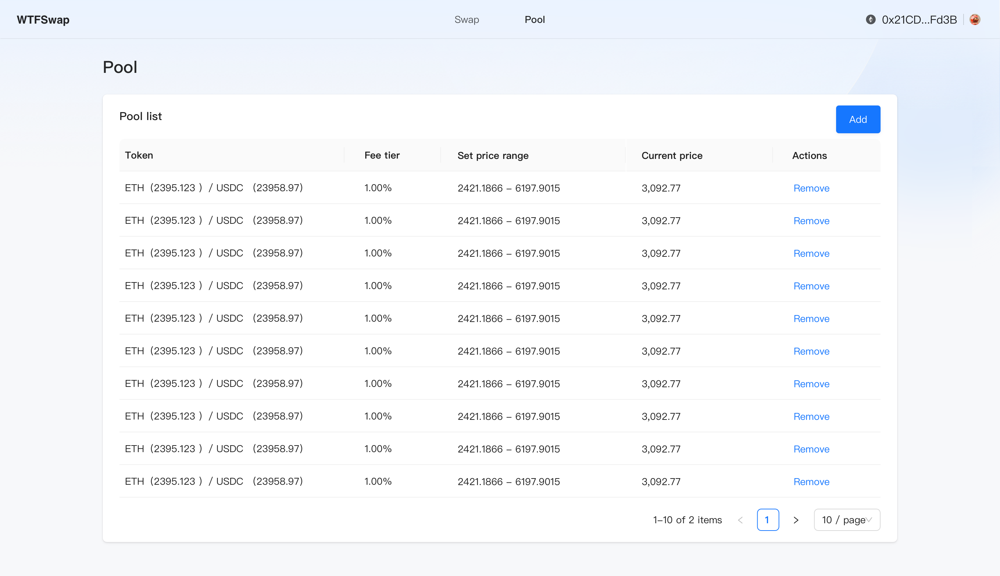
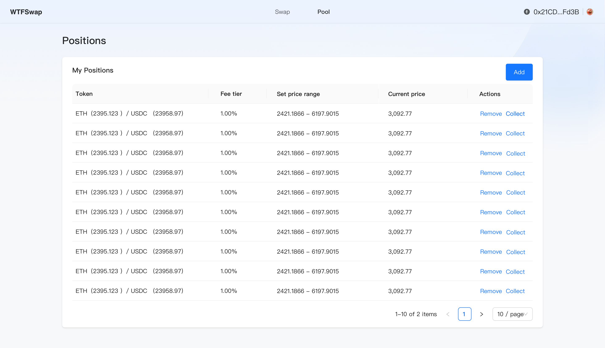
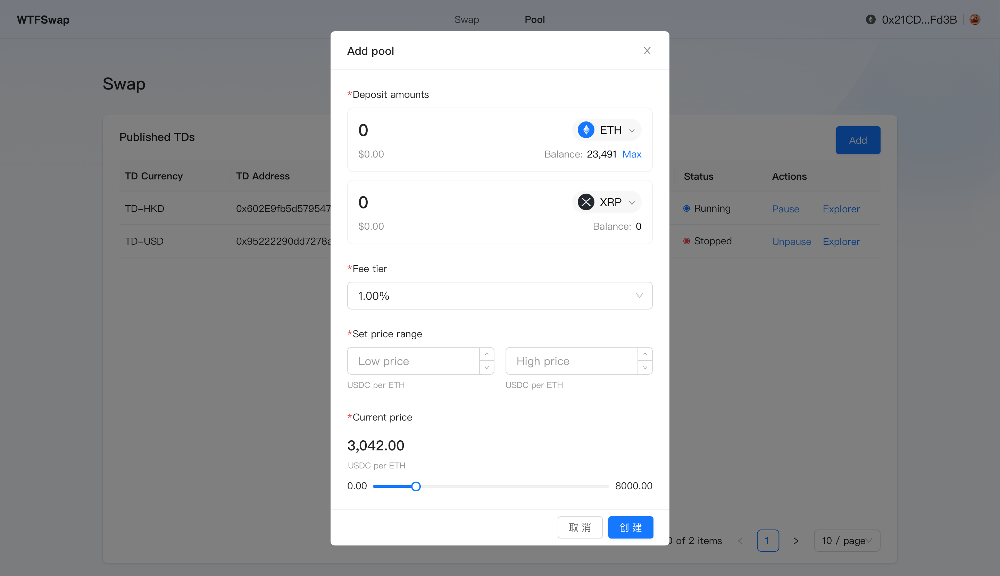

在上面的几讲中我们大概介绍了 DEX，分析了我们大概要做什么，以及参考了 Uniswap 的合约代码。那这一讲我们开始设计 Wtfswap 的整体功能，我们会设计一个类似 Uniswap 但是又部分区别于它的功能，会做一些简化调整，用于课程开发练习。

---

我们在上一讲[《Uniswap 代码解析》](../P002_WhatIsUniswap/)中分析了 Uniswap V3 的代码，也简单提到了 Uniswap V2。Wtfswap 将会基于 Uniswap V2 并吸收部分 Uniswap V3 的概念，设计一个新的 DEX。

首先我们先回顾一下 Uniswap V2 和 Uniswap V3 的差异，在 V2 和 V3 中，一个代币对和费率唯一确定了一个交易池，在 V2 中，LP 向这样一个池子中注入流动性，价格可以在正无穷到负无穷之间波动。V3 相比 V2 最大的差异就是在 LP 注入流动性时可以定义一个价格区间，让 LP 可以提升自身的资金利用率。但是这样会导致 V3 交易的逻辑更复杂，因为一个池子里面可能包含了不同价格区间的流动性，交易的逻辑会更复杂。

在 Wtfswap 的设计中，我们也会引入价格区间，作为相比 V2 新增的功能，但是我们将不同的价格区间的流动性放到不同的池子中，用来降低复杂度。这样我们的交易逻辑会更简单，但是需要说明的是这样也会让流动性更分散，这也是为什么 V3 不这么做的原因。

另外为了为了课程更好上手，对于 Wtfswap 来说，整体设计相比 Uniswap V2 和 V3 我们会做如下的设计：

- 简化功能，不支持部分添加和提取流动性，不支持和原生代币交易，不支持跨交易对交易。
- 一个代币对+费率+价格区间唯一确定一个交易池，相比 Uniswap 来说我们针对交易池新增了价格区间的信息。
- 一个代币对下可能会有多个交易池，交易池的费率和价格区间都可以灵活设置，选择在哪些交易池中交易由 DApp 前端通过流动性情况选择。
- 直接调用合约获取当前可供交易的交易池，使得 DApp 不依赖于服务端（在 Uniswap 自己的 DApp 实现会涉及到一些服务端的接口）。

另外，我们基于 [Ant Design](https://ant.design/) 和 [Ant Design Web3](https://web3.ant.design/) 设计了一套 UI，我们除了合约开发外也会介绍如何开发前端界面。

基于 Wtfswap 的功能，我们设计了大概如下三个部分的 UI 界面。

Swap 页面，用于交易代币：

Pool 页面，用于查看当前已经有的交易池：

Positions 页面，用于查看和移除流动性：

Positions 页面创建流动性弹窗，用于创建新的流动性（如果没有对应的交易池，会先创建交易池）：

在后面的部分我们将会把课程分开为两个部分，第一个是以 P1 开头的合约部分课程，另外一个是以 P2 开头的前端部分课程。你可以根据自己的需求选择学习。
