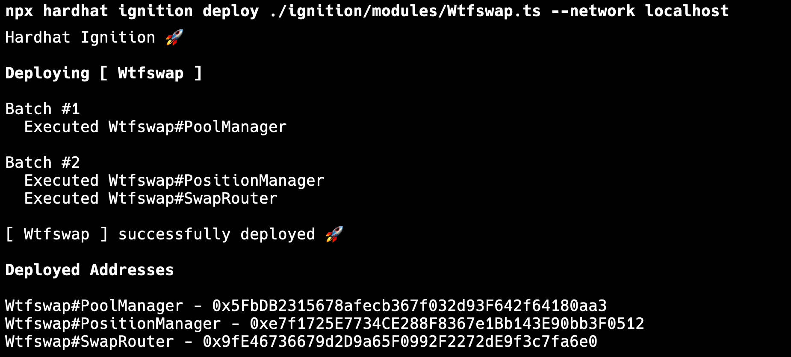

这一讲我们将在本地开发环境中初始化合约，正式启动开发。

---

## 初始化合约

Wtfswap 的合约开发我们继续基于之前在[《合约本地开发和测试环境》](../14_LocalDev/readme.md)中搭建的本地开发环境开发，如果你还没有搭建过，请基于那一讲课程搭建。

我们结合在上一讲中接口的设计，我们新增一个 `contract/wtfswap` 的目录按照如下结构初始化合约：

```
- contracts
  - wtfswap
    - interfaces
      - IFactory.sol
      - IPool.sol
      - IPoolManager.sol
      - IPositionManager.sol
      - ISwapRouter.sol
    - Factory.sol
    - Pool.sol
    - PoolManager.sol
    - PositionManager.sol
    - SwapRouter.sol
```

每一个合约文件我们都对应初始化好一个基础的架子，以 `Pool.sol` 为例：

```solidity
// SPDX-License-Identifier: GPL-2.0-or-later
pragma solidity ^0.8.24;

interface IMintCallback {
    function mintCallback(
        uint256 amount0Owed,
        uint256 amount1Owed,
        bytes calldata data
    ) external;
}

interface ISwapCallback {
    function swapCallback(
        int256 amount0Delta,
        int256 amount1Delta,
        bytes calldata data
    ) external;
}

interface IPool {
    function factory() external view returns (address);

    function token0() external view returns (address);

    function token1() external view returns (address);

    function fee() external view returns (uint24);

    function tickLower() external view returns (int24);

    function tickUpper() external view returns (int24);

    function sqrtPriceX96() external view returns (uint160);

    function tick() external view returns (int24);

    function liquidity() external view returns (uint128);

    function initialize(
        uint160 sqrtPriceX96,
        int24 tickLower,
        int24 tickUpper
    ) external;

    event Mint(
        address sender,
        address indexed owner,
        uint128 amount,
        uint256 amount0,
        uint256 amount1
    );

    function mint(
        address recipient,
        uint128 amount,
        bytes calldata data
    ) external returns (uint256 amount0, uint256 amount1);

    event Collect(
        address indexed owner,
        address recipient,
        uint128 amount0,
        uint128 amount1
    );

    function collect(
        address recipient
    ) external returns (uint128 amount0, uint128 amount1);

    event Burn(
        address indexed owner,
        uint128 amount,
        uint256 amount0,
        uint256 amount1
    );

    function burn(
        uint128 amount
    ) external returns (uint256 amount0, uint256 amount1);

    event Swap(
        address indexed sender,
        address indexed recipient,
        int256 amount0,
        int256 amount1,
        uint160 sqrtPriceX96,
        uint128 liquidity,
        int24 tick
    );

    function swap(
        address recipient,
        bool zeroForOne,
        int256 amountSpecified,
        uint160 sqrtPriceLimitX96,
        bytes calldata data
    ) external returns (int256 amount0, int256 amount1);
}

```

其它合约对应的代码可以参考 [code](./code/) 查看。

初始化完成后执行 `npx hardhat compile` 编译合约。

## 初始化部署脚本

结合之前[《合约本地开发和测试环境》](../14_LocalDev/readme.md)教程的内容，我们新建 `ignition/modules/Wtfswap.ts` 文件，编写部署脚本：

```ts
import { buildModule } from "@nomicfoundation/hardhat-ignition/modules";

const WtfswapModule = buildModule("Wtfswap", (m) => {
  const pool = m.contract("Pool");
  const factory = m.contract("Factory");
  const poolManager = m.contract("PoolManager");
  const swapRouter = m.contract("SwapRouter");
  const positionManager = m.contract("PositionManager");

  return { pool, factory, poolManager, swapRouter, positionManager };
});

export default WtfswapModule;
```

通过 `npx hardhat ignition deploy ./ignition/modules/Wtfswap.ts --network localhost` 启动本地的测试链。

然后执行 `npx hardhat ignition deploy ./ignition/modules/Wtfswap.ts --network localhost` 部署。

如果顺利你可以看到如下结果：



接下来，从下一章开始，我们就可以愉快的进行开发了。🎉
