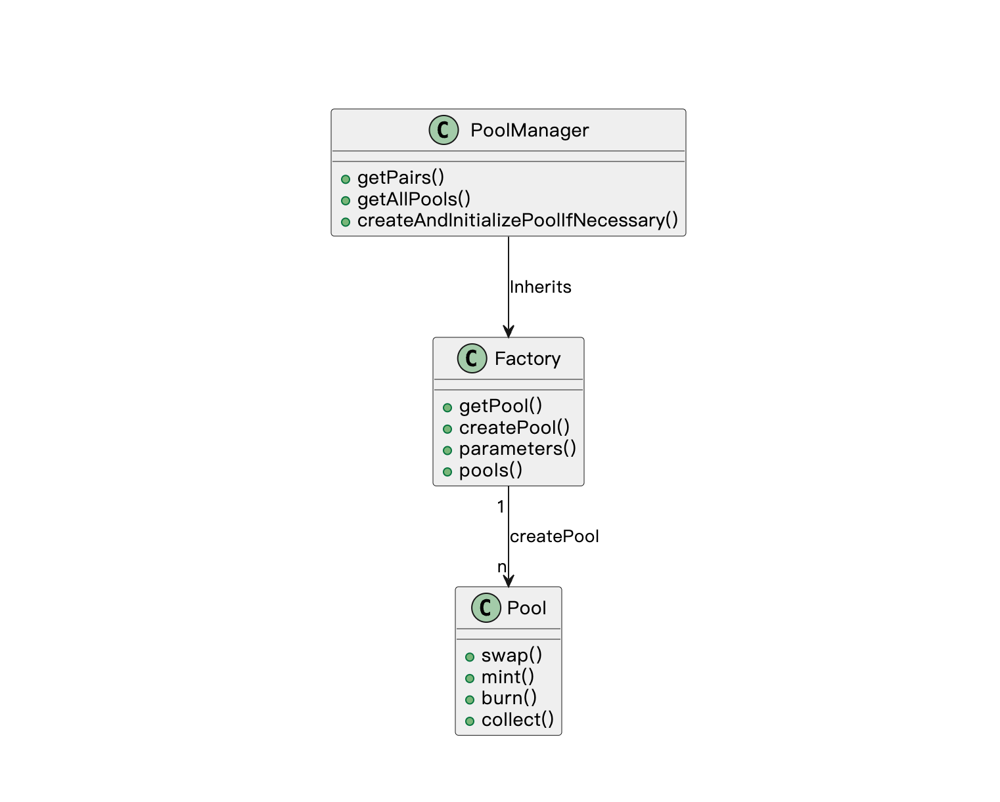

本节作者：[@yeezo](https://warpcast.com/yeezo)

这一讲我们将引导大家完成 `PoolManager.sol` 合约的开发。

---

## 合约简介

`PoolManager` 合约的主要作用是控制池子，并且提供池子的信息来供前端展示。`PoolManger` 合约继承了 `Factory` 合约，开发者在想要获取池子信息的时候，无需向更底层的 `Factory` 进行交互，只需要感知到 `PoolManager` 即可。

`PoolManager` 和 `Factory` 合约关系紧密，可以认为是同一个合约，但是为了合约功能的边界清晰我们进行了拆分。他们的关系可以如下图所示：



`PoolManager` 合约主要需要的功能比较简单，但是我们可以在里面学到一些有趣的细节知识。

## 合约开发

> 完整的代码在 [demo-contract/contracts/wtfswap/PoolManager.sol](../demo-contract/contracts/wtfswap/PoolManager.sol) 中。

在开始写合约之前，我们可以先停下来想一下，我们合约的功能应该需要包含哪些方法。在前端页面，我们有一个表格用于展示池子的一些信息，因此我们需要一个返回池子信息的方法。另外，在 position 前端页面有添加池子功能，因此我们还需要设计一个添加池子的方法。

当然，这个合约并不是必须的，它只是为了给前端提供数据，本教程将数据保存在服务端只是为了教学。实际开发中，更加推荐将这些数据存储在服务端（Uniswap 的做法），通过调用服务端的接口来保存、获取这些数据，这样的话既可以提高操作数据的响应速度，又可以减少合约存储数据的 gas 开销。

### 1. 合约继承

在之前的介绍中，我们设计了 `PoolManager` 合约需要继承 `Factory` 合约（可以参考上一节的内容），因此在写合约方法之前，我们需要继承一下。

```solidity
import "./Factory.sol";
import "./interfaces/IPoolManager.sol";

contract PoolManager is Factory, IPoolManager {
  // ...
}
```

在继承之后，我们就可以使用 `Factory` 合约里面设计的方法了。

### 2. 创建池子

首先我们考虑创建池子的功能。在之前的介绍中，我们知道了一个池子的唯一性是由代币对、价格区间以及费用确定的，因此该方法的输入参数应该包含这几项，另外该函数应该返回池子对应的合约地址。在合约的类型定义中，我们可以这么设计：

```solidity
import "./IFactory.sol";

interface IPoolManager is IFactory {
  // ...

  struct CreateAndInitializeParams {
    address token0;
    address token1;
    uint24 fee;
    int24 tickLower;
    int24 tickUpper;
    uint160 sqrtPriceX96;
  }

  function createAndInitializePoolIfNecessary(
      CreateAndInitializeParams calldata params
  ) external payable returns (address pool);
}
```

现在我们考虑具体的功能实现，在 `Factory` 合约里面对外暴露了一个 `createPool` 的方法，我们可以调用该方法去创建池子。需要注意的是，对于重复创建的情况，并不在 `PoolManager` 中处理，而是在 `Factory` 处理。

```solidity
import "./Factory.sol";
import "./interfaces/IPoolManager.sol";

contract PoolManager is Factory, IPoolManager {
  // ...

  function createAndInitializePoolIfNecessary(
        CreateAndInitializeParams calldata params
    ) external payable override returns (address poolAddress) {
        require(params.token0 < params.token1);

        poolAddress = this.createPool(
            params.token0,
            params.token1,
            params.tickLower,
            params.tickUpper,
            params.fee
        );

        //...
    }
}
```

在创建完成池子之后，我们需要维护 DEX 整体池子的信息，该信息包含两部份，DEX 支持的交易对种类以及交易对的具体信息。前者主要是为了提供我们的 DEX 支持哪些 Token 间进行交易，后者主要是提供完整的池子信息。

在 `Factory` 合约中，每次创建完成一个池子，都会记录下它的信息，因此这个信息我们不需要再记录，我们需要记录的是交易对的种类，即在获得一个新的交易对时，动态地维护一个 `pairs` 数组。

由于我们继承了 `Factory`，因此我们可以轻松拿到 `Factory` 中的 `pools`，因此记录信息的逻辑可以如下实现：

```solidity
import "./Factory.sol";
import "./interfaces/IPool.sol";
import "./interfaces/IPoolManager.sol";

contract PoolManager is Factory, IPoolManager {
  Pair[] public pairs;
  // ...

  function createAndInitializePoolIfNecessary(
        CreateAndInitializeParams calldata params
    ) external payable override returns (address poolAddress) {
        require(params.token0 < params.token1);

        poolAddress = this.createPool(
            params.token0,
            params.token1,
            params.tickLower,
            params.tickUpper,
            params.fee
        );

        // 获取池子合约
        IPool pool = IPool(poolAddress);

        // 获取同一交易对的数量
        uint256 index = pools[pool.token0()][pool.token1()].length;

        // 新创建的池子，没有初始化价格，需要初始化价格
        if (pool.sqrtPriceX96() == 0) {
          pool.initialize(params.sqrtPriceX96);

          if (index == 1) {
              // 如果是第一次添加该交易对，需要记录下来
              pairs.push(
                  Pair({token0: pool.token0(), token1: pool.token1()})
              );
          }
        }
    }
}
```

需要注意的是，虽然 `createPool` 的入参 `tokenA` 和 `tokenB` 没有顺序要求，但是在 `createAndInitializePoolIfNecessary` 中我们创建的时候要求 `token0 < token1`。因为在这个方法中需要传入初始化的价格，而在交易池中价格是按照 `token0/token1` 的方式计算的，做这个限制可以避免 LP 不小心初始化错误的价格。在后续的代码和测试中，我们也约定了 `tokenA` 和 `tokenB` 是未排序的，而 `token0` 和 `token1` 是排序的，这样也便于我们理解代码。

至此，创建池子的方法我们就算是实现完成了。

### 3. 返回全部池子信息

由于池子的信息是在 `Factory` 合约中保存的，因此我们在返回全部池子信息的时候，还需要对 `Factory` 保存的信息进行处理，处理成我们想要的数据格式。

这部分的逻辑比较清晰，通过遍历全部的池子信息，做一些数据转换就行。

```solidity
import "./Factory.sol";
import "./interfaces/IPool.sol";
import "./interfaces/IPoolManager.sol";

contract PoolManager is Factory, IPoolManager {
  function getAllPools()
    external
    view
    override
    returns (PoolInfo[] memory poolsInfo)
  {
    uint32 length = 0;
    // 先算一下大小，从 pools 获取
    for (uint32 i = 0; i < pairs.length; i++) {
        length += uint32(pools[pairs[i].token0][pairs[i].token1].length);
    }

    // 再填充数据
    poolsInfo = new PoolInfo[](length);
    for (uint32 i = 0; i < pairs.length; i++) {
      address[] memory addresses = pools[pairs[i].token0][
          pairs[i].token1
      ];
      for (uint32 j = 0; j < addresses.length; j++) {
        IPool pool = IPool(addresses[j]);
        poolsInfo[i] = PoolInfo({
          token0: pool.token0(),
          token1: pool.token1(),
          index: j,
          fee: pool.fee(),
          feeProtocol: 0,
          tickLower: pool.tickLower(),
          tickUpper: pool.tickUpper(),
          tick: pool.tick(),
          sqrtPriceX96: pool.sqrtPriceX96()
        });
      }
    }
    return poolsInfo;
  }
}
```

在这里需要注意的是，我们首先计算了返回池子的大小，然后再往里面添加数据。这么做看起来非常的不合理，但是在合约方法中，memory 数组是无法进行动态地添加数据的，这个是 Solidity 语法上的限制，为了性能上的优化，memory 定义的数组需要提前分配好内存。因此这是一个无奈之举。

### 4. 返回 pairs 数据

`pairs` 数据主要是用于查询我们 DEX 是否支持某一交易对的交易，我们在介绍 2.创建池子 章节的时候就已经维护了 `pairs`，因此我们只需要将其返回出去就好。

```solidity
import "./Factory.sol";
import "./interfaces/IPoolManager.sol";

contract PoolManager is Factory, IPoolManager {
  Pair[] public pairs;

  function getPairs() external view override returns (Pair[] memory) {
    return pairs;
  }

  //...
}
```

可以看到我们设计了一个 `getPairs` 方法用于返回数据。可能会有一些同学有这样的疑问，为什么要设计一个函数方法用于返回，合约里面的变量不是会自动生成对应的 getter 方法用于获取其值的吗？

是的没有错，solidity 是会自动给合约里面定义的 public 变量生成对应的 getter 方法，开发者可以不用再额外设计获取值的方法，但是对于变量是数组这个特殊情况，solidity 生成的 getter 方法并不会返回整个数据，而是需要调用者指定索引，只返回索引对应的值。这么设计的原因是避免一次返回过多的数据，在别的合约使用这份数据时产生不可控的 gas 费。

因此，对于数组这个特殊情况，如果我们需要它返回全部的内容，就需要自己写一个合约方法将其返回。

## 合约测试

我们需要测试是否成功创建以及返回的池子信息是否正确，代码如下：

```typescript
import { loadFixture } from "@nomicfoundation/hardhat-toolbox-viem/network-helpers";
import { expect } from "chai";
import hre from "hardhat";
import { TickMath, encodeSqrtRatioX96 } from "@uniswap/v3-sdk";

describe("PoolManager", function () {
  async function deployFixture() {
    const manager = await hre.viem.deployContract("PoolManager");
    const publicClient = await hre.viem.getPublicClient();
    return {
      manager,
      publicClient,
    };
  }

  it("getPairs & getAllPools", async function () {
    const { manager } = await loadFixture(deployFixture);
    const tokenA: `0x${string}` = "0x1f9840a85d5aF5bf1D1762F925BDADdC4201F984";
    const tokenB: `0x${string}` = "0xEcd0D12E21805803f70de03B72B1C162dB0898d9";
    const tokenC: `0x${string}` = "0x2260FAC5E5542a773Aa44fBCfeDf7C193bc2C599";
    const tokenD: `0x${string}` = "0x6B175474E89094C44Da98b954EedeAC495271d0F";

    // 创建 tokenA-tokenB
    await manager.write.createAndInitializePoolIfNecessary([
      {
        token0: tokenA,
        token1: tokenB,
        fee: 3000,
        tickLower: TickMath.getTickAtSqrtRatio(encodeSqrtRatioX96(1, 1)),
        tickUpper: TickMath.getTickAtSqrtRatio(encodeSqrtRatioX96(10000, 1)),
        sqrtPriceX96: BigInt(encodeSqrtRatioX96(100, 1).toString()),
      },
    ]);

    // 由于和前一个参数一样，会被合并
    await manager.write.createAndInitializePoolIfNecessary([
      {
        token0: tokenA,
        token1: tokenB,
        fee: 3000,
        tickLower: TickMath.getTickAtSqrtRatio(encodeSqrtRatioX96(1, 1)),
        tickUpper: TickMath.getTickAtSqrtRatio(encodeSqrtRatioX96(10000, 1)),
        sqrtPriceX96: BigInt(encodeSqrtRatioX96(100, 1).toString()),
      },
    ]);

    await manager.write.createAndInitializePoolIfNecessary([
      {
        token0: tokenC,
        token1: tokenD,
        fee: 2000,
        tickLower: TickMath.getTickAtSqrtRatio(encodeSqrtRatioX96(100, 1)),
        tickUpper: TickMath.getTickAtSqrtRatio(encodeSqrtRatioX96(5000, 1)),
        sqrtPriceX96: BigInt(encodeSqrtRatioX96(200, 1).toString()),
      },
    ]);

    // 判断返回的 pairs 的数量是否正确
    const pairs = await manager.read.getPairs();
    expect(pairs.length).to.equal(2);

    // 判断返回的 pools 的数量、参数是否正确
    const pools = await manager.read.getAllPools();
    expect(pools.length).to.equal(2);
    expect(pools[0].token0).to.equal(tokenA);
    expect(pools[0].token1).to.equal(tokenB);
    expect(pools[0].sqrtPriceX96).to.equal(
      BigInt(encodeSqrtRatioX96(100, 1).toString())
    );
    expect(pools[1].token0).to.equal(tokenC);
    expect(pools[1].token1).to.equal(tokenD);
    expect(pools[1].sqrtPriceX96).to.equal(
      BigInt(encodeSqrtRatioX96(200, 1).toString())
    );
  });
});
```

你可以再补充一个异常情况的测试样例：

```typescript
it("require token0 < token1", async function () {
  const { manager } = await loadFixture(deployFixture);
  const tokenA: `0x${string}` = "0x1f9840a85d5aF5bf1D1762F925BDADdC4201F984";
  const tokenB: `0x${string}` = "0xEcd0D12E21805803f70de03B72B1C162dB0898d9";

  await expect(
    manager.write.createAndInitializePoolIfNecessary([
      {
        token0: tokenB,
        token1: tokenA,
        fee: 3000,
        tickLower: TickMath.getTickAtSqrtRatio(encodeSqrtRatioX96(1, 1)),
        tickUpper: TickMath.getTickAtSqrtRatio(encodeSqrtRatioX96(10000, 1)),
        sqrtPriceX96: BigInt(encodeSqrtRatioX96(100, 1).toString()),
      },
    ])
  ).to.be.rejected;
});
```

完整的单测代码在 [demo-contract/test/wtfswap/PoolManager.ts](../demo-contract/test/wtfswap/PoolManager.ts) 中，在实际项目中，你的单测应该覆盖到所有的逻辑分支，以保证合约的安全。
