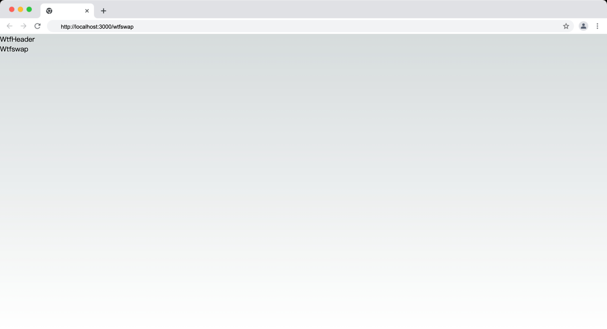

这一讲将会初始化前端代码，搭建起基本的 UI 框架，并做初步的技术分析。

---

## 初始化前端代码

我们将会继续将基于 [React](https://react.dev/) + [Next.js](https://nextjs.org/) + [TypeScript](https://www.typescriptlang.org/) 来初始化我们的项目，并直接沿用在前面的课程中创建好的项目代码。

如果你还没有创建项目，可以参考 [01_QuickStart](../01_QuickStart/readme.md) 中的内容完成初始化。在 Wtfswap 的开发课程中，我们不会覆盖原有的代码，而是新建 `pages/wtfswap/index.tsx` 文件，作为 Wtfswap 的入口文件。

请新建文件并初始化如下内容：

```tsx
export default function Wtfswap() {
  return <div>Wtfswap</div>;
}
```

执行 `npm run dev` 后打开 [http://localhost:3000/wtfswap](http://localhost:3000/wtfswap) 确认页面是否正常显示，如果可以看到 `Wtfswap` 字样，说明初始化成功。千里之行，始于足下。你已经完成了第一个步骤，离 Wtfswap 的实现又近了一步。

## 前端框架搭建

我们基于 [Wtfswap 整体设计](../P003_OverallDesign/readme.md) 中的设计图，来搭建前端框架。首先我们要确认下关键的页面和组件：

```
- pages
  - components
    - WtfLayout/index.tsx # Wtfswap 的整体布局
    - WtfLayout/Header.tsx # Wtfswap 整体布局的头部
    - WtfAddPositionModal/index.tsx # 创建流动性的弹窗
  - wtfswap
    - index.tsx # Wtfswap 首页，也就是 Swap 页面
    - pool.tsx # Pool 页面
    - positions.tsx # Positions 页面
```

我们先来创建 `WtfLayout` 组件，这个组件是 Wtfswap 的整体布局，包含了头部。在 `pages/components` 目录下新建 `WtfLayout/Header.tsx` 文件，并初始化如下内容：

```tsx
export default function WtfHeader() {
  return <div>WtfHeader</div>;
}
```

新建 `WtfLayout/index.tsx` 文件，并初始化如下内容：

```tsx
import React from "react";
import Header from "./Header";

interface WtfLayoutProps {
  children: React.ReactNode;
}

const WtfLayout: React.FC<WtfLayoutProps> = ({ children }) => {
  return (
    <div>
      <Header />
      {children}
    </div>
  );
};

export default WtfLayout;
```

接下来我们在 `pages/wtfswap/index.tsx` 中引入 `WtfLayout` 组件：

```tsx
+ import WtfLayout from "@/components/WtfLayout";

export default function Wtfswap() {
-   return <div>Wtfswap</div>;
+   return <WtfLayout>Wtfswap</WtfLayout>;
}
```

`Wtfswap` 组件的内容嵌套在 `WtfLayout` 中，将会作为 `WtfLayout` 的 `children` 属性传入并和 `WtfHeader` 组件一起渲染出来，这样在 [http://localhost:3000/wtfswap](http://localhost:3000/wtfswap) 上你就可以看到 `WtfHeader` 和 `Wtfswap` 字样：



同理，我们继续创建 `wtfswap/positions.tsx` 和 `wtfswap/pool.tsx` 文件，并初始化如下内容，使得从 Pool 页面可以跳转到 Positions 页面：

```tsx
// wtfswap/positions.tsx
import WtfLayout from "@/components/WtfLayout";

export default function WtfswapPositions() {
  return <WtfLayout>WtfswapPositions</WtfLayout>;
}
```

```tsx
// wtfswap/pool.tsx
import WtfLayout from "@/components/WtfLayout";
import Link from "next/link";

export default function WtfswapPool() {
  return (
    <WtfLayout>
      WtfswapPool <Link href="/wtfswap/positions">My Positions</Link>
    </WtfLayout>
  );
}
```

访问 [http://localhost:3000/wtfswap/pool](http://localhost:3000/wtfswap/pool) 和 [http://localhost:3000/wtfswap/positions](http://localhost:3000/wtfswap/positions) 可以看到结果。

## 技术分析和后续研发计划

做好基础的框架搭建后我们接下来要进行后续的研发，在研发之前我们简单做一下技术分析并初步确定后续的研发计划。

除了 UI 的开发，我们还需要考虑到 Wtfswap 的业务逻辑，这里我们简单列出一些关键的业务逻辑并做简单的技术分析：

1. **连接钱包**：用户需要连接钱包才能进行交易，在课程中我们使用 [Ant Design Web3 的以太坊适配器](https://web3.ant.design/components/ethereum-cn) 来连接钱包和链。我们需要在 `WtfLayout` 中引入 `WagmiWeb3ConfigProvider` 给所有的组件提供连接钱包和链的能力。另外需要在 `WtfHeader` 中使用 [ConnectorModal](https://web3.ant.design/components/connect-modal-cn) 等组件来实现连接钱包的 UI，支持多种形式的连接钱包和切换链。
1. **Swap 页面**：Swap 页面是 Wtfswap 的核心页面，该页面讲基于 [Ant Design](https://ant.design/components/overview-cn/) 和 [Ant Design Web3](https://web3.ant.design/components/icons-cn) 的基础组件搭建，并使用 [wagmi](https://wagmi.sh/) 的 Hooks 来和链交互。
1. **Pool 页面**：Pool 页面需要展示当前已经有的交易池，UI 主要基于 Ant Design 的 [Table](https://ant.design/components/table-cn) 组件开发。数据也同样是使用 [wagmi](https://wagmi.sh/) 直接从链上获取。
1. **Positions 页面**：Positions 页面需要展示 LP 资金池的信息，并支持提取资金池的操作，UI 主要基于 Ant Design 的 [Table](https://ant.design/components/table-cn) 组件开发。数据也同样是使用 [wagmi](https://wagmi.sh/) 直接从链上获取。
1. **添加流动性（Position）**：添加流动性是 Wtfswap 的核心功能之一，我们需要在 `WtfAddPositionModal` 组件中实现创建资金池的 UI，并使用 wagmi 的 Hooks 来和链交互。`WtfAddPositionModal` 组件将会被 `pages/wtfswap/positions.tsx` 引用，基于 Ant Design 的 [Modal](https://ant.design/components/modal-cn) 组件实现。

接下来，就让我们进入后面的研发环节，逐步实现 Wtfswap 的功能。
