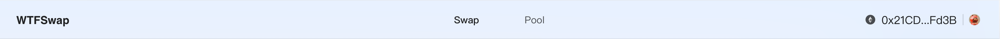

本节作者：[@愚指导](https://x.com/yudao1024)

这一讲，我们来实现 Wtfswap 的 Layout 头部部分的 UI。

---

设计稿如下所示：



样式比较简单，右侧我们可以使用 Ant Design Web3 的 [ConnectButton](https://web3.ant.design/components/connect-button) 组件，其它部分可以直接用些样式，样式我们基于 [CSSModules](https://nextjs.org/docs/app/building-your-application/styling/css-modules#css-modules) 来写，NextJS 默认支持，而且更好理解，比较适合课程中使用。当然实际项目中你也可以按照你的需求使用[其它方案](https://nextjs.org/docs/app/building-your-application/styling)。

我们新建 `components/WtfLayout/styles.module.css`，并初始化部分内容：

```css
.header {
  .title {
  }
  .nav {
  }
}
```

稍后我们再来补充相关内容，在这之前先修改 `Header.tsx`：

```tsx
import Link from "next/link";
import { ConnectButton } from "@ant-design/web3";
import styles from "./styles.module.css";

export default function WtfHeader() {
  return (
    <div className={styles.header}>
      <div className={styles.title}>WTFSwap</div>
      <div className={styles.nav}>
        <Link href="/wtfswap">Swap</Link>
        <Link href="/wtfswap/pool">Pool</Link>
      </div>
      <div>
        <ConnectButton type="text" />
      </div>
    </div>
  );
}
```

这里用了 [Link](https://nextjs.org/learn-pages-router/basics/navigate-between-pages/link-component) 组件来实现页面的跳转。另外引入了 [ConnectButton](https://web3.ant.design/components/connect-button) 组件，并设置了 `type` 为 `text`，以匹配设计稿的样式。

接下来我们继续完善 `styles.module.csss` 中的样式：

```css
.header {
  height: 56px;
  line-height: 56px;
  padding-inline: 24px;
  background-color: #e8f1ff;
  display: flex;
  flex-direction: row;
  justify-content: space-between;
  border-bottom: 1px solid #d7e1eb;
}

.title {
  font-size: 16px;
  font-weight: bold;
}

.nav {
  display: flex;
  gap: 64px;
}

.nav a {
  font-size: 14px;
  opacity: 0.65;
}
```

接下来我们还要实现高亮当前页面对应的导航的样式，首先我们需要把要高亮的 `Link` 组件添加上一个 `className`：

```diff
import Link from "next/link";
+ import { usePathname } from "next/navigation";
import { ConnectButton } from "@ant-design/web3";
import styles from "./styles.module.css";

export default function WtfHeader() {
+  const pathname = usePathname();
+  const isSwapPage = pathname === "/wtfswap";

  return (
    <div className={styles.header}>
      <div className={styles.title}>WTFSwap</div>
      <div className={styles.nav}>
        <Link
          href="/wtfswap"
+          className={isSwapPage ? styles.active : undefined}
        >
          Swap
        </Link>
        <Link
          href="/wtfswap/pool"
+          className={!isSwapPage ? styles.active : undefined}
        >
          Pool
        </Link>
      </div>
      <div>
        <ConnectButton type="text" />
      </div>
    </div>
  );
}
```

然后添加相关样式：

```css
.nav a.active {
  font-weight: bold;
  opacity: 1;
}
```

除了头部样式外，我们再补充一下布局的背景颜色。修改 `WtfLayout/index.tsx` 如下：

```diff
import React from "react";
import Header from "./Header";
+ import styles from "./styles.module.css";

interface WtfLayoutProps {
  children: React.ReactNode;
}

const WtfLayout: React.FC<WtfLayoutProps> = ({ children }) => {
  return (
-    <div>
+    <div className={styles.layout}>
      <Header />
      {children}
    </div>
  );
};

export default WtfLayout;
```

然后在 `styles.module.css` 中添加：

```css
min-height: 100vh;
background: linear-gradient(to bottom, #e8f1ff, #f6f7f9);
```

至此，布局头部的 UI 样式我们就完成了。
