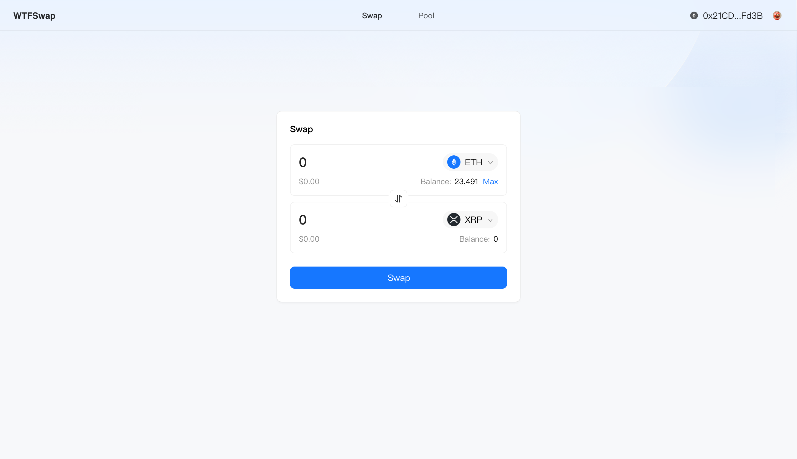
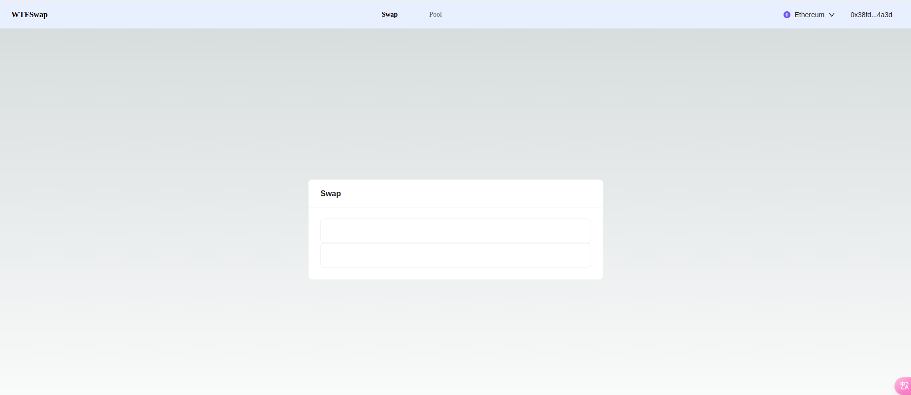
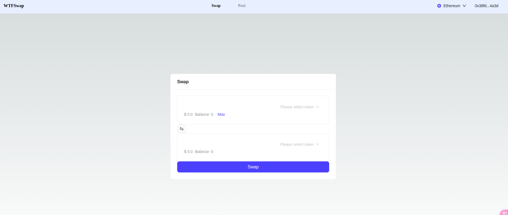
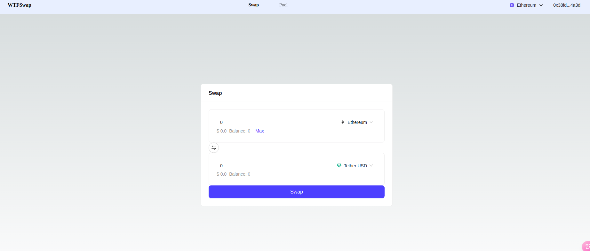
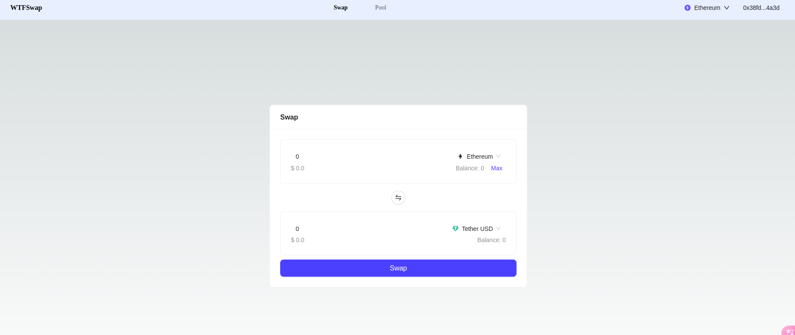

本节作者：[@小符](https://x.com/smallfu666)

这一讲我们来实现 Wtfswap 的 Swap 部分的 UI。

---

设计稿如下所示：



Swap 页面是 Wtfswap 的核心页面，先来拆分下 Swap 页面，Swap 页面首先引入了 [Layout 的头部](../P202_HeadUI/readme.md)，然后在页面中间实现了 Swap UI；搭建 Swap 页面需要多个组件， 主要使用 [Card](https://ant.design/components/card-cn) 组件完成整个框架的搭建。这一讲课完整的代码可以在[这里](./code)获取。

修改 `pages/wtfswap/index.tsx` , 先引入 `Card` 组件搭建基础框架：

```diff
+ import { Card } from 'antd';

import WtfLayout from "@/components/WtfLayout";

export default function Wtfswap() {
-    return <WtfLayout>Wtfswap</WtfLayout>;
+      return (
+        <WtfLayout>
+	   <Card title="Swap">
+            <Card></Card>
+	     <Card></Card>
+	   </Card>
+        </WtfLayout>
+    );
}
```

然后新建 `pages/wtfswap/swap.module.css` 文件，初始化样式：

```css
.swapCard {
  width: 600px;
  margin: 0 auto;
  position: absolute;
  top: 50%;
  left: 50%;
  transform: translate(-50%, -50%);
}
```

在 `index.tsx` 中使用样式：

```diff
import { Card } from 'antd';

import WtfLayout from "@/components/WtfLayout";
+ import styles from './swap.module.css';

export default function Wtfswap() {
  return (
    <WtfLayout>
-     <Card title="Swap">
+     <Card title="Swap" className={styles.swapCard}>
        <Card></Card>
        <Card></Card>
      </Card>
    </WtfLayout>
  );
}
```

这样就搭建好了基础的 Swap 页面布局，然后在此布局上进行细化。



接下来使用其他组件完善页面，选择器使用 Antd Design Web3 的 [TokenSelect](https://web3.ant.design/components/token-select) 组件，然后搭配 `Button`，`Space`，`Input`，`Typography` 等组件。

```diff
- import { Card } from 'antd';
+ import { Card, Input, Button, Space, Typography } from 'antd';
+ import { TokenSelect } from '@ant-design/web3';
+ import { SwapOutlined } from '@ant-design/icons';

import WtfLayout from "@/components/WtfLayout";
import styles from './swap.module.css';

+ const { Text } = Typography;

export default function Wtfswap() {
  return (
    <WtfLayout>
      <Card title="Swap" className={styles.swapCard}>
       <Card>
+         <Input
+           variant="borderless"
+           type="number"
+           addonAfter={
+             <TokenSelect />
+           }
+         />
+         <Space>
+           <Text type="secondary">
+             $ 0.0
+           </Text>
+           <Space>
+             <Text type="secondary">
+               Balance: 0
+             </Text>
+             <Button size="small" type="link">
+               Max
+             </Button>
+           </Space>
+         </Space>
        </Card>
+       <Space>
+         <Button
+           shape="circle"
+           icon={<SwapOutlined />}
+         />
+       </Space>
        <Card>
+         <Input
+           variant="borderless"
+           type="number"
+           addonAfter={
+             <TokenSelect />
+           }
+         />
+         <Space>
+           <Text type="secondary">
+             $ 0.0
+           </Text>
+           <Text type="secondary">
+             Balance: 0
+           </Text>
+         </Space>
        </Card>
+       <Button type="primary" size="large" block>
+         Swap
+       </Button>
      </Card>
    </WtfLayout>
  );
}
```



现在的 Swap 页面已经初具雏形了，接下来定义可以选择的代币列表和 Swap 的 `TokenA` 和 `TokenB`，可以从 `@ant-design/web3-assets/tokens` 引入需要使用的 Token：

```diff
+ import React, { useState } from 'react';
import { Card, Input, Button, Space, Typography } from 'antd';
- import { TokenSelect } from '@ant-design/web3';
+ import { TokenSelect, type Token } from '@ant-design/web3';
+ import { ETH, USDT, USDC } from '@ant-design/web3-assets/tokens';
import { SwapOutlined } from '@ant-design/icons';

// ...

export default function Wtfswap() {
+ const [tokenA, setTokenA] = useState<Token>(ETH);
+ const [tokenB, setTokenB] = useState<Token>(USDT);
+ const [amountA, setAmountA] = useState(0);
+ const [amountB, setAmountB] = useState(0);
+ const [optionsA, setOptionsA] = useState<Token[]>([ETH, USDT, USDC]);;
+ const [optionsB, setOptionsB] = useState<Token[]>([USDT, ETH, USDC]);;

// ...

<Input
  variant="borderless"
+ value={amountA}
  type="number"
  addonAfter={
-   <TokenSelect />
+   <TokenSelect value={tokenA} onChange={setTokenA} options={optionsA} />
  }
/>

// ...

<Input
  variant="borderless"
+ value={amountB}
  type="number"
  addonAfter={
-   <TokenSelect />
+   <TokenSelect value={tokenB} onChange={setTokenB} options={optionsB} />
  }
/>

// ...
```



现在，为 `Input` 组件和 `Button` 组件添加函数：
1. **handleAmountAChange**： Input 组件的输入值改变时，同步更新 `AmountA`。其他的功能在后续章节实现。
2. **handleSwitch**：点击切换按钮时，调换 `TokenA：TokenB` 代币对，以及对应的值 `AmountA：AmountB`。

```diff
// ...

+ const handleAmountAChange = (e: any) => {
+   setAmountA(parseFloat(e.target.value));
+   // 后续章节实现
+ };
+
+ const handleSwitch = () => {
+   setTokenA(tokenB);
+   setTokenB(tokenA);
+   setAmountA(amountB);
+   setAmountB(amountA);
+ };

// ...

<Input
  variant="borderless"
  value={amountA}
  type="number"
+ onChange={(e) => handleAmountAChange(e)}
  addonAfter={
    <TokenSelect value={tokenA} onChange={setTokenA} options={optionsA} />
  }
/>

// ...

<Space className={styles.switchBtn}>
  <Button
    shape="circle"
    icon={<SwapOutlined />}
+   onClick={handleSwitch}
  />
</Space>

// ...
```

然后为 `Max` 按钮添加函数 `handleMax`，UI 阶段先不实现功能。

```diff
// ...
+ const handleMax = () => {
+ };

// ...

- <Button size="small" type="link">
+ <Button size="small" onClick={handleMax} type="link">
  Max
</Button>

// ...
```

以上基本实现了 Swap 页面，接下来优化下样式，使其匹配设计稿的内容，编辑 `pages/wtfswap/swap.module.css` 文件：

```diff
.swapCard {
  width: 600px;
  margin: 0 auto;
  position: absolute;
  top: 50%;
  left: 50%;
  transform: translate(-50%, -50%);
}

+ .switchBtn {
+   font-size: '20px';
+   display: flex;
+   justify-content: center;
+   margin: 16px 0;
+ }
+ 
+ .swapSpace {
+   width: 99%;
+   justify-content: space-between;
+ }
+ 
+ .swapBtn {
+   margin-top: 10px;
+ }
```

在 `index.tsx` 引入新添加的样式：

```diff
import React, { useState } from 'react';
import { Card, Input, Button, Space, Typography } from 'antd';
import { TokenSelect, type Token } from '@ant-design/web3';
import { ETH, USDT, USDC } from '@ant-design/web3-assets/tokens';
import { SwapOutlined } from '@ant-design/icons';

import WtfLayout from "@/components/WtfLayout";
import styles from "./swap.module.css";

const { Text } = Typography;

export default function Wtfswap() {
  const [tokenA, setTokenA] = useState<Token>(ETH);
  const [tokenB, setTokenB] = useState<Token>(USDT);
  const [amountA, setAmountA] = useState(0);
  const [amountB, setAmountB] = useState(0);
  const [optionsA, setOptionsA] = useState<Token[]>([ETH, USDT, USDC]);;
  const [optionsB, setOptionsB] = useState<Token[]>([USDT, ETH, USDC]);;

  const handleAmountAChange = (e: any) => {
    setAmountA(parseFloat(e.target.value));
  };

  const handleSwitch = () => {
    setTokenA(tokenB);
    setTokenB(tokenA);
    setAmountA(amountB);
    setAmountB(amountA);
  };

  const handleMax = () => {
  };

  return (
    <WtfLayout>
      <Card title="Swap" className={styles.swapCard}>
        <Card>
          <Input
            variant="borderless"
            value={amountA}
            type="number"
            onChange={(e) => handleAmountAChange(e)}
            addonAfter={
              <TokenSelect value={tokenA} onChange={setTokenA} options={optionsA} />
            }
          />
-         <Space>
+         <Space className={styles.swapSpace}>
            <Text type="secondary">
              $ 0.0
            </Text>
            <Space>
              <Text type="secondary">
                Balance: 0
              </Text>
              <Button size="small" onClick={handleMax} type="link">
                Max
              </Button>
            </Space>
          </Space>
        </Card>
-       <Space>
+       <Space className={styles.switchBtn}>
          <Button
            shape="circle"
            icon={<SwapOutlined />}
            onClick={handleSwitch}
          />
        </Space>
        <Card>
          <Input
            variant="borderless"
            value={amountB}
            type="number"
            addonAfter={
              <TokenSelect value={tokenB} onChange={setTokenB} options={optionsB} />
            }
          />
-       <Space>
+       <Space className={styles.swapSpace}>
            <Text type="secondary">
              $ 0.0
            </Text>
            <Text type="secondary">
              Balance: 0
            </Text>
          </Space>
        </Card>
-       <Button type="primary" size="large" block >
+       <Button type="primary" size="large" block className={styles.swapBtn}>
          Swap
        </Button>
      </Card>
    </WtfLayout>
  );
}
```



这样，我们就实现了 Swap 部分的 UI 开发，为了简化教程，有的细节并没有完全按照设计稿实现。页面样式使用了 [CSSModules](https://nextjs.org/docs/app/building-your-application/styling/css-modules#css-modules) 实现，你也可以使用自己熟悉的方案。本节的要点主要是使用了 Antd Design Web3 提供的 `TokenSelect` 组件，方便我们快速集成 `Token` 到选择器中。

