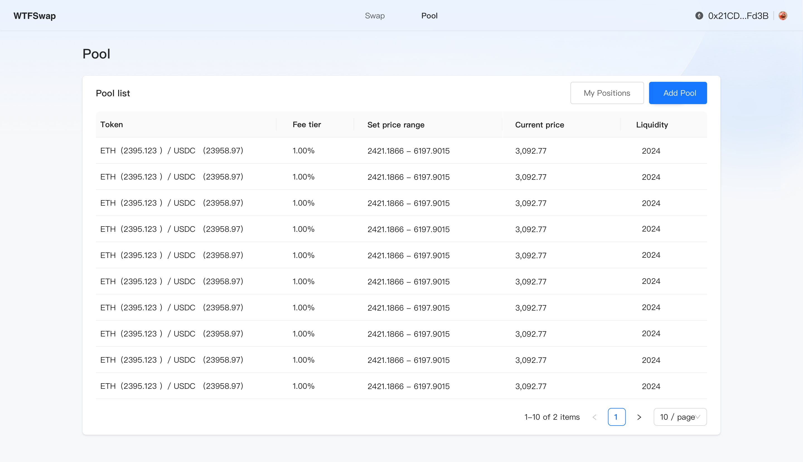
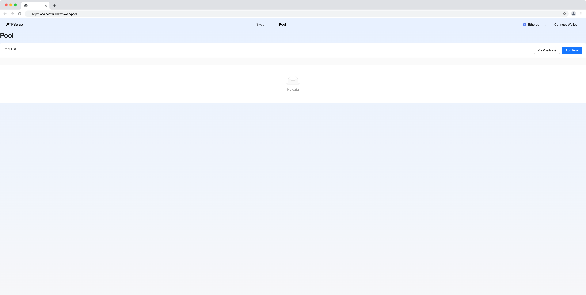
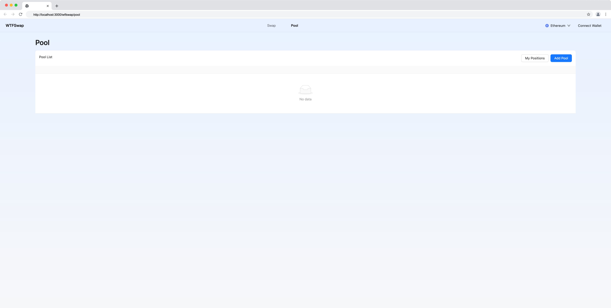
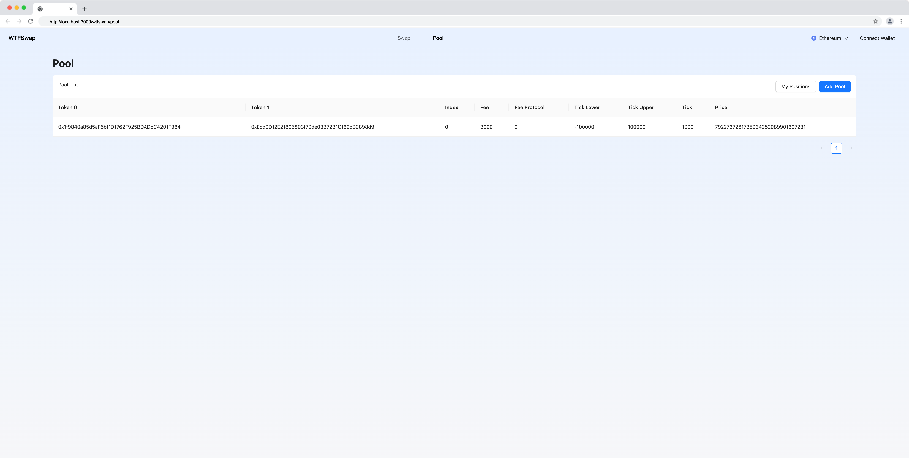

本节作者：[@愚指导](https://x.com/yudao1024)

这一讲我们来实现 Wtfswap 的交易池列表的 UI 页面开发。

---

## 框架搭建

首先我们来看一下设计稿：



该页面主要是用来显示一个列表，展示出当前所有的交易池。另外有两个按钮，分别是添加交易池和查看流动性列表的入口。

我们主要会用到 Ant Design 的 [Table 组件](https://ant.design/components/table-cn) 来展示列表。首先，我们基于 Table 组件和其他一些 Ant Design 的布局组件来搭建整体的结构：

```tsx
import React from "react";
import { Flex, Table, Space, Typography, Button } from "antd";
import WtfLayout from "@/components/WtfLayout";
import Link from "next/link";

const PoolListTable: React.FC = () => {
  return (
    <Table
      title={() => (
        <Flex justify="space-between">
          <div>Pool List</div>
          <Space>
            <Link href="/wtfswap/positions">
              <Button>My Positions</Button>
            </Link>
            <Button type="primary">Add Pool</Button>
          </Space>
        </Flex>
      )}
    />
  );
};

export default function WtfswapPool() {
  return (
    <WtfLayout>
      <Typography.Title level={2}>Pool</Typography.Title>
      <PoolListTable />
    </WtfLayout>
  );
}
```

我们在页面中新增了一个 `PoolListTable` 组件，这样可以确保我们的表格相关代码被 `WtfLayout` 包裹，否则后续课程在代码中需要调用 wagmi 的 Hooks 时会报错。

你会得到下面这样的效果：



然后我们新建一个 `pool.module.css` 文件，给最外层添加边距，优化一下样式：

```css
.container {
  margin: 24px 148px;
}
```

然后在页面中引入这个样式：

```diff
import React from "react";
import { Flex, Table, Space, Typography, Button } from "antd";
import WtfLayout from "@/components/WtfLayout";
import Link from "next/link";
+ import styles from "./pool.module.css";

const PoolListTable: React.FC = () => {
  return (
    <Table
      title={() => (
        <Flex justify="space-between">
          <div>Pool List</div>
          <Space>
            <Link href="/wtfswap/positions">
              <Button>My Positions</Button>
            </Link>
            <Button type="primary">Add Pool</Button>
          </Space>
        </Flex>
      )}
    />
  );
};

export default function WtfswapPool() {
  return (
    <WtfLayout>
+      <div className={styles.container}>
        <Typography.Title level={2}>Pool</Typography.Title>
        <PoolListTable />
+      </div>
    </WtfLayout>
  );
}
```

得到最后整体结构效果如下：



## 添加 Mock 数据

接下来我们来添加一些 Mock 数据，用来填充表格。首先我们需要定义表格的列，我们把所有的交易池信息都显示出来（这点可能和设计稿中不一致，设计稿更多只是 UI 样式的参考，请忽略）。

```tsx
import type { TableProps } from "antd";

const columns: TableProps["columns"] = [
  {
    title: "Token 0",
    dataIndex: "token0",
    key: "token0",
  },
  {
    title: "Token 1",
    dataIndex: "token1",
    key: "token1",
  },
  {
    title: "Index",
    dataIndex: "index",
    key: "index",
  },
  {
    title: "Fee",
    dataIndex: "fee",
    key: "fee",
  },
  {
    title: "Fee Protocol",
    dataIndex: "feeProtocol",
    key: "feeProtocol",
  },
  {
    title: "Tick Lower",
    dataIndex: "tickLower",
    key: "tickLower",
  },
  {
    title: "Tick Upper",
    dataIndex: "tickUpper",
    key: "tickUpper",
  },
  {
    title: "Tick",
    dataIndex: "tick",
    key: "tick",
  },
  {
    title: "Price",
    dataIndex: "sqrtPriceX96",
    key: "sqrtPriceX96",
    render: (value: bigint) => {
      return value.toString();
    },
  },
];
```

上面代码中具体的字段你可以参考我们之前在合约中 [IPoolManager.sol](../demo-contract/contracts/wtfswap/interfaces/IPoolManager.sol) 的定义。

给 `Table` 组件添加 `dataSource` 和 `columns` 属性：

```tsx
const PoolListTable: React.FC = () => {
  const data = [
    {
      token0: "0x1f9840a85d5aF5bf1D1762F925BDADdC4201F984",
      token1: "0xEcd0D12E21805803f70de03B72B1C162dB0898d9",
      index: 0,
      fee: 3000,
      feeProtocol: 0,
      tickLower: -100000,
      tickUpper: 100000,
      tick: 1000,
      sqrtPriceX96: BigInt("7922737261735934252089901697281"),
    },
  ];
  return (
    <Table
      title={() => (
        <Flex justify="space-between">
          <div>Pool List</div>
          <Space>
            <Link href="/wtfswap/positions">
              <Button>My Positions</Button>
            </Link>
            <Button type="primary">Add Pool</Button>
          </Space>
        </Flex>
      )}
      columns={columns}
      dataSource={data}
    />
  );
};
```

就这样，我们的 UI 部分就完成了，最后的效果是：



完整的代码请参考：[pool.tsx](./code/pool.tsx)

我们将在后面的课程中完善代码，添加调用合约接口获取实际交易池列表的逻辑。
