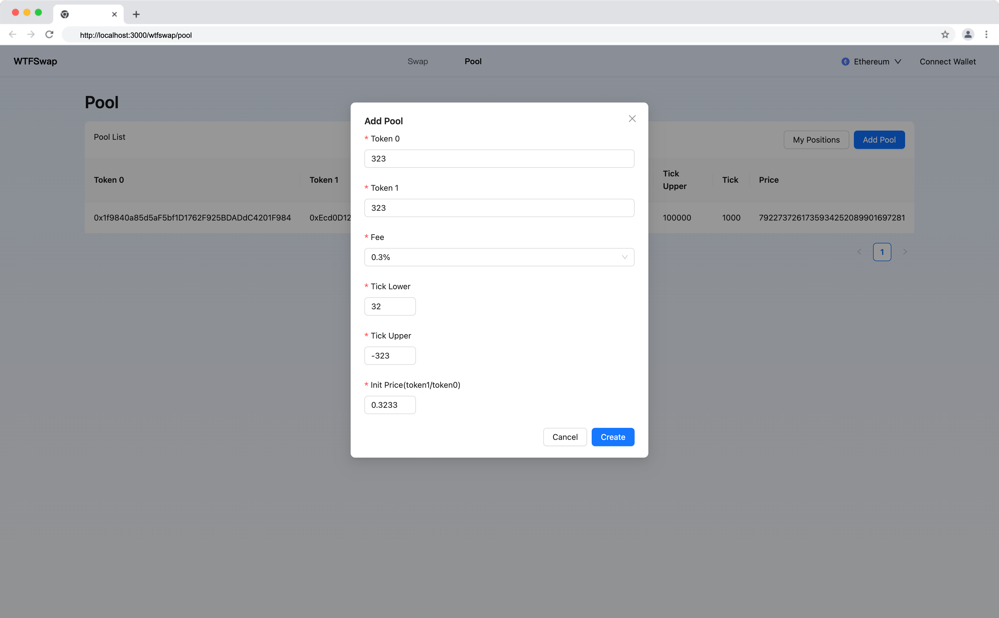

本节作者：[@愚指导](https://x.com/yudao1024)

这一讲我们来实现 Wtfswap 添加交易弹窗的 UI。

---

## 添加弹窗

我们参考下面设计稿：


设计稿是添加流动性的设计稿，这里仅作为参考，因为是课程，我们不会完全实现设计稿中的效果，仅仅通过必要的代码实现必要的功能。

我们主要会用到 Ant Design 的 [Modal 组件](https://ant.design/components/modal-cn) 和 [Form 组件](https://ant.design/components/form-cn) 来实现一个弹窗以及在弹窗中的一个表单。我们首先创建一个组件 `WtfAddPoolModal`，定义它的组件属性。该组件通过一个弹窗表单收集 LP 输入的交易池相关信息，并且通过参数中提供的回调函数将创建交易池的字段传递给页面。

```tsx
import { Modal } from "antd";

interface CreatePoolParams {
  token0: string;
  token1: string;
  fee: number;
  tickLower: number;
  tickUpper: number;
  sqrtPriceX96: BigInt;
}

interface AddPoolModalProps {
  open: boolean;
  onCancel: () => void;
  onCreatePool: (params: CreatePoolParams) => void;
}

export default function AddPoolModal(props: AddPoolModalProps) {
  const { open, onCancel, onCreatePool } = props;
  const [form] = Form.useForm();

  return (
    <Modal
      title="Add Pool"
      open={open}
      onCancel={onCancel}
      okText="Create"
      onOk={() => {
        // TODO
      }}
    ></Modal>
  );
}
```

然后我们在上一讲实现的交易池列表 UI 中引入 `AddPoolModal`：

```diff
import React from "react";
import { Flex, Table, Space, Typography, Button } from "antd";
import type { TableProps } from "antd";
import WtfLayout from "@/components/WtfLayout";
+ import AddPoolModal from "@/components/AddPoolModal";
import Link from "next/link";
import styles from "./pool.module.css";

//...

const PoolListTable: React.FC = () => {
+  const [openAddPoolModal, setOpenAddPoolModal] = React.useState(false);
  const data = [
    {
      token0: "0x1f9840a85d5aF5bf1D1762F925BDADdC4201F984",
      token1: "0xEcd0D12E21805803f70de03B72B1C162dB0898d9",
      index: 0,
      fee: 3000,
      tickLower: -100000,
      tickUpper: 100000,
      tick: 1000,
      sqrtPriceX96: BigInt("7922737261735934252089901697281"),
    },
  ];
  return (
    <>
      <Table
        rowKey="token0"
        title={() => (
          <Flex justify="space-between">
            <div>Pool List</div>
            <Space>
              <Link href="/wtfswap/positions">
                <Button>My Positions</Button>
              </Link>
              <Button
                type="primary"
                onClick={() => {
+                  setOpenAddPoolModal(true);
                }}
              >
                Add Pool
              </Button>
            </Space>
          </Flex>
        )}
        columns={columns}
        dataSource={data}
      />
+      <AddPoolModal
+        open={openAddPoolModal}
+        onCancel={() => {
+          setOpenAddPoolModal(false);
+        }}
+        onCreatePool={(createPram) => {
+          console.log("get createPram", createPram);
+          setOpenAddPoolModal(false);
+        }}
+      />
    </>
  );
};

```

我们通过组件中的状态 `openAddPoolModal` 来控制弹窗的打开和关闭，另外 `onCreatePool` 中处理创建交易池，相关创建的逻辑会在后续的和链交互的课程中补充。

## 添加表单

我们继续在 `CreatePoolModal` 组件中添加相关代码，主要使用 Ant Design 的 `Form` 组件和 `Input`、`InputNumber` 组件。

相关新增组件代码如下：

```jsx
<Form layout="vertical">
  <Form.Item required label="Token 0" name="token0">
    <Input />
  </Form.Item>
  <Form.Item required label="Token 1" name="token1">
    <Input />
  </Form.Item>
  <Form.Item required label="Fee" name="fee">
    <Select>
      <Select.Option value={3000}>0.3%</Select.Option>
      <Select.Option value={500}>0.05%</Select.Option>
      <Select.Option value={10000}>1%</Select.Option>
    </Select>
  </Form.Item>
  <Form.Item required label="Tick Lower" name="tickLower">
    <InputNumber />
  </Form.Item>
  <Form.Item required label="Tick Upper" name="tickUpper">
    <InputNumber />
  </Form.Item>
  <Form.Item required label="Init Price(token1/token0)" name="price">
    <InputNumber min={0.000001} max={1000000} />
  </Form.Item>
</Form>
```

其中 `required` 代表该表单项必填，`label` 为 UI 上显示的表单项名称，`name` 为字段的值，具体的用法可以参考 Ant Design 的[文档](https://ant.design/components/form-cn)，这些都是 Ant Design 定义的属性。

最后，我们需要在点击弹窗的 `Create` 按钮时调用 `onCreatePool` 函数，调用前还需要处理下价格，将 `price` 转换为 `sqrtPriceX96`。另外我们将用户输入的 `price` 限制在一个范围，便于计算（避免超出 JavaScript 的 Number 大小范围），在实际业务需求中你应该注意自己处理这一点。

价格转换我们需要引入一下 `@uniswap/sdk` 这个 npm 包，首先你需要通过 `npm i @uniswap/sdk` 安装它，然后我们新建一个文件 `utils/common.ts`，创建一个工具方法 `parsePriceToSqrtPriceX96`：

```ts
import { encodeSqrtRatioX96 } from "@uniswap/v3-sdk";

export const parsePriceToSqrtPriceX96 = (price: number): BigInt => {
  return BigInt(encodeSqrtRatioX96(price * 1000000, 1000000).toString());
};
```

然后在 `AddPoolModal` 组件中添加相关逻辑

```diff
import { Modal, Form, Input, InputNumber, Select } from "antd";
+ import { parsePriceToSqrtPriceX96 } from "@/utils/common";

interface CreatePoolParams {
  token0: string;
  token1: string;
  fee: number;
  tickLower: number;
  tickUpper: number;
  sqrtPriceX96: BigInt;
}

interface AddPoolModalProps {
  open: boolean;
  onCancel: () => void;
  onCreatePool: (params: CreatePoolParams) => void;
}

export default function AddPoolModal(props: AddPoolModalProps) {
  const { open, onCancel, onCreatePool } = props;
+  const [form] = Form.useForm();

  return (
    <Modal
      title="Add Pool"
      open={open}
      onCancel={onCancel}
      okText="Create"
      onOk={() => {
+        form.validateFields().then((values) => {
+          onCreatePool({
+            ...values,
+            sqrtPriceX96: parsePriceToSqrtPriceX96(values.price),
+          });
+        });
      }}
    >
+      <Form layout="vertical" form={form}>
-      <Form layout="vertical">
        <Form.Item required label="Token 0" name="token0">
          <Input />
        </Form.Item>
        <Form.Item required label="Token 1" name="token1">
          <Input />
        </Form.Item>
        <Form.Item required label="Fee" name="fee">
          <Select>
            <Select.Option value={3000}>0.3%</Select.Option>
            <Select.Option value={500}>0.05%</Select.Option>
            <Select.Option value={10000}>1%</Select.Option>
          </Select>
        </Form.Item>
        <Form.Item required label="Tick Lower" name="tickLower">
          <InputNumber />
        </Form.Item>
        <Form.Item required label="Tick Upper" name="tickUpper">
          <InputNumber />
        </Form.Item>
        <Form.Item required label="Init Price(token1/token0)" name="price">
          <InputNumber min={0.000001} max={1000000} />
        </Form.Item>
      </Form>
    </Modal>
  );
}
```

就这样，我们的创建交易池 UI 部分就完成了，最后的效果是：



完整的代码请参考：[AddPoolModal/index.tsx](../demo/components/AddPoolModal/index.tsx)

我们将在后面的课程中完善代码，添加调用合约接口创建交易池的逻辑。
