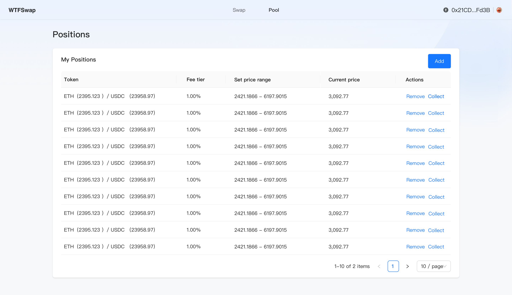
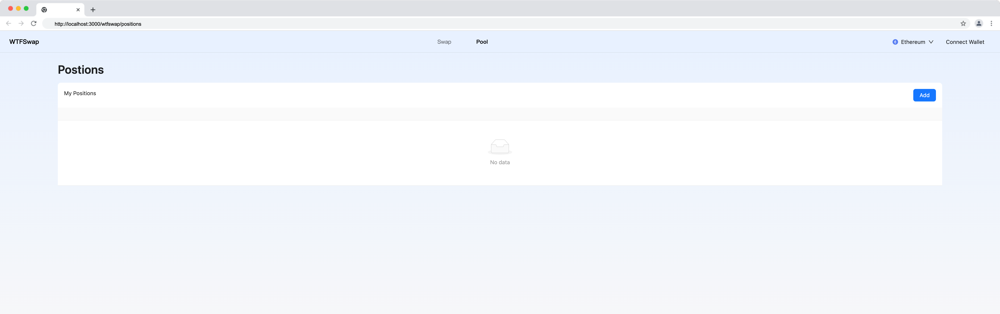
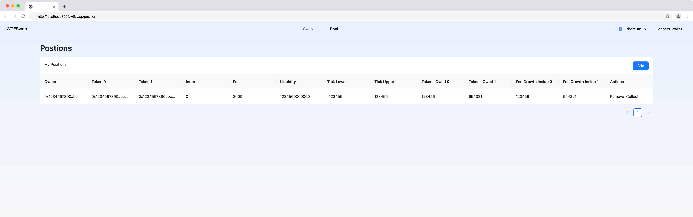

本节作者：[@愚指导](https://x.com/yudao1024)

这一讲我们来实现 Wtfswap 的流动性（头寸）列表的 UI 页面开发。

---

## 框架搭建

首先我们来看一下设计稿：



和交易池列表页面类似，该页面主要是用来显示一个列表，展示出当前账号下的头寸，并包含添加头寸、移除头寸和收回头寸的操作入口。

我们可以直接复制交易池列表页面的代码 [pool.tsx](../P205_PoolListUI/code/pool.tsx) 为 `positions.tsx`，以及 [pool.module.css](../P205_PoolListUI/code/pool.tsx) 为 `positions.module.css`，然后修改一下标题和按钮内容，`columns` 和 `data` 的内容可以先置空，后续再补充。

```tsx
import React from "react";
import { Flex, Table, Space, Typography, Button } from "antd";
import type { TableProps } from "antd";
import WtfLayout from "@/components/WtfLayout";
import styles from "./positions.module.css";

const columns: TableProps["columns"] = [];

const PoolListTable: React.FC = () => {
  const data = [];
  return (
    <Table
      title={() => (
        <Flex justify="space-between">
          <div>My Positions</div>
          <Space>
            <Button type="primary">Add</Button>
          </Space>
        </Flex>
      )}
      columns={columns}
      dataSource={data}
    />
  );
};

export default function WtfswapPool() {
  return (
    <WtfLayout>
      <div className={styles.container}>
        <Typography.Title level={2}>Postions</Typography.Title>
        <PoolListTable />
      </div>
    </WtfLayout>
  );
}
```

你会得到下面这样的效果：



## 添加 Mock 数据

接下来我们来添加列定义和 Mock 数据，用来填充表格。具体字段参考我们在合约中定义的 [PositionInfo](../demo-contract/contracts/wtfswap/interfaces/IPositionManager.sol)。

```tsx
import type { TableProps } from "antd";

const columns: TableProps["columns"] = [
  {
    title: "Owner",
    dataIndex: "owner",
    key: "owner",
    ellipsis: true,
  },
  {
    title: "Token 0",
    dataIndex: "token0",
    key: "token0",
    ellipsis: true,
  },
  {
    title: "Token 1",
    dataIndex: "token1",
    key: "token1",
    ellipsis: true,
  },
  {
    title: "Index",
    dataIndex: "index",
    key: "index",
  },
  {
    title: "Fee",
    dataIndex: "fee",
    key: "fee",
  },
  {
    title: "Liquidity",
    dataIndex: "liquidity",
    key: "liquidity",
    render: (value: bigint) => {
      return value.toString();
    },
  },
  {
    title: "Tick Lower",
    dataIndex: "tickLower",
    key: "tickLower",
  },
  {
    title: "Tick Upper",
    dataIndex: "tickUpper",
    key: "tickUpper",
  },
  {
    title: "Tokens Owed 0",
    dataIndex: "tokensOwed0",
    key: "tokensOwed0",
    render: (value: bigint) => {
      return value.toString();
    },
  },
  {
    title: "Tokens Owed 1",
    dataIndex: "tokensOwed1",
    key: "tokensOwed1",
    render: (value: bigint) => {
      return value.toString();
    },
  },
  {
    title: "Fee Growth Inside 0",
    dataIndex: "feeGrowthInside0LastX128",
    key: "feeGrowthInside0LastX128",
    render: (value: bigint) => {
      return value.toString();
    },
  },
  {
    title: "Fee Growth Inside 1",
    dataIndex: "feeGrowthInside1LastX128",
    key: "feeGrowthInside1LastX128",
    render: (value: bigint) => {
      return value.toString();
    },
  },
  {
    title: "Actions",
    key: "actions",
    render: () => (
      <Space className={styles.actions}>
        <a>Remove</a>
        <a>Collect</a>
      </Space>
    ),
  },
];
```

简单构造一个 Mock 数据：

```tsx
const data = [
  {
    owner: "0x1234567890abcdef1234567890abcdef12345678",
    token0: "0x1234567890abcdef1234567890abcdef12345678",
    token1: "0x1234567890abcdef1234567890abcdef12345678",
    index: 0,
    fee: 3000,
    liquidity: BigInt(1234560000000),
    tickLower: -123456,
    tickUpper: 123456,
    tokensOwed0: BigInt(123456),
    tokensOwed1: BigInt(654321),
    feeGrowthInside0LastX128: BigInt(123456),
    feeGrowthInside1LastX128: BigInt(654321),
  },
];
```

就这样，我们的 UI 部分就完成了，最后的效果是（可能和设计稿中不一致，设计稿更多只是 UI 样式的参考，请忽略）：



完整的代码请参考：[positions.tsx](./code/positions.tsx)

我们将在后面的课程中完善代码，添加和合约交互的相关逻辑。
