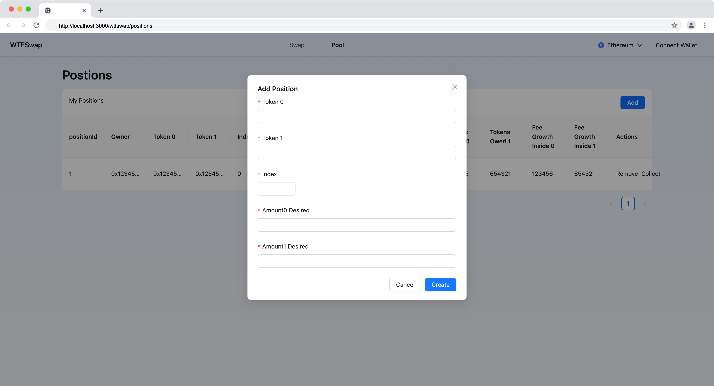

本节作者：[@愚指导](https://x.com/yudao1024)

这一讲我们来实现 Wtfswap 添加流动性（头寸）弹窗的 UI。

---

## 添加弹窗

我们参考下面设计稿：


设计稿仅作视觉上的参考，我们不会完全实现设计稿中的效果，仅仅通过必要的代码实现必要的功能。

和[添加交易池弹窗 UI 的课程](../P206_AddPoolUI/readme.md)类似，我们首先创建一个组件 `WtfAddPositionModal`，定义它的组件属性。该组件通过一个弹窗表单收集 LP 输入的交易池相关信息，并且通过参数中提供的回调函数将创建交易池的字段传递给页面。

我们直接复制 [WtfAddPositionModal/index.tsx](../demo/components/AddPoolModal/index.tsx) 的代码，做修改：

```tsx
import { Modal, Form, Input, InputNumber } from "antd";

interface CreatePositionParams {
  token0: string;
  token1: string;
  index: number;
  amount0Desired: BigInt;
  amount1Desired: BigInt;
  recipient: string;
  deadline: BigInt;
}

interface AddPositionModalProps {
  open: boolean;
  onCancel: () => void;
  onCreatePosition: (params: CreatePositionParams) => void;
}

export default function AddPositionModal(props: AddPositionModalProps) {
  const { open, onCancel, onCreatePosition } = props;
  const [form] = Form.useForm();

  return (
    <Modal
      title="Add Position"
      open={open}
      onCancel={onCancel}
      okText="Create"
      onOk={() => {
        form.validateFields().then((values) => {
          onCreatePosition({
            ...values,
            amount0Desired: BigInt(values.amount0Desired),
            amount1Desired: BigInt(values.amount1Desired),
            deadline: BigInt(Date.now() + 100000),
          });
        });
      }}
    >
      <Form layout="vertical" form={form}>
        <Form.Item required label="Token 0" name="token0">
          <Input />
        </Form.Item>
        <Form.Item required label="Token 1" name="token1">
          <Input />
        </Form.Item>
        <Form.Item required label="Index" name="index">
          <InputNumber />
        </Form.Item>
        <Form.Item required label="Amount0 Desired" name="amount0Desired">
          <Input />
        </Form.Item>
        <Form.Item required label="Amount1 Desired" name="amount1Desired">
          <Input />
        </Form.Item>
      </Form>
    </Modal>
  );
}
```

因为和[添加交易池弹窗 UI 的课程](../P206_AddPoolUI/readme.md)类似，所以具体就不展开了，相比 `AddPoolModal` 来说，`AddPositionModal` 主要表单字段不同，具体的表单字段可以参考合约代码 [](../demo-contract/contracts/wtfswap/interfaces/IPositionManager.sol) 中的 `MintParams` 的定义：

```solidity
struct MintParams {
    address token0;
    address token1;
    uint32 index;
    uint256 amount0Desired;
    uint256 amount1Desired;
    address recipient;
    uint256 deadline;
}
```

## 引入 AddPositionModal

然后我们在上一讲实现的流动性列表 UI 中引入 `AddPositionModal`：

```diff
import React from "react";
import { Flex, Table, Space, Typography, Button } from "antd";
import type { TableProps } from "antd";
import WtfLayout from "@/components/WtfLayout";
+ import AddPositionModal from "@/components/AddPositionModal";
import styles from "./positions.module.css";

const columns: TableProps["columns"] = [
  // ...
];

const PoolListTable: React.FC = () => {
  const [openAddPositionModal, setOpenAddPositionModal] = React.useState(false);
  const data = [
    // ...
  ];
  return (
+    <>
      <Table
        title={() => (
          <Flex justify="space-between">
            <div>My Positions</div>
            <Space>
              <Button
                type="primary"
                onClick={() => {
+                  setOpenAddPositionModal(true);
                }}
              >
                Add
              </Button>
            </Space>
          </Flex>
        )}
        columns={columns}
        dataSource={data}
      />
+      <AddPositionModal
+        open={openAddPositionModal}
+        onCancel={() => {
+          setOpenAddPositionModal(false);
+        }}
+        onCreatePosition={(createPram) => {
+          console.log("get createPram", createPram);
+          setOpenAddPositionModal(false);
+        }}
+      />
+    </>
  );
};

export default function WtfswapPool() {
  return (
    <WtfLayout>
      <div className={styles.container}>
        <Typography.Title level={2}>Postions</Typography.Title>
        <PoolListTable />
      </div>
    </WtfLayout>
  );
}
```

我们通过组件中的状态 `openAddPositionModal` 来控制弹窗的打开和关闭，另外 `onCreatePosition` 中处理创建交易池，相关创建的逻辑会在后续的和链交互的课程中补充。

就这样，我们的添加流动性 UI 部分就完成了，最后的效果是：



完整的代码请参考：[AddPositionModal/index.tsx](../demo/components/AddPositionModal/index.tsx)

我们将在后面的课程中完善代码，添加调用合约接口添加流动性的逻辑。
