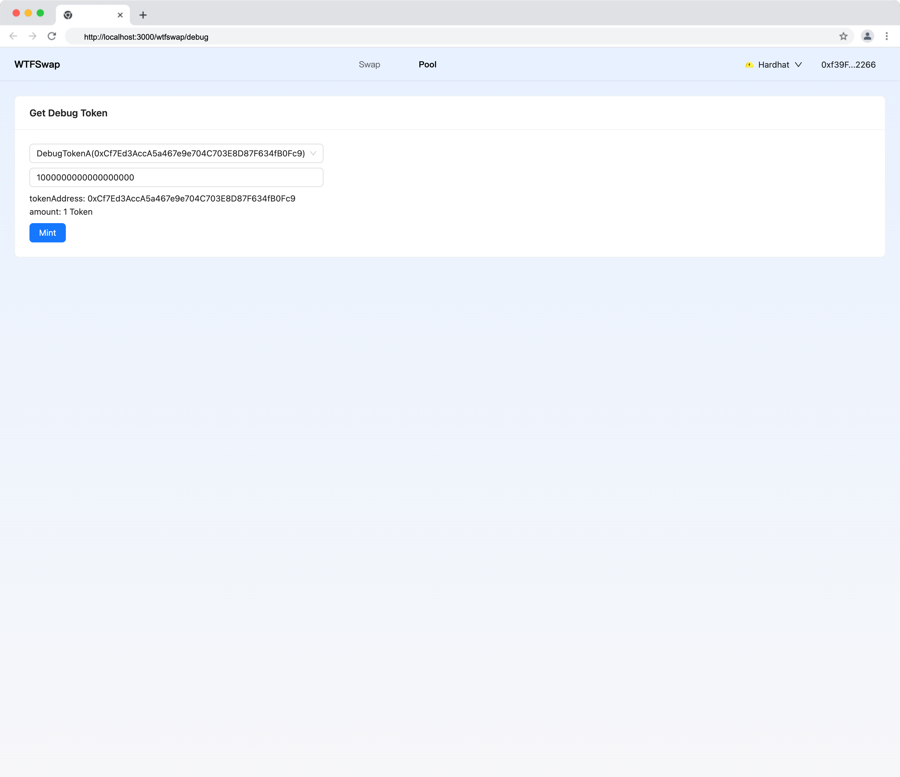

本节作者：[@愚指导](https://x.com/yudao1024)

这一讲开始将会准备前端和链联调相关工作，为后面各个开发前端和链做交互做准备。

---

## 添加测试用的代币合约

为了方便测试，我们新建一个 `wtfswap/test-contracts/DebugToken.sol` 合约，用于测试。合约代码如下：

```solidity
// SPDX-License-Identifier: MIT
pragma solidity ^0.8.20;

import "@openzeppelin/contracts/token/ERC20/ERC20.sol";

contract DebugToken is ERC20 {
    uint256 private _nextTokenId = 0;

    constructor(string memory name, string memory symbol) ERC20(name, symbol) {}

    function mint(address recipient, uint256 quantity) public payable {
        require(quantity > 0, "quantity must be greater than 0");
        require(
            quantity < 10000000 * 10 ** 18,
            "quantity must be less than 10000000 * 10 ** 18"
        );
        _mint(recipient, quantity);
    }
}
```

该合约可以在部署时指定代币名称，并且可以随意 mint 代币（我们只是简单做了一个单测 mint 上限的限制）。

然后我们新增一个部署文件 `ignition/modules/DebugToken.ts`，用于部署三个测试用的代币合约：

```typescript
import { buildModule } from "@nomicfoundation/hardhat-ignition/modules";

const DebugTokenModule = buildModule("DebugToken", (m) => {
  const debugTokenA = m.contract("DebugToken", ["DebugTokenA", "DTA"], {
    id: "DebugTokenA",
  });
  const debugTokenB = m.contract("DebugToken", ["DebugTokenB", "DTB"], {
    id: "DebugTokenB",
  });
  const debugTokenC = m.contract("DebugToken", ["DebugTokenC", "DTC"], {
    id: "DebugTokenC",
  });

  return {
    debugTokenA,
    debugTokenB,
    debugTokenC,
  };
});

export default DebugTokenModule;
```

## 本地部署合约

我们需要在本地运行一个测试用的链节点测试，首先在 `demo-contracts` 目录下运行：

```sh
npx hardhat node # 启动一个本地链开发调试节点
```

然后新开一个终端分别部署 Wtfswap 合约和 DebugToken 合约：

```sh
npx hardhat compile # 编译合约
npx hardhat ignition deploy ./ignition/modules/Wtfswap.ts --network localhost # 部署 Wtfswap 合约
npx hardhat ignition deploy ./ignition/modules/DebugToken.ts --network localhost # 部署 DebugToken 合约
```

更多细节可以参考[《合约本地开发和测试环境》](../14_LocalDev/readme.md) 和 [《初始化合约和开发环境》](../P102_InitContracts/readme.md)。

需要注意的是，部署在本地时，合约地址会按照部署顺序分配固定地址，所以为了保证在后续的测试中合约地址不变，请保证启动链后部署合约的顺序不变。我们在 `utils/common.ts` 中新建一个方法 `getContractAddress` 用来获取合约地址：

```typescript
export const getContractAddress = (
  contract:
    | "PoolManager"
    | "PositionManager"
    | "SwapRouter"
    | "DebugTokenA"
    | "DebugTokenB"
    | "DebugTokenC"
): `0x${string}` => {
  const isProd = process.env.NODE_ENV === "production";
  if (contract === "PoolManager") {
    return isProd
      ? "0x5FbDB2315678afecb367f032d93F642f64180aa3"
      : "0x5FbDB2315678afecb367f032d93F642f64180aa3";
  }
  if (contract === "PositionManager") {
    return isProd
      ? "0xe7f1725E7734CE288F8367e1Bb143E90bb3F0512"
      : "0xe7f1725E7734CE288F8367e1Bb143E90bb3F0512";
  }
  if (contract === "SwapRouter") {
    return isProd
      ? "0x9fE46736679d2D9a65F0992F2272dE9f3c7fa6e0"
      : "0x9fE46736679d2D9a65F0992F2272dE9f3c7fa6e0";
  }
  if (contract === "DebugTokenA") {
    return isProd
      ? "0xCf7Ed3AccA5a467e9e704C703E8D87F634fB0Fc9"
      : "0xCf7Ed3AccA5a467e9e704C703E8D87F634fB0Fc9";
  }
  if (contract === "DebugTokenB") {
    return isProd
      ? "0xDc64a140Aa3E981100a9becA4E685f962f0cF6C9"
      : "0xDc64a140Aa3E981100a9becA4E685f962f0cF6C9";
  }
  if (contract === "DebugTokenC") {
    return isProd
      ? "0x5FC8d32690cc91D4c39d9d3abcBD16989F875707"
      : "0x5FC8d32690cc91D4c39d9d3abcBD16989F875707";
  }
  throw new Error("Invalid contract");
};
```

未来我们会在合约部署到测试网之后更新这个方法，确保项目部署后可以访问到正确的合约地址。

## 更新合约接口代码

合约和链都准备好之后我们还要更新下前端调用合约的 React Hooks 模板，你需要进入到 `demo` 目录下更新合约最新的接口：

```sh
npx wagmi generate
```

它会按照我们的配置更新 `utils/contracts.ts` 文件，然后生成代码来调用我们在之前课程中实现的合约。比如在下一讲中可以用 `useReadPoolManagerGetAllPools` 查看交易池和 `useWritePoolManagerCreateAndInitializePoolIfNecessary` 创建交易池。具体可以参考[《使用 Wagmi CLI 调试本地合约》](../15_WagmiCli/readme.md)的说明。

## 测试代币水龙头页面

另外为了方便后续的测试，我们还开发了一个测试页面用于获取测试代币。

完整的代码在 [wtfswap/debug.tsx](../demo/pages/wtfswap/debug.tsx) 中，这个页面会调用我们的 DebugToken 合约，mint 一些代币到当前账户。

启动项目后通过访问 [http://localhost:3000/wtfswap/debug](http://localhost:3000/wtfswap/debug) 即可通过该水龙头页面领取代币：



至此我们就准备好了前端和链的联调准备，下一讲开始我们会添加相关代码，完善我们的 DEX 前端逻辑。
