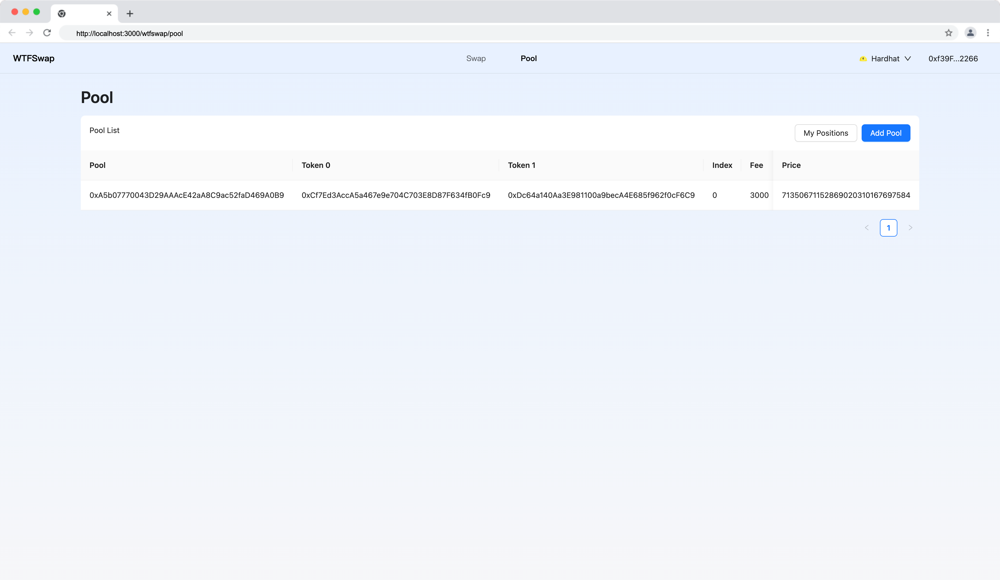

本节作者：[@愚指导](https://x.com/yudao1024)

这一讲开始将会开发前端调用合约相关逻辑，我们首先从支持添加交易对开始。

---

## 获取交易池列表

我们在之前的[《PoolManager 合约开发》](../P104_PoolManager/readme.md)中已经实现了 `getAllPools` 方法，这个方法可以获取所有的交易池列表。我们在前端调用这个方法，获取所有的交易池列表。

> 需要注意的是，在实际的 DApp 开发中，该方法由服务端维护和返回更合适，而不需要在合约中实现，我们这么做只是为了优化课程内容。

我们在上一讲中通过 `npx wagmi generate` 更新了 `utils/coontract.ts` 文件，里面包含了一系列的 React Hooks，我们可以很方便的调用合约方法。

我们只需要使用 `useReadPoolManagerGetAllPools` 就可以获取到所有的交易池列表，如下所示，几行关键的代码即可完成：

```diff

+ import { useReadPoolManagerGetAllPools } from "@/utils/contracts";

const PoolListTable: React.FC = () => {
+  const { data = [] } = useReadPoolManagerGetAllPools({
+    address: getContractAddress("PoolManager"),
+  });
  return (
    <>
      <Table
        rowKey="pool"
        scroll={{ x: "max-content" }}
        title={() => (
          <Flex justify="space-between">
// ...
          </Flex>
        )}
        columns={columns}
+        dataSource={data}
      />
    </>
  );
};
```

对于类似 `getAllPools` 这样读的方法来说，因为不涉及到链上状态的变化，所以我们可以直接调用，不需要发起交易，也不需要消耗 GAS。

## 创建交易池

创建交易池需要调用的是 `createAndInitializePoolIfNecessary` 方法，这是一个写方法，需要发起交易，唤起用户钱包签名。

关键代码如下：

```diff
import {
  useReadPoolManagerGetAllPools,
+  useWritePoolManagerCreateAndInitializePoolIfNecessary,
} from "@/utils/contracts";


const PoolListTable: React.FC = () => {
  const [openAddPoolModal, setOpenAddPoolModal] = React.useState(false);
+  const [loading, setLoading] = React.useState(false);
-  const { data = [] } = useReadPoolManagerGetAllPools({
+  const { data = [], refetch } = useReadPoolManagerGetAllPools({
    address: getContractAddress("PoolManager"),
  });
+  const { writeContractAsync } =
+    useWritePoolManagerCreateAndInitializePoolIfNecessary();
  return (
    <>
      <Table
        rowKey="pool"
        scroll={{ x: "max-content" }}
        title={() => (
          <Flex justify="space-between">
            <div>Pool List</div>
            <Space>
              <Link href="/wtfswap/positions">
                <Button>My Positions</Button>
              </Link>
              <Button
                type="primary"
+               loading={loading}
                onClick={() => {
                  setOpenAddPoolModal(true);
                }}
              >
                Add Pool
              </Button>
            </Space>
          </Flex>
        )}
        columns={columns}
        dataSource={data}
      />
      <AddPoolModal
         open={openAddPoolModal}
        onCancel={() => {
          setOpenAddPoolModal(false);
        }}
        onCreatePool={async (createParams) => {
           console.log("get createParams", createParams);
+          setLoading(true);
+          setOpenAddPoolModal(false);
+          try {
+            await writeContractAsync({
+              address: getContractAddress("PoolManager"),
+              args: [
+                {
+                  token0: createParams.token0,
+                  token1: createParams.token1,
+                  fee: createParams.fee,
+                  tickLower: createParams.tickLower,
+                  tickUpper: createParams.tickUpper,
+                  sqrtPriceX96: createParams.sqrtPriceX96,
+                },
+              ],
+            });
+            message.success("Create Pool Success If Necessary");
+            refetch();
+          } catch (error: any) {
+            message.error(error.message);
+          } finally {
+            setLoading(false);
+          }
         }}
      />
    </>
  );
};
```

核心逻辑是完善了 `onCreatePool` 方法，它会调用 `writeContractAsync` 创建一个交易池，这个过程会唤起用户钱包要求用户签名。另外创建成功后更新交易池列表，需要注意的是我们使用的是 `writeContractAsync` 而不是 `writeContract`，前者会等到真正创建成功后才会返回，后者会立即返回。

完成的代码你可以在 [demo/pages/wtfswap/pool.tsx](../demo/pages/wtfswap/pool.tsx) 中查看。

最后的效果如下：


