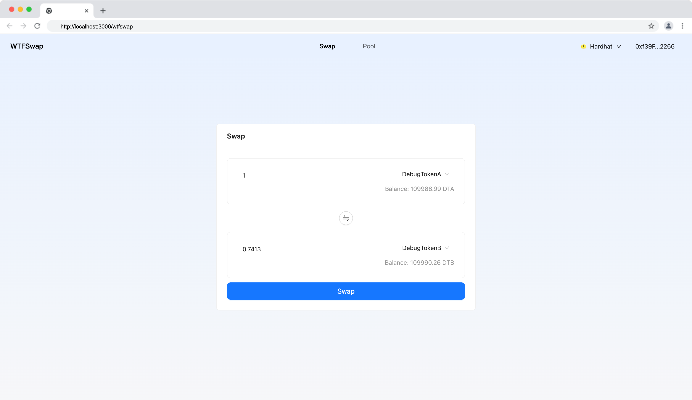

本节作者：[@愚指导](https://x.com/yudao1024)

这一讲会完成交易相关逻辑，包括交易的询价、指定输入交易、指定输出交易等。

---

## 显示可用的交易对

首先，我们需要获取到当前可以用的交易对，并展示到下拉选择中供用户选择。我们需要使用 `useReadPoolManagerGetPairs` 调用 `PoolManager` 的 `GetPairs` 方法。

参考代码如下，我们设置了 `tokens`，`tokenA` 和 `tokenB` 三个状态：

```tsx
// 用户可以选择的代币
const [tokens, setTokens] = useState<Token[]>([]);
// 用户选择的两个代币
const [tokenA, setTokenA] = useState<Token>();
const [tokenB, setTokenB] = useState<Token>();
// 获取所有的交易对
const { data: pairs = [] } = useReadPoolManagerGetPairs({
  address: getContractAddress("PoolManager"),
});

useEffect(() => {
  const options: Token[] = uniq(
    pairs.map((pair) => [pair.token0, pair.token1]).flat()
  ).map(getTokenInfo);
  setTokens(options);
  setTokenA(options[0]);
  setTokenB(options[1]);
}, [pairs]);

return (
  <>
    <TokenSelect value={tokenA} onChange={setTokenA} options={tokens} />
    <TokenSelect value={tokenB} onChange={setTokenB} options={tokens} />
  </>
);
```

以上只是核心代码，你可以参考它尝试自己来完成课程，代码中需要用到 `getTokenInfo` 方法，它维护在 [demo/utils/common.ts](../demo/utils/common.ts) 中，维护了 Token 的信息，在课程中，我们写死了相关信息，实际开发中，你应该有一个服务来维护各种 Token 的图标，名称等信息，提供接口给前端调用。

## 显示余额

我们需要显示用户的余额，这里我们需要使用 `useReadErc20BalanceOf` Hook 来获取用户的余额。我们新增一个组件 [Balance.tsx](../demo/components/Balance.tsx)，用于显示余额：

```tsx
import React, { forwardRef, useImperativeHandle } from "react";
import type { Token } from "@ant-design/web3";
import { CryptoPrice } from "@ant-design/web3";
import { useReadErc20BalanceOf } from "@/utils/contracts";
import { useAccount } from "wagmi";
import useTokenAddress from "@/hooks/useTokenAddress";

interface Props {
  token?: Token;
}

// 使用 forwardRef 来接收 ref
const Balance = (
  props: Props,
  ref: React.ForwardedRef<{ refresh: () => void }>
) => {
  const { address } = useAccount();
  const tokenAddress = useTokenAddress(props.token);
  const { data: balance, refetch } = useReadErc20BalanceOf({
    address: tokenAddress,
    args: [address as `0x${string}`],
    query: {
      enabled: !!tokenAddress,
    },
  });

  // 使用 useImperativeHandle 将 refetch 方法暴露给外部
  useImperativeHandle(ref, () => ({
    refresh: refetch,
  }));

  return balance === undefined ? (
    "-"
  ) : (
    <CryptoPrice
      value={balance}
      symbol={props.token?.symbol}
      decimals={props.token?.decimal}
      fixed={2}
    />
  );
};

export default forwardRef(Balance);
```

组件接收一个 `token` 参数，它的类型是 `Token`，是 [Ant Design Web3](https://web3.ant.design/) 中定义的一个类型，定义包含了该 Token 的信息，我们使用 Ant Design Web3 的 [CryptoPrice](https://web3.ant.design/components/crypto-price) 组件来显示余额。

另外组件对外暴露了一个 `refresh` 方法用于更新余额，我们在交易完成后需要手动调用一下。

## 报价

在发起交易之前，我们需要模拟调用报价接口，获取价格相关信息。因为该接口需要在用户输入金额时频繁调用，并且在调用后需要设置其它组件状态，不方便直接使用 Hooks 实现，所以我们封装了一个方法 `updateAmountBWithAmountA`：

```ts
const updateAmountBWithAmountA = async (value: number) => {
  if (
    !publicClient ||
    !tokenAddressA ||
    !tokenAddressB ||
    isNaN(value) ||
    value === 0
  ) {
    return;
  }
  if (tokenAddressA === tokenAddressB) {
    message.error("Please select different tokens");
    return;
  }
  try {
    const newAmountB = await publicClient.simulateContract({
      address: getContractAddress("SwapRouter"),
      abi: swapRouterAbi,
      functionName: "quoteExactInput",
      args: [
        {
          tokenIn: tokenAddressA,
          tokenOut: tokenAddressB,
          indexPath: swapIndexPath,
          amountIn: parseAmountToBigInt(value, tokenA),
          sqrtPriceLimitX96,
        },
      ],
    });
    setAmountB(parseBigIntToAmount(newAmountB.result, tokenB));
    setIsExactInput(true);
  } catch (e: any) {
    message.error(e.message);
  }
};
```

我们在 TokenA 金额发生变化的时候获取报价，修改对应的 TokenB：

```ts
useEffect(() => {
  // 当用户输入发生变化时，重新请求报价接口计算价格
  if (isExactInput) {
    updateAmountBWithAmountA(amountA);
  } else {
    updateAmountAWithAmountB(amountB);
  }
}, [isExactInput, tokenAddressA, tokenAddressB, amountA, amountB]);
```

同理，我们也会有 `updateAmountAWithAmountB` 方法，它是在 TokenB 金额发生变化的时候获取报价，修改对应的 TokenA，这种情况则是指定输出来交易。

我们需要新增多个相关状态，这里就不具体展开了，完成的代码你可以在 [demo/pages/wtfswap/index.tsx](../demo/pages/wtfswap/index.tsx) 中查看。

另外我们还需要设置交易的限价，也就是设置一个滑点，在课程中我们就简化实现（设置默认的 10000 个 tick 的价格偏差）：

```ts
export const computeSqrtPriceLimitX96 = (
  pools: {
    pool: `0x${string}`;
    token0: `0x${string}`;
    token1: `0x${string}`;
    index: number;
    fee: number;
    feeProtocol: number;
    tickLower: number;
    tickUpper: number;
    tick: number;
    sqrtPriceX96: bigint;
  }[],
  zeroForOne: boolean
): bigint => {
  if (zeroForOne) {
    // 如果是 token0 交换 token1，那么交易完成后价格 token0 变多，价格下降下限
    // 先找到交易池的最小 tick
    const minTick =
      minBy(pools, (pool) => pool.tick)?.tick ?? TickMath.MIN_TICK;
    // 价格限制为最小 tick - 10000，避免价格过低，在实际项目中应该按照用户设置的滑点来调整
    const limitTick = Math.max(minTick - 10000, TickMath.MIN_TICK);
    return BigInt(TickMath.getSqrtRatioAtTick(limitTick).toString());
  } else {
    // 反之，设置一个最大的价格
    // 先找到交易池的最大 tick
    const maxTick =
      maxBy(pools, (pool) => pool.tick)?.tick ?? TickMath.MAX_TICK;
    // 价格限制为最大 tick + 10000，避免价格过高，在实际项目中应该按照用户设置的滑点来调整
    const limitTick = Math.min(maxTick + 10000, TickMath.MAX_TICK);
    return BigInt(TickMath.getSqrtRatioAtTick(limitTick).toString());
  }
};
```

`computeSqrtPriceLimitX96` 方法在 [utils/common.ts](../demo/utils/common.ts) 中，它会根据当前的交易池的 tick 信息，计算出一个价格限制，避免价格过高或过低。

## 交易

当获取报价成功后我们需要发起交易，和注入流动性类似，交易也需要操作用户金额，所以也需要使用 `useWriteErc20Approve` 进行授权。核心代码如下：

```tsx
<Button
  type="primary"
  size="large"
  block
  className={styles.swapBtn}
  disabled={!tokenAddressA || !tokenAddressB || !amountA || !amountB}
  loading={loading}
  onClick={async () => {
    setLoading(true);
    try {
      if (isExactInput) {
        const swapParams = {
          tokenIn: tokenAddressA!,
          tokenOut: tokenAddressB!,
          amountIn: parseAmountToBigInt(amountA, tokenA),
          amountOutMinimum: parseAmountToBigInt(amountB, tokenB),
          recipient: account?.address as `0x${string}`,
          deadline: BigInt(Math.floor(Date.now() / 1000) + 1000),
          sqrtPriceLimitX96,
          indexPath: swapIndexPath,
        };
        console.log("swapParams", swapParams);
        await writeApprove({
          address: tokenAddressA!,
          args: [getContractAddress("SwapRouter"), swapParams.amountIn],
        });
        await writeExactInput({
          address: getContractAddress("SwapRouter"),
          args: [swapParams],
        });
      } else {
        const swapParams = {
          tokenIn: tokenAddressA!,
          tokenOut: tokenAddressB!,
          amountOut: parseAmountToBigInt(amountB, tokenB),
          amountInMaximum: parseAmountToBigInt(Math.ceil(amountA), tokenA),
          recipient: account?.address as `0x${string}`,
          deadline: BigInt(Math.floor(Date.now() / 1000) + 1000),
          sqrtPriceLimitX96,
          indexPath: swapIndexPath,
        };
        console.log("swapParams", swapParams);
        await writeApprove({
          address: tokenAddressA!,
          args: [getContractAddress("SwapRouter"), swapParams.amountInMaximum],
        });
        await writeExactOutput({
          address: getContractAddress("SwapRouter"),
          args: [swapParams],
        });
      }
      message.success("Swap success");
      balanceARef.current?.refresh();
      balanceBRef.current?.refresh();
      setAmountA(NaN);
      setAmountB(NaN);
    } catch (e: any) {
      message.error(e.message);
    } finally {
      setLoading(false);
    }
  }}
>
  Swap
</Button>
```

具体实现的时候需要考虑较多的细节，包括选择哪些交易池更便宜，如何处理交易失败，如何更好的显示部分成交信息等，课程中只是做了一个简单的实现。

最后的效果如下：



至此，我们的所有基础代码就开发完成了，后续我们会继续讲解如何部署和优化合约。
