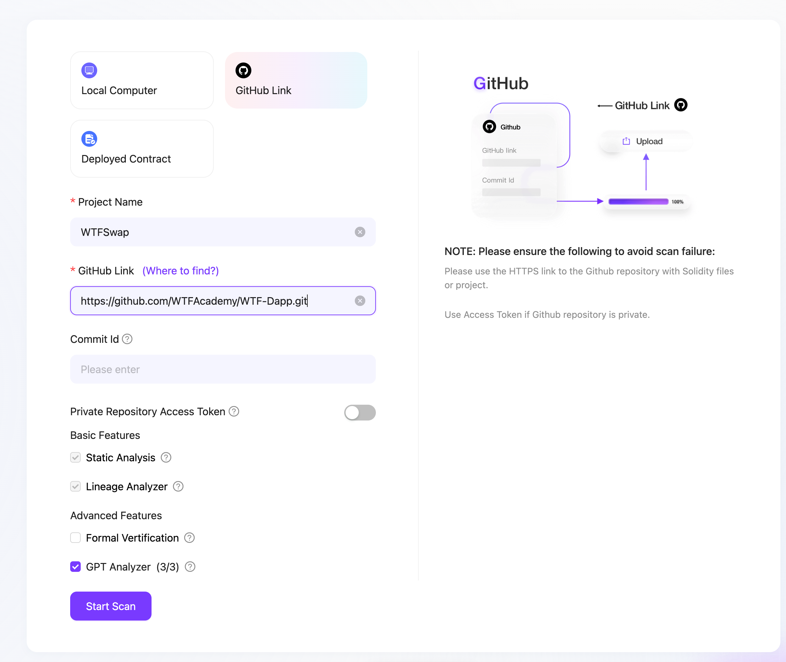
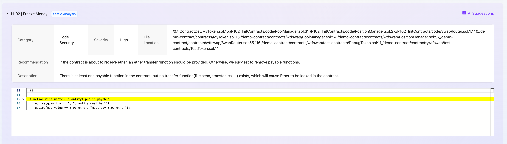
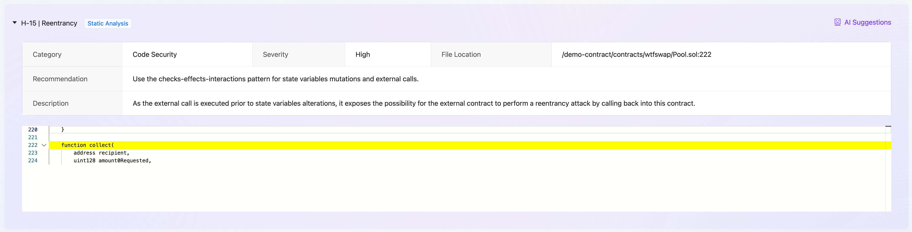

本节作者：[@愚指导](https://x.com/yudao1024)
漏洞列表贡献：[@愚指导](https://x.com/yudao1024) [@Ethan](https://x.com/SnowS39053)

这一讲会简单讲一下合约安全，也欢迎大家提交本课程的合约漏洞帮助完善该文档。

---

## 关于合约安全和优化

合约安全是 DApp 开发中非常重要的一个环节，智能合约的漏洞可能会导致资产的损失，因此在开发合约时需要格外小心。因为大部分区块链的合约一旦部署就无法更新，只能重新部署。而且合约代码通常都是开源的，所以一旦部署了有问题的合约就容易被黑客利用，或者资产被意外冻结在合约中，也可能会产生非预期的错误结果。

所以合约安全变得很重要，通常来说合约在正式发布前都会经过专业的团队进行安全审计，产出安全报告后才能发布。
更多的合约安全的内容大家可以参考 WTF Academy 的[《合约安全》](https://github.com/AmazingAng/WTF-Solidity?tab=readme-ov-file#%E5%90%88%E7%BA%A6%E5%AE%89%E5%85%A8)部分课程。

除了合约的安全外，合约的优化也很重要。因为合约的执行需要消耗 GAS，而合约发布之后就无法再更新代码，所以合约上线前对合约的代码做优化也很重要。

## 使用 AI 来审计合约

合约的审计目前来说还是需要专家团队审核来保障，但是也有一些 AI 工具可以做一些审计，这也是对合约进行初步审查避免一些初级和常见问题的有效手段。

我们这里尝试使用 ZAN 的 [AI Scan](https://zan.top/cn/home/ai-scan) 的服务来做一个简单的审计，如下图所示，我们提交了一个审计任务。

最后我们会得到一个报告，该报告基于一些已有的只能合约漏洞数据库生成，提供了一些可能的漏洞和建议。比如下图所示，因为我们的合约并不支持原生代币的交易，所以也没有做原生代币的提取，我们的合约中的 `payable` 其实是没有必要的，相反它还可能会导致意外转入原生代币到合约之后无法提取。

另外还有类似重入攻击、溢出攻击等常见的可能的漏洞：

完整的报告你可以通过 [https://zan.top/review/reports/public/51d6c489-8b2e-4f9a-b132-9916a30083b0](https://zan.top/review/reports/public/51d6c489-8b2e-4f9a-b132-9916a30083b0) 查看。

## Wtfswap 合约漏洞和优化案例收集

当然，AI 来审计合约目前还无法完全的保证合约的安全性，很多逻辑尤其是涉及到具体的业务逻辑时，都需要类似 [ZAN Expert Audit](https://zan.top/home/expert-audit) 这样的服务来请求安全专家对合约进行审查。比如 [Bevmswap-20240328.pdf](https://mdn.alipayobjects.com/huamei_hsbbrh/afts/file/A*hU0NTIk3I-4AAAAAAAAAAAAADiOMAQ/Bevmswap-20240328.pdf) 就是一个专家审计的报告。

因为资源原因我们也无法对 Wtfswap 合约进行完整的审查，在此欢迎社区给我们的合约提交漏洞。

你可以直接提交 [Pull Request](https://github.com/WTFAcademy/WTF-Dapp/pulls) 来提交你发现的漏洞，新增漏洞文件到 [bugs](./bugs/) 帮助社区同学学习。

漏洞列表：

1. [《payable 可能导致资金被锁》](./bugs/001.md)
2. [《getAllPools 方法存在数据覆盖的问题》](./bugs/002.md)

上面是当前已经发现的 Wtfswap 合约的漏洞或者优化点，欢迎社区同学提交补充更多的案例。
