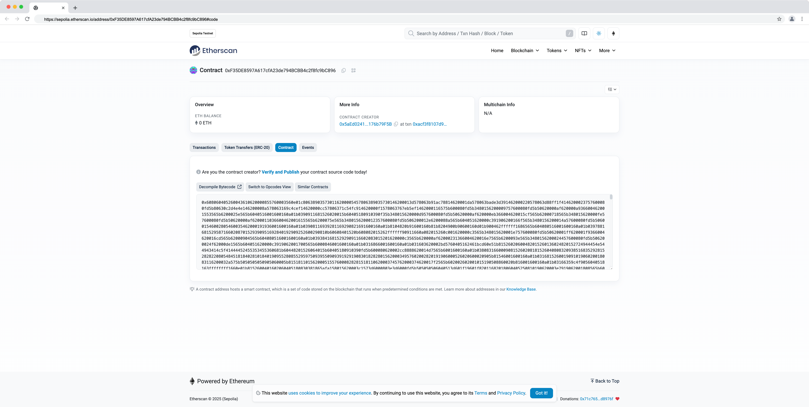

本节作者：[@愚指导](https://x.com/yudao1024)

这一讲我们将会把 Wtfswap 部署到测试网 Sepolia 上，正式完成我们的课程。

---

## 合约部署

和部署合约到本地测试节点类似，我们可以使用 Hardhat Ignition 来部署合约到测试网。

首先我们需要在 `hardhat.config.ts` 中配置测试网的网络信息：

```diff
import { HardhatUserConfig } from "hardhat/config";
import "@nomicfoundation/hardhat-toolbox-viem";

const config: HardhatUserConfig = {
  solidity: {
    version: "0.8.24",
    settings: {
      optimizer: {
        enabled: true,
        runs: 200,
      },
    },
  },
+  networks: {
+    sepolia: {
+      url: "https://api.zan.top/public/eth-sepolia", // 实际项目中需要替换为你的 ZAN 的 RPC 地址，这里用的是测试用的公共地址，可能不稳定
+      accounts: ["YOUR_PRIVATE_KEY"], // 替换为你的钱包私钥
+    },
+  },
};

export default config;
```

在配置中你需要配置两个关键信息：

1. 网络的 RPC 地址，这里使用的是 ZAN 的测试网地址，实际项目中需要替换为你的 RPC 地址。你可以在 [https://zan.top/service/apikeys](https://zan.top/service/apikeys) 找到各种可用网络的 RPC 地址，除了测试网，以太坊主网以及其他以太坊 L2 的网络上也都可以。
1. 钱包私钥，需要注意的是，要保护好你的钱包私钥。建议使用安全的电脑环境，以及使用专门的钱包来部署合约。另外，你也可以考虑通过 CloudIDE 来换起钱包来部署合约，那样更安全，也可以避免依赖链投毒（比如 Hardhat 依赖的某个包被投毒）。

配置好之后执行 `npx hardhat ignition deploy ./ignition/modules/Wtfswap.ts --network sepolia` 就可以部署 Wtfswap 合约到测试网了。下面是课程开发是部署的日志：

```
npx hardhat ignition deploy ./ignition/modules/Wtfswap.ts --network sepolia
✔ Confirm deploy to network sepolia (11155111)? … yes
Hardhat Ignition 🚀

Deploying [ Wtfswap ]

Batch #1
  Executed Wtfswap#PoolManager

Batch #2
  Executed Wtfswap#PositionManager
  Executed Wtfswap#SwapRouter

[ Wtfswap ] successfully deployed 🚀

Deployed Addresses

Wtfswap#PoolManager - 0xF35DE8597A617cfA23de794BCBB4c2f8fc9bC896
Wtfswap#PositionManager - 0x59ebEa058E193B64f0E091220d5Db98288EFec57
Wtfswap#SwapRouter - 0xA8b9Fa84A4Df935e768d3cC211E3d679027d0B31
```

同理，我们把测试 Token 也部署到测试网上：

```
npx hardhat ignition deploy ./ignition/modules/DebugToken.ts --network sepolia
✔ Confirm deploy to network sepolia (11155111)? … yes
Hardhat Ignition 🚀

Resuming existing deployment from ./ignition/deployments/chain-11155111

Deploying [ DebugToken ]

Warning - previously executed futures are not in the module:
 - Wtfswap#PoolManager
 - Wtfswap#PositionManager
 - Wtfswap#SwapRouter

Batch #1
  Executed DebugToken#DebugTokenA
  Executed DebugToken#DebugTokenB
  Executed DebugToken#DebugTokenC

[ DebugToken ] successfully deployed 🚀

Deployed Addresses

Wtfswap#PoolManager - 0xF35DE8597A617cfA23de794BCBB4c2f8fc9bC896
Wtfswap#PositionManager - 0x59ebEa058E193B64f0E091220d5Db98288EFec57
Wtfswap#SwapRouter - 0xA8b9Fa84A4Df935e768d3cC211E3d679027d0B31
DebugToken#DebugTokenA - 0x5AAB2806D12E380c24C640a8Cd94906d7fA59b16
DebugToken#DebugTokenB - 0x00E6EC12a0Fc35d7064cD0d551Ac74A02bA8a5A5
DebugToken#DebugTokenC - 0x1D46AD43cc80BFb66C1D574d2B0E4abab191d1E0
```

如上所示，你可以看到合约已经部署到测试网上了。我们打开 `PoolManager` 合约的地址 [https://sepolia.etherscan.io/address/0xF35DE8597A617cfA23de794BCBB4c2f8fc9bC896#code](https://sepolia.etherscan.io/address/0xF35DE8597A617cfA23de794BCBB4c2f8fc9bC896#code) 可以看到合约已经部署成功：



不过我们可以看到，部署只会将合约编译后的内容发布到网络中，合约的源代码并不会发布到网络中，我们在区块链浏览器上也看不到源代码。接下来我们就要做合约认证，源代码也提交到 Etherscan 上。

## 合约认证

智能合约的认证是为了让用户可以查看合约的源代码，以及验证合约的合法性。我们可以使用 Hardhat 的 `verify` 命令来提交合约源代码到 Etherscan 上。你需要在 [https://etherscan.io/myapikey](https://etherscan.io/myapikey) 获取你的 API Key，然后在 `hardhat.config.ts` 中配置：

```diff
import { HardhatUserConfig } from "hardhat/config";
import "@nomicfoundation/hardhat-toolbox-viem";

const config: HardhatUserConfig = {
  solidity: {
    version: "0.8.24",
    settings: {
      optimizer: {
        enabled: true,
        runs: 200,
      },
    },
  },
  networks: {
    sepolia: {
      url: "https://api.zan.top/public/eth-sepolia", // 实际项目中需要替换为你的 ZAN 的 RPC 地址，这里用的是测试用的公共地址，可能不稳定
      accounts: ["YOUR_PRIVATE_KEY"], // 替换为你的钱包私钥
    },
  },
+  etherscan: {
+    apiKey: {
+      sepolia: "YOUR_ETHERSCAN_API_KEY", // 替换为你的 Etherscan API Key
+    },
+  },
};

export default config;
```

接下来我们分别执行各个合约的 `npx hardhat verify --network sepolia [ContractAddress]` 命令来提交合约源代码到 Etherscan 上。下面是课程开发时提交的日志。

认证 PoolManager 合约：

```
npx hardhat verify --network sepolia 0xF35DE8597A617cfA23de794BCBB4c2f8fc9bC896
[INFO] Sourcify Verification Skipped: Sourcify verification is currently disabled. To enable it, add the following entry to your Hardhat configuration:

sourcify: {
  enabled: true
}

Or set 'enabled' to false to hide this message.

For more information, visit https://hardhat.org/hardhat-runner/plugins/nomicfoundation-hardhat-verify#verifying-on-sourcify
Successfully submitted source code for contract
contracts/wtfswap/PoolManager.sol:PoolManager at 0xF35DE8597A617cfA23de794BCBB4c2f8fc9bC896
for verification on the block explorer. Waiting for verification result...

Successfully verified contract PoolManager on the block explorer.
https://sepolia.etherscan.io/address/0xF35DE8597A617cfA23de794BCBB4c2f8fc9bC896#code
```

认证 PositionManager 合约（需要把 PoolManager 合约地址作为参数）：

```
npx hardhat verify --network sepolia 0x59ebEa058E193B64f0E091220d5Db98288EFec57 0xF35DE8597A617cfA23de794BCBB4c2f8fc9bC896
[INFO] Sourcify Verification Skipped: Sourcify verification is currently disabled. To enable it, add the following entry to your Hardhat configuration:

sourcify: {
  enabled: true
}

Or set 'enabled' to false to hide this message.

For more information, visit https://hardhat.org/hardhat-runner/plugins/nomicfoundation-hardhat-verify#verifying-on-sourcify
Successfully submitted source code for contract
contracts/wtfswap/PositionManager.sol:PositionManager at 0x59ebEa058E193B64f0E091220d5Db98288EFec57
for verification on the block explorer. Waiting for verification result...

Successfully verified contract PositionManager on the block explorer.
https://sepolia.etherscan.io/address/0x59ebEa058E193B64f0E091220d5Db98288EFec57#code
```

认证 SwapRouter 合约（需要把 PoolManager 合约地址作为参数）：

```
npx hardhat verify --network sepolia 0xA8b9Fa84A4Df935e768d3cC211E3d679027d0B31 0xF35DE8597A617cfA23de794BCBB4c2f8fc9bC896
[INFO] Sourcify Verification Skipped: Sourcify verification is currently disabled. To enable it, add the following entry to your Hardhat configuration:

sourcify: {
  enabled: true
}

Or set 'enabled' to false to hide this message.

For more information, visit https://hardhat.org/hardhat-runner/plugins/nomicfoundation-hardhat-verify#verifying-on-sourcify
Successfully submitted source code for contract
contracts/wtfswap/SwapRouter.sol:SwapRouter at 0xA8b9Fa84A4Df935e768d3cC211E3d679027d0B31
for verification on the block explorer. Waiting for verification result...

Successfully verified contract SwapRouter on the block explorer.
https://sepolia.etherscan.io/address/0xA8b9Fa84A4Df935e768d3cC211E3d679027d0B31#code
```

认证各个 DebugToken 合约（需要把 Token 信息作为参数）：

```
npx hardhat verify --network sepolia 0x5AAB2806D12E380c24C640a8Cd94906d7fA59b16 "DebugTokenA" "DTA"
[INFO] Sourcify Verification Skipped: Sourcify verification is currently disabled. To enable it, add the following entry to your Hardhat configuration:

sourcify: {
  enabled: true
}

Or set 'enabled' to false to hide this message.

For more information, visit https://hardhat.org/hardhat-runner/plugins/nomicfoundation-hardhat-verify#verifying-on-sourcify
Successfully submitted source code for contract
contracts/wtfswap/test-contracts/DebugToken.sol:DebugToken at 0x5AAB2806D12E380c24C640a8Cd94906d7fA59b16
for verification on the block explorer. Waiting for verification result...

Successfully verified contract DebugToken on the block explorer.
https://sepolia.etherscan.io/address/0x5AAB2806D12E380c24C640a8Cd94906d7fA59b16#code

npx hardhat verify --network sepolia 0x5AAB2806D12E380c24C640a8Cd94906d7fA59b16 "DebugTokenB" "DTB"
[INFO] Sourcify Verification Skipped: Sourcify verification is currently disabled. To enable it, add the following entry to your Hardhat configuration:

sourcify: {
  enabled: true
}

Or set 'enabled' to false to hide this message.

For more information, visit https://hardhat.org/hardhat-runner/plugins/nomicfoundation-hardhat-verify#verifying-on-sourcify
The contract 0x5AAB2806D12E380c24C640a8Cd94906d7fA59b16 has already been verified on Etherscan.
https://sepolia.etherscan.io/address/0x5AAB2806D12E380c24C640a8Cd94906d7fA59b16#code
npx hardhat verify --network sepolia 0x5AAB2806D12E380c24C640a8Cd94906d7fA59b16 "DebugTokenC" "DTC"
[INFO] Sourcify Verification Skipped: Sourcify verification is currently disabled. To enable it, add the following entry to your Hardhat configuration:

sourcify: {
  enabled: true
}

Or set 'enabled' to false to hide this message.

For more information, visit https://hardhat.org/hardhat-runner/plugins/nomicfoundation-hardhat-verify#verifying-on-sourcify
The contract 0x5AAB2806D12E380c24C640a8Cd94906d7fA59b16 has already been verified on Etherscan.
https://sepolia.etherscan.io/address/0x5AAB2806D12E380c24C640a8Cd94906d7fA59b16#code
```

## 前端部署

前端的部署我们在之前的课程[《Next.js 部署》](../06_NextJS/readme.md)中已经讲过了，这里就不再赘述了。你可以参考那一节的内容来部署前端。

但是我们在部署之前需要修改合约地址，因为我们的合约已经部署到测试网上了。你需要修改 [demo/utils/common.ts](../demo/utils/common.ts) 中的 `getContractAddress` 方法，以及 `builtInTokens` 配置。

```ts
export const getContractAddress = (
  contract:
    | "PoolManager"
    | "PositionManager"
    | "SwapRouter"
    | "DebugTokenA"
    | "DebugTokenB"
    | "DebugTokenC"
): `0x${string}` => {
  const isProd = process.env.NODE_ENV === "production";
  if (contract === "PoolManager") {
    return isProd
      ? "0xF35DE8597A617cfA23de794BCBB4c2f8fc9bC896"
      : "0x5FbDB2315678afecb367f032d93F642f64180aa3";
  }
  if (contract === "PositionManager") {
    return isProd
      ? "0x59ebEa058E193B64f0E091220d5Db98288EFec57"
      : "0xe7f1725E7734CE288F8367e1Bb143E90bb3F0512";
  }
  if (contract === "SwapRouter") {
    return isProd
      ? "0xA8b9Fa84A4Df935e768d3cC211E3d679027d0B31"
      : "0x9fE46736679d2D9a65F0992F2272dE9f3c7fa6e0";
  }
  if (contract === "DebugTokenA") {
    return isProd
      ? "0x5AAB2806D12E380c24C640a8Cd94906d7fA59b16"
      : "0xCf7Ed3AccA5a467e9e704C703E8D87F634fB0Fc9";
  }
  if (contract === "DebugTokenB") {
    return isProd
      ? "0x00E6EC12a0Fc35d7064cD0d551Ac74A02bA8a5A5"
      : "0xDc64a140Aa3E981100a9becA4E685f962f0cF6C9";
  }
  if (contract === "DebugTokenC") {
    return isProd
      ? "0x1D46AD43cc80BFb66C1D574d2B0E4abab191d1E0"
      : "0x5FC8d32690cc91D4c39d9d3abcBD16989F875707";
  }
  throw new Error("Invalid contract");
};

const builtInTokens: Record<string, Token> = {
  //... 内容太多，不在这里展开，请参考 ../demo/utils/common.ts 中的代码。
};
```

如上所示，我们会在生产环境下使用 Sepolia 测试网的合约地址，而在开发环境下使用本地测试网的合约地址。

最后，我们还需要把 [demo/components/WtfLayout/index.tsx](../demo/components/WtfLayout/index.tsx) 中的 `Mainnet` 网络改为 `Sepolia` 网络，另外还需要添加 Sepolia 网络的 RPC，我们这里使用了 [ZAN](https://zan.top/) 的 RPC 服务。

```diff
import React from "react";
import Header from "./Header";
import styles from "./styles.module.css";
import {
  MetaMask,
  OkxWallet,
  TokenPocket,
  WagmiWeb3ConfigProvider,
  WalletConnect,
  Hardhat,
-  Mainnet,
+  Sepolia,
} from "@ant-design/web3-wagmi";
import { useAccount } from "wagmi";

interface WtfLayoutProps {
  children: React.ReactNode;
}

const LayoutContent: React.FC<WtfLayoutProps> = ({ children }) => {
  const { address } = useAccount();
  const [loading, setLoading] = React.useState(true);

  React.useEffect(() => {
    setLoading(false);
  }, []);

  if (loading || !address) {
    return <div className={styles.connectTip}>Please Connect First.</div>;
  }
  return children;
};

const WtfLayout: React.FC<WtfLayoutProps> = ({ children }) => {
  return (
    <WagmiWeb3ConfigProvider
      eip6963={{
        autoAddInjectedWallets: true,
      }}
-      chains={[Mainnet, Hardhat]}
+      chains={[Sepolia, Hardhat]}
+      transports={{
+        [Hardhat.id]: http("http://127.0.0.1:8545"),
+        [Sepolia.id]: http("https://api.zan.top/public/eth-sepolia"),
+      }}
      ens
      wallets={[
        MetaMask(),
        WalletConnect(),
        TokenPocket({
          group: "Popular",
        }),
        OkxWallet(),
      ]}
      walletConnect={{
        projectId: "c07c0051c2055890eade3556618e38a6",
      }}
    >
      <div className={styles.layout}>
        <Header />
        <LayoutContent>{children}</LayoutContent>
      </div>
    </WagmiWeb3ConfigProvider>
  );
};

export default WtfLayout;
```

至此，我们就完成了 Wtfswap 课程的全部主体内容，你可以访问 [https://wtf-dapp.vercel.app/wtfswap](https://wtf-dapp.vercel.app/wtfswap) 体验最终版本，撒花 🎉🎉🎉🎉。
