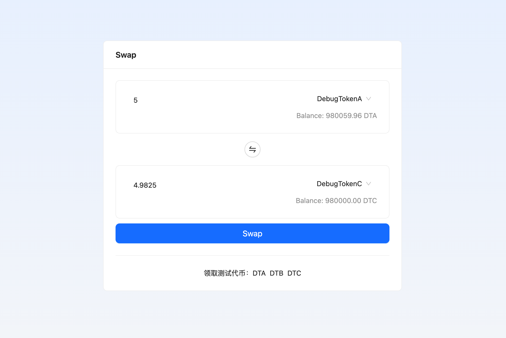

本节作者：[@愚指导](https://x.com/yudao1024)

这一篇文章我们将会指导你如何体验部署到测试网的 [WTFSwap Demo](https://wtf-dapp.vercel.app/wtfswap)。

---

## 1. 领取测试网代币

WTFSwap Demo 是部署在测试网 Sepolia 上的一个去中心化交易所课程 Demo。在体验之前，你需要领取一些测试网 Sepolia ETH 代币作为手续费 GAS。

你可以通过 [ZAN 的水龙头](https://zan.top/faucet?chInfo=wtf) 来领取测试网代币。

请在上图示意的水龙头网页中填入钱包地址，领取 0.01 SepoliaETH。

什么？你还没有钱包地址？那你可以选择 [MetaMask](https://metamask.io/)、[TokenPocket](https://www.tokenpocket.pro/)、[imToken](https://token.im/) 等，这里就不做赘述了，赶紧自己去搞一个，加入 Web3 吧！

## 2. 领取测试用的代币

访问 WTFSwap 的测试网地址：[https://wtf-dapp.vercel.app/wtfswap](https://wtf-dapp.vercel.app/wtfswap)，链接钱包后你可以看到交易框下面的测试代币水龙头：

点击可以领取我们已经部署好的三个测试代币 DTA、DTB、DTC，每次领取 10 个，领取后上面的代币余额会增加（可能需要等待一会，会自动更新）。

## 3. 交易

领取好测试代币后就可以交易了。选择任意交易对（但是记得不要选相同的代币），在上面的输入框或者下面的输入框输入指定的代币数量，DApp 会自动预估交易的代币数量。如果是在上面输入，那么下面会更新为指定输入后获得多少代币。如果是在下面输入，那么上面会更新为指定输入需要支付多少代币。

预估结果出来之后点击 Swap 按钮就可以发起交易了，交易会在测试网上进行，欢迎体验。另外如果你感兴趣可以尝试添加交易对或者注入流动性。

下面是部署在测试网上的各个合约地址：

- Wtfswap#PoolManager - [0xF35DE8597A617cfA23de794BCBB4c2f8fc9bC896](https://sepolia.etherscan.io/address/0xF35DE8597A617cfA23de794BCBB4c2f8fc9bC896)
- Wtfswap#PositionManager - [0x59ebEa058E193B64f0E091220d5Db98288EFec57](https://sepolia.etherscan.io/address/0x59ebEa058E193B64f0E091220d5Db98288EFec57)
- Wtfswap#SwapRouter - [0xA8b9Fa84A4Df935e768d3cC211E3d679027d0B31](https://sepolia.etherscan.io/address/0xA8b9Fa84A4Df935e768d3cC211E3d679027d0B31)
- DebugToken#DebugTokenA - [0x5AAB2806D12E380c24C640a8Cd94906d7fA59b16](https://sepolia.etherscan.io/address/0x5AAB2806D12E380c24C640a8Cd94906d7fA59b16)
- DebugToken#DebugTokenB - [0x00E6EC12a0Fc35d7064cD0d551Ac74A02bA8a5A5](https://sepolia.etherscan.io/address/0x00E6EC12a0Fc35d7064cD0d551Ac74A02bA8a5A5)
- DebugToken#DebugTokenC - [0x1D46AD43cc80BFb66C1D574d2B0E4abab191d1E0](https://sepolia.etherscan.io/address/0x1D46AD43cc80BFb66C1D574d2B0E4abab191d1E0)

> 需要注意的是，WTFSwap 目前仅作为课程使用，可能存在很多问题，如果你在体验过程中遇到问题，欢迎提 [issue](https://github.com/WTFAcademy/WTF-Dapp/issues) 或者给[《合约优化和安全》](../P301_ContractOptimize/readme.md) 这一章提交内容。
