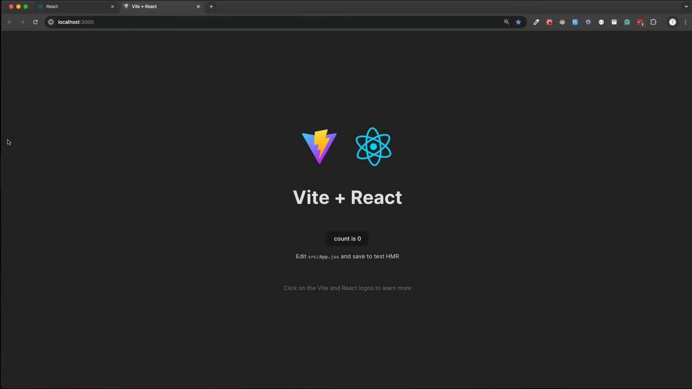
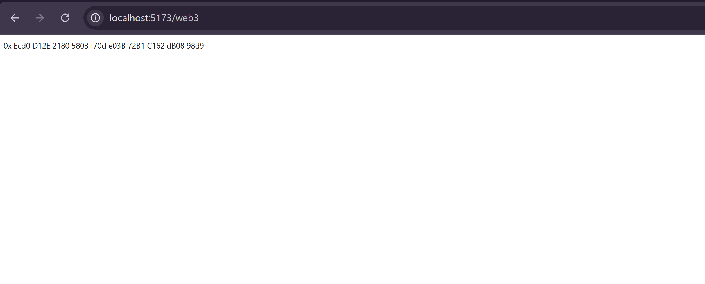
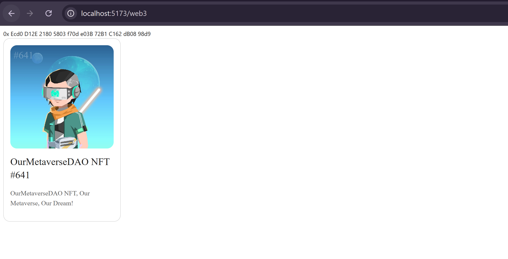

This course is mainly aimed at students with a certain foundation in front-end development, helping you move from Web2 to Web3 and acquire the R&D capabilities of DApp (decentralized applications).

The course will be based on Ant Design Web3 , so you can get started more easily. Of course, this will not affect your understanding of the basic concepts. We will explain the relevant concepts in the course to ensure that you can master the basic knowledge of DApp development after completing the course.

This course has certain prerequisites, requiring you to have a basic understanding of React front-end development. If you are not familiar with [React](https://react.dev/), you can study the [React official documentation first.](https://react.dev/learn)

---

## Initialize a React project

We will initialize based on [React](https://react.dev/) + [Vite](https://vite.dev/) + [TypeScript](https://www.typescriptlang.org/) our projects. Of course, if you are more familiar with other front-end frameworks such as [umi](https://umijs.org/), you can also use the framework you are familiar with. You can still refer to this tutorial, but for non-professional front-end developers, we recommend following our tutorial step by step to avoid problems caused by some framework differences.

Before starting, please make sure you have [Node.js](https://nodejs.org/) installed and the version is greater than 20.0.0. The tutorial will be written based on the latest Node.js version. If you are using an older version of Node.js, it may also work, but when you encounter problems, you can try upgrading the Node.js version.

After the installation is complete, you can check whether Node.js and its own `npm` and `npx` are installed successfully through the following commands:

```bash
node -v # => v20.0.0+
npm -v # => 10.0.0+
npx -v # => 10.0.0+
```

Next, let's refer to the [Vite official documentation](https://vite.dev/guide/) to create a new project:

``` bash
npm create vite@latest
```

Please follow the prompts to create a new project. We will name it as follows `dApp_test`. For technology stack:

- Select the `React` framework
- Select the `TypeScript` variant

Open the new folder you just created with:
```
cd dApp_test
```
Initiate the folder to open in VS Code with: 
```
code .
```

Open your VS Code terminal and install the dependencies:
```
npm install
```

## Install dApp dependencies and start the project

After the creation is completed, enter the project directory to install the dependencies:

```base
cd ant-design-web3-demo
npm i
```

After the installation is complete, execute `npm run dev` to start the Project. You can visit the browser `http://localhost:5173` to check whether the project has started successfully.



## Add Ant Design Web3

Next, we install the basic components of [Ant Design](https://ant.design/) and [Ant Design Web3](https://web3.ant.design/) and other dependencies into the project:

```bash
npm i antd @ant-design/web3 @ant-design/web3-wagmi wagmi @tanstack/react-query --save
```

- `@ant-design/web3` is a UI component library that connects to different blockchains through different [adapters](../guide/adapter.zh-CN.md). In this course, we are mainly based on [Ethereum](https://ethereum.org/zh/). Correspondingly, we will also use [Ethereum adapter](../../packages/web3/src/wagmi/index.zh-CN.md) to implement the course requirements.

- [wagmi](https://wagmi.sh/) is an open source React Hooks library that serves Ethereum and relies on `@tanstack/react-query`. The adapter `@ant-design/web3-wagmi` of Ant Design Web3 is implemented based on it. In the later part of this course, if there is no special instructions, the adapter mentioned refers to `@ant-design/web3-wagmi` .


After installation, add Vite support pacakages:
```bash
npm install vite-plugin-imp -D
```

Then copy the code below and paste it in vite.config.ts (or vite.config.js if you selected javascript during Vite installation)

```bash
import { defineConfig } from 'vite';
import react from '@vitejs/plugin-react';
import vitePluginImp from 'vite-plugin-imp';

export default defineConfig({
  plugins: [
    react(),
    vitePluginImp({
      libList: [
        {
          libName: 'antd',
          style: (name) => `antd/es/${name}/style`,
        },
      ],
    }),
  ],
});
```

Afterwards, in `src`, create a `components` folder and create `Web3.jsx` file in it. Paste the following content in it:

```tsx | pure
import { Address } from "@ant-design/web3";

export default function Web3() {
  return (
    <Address format address="0xEcd0D12E21805803f70de03B72B1C162dB0898d9" />
  );
}
```

Then install:

```bash
npm install react-router-dom
```

In App.tsx, set up a routing path: 

```bash
import { BrowserRouter as Router, Route, Routes } from 'react-router-dom';
import Web3 from './components/Web3';

function App() {
  return (
    <Router>
      <Routes>
        <Route path="/" element={<h1>Welcome to my dApp testing ground</h1>} />
        <Route path="/web3" element={<Web3 />} />
      </Routes>
    </Router>
  );
}

export default App;
```

Now, you can go to http://localhost:5173/Web3 to see the address renderers.




## Adapter Configuration

The adapter configuration closely follows the guidelines outlined in the [official wagmi documentation](https://wagmi.sh/core/getting-started). For real-world projects, you will generally need to set up the JSON RPC endpoint and configure various wallets. This course begins with the most basic setup and will progressively help you understand the necessary configurations for your specific project.

To start, open the `src/components/Web3.tsx` file and import the components or modules required for the configuration process.

Starting with: 
```bash
import { createConfig, http } from 'wagmi';
import { mainnet } from 'wagmi/chains';
import { WagmiWeb3ConfigProvider } from '@ant-design/web3-wagmi';
import { Address } from "@ant-design/web3";

export default function Web3() {
  return (
    <Address format address="0xEcd0D12E21805803f70de03B72B1C162dB0898d9" />
  );
};
```

The content provided explains the following components and concepts related to the wagmi library and Ant Design Web3:

- **[createConfig](https://wagmi.sh/react/config):** This is a method from the wagmi library used to set up a configuration for your application.
- **HTTP Transport:** This method, part of the wagmi library, sets up an [HTTP JSON RPC](https://wagmi.sh/core/api/transports/http) connection. This connection allows you to interact with Ethereum or other compatible blockchains using HTTP requests.
- **[Mainnet and Other Networks](https://wagmi.sh/react/chains):** The term "mainnet" refers to the Ethereum mainnet. Besides the mainnet, there are test networks like `sepolia`, and other public chains compatible with the Ethereum Virtual Machine (EVM), such as `bsc` (Binance Smart Chain) and `base`. These chains include both Layer 1 (L1) chains like Ethereum and Layer 2 (L2) solutions, although details on L2 chains are not covered in this section.
- **[WagmiWeb3ConfigProvider](https://web3.ant.design/zh-CN/components/wagmi#wagmiweb3configproviderprops):** This is a component in Ant Design Web3 that acts as a provider for receiving configurations from the wagmi library.

Next, you'll need to proceed with setting up your configuration.

```bash
import { createConfig, http } from "wagmi";
import { mainnet } from "wagmi/chains";
import { WagmiWeb3ConfigProvider } from "@ant-design/web3-wagmi";
import { Address } from "@ant-design/web3";

const config = createConfig({
   chains: [mainnet],
   transports: {
     [mainnet.id]: http(),
   },
 });

export default function Web3() {
  return (
     <WagmiWeb3ConfigProvider config={config}>
        <Address format address="0xEcd0D12E21805803f70de03B72B1C162dB0898d9" />
    </WagmiWeb3ConfigProvider>
  );
};
```

With the basic configuration for wagmi now complete, we can proceed to use Ant Design Web3 components to access data from the blockchain.

As an example, let's explore how to use the NFTCard component from Ant-Design

```bash
import { createConfig, http } from "wagmi";
import { mainnet } from "wagmi/chains";
import { WagmiWeb3ConfigProvider } from "@ant-design/web3-wagmi";
import { Address } from "@ant-design/web3";
import { Address, NFTCard } from "@ant-design/web3";

const config = createConfig({
  chains: [mainnet],
  transports: {
    [mainnet.id]: http(),
  },
});

export default function Web3() {
  return (
    <WagmiWeb3ConfigProvider config={config}>
      <Address format address="0xEcd0D12E21805803f70de03B72B1C162dB0898d9" />
    <NFTCard address="0xEcd0D12E21805803f70de03B72B1C162dB0898d9" tokenId={641} />
    </WagmiWeb3ConfigProvider>
  );
};
```
The `NFTCard` component fetches the NFT data for tokenId 641 from the contract located at [0xEcd0D12E21805803f70de03B72B1C162dB0898d9](https://etherscan.io/address/0xEcd0D12E21805803f70de03B72B1C162dB0898d9) and displays it on the page.

Here’s what it should look like:



If the NFT doesn't display, please check your network connection. If you can see the NFT image rendered successfully, you've completed this lesson! Congratulations! 
