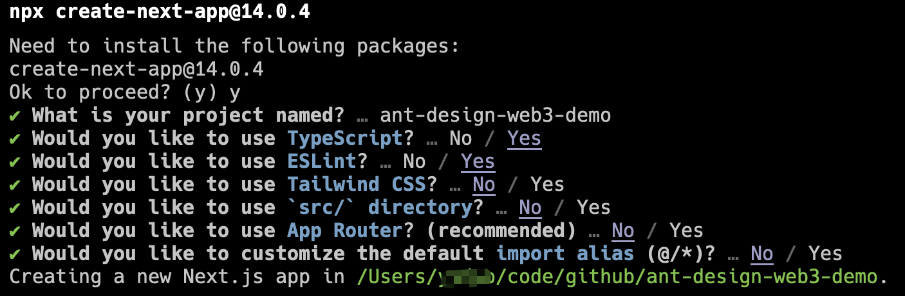
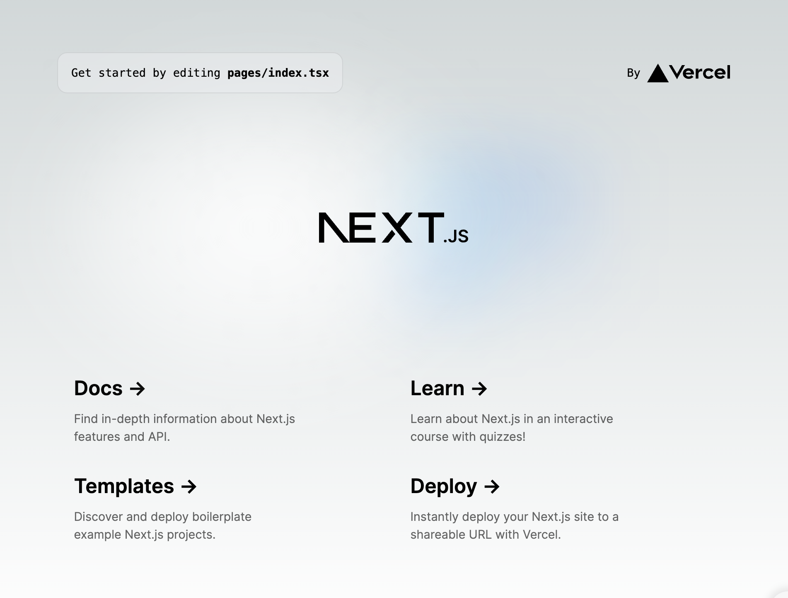

Translated by：[@Mofasasi](https://x.com/mofasasi)

In this lecture, we will guide you to quickly create a React project and display an NFT image in it.

---

This course is mainly aimed at students with a certain foundation in front-end development, helping you move from Web2 to Web3 and acquire the R&D capabilities of DApp (decentralized applications).

The course will be based on Ant Design Web3 , so you can get started more easily. Of course, this will not affect your understanding of the basic concepts. We will explain the relevant concepts in the course to ensure that you can master the basic knowledge of DApp development after completing the course.

This course has certain prerequisites, requiring you to have a basic understanding of React front-end development. If you are not familiar with [React](https://react.dev/), you can study the [React official documentation first.](https://react.dev/learn)

---

## Initialize a React project

We will initialize based on [React](https://react.dev/) + [Next.js](https://nextjs.org/) + [TypeScript](https://www.typescriptlang.org/) our projects. Of course, if you are more familiar with other front-end frameworks such as [umi](https://umijs.org/), you can also use the framework you are familiar with. You can still refer to this tutorial, but for non-professional front-end developers, we recommend following our tutorial step by step to avoid problems caused by some framework differences.

Before starting, please make sure you have [Node.js](https://nodejs.org/) installed and the version is greater than 20.0.0. The tutorial will be written based on the latest Node.js version. If you are using an older version of Node.js, it may also work, but when you encounter problems, you can try upgrading the Node.js version.

After the installation is complete, you can check whether Node.js and its own `npm` and `npx` are installed successfully through the following commands:

```bash
node -v # => v20.0.0+
npm -v # => 10.0.0+
npx -v # => 10.0.0+
```

Next, let's refer to the [Next.js official documentation](https://nextjs.org/docs/getting-started/installation) to create a new project:

```bash
npx create-next-app@14.0.4 # 我们指定 create-next-app 的版本为 14.0.4，避免升级带来的差异影响教程的细节
```

Please follow the prompts to create a new project. We will name it as follows `ant-design-web3-demo`. For specific technology stack selection, you can refer to the figure below:



We removed the Tailwind CSSand App Routeroptions to make the project simpler. In actual projects, you should choose the required content according to your needs.

## Install dependencies and start the project

After the creation is completed, enter the project directory to install the dependencies:

```base
cd ant-design-web3-demo
npm i
```

After the installation is complete, execute `npm run dev` to start the Project. You can visit the browser `http://localhost:3000` to check whether the project has started successfully.



## Add Ant Design Web3

Next, we install the basic components of [Ant Design](https://ant.design/) and [Ant Design Web3](https://web3.ant.design/) and other dependencies into the project:

```bash
npm i antd @ant-design/web3 @ant-design/web3-wagmi wagmi @tanstack/react-query --save
```

- `@ant-design/web3` is a UI component library that connects to different blockchains through different [adapters](../guide/adapter.zh-CN.md). In this course, we are mainly based on [Ethereum](https://ethereum.org/zh/). Correspondingly, we will also use [Ethereum adapter](../../packages/web3/src/wagmi/index.zh-CN.md) to implement the course requirements.

- [wagmi](https://wagmi.sh/) is an open source React Hooks library that serves Ethereum and relies on `@tanstack/react-query`. The adapter `@ant-design/web3-wagmi` of Ant Design Web3 is implemented based on it. In the later part of this course, if there is no special instructions, the adapter mentioned refers to `@ant-design/web3-wagmi` .

After the installation is complete, because of the current version of Next.js [an existing issue](https://github.com/ant-design/ant-design/issues/46053), you need to configure it in `next.config.js` Add the following configuration:

```diff
/** @type {import('next').NextConfig} */
const nextConfig = {
  reactStrictMode: true,
+ transpilePackages: [  "@ant-design", "antd", "rc-util", "rc-pagination", "rc-picker" ],
}

module.exports = nextConfig
```

After the installation is complete, create a new `pages/web3.tsx` file and fill in the following content:

```tsx | pure
import { Address } from "@ant-design/web3";

export default function Web3() {
  return (
    <Address format address="0xEcd0D12E21805803f70de03B72B1C162dB0898d9" />
  );
}
```

