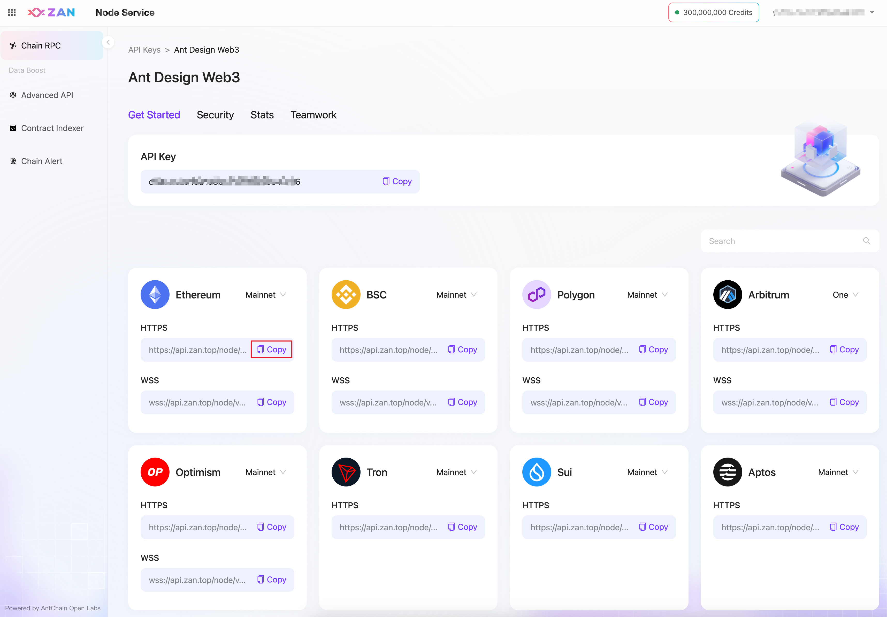
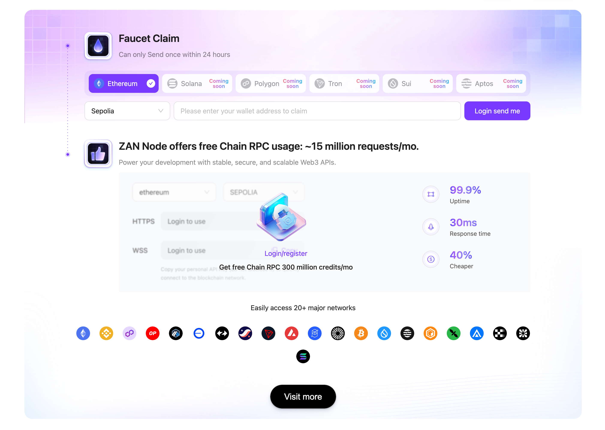

Translated by：[@Mofasasi](https://x.com/mofasasi)

In this lecture, we will guide you to quickly create a React project and display an NFT image in it.

---

## Node Service: A Key Element in DApp Development

In this session, we'll explore the concept of node services and demonstrate how to set them up in your project. We'll also guide you on obtaining Sepolia testnet ETH through a faucet.

## Understanding Node Services

Node services are fundamental to DApp development. They function as services within the blockchain network, enabling interactions with the blockchain. In DApp development, node services are essential for retrieving blockchain data, sending transactions, and performing other key operations.

On the Ethereum network, platforms like [ZAN](https://zan.top?chInfo=wtf), [Infura](https://infura.io/), and [Alchemy](https://www.alchemy.com/) provide access to these node services. While all these platforms offer free node services, they also provide premium options for enhanced performance if your application demands it.

## Setting Up a Node Service

We'll use [ZAN's node service](https://zan.top/home/node-service?chInfo=wtf) as an example to illustrate how to configure a node service.

Start by registering and logging in at [https://zan.top](https://zan.top?chInfo=wtf). Once logged in, go to the node service console at [https://zan.top/service/apikeys](https://zan.top/service/apikeys?chInfo=wtf) to generate an API Key. Each API Key includes a default free quota, adequate for small-scale projects. For larger, production-level projects, you may need to purchase additional node services based on your specific requirements.

After creating your API Key, you will see a screen similar to this:



Copy the Ethereum mainnet node service address displayed, and integrate it into wagmi's `http()` method as follows:

```bash
const config = createConfig({
  chains: [mainnet],
  transports: {
-    [mainnet.id]: http(),
+    [mainnet.id]: http('https://api.zan.top/node/v1/eth/mainnet/{YourZANApiKey}'),
  },
});
```

In the code above, replace `YourZANApiKey` with your personal key. To protect your key from unauthorized use in real projects, consider placing it in a backend service, which will then handle calls to the node service. Alternatively, you can configure a domain whitelist in ZAN's console to minimize the risk of misuse. However, for this tutorial, you can use `http()` directly and leverage wagmi's built-in experimental node service.

If you're using node services from Infura or Alchemy, you can also configure their service addresses in wagmi's `http()` method.

## Getting Testnet ETH from a Faucet

In addition to node services, testnet ETH is crucial for development. You can typically obtain it from faucet services, which are online platforms that provide small amounts of free cryptocurrency for testing in a development environment. These services are often offered by testnet administrators, developer communities, or node service providers.

For instance, you can acquire Sepolia testnet ETH for testing through [ZAN's faucet service](https://zan.top/faucet?chInfo=wtf).



Please claim a suitable amount of Sepolia testnet ETH from the faucet webpage shown above, as it may be needed in future lessons.
