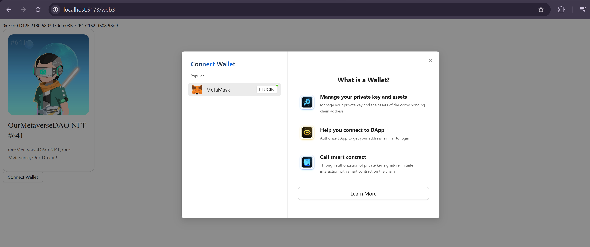

Connecting a wallet is a vital interaction in any decentralized application (DApp). In this session, we will walk you through the process of implementing a wallet connection feature using [wagmi](https://wagmi.sh) and [Ant Design Web3](https://web3.ant.design).

## How Wallets Connect in DApps

For DApps, connecting to a wallet is essential to obtain the user's wallet address and to execute user-authorized actions like sending transactions or signing messages. In the Ethereum ecosystem, there are typically three ways to connect a wallet:

1. Using a browser extension.
2. Accessing the DApp through a wallet app.
3. Employing the WalletConnect protocol.

The first two methods rely on interfaces that the wallet injects into the browser's runtime environment, whereas WalletConnect uses server-side relays. Wallet injection interfaces can be implemented in two ways: via [EIP-1193](https://eips.ethereum.org/EIPS/eip-1193) or [EIP-6963](https://eips.ethereum.org/EIPS/eip-6963). EIP-1193 is an earlier, relatively straightforward protocol; we will begin by using it to attempt a wallet connection.

## Setting Up the Wallet

Let's use [MetaMask](https://metamask.io/) as an example to illustrate how to connect to a wallet.

```bash
import { createConfig, http } from "wagmi";
import { mainnet } from "wagmi/chains";
 import { WagmiWeb3ConfigProvider, MetaMask } from "@ant-design/web3-wagmi";
 import { Address, NFTCard, Connector, ConnectButton } from "@ant-design/web3";
 import { injected } from "wagmi/connectors";

const config = createConfig({
  chains: [mainnet],
  transports: {
    [mainnet.id]: http(),
  },
   connectors: [
     injected({
       target: "metaMask",
     }),
   ],
});

export default function Web3() {
  return (
    <WagmiWeb3ConfigProvider config={config} wallets={[MetaMask()]}>
      <Address format address="0xEcd0D12E21805803f70de03B72B1C162dB0898d9" />
      <NFTCard
        address="0xEcd0D12E21805803f70de03B72B1C162dB0898d9"
        tokenId={641}
      />
       <Connector>
         <ConnectButton />
     </Connector>
    </WagmiWeb3ConfigProvider>
  );
};
```
When you click on 'Connect Wallet' on your frontend, you should see a pop up like this:


