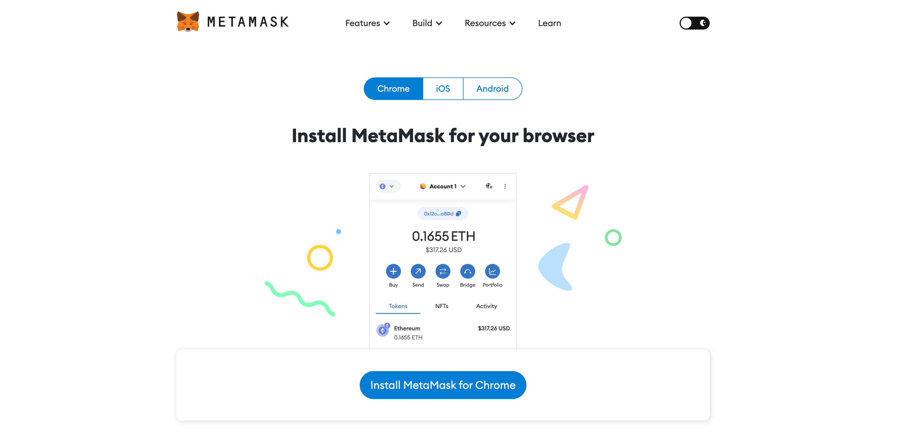
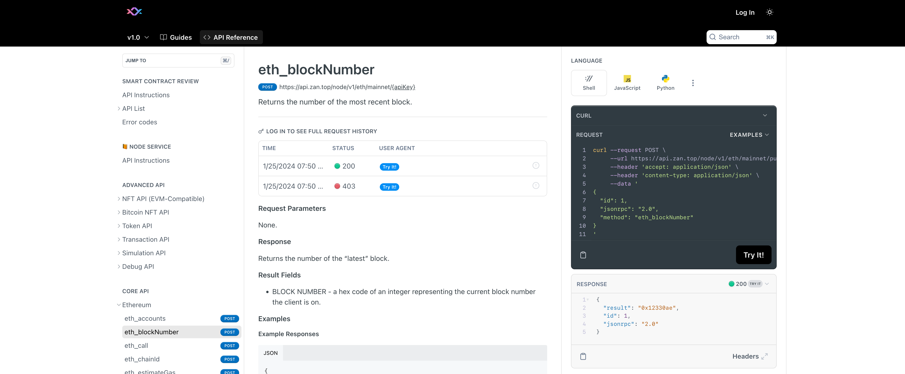
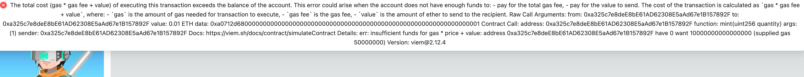
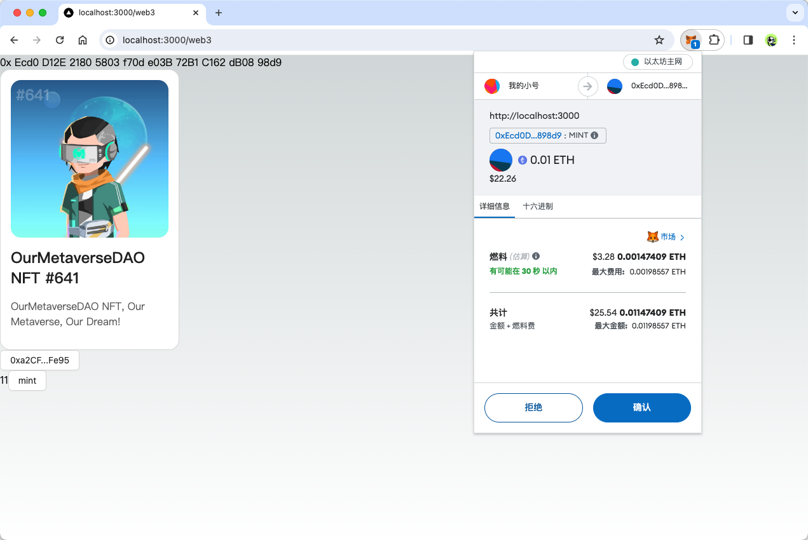

The frontend of a decentralized application (DApp) is distinct from that of a traditional app because it needs to communicate with the blockchain. This communication is primarily done through smart contracts. In this session, we will explore how to interact with smart contracts.

## How a DApp Interacts with Smart Contracts

Using Ethereum as an example, after a smart contract is deployed on the blockchain, we can call its methods by creating an Ethereum transaction, as long as we have the contract's Application Binary Interface (ABI) and its address.

> The ABI is a standard that defines the interface of a smart contract, detailing its functions and parameters. The contract address, sometimes referred to as a "hash," is the unique identifier of the contract on the blockchain. Both the ABI and the address are available when you deploy the smart contract.

A DApp can usually interact with contract methods in two main ways: by using a wallet plugin or by directly connecting through node Remote Procedure Call (RPC). We will focus primarily on the first method—using a wallet plugin.

### Using MetaMask Wallet

[MetaMask](https://metamask.io/) is the most popular wallet plugin in the Ethereum ecosystem. It allows users to manage their Ethereum assets directly from their browser and acts as a bridge for DApps to interact with the Ethereum network. If you haven't used it before, you can [download](https://metamask.io/download/) and install it from their website, and follow the official setup guide. Alternatively, you can also use other wallets like [TokenPocket](https://www.tokenpocket.pro/) or [imToken](https://token.im/).



Once MetaMask is installed, you'll see its icon in the top right corner of your browser. MetaMask also injects a `window.ethereum` object into every webpage, which serves as an interface for DApps to communicate with the Ethereum network. For example, you can send an `eth_chainId` RPC request to find out the current network's ID.

```bash
await window.ethereum.request({ method: "eth_chainId" }); // 0x1 represents the Ethereum mainnet
```

We can also get the account address and other information of the current wallet through the following code:

```bash
async function getAccount() {
  const accounts = await window.ethereum
    .request({ method: "eth_requestAccounts" })
    .catch((err) => {
      if (err.code === 4001) {
        // EIP-1193 userRejectedRequest error
        // If this happens, the user rejected the connection request.
        console.log("Please connect to MetaMask.");
      } else {
        console.error(err);
      }
    });
  const account = accounts[0];
  return account;
}

await getAccount(); // your account address
```

For detailed information on wallet RPC and API, please refer to the [official MetaMask documentation](https://docs.metamask.io/guide/rpc-api.html#other-rpc-methods).

### Accessing Blockchain Data via Node RPC

As we have previously learned, a blockchain is a decentralized network that allows us to access its data by connecting to one of its nodes. The Ethereum network, for example, consists of many nodes. We can obtain RPC interfaces to interact with the network using services provided by companies like [ZAN](https://zan.top/) and [Infura](https://infura.io/).

The [zan.top documentation](https://docs.zan.top/reference/eth-accounts) offers straightforward methods to test RPCs and demonstrates how to invoke smart contracts through RPC calls.



## Coding a DApp: Implementing the Necessary Steps

When developing a decentralized application (DApp) and you need to call a contract method, the process generally involves the following steps:

1. Constructing transaction data
2. Authorizing the wallet to add a signature to the transaction data
3. Sending the signed transaction data to the blockchain network using node services

> Note: For read-only contract methods, since you're not writing data to the blockchain, signing the transaction isn't necessary. You can simply read data directly from the blockchain using node services.

### Executing Read-Only Contract Methods

<Meaning-Based Translation>
Once the node service is configured, we can begin interacting with the contract. To read contract data, we utilize the [useReadContract](https://wagmi.sh/react/api/hooks/useReadContract) hook provided by wagmi. Below is a sample code snippet demonstrating how to use it:

```bash 
import { createConfig, http, useAccount, useReadContract } from "wagmi";
import { mainnet } from "wagmi/chains";
 import { WagmiWeb3ConfigProvider, MetaMask } from "@ant-design/web3-wagmi";
 import { Address, NFTCard, Connector, ConnectButton } from "@ant-design/web3";
 import { injected } from "wagmi/connectors";

const config = createConfig({
  chains: [mainnet],
  transports: {
    [mainnet.id]: http(),
  },
   connectors: [
     injected({
       target: "metaMask",
     }),
   ],
});

const CallTest =() => {
  const {account} = useAccount();
  const result = useReadContract({
    abi:[
      {
        type:'function',
        name: 'balanceOf',
        stateMutability: 'view',
        inputs: [{name: 'account', type: 'address'}],
        outputs: [{type: 'uint256'}],
      },
    ],
    address: '0xEcd0D12E21805803f70de03B72B1C162dB0898d9',
    functionName: 'balanceOf',
    args: [account?.address as `0x${string}`],
  });
  return (
    <div>{result.data?.toString()}</div>
  );
}

export default function Web3() {
  return (
    <WagmiWeb3ConfigProvider config={config} wallets={[MetaMask()]}>
      <Address format address="0xEcd0D12E21805803f70de03B72B1C162dB0898d9" />
      <NFTCard
        address="0xEcd0D12E21805803f70de03B72B1C162dB0898d9"
        tokenId={641}
      />
       <Connector>
         <ConnectButton />
     </Connector>
     <CallTest />
    </WagmiWeb3ConfigProvider>
  );
};
```

To implement the `balanceOf` method for calling a contract, as shown in the code above, we have created a new `CallTest` component and included it within the `WagmiWeb3ConfigProvider`. This setup is necessary because the `useReadContract` hook must be used inside the `WagmiWeb3ConfigProvider` to function properly. As a result, we cannot directly use `useReadContract` immediately after the line `export default function Web3() {`.

In practice, the `WagmiWeb3ConfigProvider` should be placed at the highest level of your component hierarchy. This placement ensures that all components within your project have access to the necessary Hooks.

The `balanceOf` method is used to find out how many NFTs a specific address holds from this contract. To achieve this, we also need to use the `useAccount` Hook from `@ant-design/web3` to obtain the address of the currently connected account. We then pass this account address as an argument to the `balanceOf` method to find out how many NFTs are linked to the current account. If everything is set up correctly and the account has no NFTs, you should see a result of `0`.

In the code, the `abi` field specifies the method types, which enables wagmi to manage method inputs and outputs by converting JavaScript objects into blockchain transaction data. Typically, the `abi` is automatically generated from the contract code, which we will discuss in more detail in the next chapter.

### Writing Methods for Contract Interaction

Simply reading from a contract is not sufficient for a fully functional DApp, which will also involve writing data to smart contracts. Writing data to smart contracts typically involves executing blockchain methods that alter contract data.

Next, we will attempt to call the [mint](https://etherscan.io/address/0xEcd0D12E21805803f70de03B72B1C162dB0898d9#writeContract#F6) method used in a contract from a subsequent course. The `mint` method is not part of the ERC721 standard; it is specifically defined by this contract. Invoking the `mint` method requires using GAS and incurs at least a fee of `0.01ETH` to acquire an NFT.

Here are the necessary code changes:

```bash
import {
    Address,
    ConnectButton,
    Connector,
    NFTCard,
    useAccount,
  } from "@ant-design/web3";
  import { MetaMask, WagmiWeb3ConfigProvider } from "@ant-design/web3-wagmi";
  import { Button, message } from "antd";
  import { parseEther } from "viem";
  import { createConfig, http, useReadContract, useWriteContract } from "wagmi";
  import { mainnet } from "wagmi/chains";
  import { injected } from "wagmi/connectors";
  
  const config = createConfig({
    chains: [mainnet],
    transports: {
      [mainnet.id]: http(),
    },
    connectors: [
      injected({
        target: "metaMask",
      }),
    ],
  });
  
  const CallTest = () => {
    const { account } = useAccount();
    const result = useReadContract({
      abi: [
        {
          type: "function",
          name: "balanceOf",
          stateMutability: "view",
          inputs: [{ name: "account", type: "address" }],
          outputs: [{ type: "uint256" }],
        },
      ],
      // Sepolia test contract 0x418325c3979b7f8a17678ec2463a74355bdbe72c
      address: "0xEcd0D12E21805803f70de03B72B1C162dB0898d9",
      functionName: "balanceOf",
      args: [account?.address as `0x${string}`],
    });
    const { writeContract } = useWriteContract();
  
    return (
      <div>
        {result.data?.toString()}
        <Button
          onClick={() => {
            writeContract(
              {
                abi: [
                  {
                    type: "function",
                    name: "mint",
                    stateMutability: "payable",
                    inputs: [
                      {
                        internalType: "uint256",
                        name: "quantity",
                        type: "uint256",
                      },
                    ],
                    outputs: [],
                  },
                ],
                address: "0xEcd0D12E21805803f70de03B72B1C162dB0898d9",
                functionName: "mint",
                args: [BigInt(1)],
                value: parseEther("0.01"),
              },
              {
                onSuccess: () => {
                  message.success("Mint Success");
                },
                onError: (err) => {
                  message.error(err.message);
                },
              }
            );
          }}
        >
          mint
        </Button>
      </div>
    );
  };
  
  export default function Web3() {
    return (
      <WagmiWeb3ConfigProvider config={config} wallets={[MetaMask()]}>
        <Address format address="0xEcd0D12E21805803f70de03B72B1C162dB0898d9" />
        <NFTCard
          address="0xEcd0D12E21805803f70de03B72B1C162dB0898d9"
          tokenId={641}
        />
        <Connector>
          <ConnectButton />
        </Connector>
        <CallTest />
      </WagmiWeb3ConfigProvider>
    );
  }
```

"In the code above, we utilized the `viem` library, which `wagmi` depends on. To use it in your project, you'll need to install the library, commonly done through a package manager like npm."

```bash
npm i viem --save
```

This code snippet is designed to trigger the contract's `mint` method with the parameter `1` when the `mint` button is clicked, signifying the minting of one NFT. Each NFT requires a fee of `0.01 ETH`, so we need to ensure this amount is included with the transaction to successfully mint the NFT. To accomplish this, we specify `value: parseEther("0.01")` in the contract call.

In Ethereum, contracts cannot automatically withdraw ETH from the caller's account. Therefore, when making a call, it's crucial to include the ETH payment manually, which is an important aspect of contract security.

The system will notify you of the outcome of your contract call, whether successful or unsuccessful. If no account is connected, an error message will alert you to this issue. To proceed, you must first connect your account by clicking the connect button we set up in the previous lesson.

If your account lacks sufficient GAS, an error message like the one shown below will pop up:



If you have enough ETH, a window requesting authorization, similar to the image below, will appear:



Choosing **Reject** will cancel the contract call, ensuring no ETH is deducted from your account. In the next chapter, we'll guide you through deploying a test contract, allowing you to experience the entire process in a test setting. However, if you decide to click confirm, the contract call will proceed, your ETH will be used, and you'll receive an NFT.
