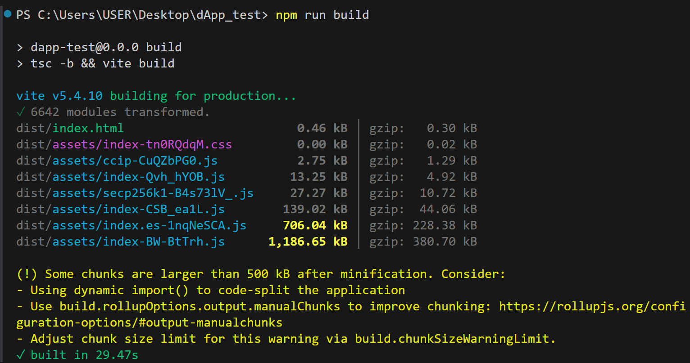
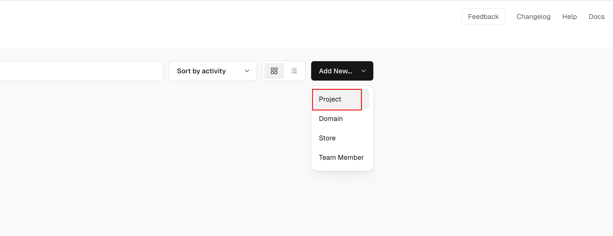
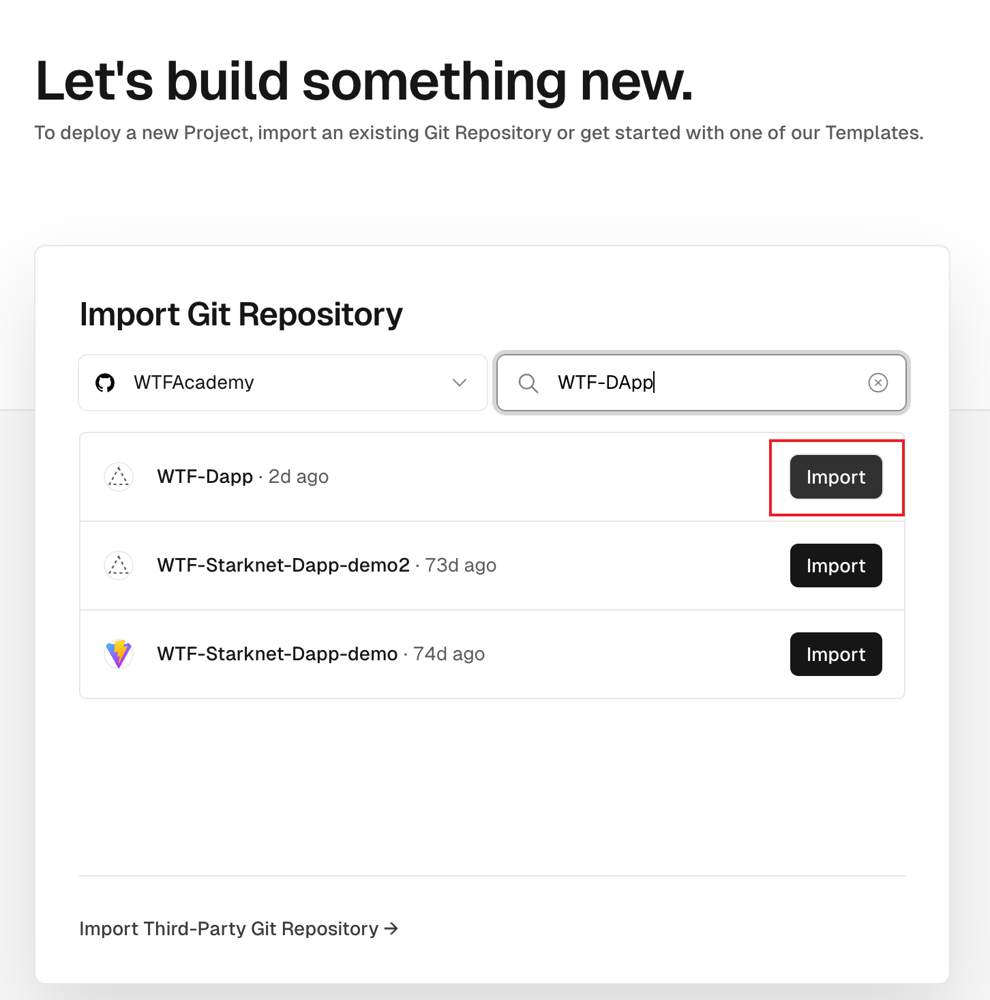
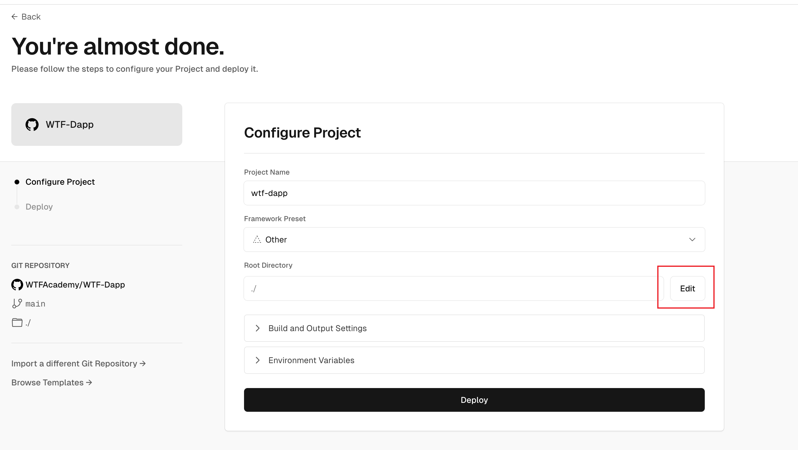
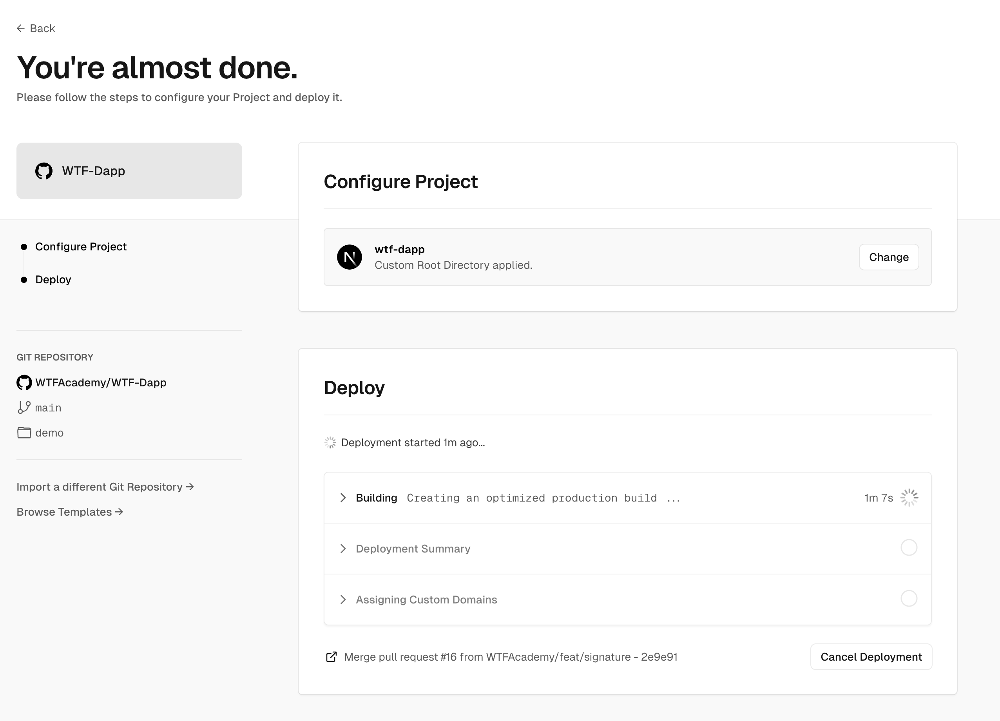
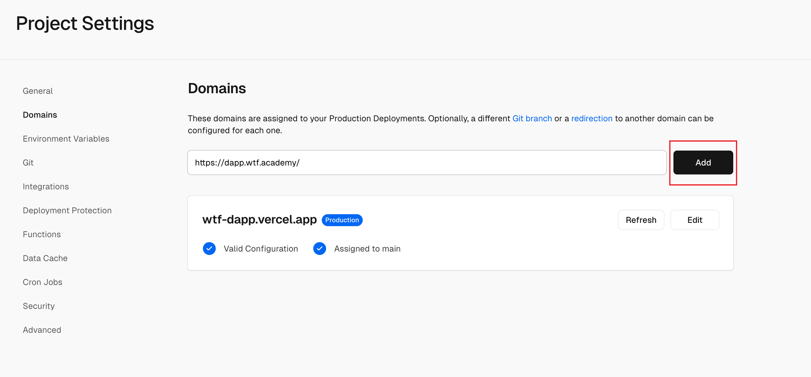

This section offers a brief introduction on Vite and the basics of front-end deployment. If you're already experienced in front-end development, feel free to skip ahead.

[Vite](https://vite.dev/) is a powerful framework that facilitates the rapid development of React applications. Once we build our application using React and Vite, the next step is to deploy it on a server, making it accessible to users.

Running `npm run build` in your project (which triggers `vite build` as defined in `package.json`) compiles your application into JavaScript, CSS, and other necessary files. These are designed to run in a browser, which natively supports JavaScript but not React. Therefore, we must compile the React code into browser-executable files. Furthermore, these JavaScript files can also be executed in a Node.js environment on the server, enabling server-side logic. While our previous courses haven't covered this, future courses will explore server-side functionalities, including tasks like signature verification.

If the execution is successful, you can see the following effect:

After completing the build, you can deploy your application locally by running `npm run dev`. If you're deploying to your own server, the steps are similar: install the necessary dependencies, build your application, and then start it using either `npm run dev`.

If you're using a different front-end framework like [Next.js](https://nextjs.org/), the process remains largely the same: you'll typically need to build the project and then start the service.

When your build results in static resources meant for a browser, you can use a tool like Nginx or Express to set up a web server to host these files. Alternatively, [GitHub Pages](https://pages.github.com/) is an excellent option for hosting static files, as it is specifically designed for serving static content.

## Deploying with Vercel

This section will guide you through deploying your application using [Vercel](https://vercel.com/). Vercel supports Vite, offering a straightforward and efficient deployment process. To get started, simply upload your code to a hosting service like GitHub or GitLab, and then select your repository on Vercel. The platform will automatically handle the building and deployment of your application.

Begin by pushing your code to your GitHub account. Alternatively, you can fork the following repository: [https://github.com/WTFAcademy/WTF-Dapp](https://github.com/WTFAcademy/WTF-Dapp). The complete code is available in the [demo](../demo/) folder.

After logging in to Vercel, create a new project in its console:

Next, select and import your Github project. During this process, you may need to authorize Vercel to access your Github repository:

Select the root directory of your Next.js project and then click Deploy.

From this point forward, everything will be handled automatically:

You can view the final demo of this tutorial at [https://wtf-dapp.vercel.app/web3](https://wtf-dapp.vercel.app/web3).

## Custom Domain Name

Vercel provides a default domain name for your projects, but it's common to use a custom domain name for a more professional appearance. To do this, locate your project in the Vercel console and navigate to the Domains section to add your custom domain.

Once you've added your domain, follow the provided instructions to set up a CNAME record with your domain provider. This will ensure that your domain directs traffic to Vercel's servers.
