This session will provide a brief overview of developing and testing smart contracts.

In this tutorial, we will be using `Remix` to execute `Solidity` smart contracts.

`Remix` is the officially recommended integrated development environment (IDE) for Ethereum smart contracts, particularly suited for beginners. It provides an intuitive interface that lets you write, compile, and deploy smart contracts directly in your web browser, eliminating the need for local installations. In more advanced courses, we'll also cover [local development and testing environments for contracts](../14_LocalDev/readme.md).

`Solidity` is a high-level programming language specifically designed for creating `smart contracts`. Drawing influences from `C++`, `Python`, and `JavaScript`, it is tailored to run on the Ethereum Virtual Machine (`EVM`). Solidity is a statically typed language that supports features like inheritance, libraries, and complex user-defined types.

## Getting Started with Contracts

### Interface Overview

When you first access [Remix](https://remix.ethereum.org), you'll be greeted with an interface similar to the one shown below:

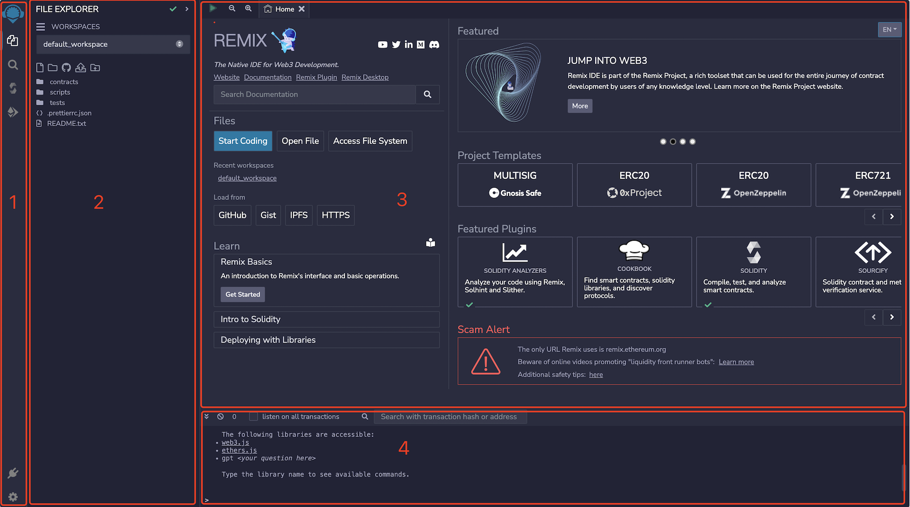

The `Remix` interface includes three main panels and a terminal, as depicted in the image.

1. Icon Panel - Allows you to modify which plugins are displayed in the side panel by clicking.
2. Side Panel - This area contains the interface for most plugins, though some are excluded.
3. Main Panel - Used for editing files and tabs, and it displays certain comprehensive tool pages.
4. Terminal - Displays transaction receipts and various logs for your activities.

### Sidebar Icons Overview

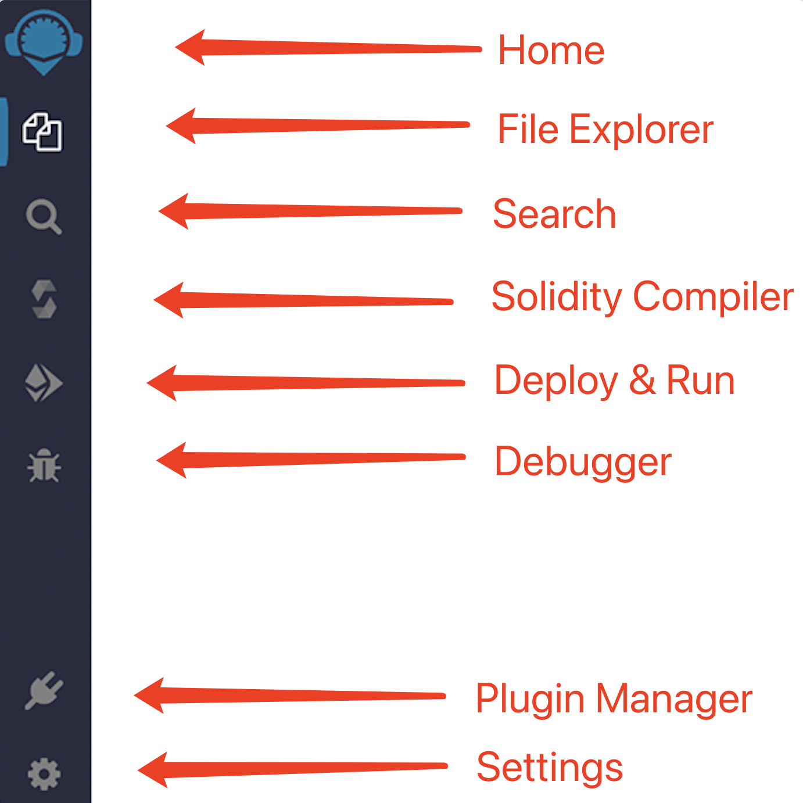

Below is a quick overview of the sidebar icons, which will be explained more thoroughly as we proceed:

- **Home:** Always brings you back to the main page, even if it's been closed.
- **File Explorer:** Used for managing workspaces and files.
- **Search:** A tool for conducting a global search.
- **Solidity Compiler:** The interface for compiling contracts. It initially shows basic compiler settings and has an `Advanced Configurations` button for more options.
- **Deploy & Run:** Facilitates sending transactions to the current environment. (Note: The "environment" refers to the blockchain network or simulation environment you are interacting with.)
- **Debugger:** Displays the state of contracts during transaction debugging.
- **Plugin Manager:** A hub where you can install various plugins.
- **Settings:** Offers basic settings like `language`, `theme`, `GitHub access token`, and general application settings.

### Managing Workspaces and Files

In **Remix**, **WORKSPACES** are specialized folders that separate projects. Files from one workspace cannot be accessed by another. 

As shown in the image below, clicking on icon 1 allows you to switch between different workspaces. Icon 2 provides additional workspace management options such as `Create`, `Clone`, `Rename`, `Download`, and `Delete`.

 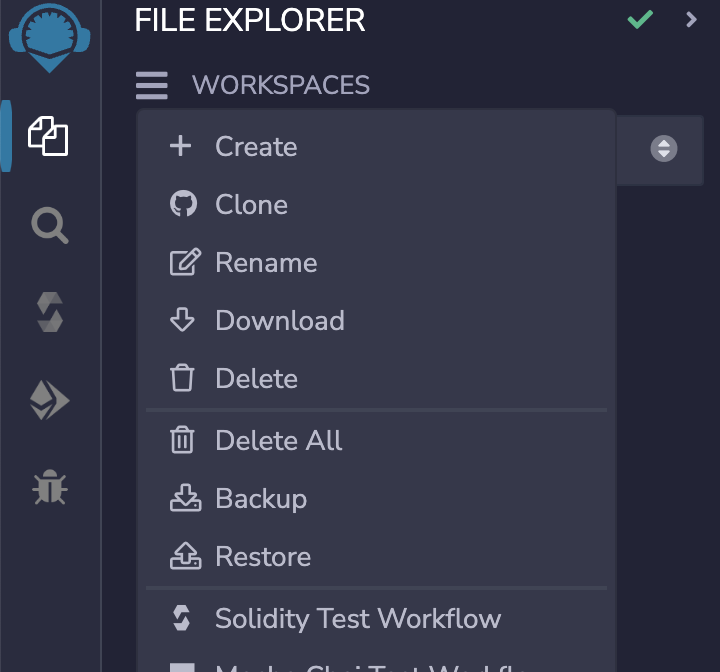

### Creating a Workspace

For this tutorial, we'll demonstrate how to create a new workspace using the `Create` button. When you click on `Create`, a `Create Workspace` window appears, offering the following templates:

- Basic
- Blank
- OpenZeppelin ERC20
- OpenZeppelin ERC721
- OpenZeppelin ERC1155
- 0xProject ERC20
- Gnosis MultiSig

When you select the `ERC721` template from the `OpenZeppelin` library, you can add optional features like `Mintable`.

> **ERC721** is a standard for non-fungible tokens on Ethereum, proposed in January 2018 by William Entriken, Dieter Shirley, Jacob Evans, and Nastassia Sachs.  
> **OpenZeppelin** is a library designed for secure smart contract development, offering standard implementations for many common contract types.

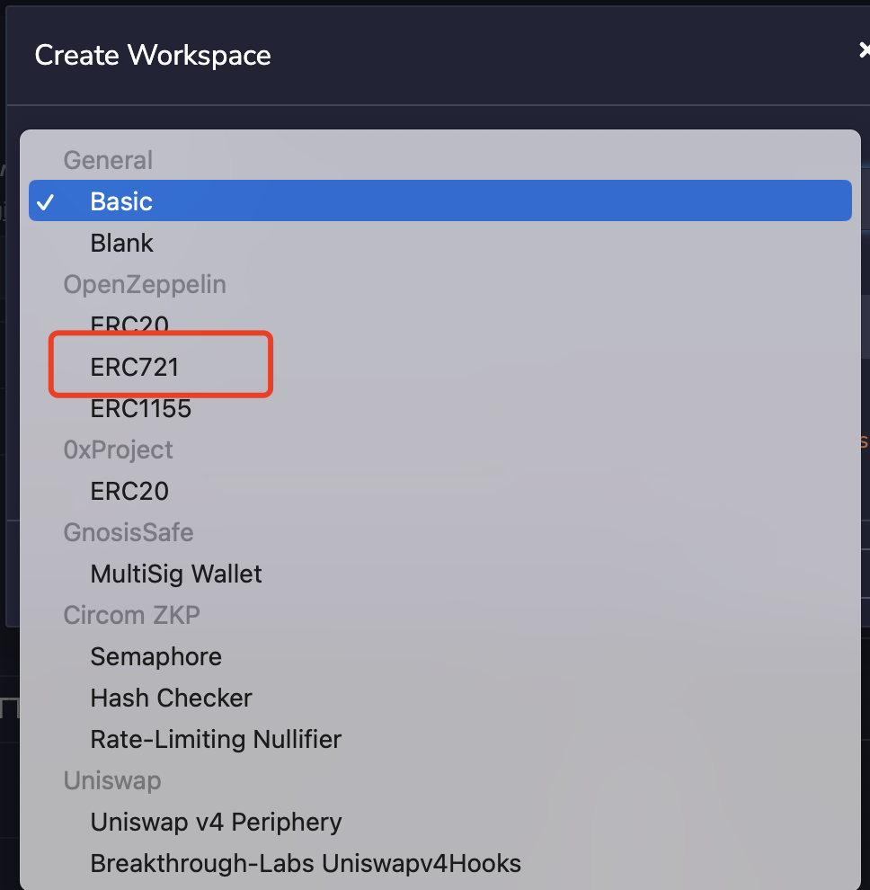 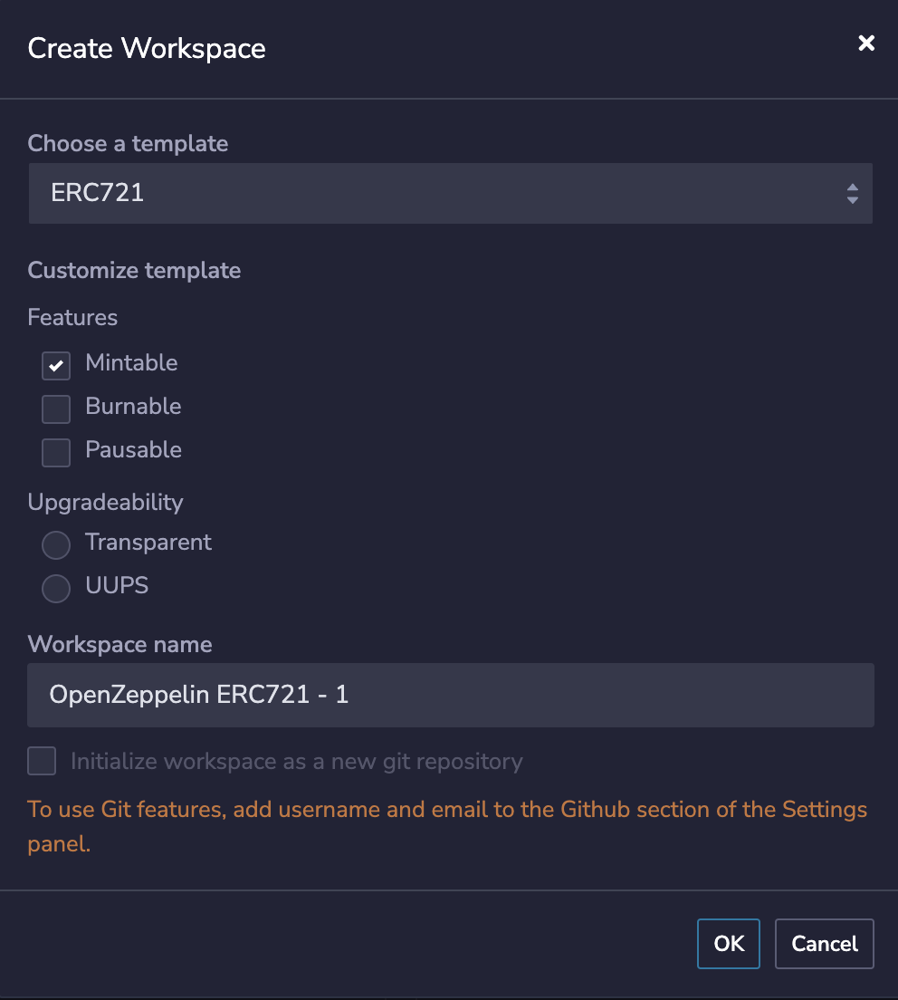

Selecting `Mintable` adds the `Mint` method to the template contract. After making your selection, click `OK`. Your new workspace will then be created, as shown below:

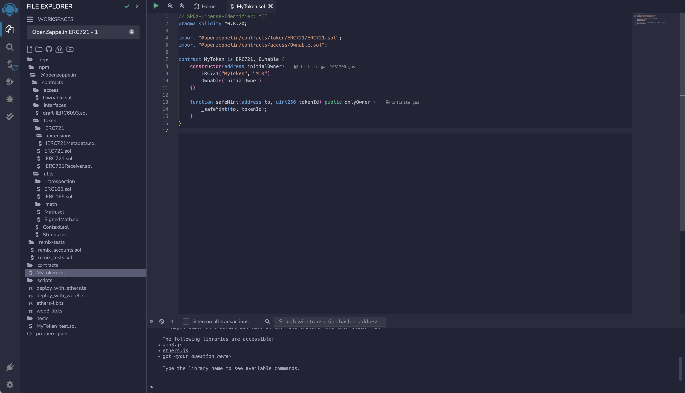 

The `.deps` directory houses the `@openzeppelin` npm package we've installed. This package provides the contract templates we reference in our contracts, as well as toolkits that these templates utilize.  
The `contracts` directory is where we save our custom-written contract files.  
The `scripts` folder contains scripts that are automatically generated for contract deployment. By executing the JavaScript files here, you can deploy contracts.  
The `tests` directory includes some automatically generated test files for validation.

The `ERC721` contract template from `@openzeppelin` is found in `contracts/MyToken.sol`. Let's go over the contents of this contract briefly.

1. The first line is a comment indicating the software license used for this code, which is the `MIT license`. If the license is not specified, you'll see a warning during compilation, although the program will still run. In Solidity, comments are written with `//` followed by the comment text, which is not executed by the program.
2. The second line specifies the version of `Solidity` that this source file is compatible with. It indicates that the file will not compile with versions below `0.8.20` or versions `0.9.0` and above, with the caret (`^`) indicating the upper limit. Solidity statements conclude with a semicolon (`;`).
3. Lines 4-5 import external Solidity files, incorporating them as part of the same Solidity contract as the original file.
4. Line 7 declares a contract named `MyToken`, using `is` to denote inheritance from the imported `ERC721` and `Ownable` contracts.
5. Lines 8-10 detail the constructor where parameters required by the inherited contracts are provided: the `ERC721` contract receives the token's `name` and `symbol`, while the `Ownable` contract receives the owner's address.
6. Lines 13-15 define a public method named `safeMint`, which requires an address-type parameter `to` and a uint256-type parameter `tokenId`. This method calls a private method `_safeMint()` from ERC721.sol, passing the `to` and `tokenId` parameters.

Next, we will add some custom features to our contract template.

## Contract Development

Let's delve into writing additional contract functionality and testing compilation.

In the upcoming code, we'll implement a new mint method to replace the default `safeMint`. This new mint method will align with the methods used in previous chapters, allowing us to substitute this new contract for course contracts once deployed.

Key changes include:

1. Setting the initialOwner to be the contract issuer, simplifying deployment by eliminating the need to specify an initialOwner.
2. Defining a private uint256 variable named `_nextTokenId`, which tracks the current progress and increments with each new NFT minted.
3. Requiring a uint256 parameter named `quantity` in the mint method, which specifies the number of NFTs to mint; for simplicity, the logic will restrict minting to one at a time.
4. Removing the `onlyOwner` modifier so anyone can call the mint method.
5. Adding the `payable` modifier so callers can transfer funds to the contract when invoking the mint method.
6. Changing `_safeMint` to `_mint`, primarily to avoid errors when testing via Remix contract calls later, and altering 'to' to `msg.sender`, indicating that NFTs are minted to the address of the transaction initiator.

The code is as follows:

```diff
// SPDX-License-Identifier: MIT
pragma solidity ^0.8.20;

import "@openzeppelin/contracts/token/ERC721/ERC721.sol";
import "@openzeppelin/contracts/access/Ownable.sol";

contract MyToken is ERC721, Ownable {
+    uint256 private _nextTokenId = 0;

-    constructor(address initialOwner)
+    constructor()
        ERC721("MyToken", "MTK")
-        Ownable(initialOwner)
+        Ownable(msg.sender)
    {}

-    function safeMint(address to, uint256 tokenId) public onlyOwner {
+    function mint(uint256 quantity) public payable {
+        require(quantity == 1, "quantity must be 1");
+        require(msg.value == 0.01 ether, "must pay 0.01 ether");
+        uint256 tokenId = _nextTokenId++;
-        _safeMint(to, tokenId);
+        _mint(msg.sender, tokenId);
    }
}
```
> In Solidity, `private` methods and variables are accessible only within the contract itself. In contrast, `public` methods and variables can be accessed by anyone.

## Testing Contracts

1. Unit Testing Plugin

To get started with unit testing in Remix, click the `Plugin manager` icon located at the bottom left of the interface. In the search bar, type `unit` to find the `SOLIDITY UNIT TESTING` plugin. Click `Activate` to install and enable it, as shown below:

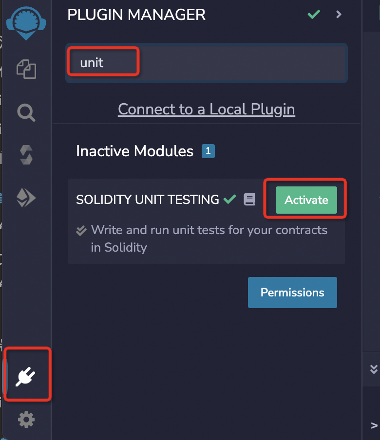

Once the installation is complete, you'll see a `Solidity unit testing` icon in the left sidebar. Click it to open the plugin in the side panel. The plugin interface should appear as follows:

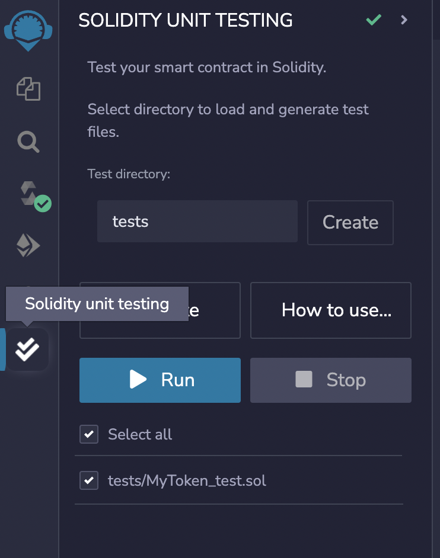

2. Unit Test File

Remix includes a built-in `assert` library for testing, which you can read more about in the [documentation](https://remix-ide.readthedocs.io/en/latest/assert_library.html). Additionally, Remix supports specific functions in test files to organize your tests. These functions include:

- `beforeEach()`: Executes before each individual test.
- `beforeAll()`: Executes once before all tests.
- `afterEach()`: Executes after each individual test.
- `afterAll()`: Executes once after all tests are completed.

You'll find the unit test file for our contract in the `tests/MyToken_test.sol` directory. Our template contract automatically created this test contract. If you start with a new, empty folder, click the `Generate` button to create a test file, as shown below:

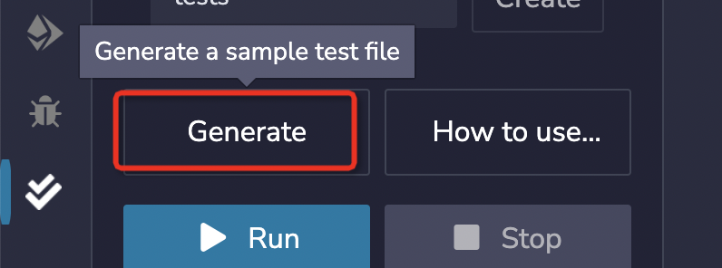

Next, open the test file `tests/MyToken_test.sol` in the `File explorer` and add the following test code:

1. `remix_tests.sol` is automatically included by Remix.
2. `remix_accounts.sol` generates test account addresses.
3. `../contracts/MyToken.sol` imports the contract file you previously wrote.
4. In `beforeAll()`, create an instance of the `MyToken` contract, named `s`, and save one of the test addresses from `TestsAccounts.getAccount(0)` as `acc0`.
5. The function `testTokenNameAndSymbol()` checks that after the contract is instantiated, the `name()` method returns `MyToken`, and the `symbol()` method returns `MTK`.
6. Define a function called `testMint()`, invoke the `mint(1)` method, and verify that after minting, the `balanceOf()` method returns 1.

Here is the code for the file `tests/MyToken_test.sol`:

```solidity
// SPDX-License-Identifier: GPL-3.0

pragma solidity >=0.8.0 <0.9.0;
import "remix_tests.sol";
import "remix_accounts.sol";
import "../contracts/MyToken.sol";

contract MyTokenTest {
    MyToken s;
    function beforeAll () public {
        s = new MyToken();
    }

    function testTokenNameAndSymbol () public {
        Assert.equal(s.name(), "MyToken", "token name did not match");
        Assert.equal(s.symbol(), "MTK", "token symbol did not match");
    }
    /// #value: 10000000000000000
    function testMint() public payable {
        s.mint{value: msg.value}(1);
        Assert.equal(s.balanceOf(address(this)), 1, "balance did not match");
    }
}
```

In Remix, unit testing is conducted by invoking the contract you wish to test from within another contract dedicated to testing. For further information, refer to the [Remix Unit Testing Plugin Documentation](https://remix-ide.readthedocs.io/en/latest/unittesting.html).

### Running Unit Tests

Once your test scripts are ready, select the relevant file and click `Run` to initiate the tests. The tests will execute in an isolated environment. After the execution concludes, a test summary will appear, as illustrated below:

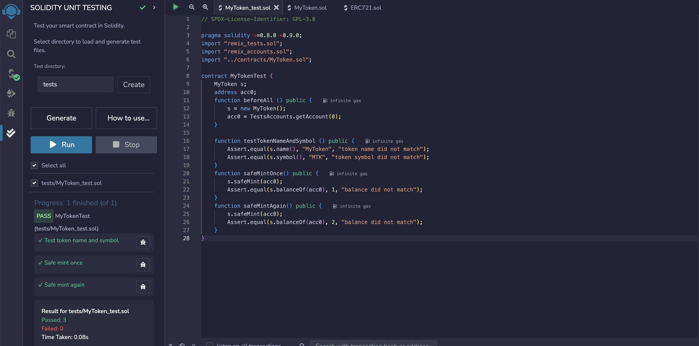

This completes the unit testing process for your contract.

If you prefer using Chai and Mocha for testing, Remix accommodates these tools too.

> Chai is a BDD/TDD assertion library for Node.js and browsers, compatible with any JavaScript testing framework. Mocha is a comprehensive JavaScript test framework that simplifies asynchronous testing on Node.js and in the browser.

To use these tools, create a `js` file in your workspace, ideally in the `scripts` folder. Right-click to create the file, write your test code within it, and then click `Run`. It should resemble this setup:

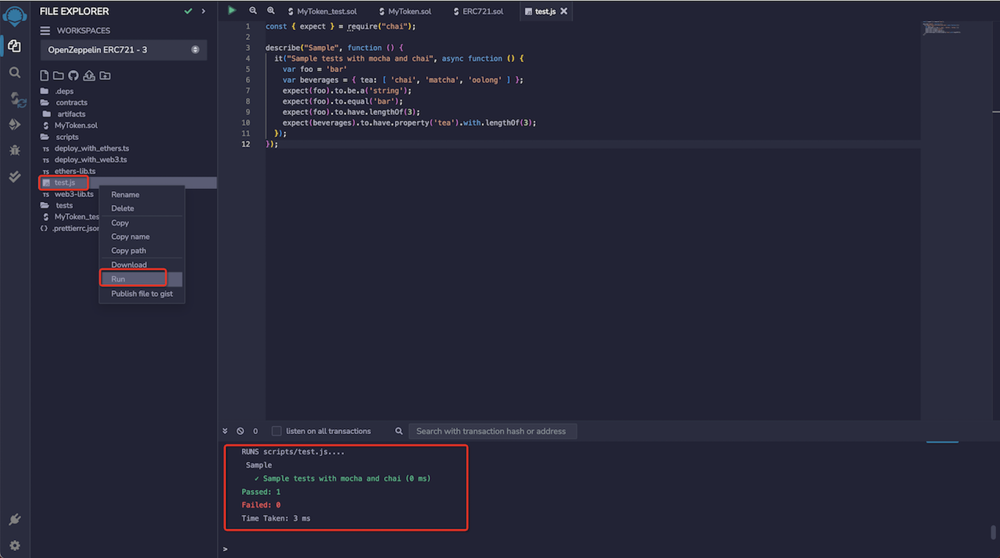

Click `Run` to execute the tests, and the results will display in the terminal.

This example demonstrates a practical testing strategy. If you're comfortable with this method, Remix fully supports it.

Next, we'll compile and deploy our contract files on the blockchain.

