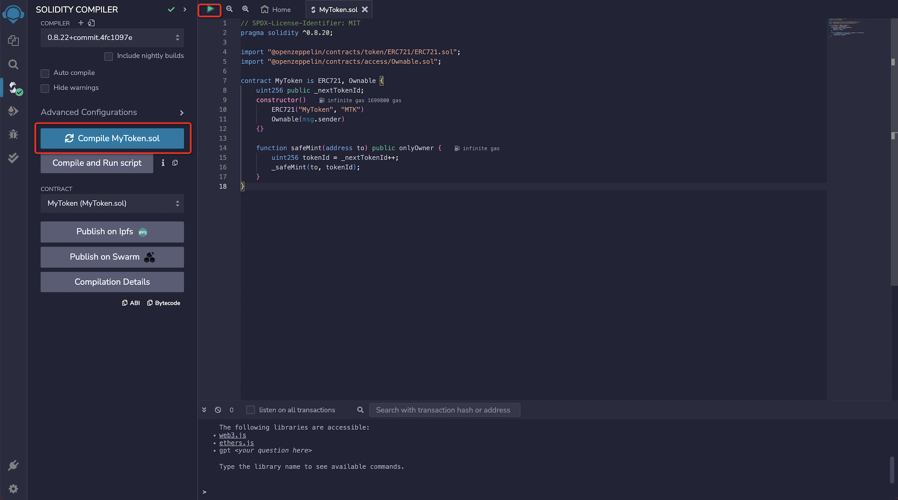
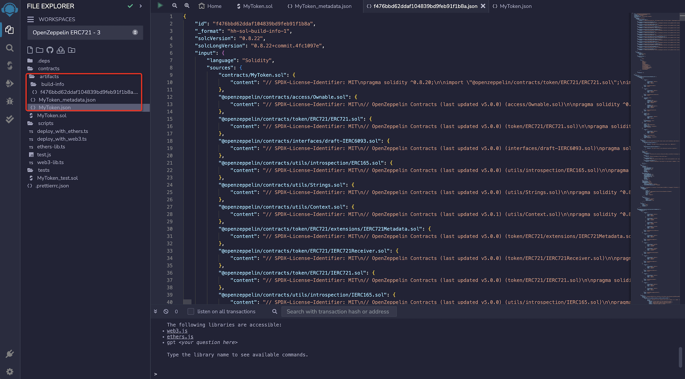
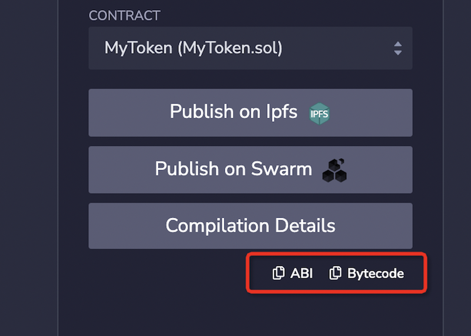
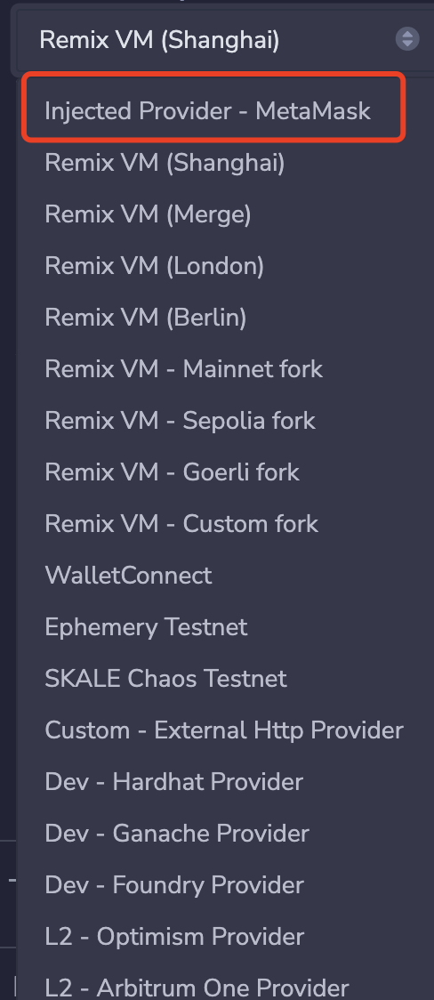
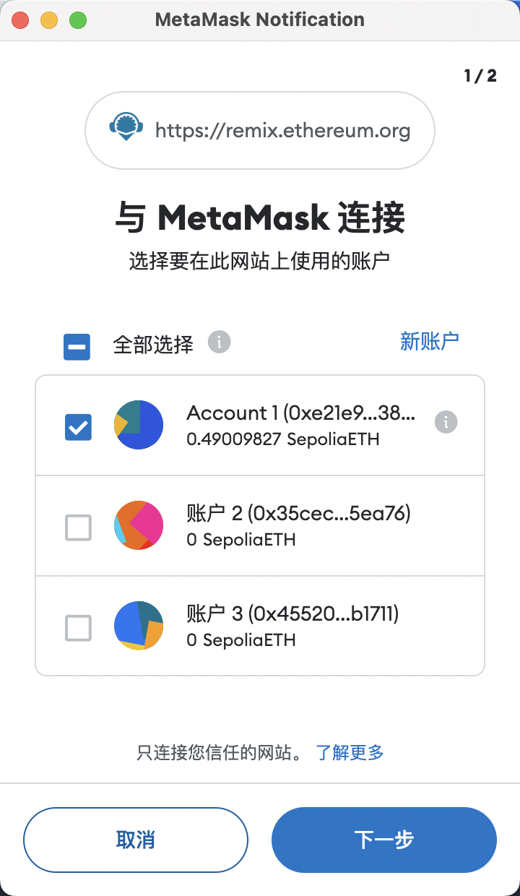
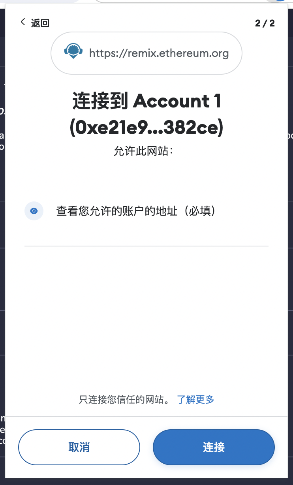
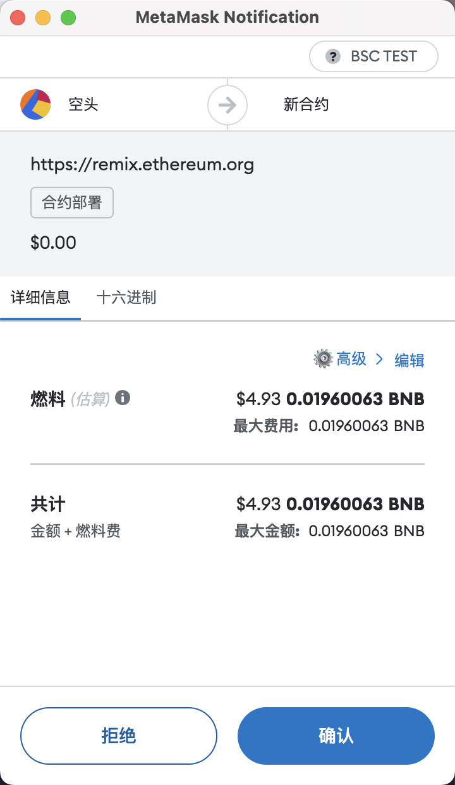
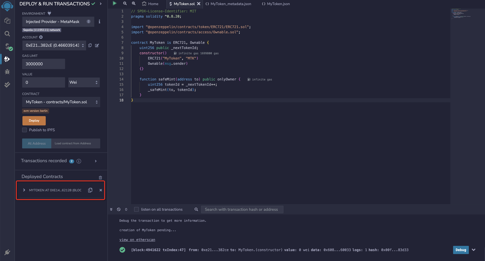
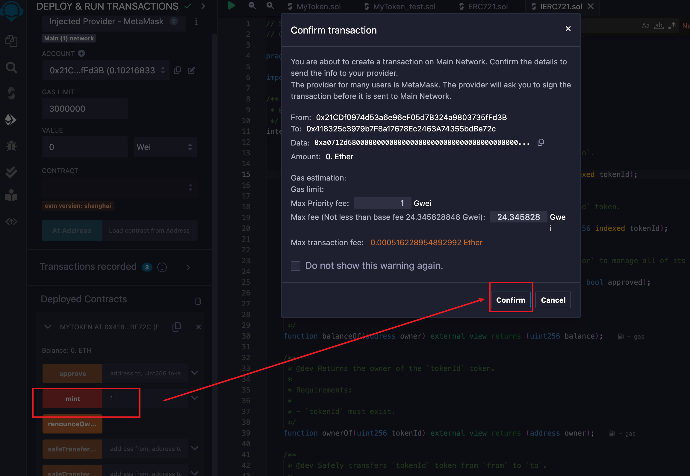
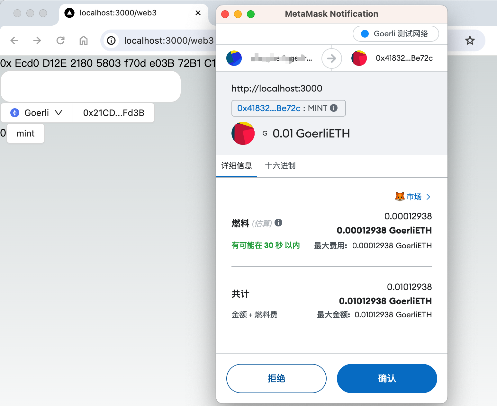

## Compilation

To begin compiling, click on the `Solidity Compiler` icon in the icon panel. You'll see the basic configuration options for the compiler. For more options, click the `Advanced Configurations` button. In the advanced menu, you can modify the EVM version, enable optimization, and set an estimate for the number of times the bytecode will be executed during the contract's lifecycle (the default is 200). For detailed information on contract optimization, refer to the [Solidity documentation on Optimizer](https://docs.soliditylang.org/en/latest/using-the-compiler.html#optimizer-options).

To compile a file, open it in the `File explorer`. If multiple files are open, make sure the one you wish to compile is selected in the editor.

You can compile a file in three ways:

- Press `Control/Command + S`
- Right-click the file in the `File explorer` and select the compile option
- Click the `Compile` button



Once compilation finishes, a green checkmark will appear beside the `Solidity Compiler` icon, as shown above. `Remix` will then generate three JSON files for each compiled contract, which you can view in the `File explorer` plugin:

1. `artifacts/<contractName>.json`: Contains links for `libraries`, `bytecode`, deployed `bytecode`, `gas estimation`, `identifiers`, and `ABI`. It helps in associating library addresses with files.
2. `artifacts/<contractName_metadata>.json`: Contains metadata from Solidity's compilation output.
3. `artifacts/build-info/<dynamic_hash>.json`: Includes information about the `solc` compiler version, compiler input, and output.

As illustrated below:



> The `ABI` is a JSON array that describes a contract's interface.

You can copy and export the ABI by clicking on it:



## Deployment

To send transactions to the current `ENVIRONMENT`, click `Deploy & Run`.

Next, we will deploy a contract to the Sepolia testnet using MetaMask. First, switch MetaMask to the Sepolia testnet (or any other testnet you are comfortable with).

From the `ENVIRONMENT` dropdown menu, select `Injected Provider - MetaMask`.

A MetaMask popup will then appear, prompting you to connect it with Remix. Once connected, the Remix side panel will display the connected network and account. Remember that deploying on a testnet requires testnet tokens, which can be obtained from online testnet faucets.





After connecting your wallet, you can proceed to deploy the contract. For a simple ERC721 smart contract, the default Gas Limit of 3 million in Remix is adequate; there is no need to specify any additional value for deployment. Follow these steps to deploy your contract:

- Ensure that `ENVIRONMENT` is set to Injected Provider - MetaMask
- Verify the connected account is correct for deployment
- Use the default GAS LIMIT: 3000000
- Set VALUE to 0
- Ensure `MyToken.sol` is the selected contract
- Click Deploy
- Click Transact to initiate the deployment
- Confirm the deployment in the MetaMask popup



Once the transaction is deployed, details will appear in the Remix terminal. By default, deployed contracts appear collapsed under the Deployed Contracts section in the side panel; click the small arrow to expand them.



Try expanding and calling the mint function as shown below:



This action will also trigger a MetaMask transaction confirmation popup. Click confirm to initiate the transaction, similar to how transactions are initiated in a DApp.

Congratulations, you have successfully deployed the contract on the testnet.

## Integrating with DApp

In the previously developed DApp, there's already a page that allows you to interact with contracts. Simply enter the contract address into the DApp to call the contract.

Apart from setting up the address, we also need to switch to the test network. The code for this is shown below:

```diff
import { createConfig, http, useReadContract, useWriteContract } from "wagmi";
- import { mainnet } from "wagmi/chains";
+ import { mainnet, sepolia } from "wagmi/chains";
import {
  WagmiWeb3ConfigProvider,
  MetaMask,
+  Sepolia,
} from "@ant-design/web3-wagmi";
import {
  Address,
  NFTCard,
  Connector,
  ConnectButton,
  useAccount,
} from "@ant-design/web3";
import { injected } from "wagmi/connectors";
import { Button, message } from "antd";
import { parseEther } from "viem";

const config = createConfig({
-  chains: [mainnet],
+  chains: [mainnet, sepolia],
  transports: {
     [mainnet.id]: http(),
+    [sepolia.id]: http(),
  },
  connectors: [
    injected({
      target: "metaMask",
    }),
  ],
});

const CallTest = () => {
  const { account } = useAccount();
  const result = useReadContract({
    abi: [
      {
        type: "function",
        name: "balanceOf",
        stateMutability: "view",
        inputs: [{ name: "account", type: "address" }],
        outputs: [{ type: "uint256" }],
      },
    ],
-    address: "0xEcd0D12E21805803f70de03B72B1C162dB0898d9",
+    address: "0x418325c3979b7f8a17678ec2463a74355bdbe72c", // use your own contract address
    functionName: "balanceOf",
    args: [account?.address as `0x${string}`],
  });
  const { writeContract } = useWriteContract();

  return (
    <div>
      {result.data?.toString()}
      <Button
        onClick={() => {
          writeContract(
            {
              abi: [
                {
                  type: "function",
                  name: "mint",
                  stateMutability: "payable",
                  inputs: [
                    {
                      internalType: "uint256",
                      name: "quantity",
                      type: "uint256",
                    },
                  ],
                  outputs: [],
                },
              ],
-             address: "0xEcd0D12E21805803f70de03B72B1C162dB0898d9",
+             address: "0x418325c3979b7f8a17678ec2463a74355bdbe72c", // use your own contract address
              functionName: "mint",
              args: [1],
              value: parseEther("0.01"),
            },
            {
              onSuccess: () => {
                message.success("Mint Success");
              },
              onError: (err) => {
                message.error(err.message);
              },
            }
          );
        }}
      >
        mint
      </Button>
    </div>
  );
};

export default function Web3() {
  return (
    <WagmiWeb3ConfigProvider
      config={config}
+      chains={[Sepolia]}
      wallets={[MetaMask()]}
    >
      <Address format address="0xEcd0D12E21805803f70de03B72B1C162dB0898d9" />
      <NFTCard
        address="0xEcd0D12E21805803f70de03B72B1C162dB0898d9"
        tokenId={641}
      />
      <Connector>
        <ConnectButton />
      </Connector>
      <CallTest />
    </WagmiWeb3ConfigProvider>
  );
};

```
Switch to the Sepolia test network on the DApp page. Click the `mint` button, and if the transaction is successful, a MetaMask confirmation window will appear:



After the transaction is confirmed, refresh the page. You should see that the `balanceOf` value has changed to `1`, indicating a successful NFT mint. Ideally, a well-designed DApp would incorporate smart contract events, listen for these events on the frontend, and automatically update the display. However, event handling is not covered in this introductory course.

## Complete Example

Here is the full example for this course:

<code src="./demo/dapp.tsx"></code>

You can also check the source code on GitHub: [https://github.com/ant-design/ant-design-web3-demo](https://github.com/ant-design/ant-design-web3-demo).

This concludes our guide on deploying and interacting with the contract. We hope you found this tutorial helpful. Thank you! 🎉
