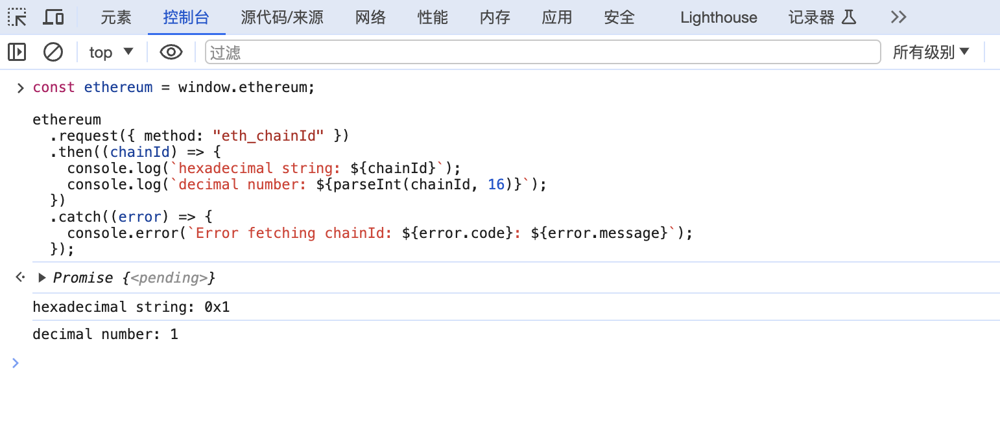

In Lecture 3, [Connect Wallet](./03_ConnectWallet/readme.md), we discussed how to connect a wallet but didn't explore the underlying principles. Two key protocols, EIP1193 and EIP6963, establish the standards for connecting wallets to decentralized applications (DApps). EIP1193 was the first of these standards, though it has some limitations that EIP6963 aims to address and improve upon.

This article will explain the fundamental concepts of these protocols to help you grasp the technical process of connecting wallets.

## EIP1193

The full specification for EIP1193 is available at [https://eips.ethereum.org/EIPS/eip-1193](https://eips.ethereum.org/EIPS/eip-1193). It outlines how DApps can use JavaScript to interact with wallets through a browser. With this specification, wallets can offer specific interfaces, which DApps can then utilize.

The specification is quite straightforward. It describes how the `ethereum` object should appear on the global `window` object within the browser at runtime, detailing its methods and events.

For a DApp, the first step is to check if `window.ethereum` exists. If it does, the DApp can interact with the wallet by calling methods on `window.ethereum`, similar to how other browser APIs like `window.localStorage` are used.

Here's a simple example to retrieve the chain ID, which is a unique identifier for different blockchain networks:

```javascript
const ethereum = window.ethereum;

ethereum
  .request({ method: "eth_chainId" })
  .then((chainId) => {
    console.log(`hexadecimal string: ${chainId}`);
    console.log(`decimal number: ${parseInt(chainId, 16)}`);
  })
  .catch((error) => {
    console.error(`Error fetching chainId: ${error.code}: ${error.message}`);
  });
```

### Exploring Ethereum Integration with Browser Consoles and EIP Standards

To observe the functionality of Ethereum-related commands, execute the following code in your browser's console:



For extended capabilities, you can adjust the parameters when you call the `request` function. The full list of supported methods is available in the [JSON-RPC API documentation](https://ethereum.org/developers/docs/apis/json-rpc). Keep in mind that some methods might not be supported by all wallets, so it’s important to implement proper error handling. Additionally, certain wallets might offer unique methods or adhere to specific conventions, so checking their documentation is recommended.

When developing a decentralized application (DApp), it is common practice to use libraries like `web3.js`, `ethers`, or `viem` to manage wallet interactions. These libraries provide a simplified interface for communicating with wallets.

### Understanding EIP1193 and its Limitations

EIP1193 outlines a standard for wallet interactions but has a notable limitation. It relies on a single `window.ethereum` object. This poses a problem when users have multiple wallets installed, as they can only select one wallet at a time. This creates competition among wallets for control over `window.ethereum`, which may degrade user experience and stifle healthy competition.

To address this, some wallets have introduced their own objects, such as `window.tokenPocket`, but this approach lacks standardization and complicates DApp development by requiring adaptations for various wallets, thus increasing development effort.

### Introducing EIP6963

EIP6963 was developed to resolve these challenges. The specification can be found at [EIP6963 documentation](https://eips.ethereum.org/EIPS/eip-6963).

Unlike EIP1193, EIP6963 does not rely on the `window.ethereum` object. Instead, it utilizes events dispatched on the `window` object, which allows multiple wallets to coexist without conflict. This standard enables wallets to notify DApps of their presence through event dispatching, allowing users to choose their preferred wallet seamlessly.

From a technical perspective, this involves using the browser's `window.addEventListener` to listen for wallet-related events and `window.dispatchEvent` to send out notifications. All related messages are prefixed with `eip6963:`, and detailed message definitions can be found in the EIP6963 specification.

For developers, leveraging community libraries can simplify the adoption of EIP6963, much like with EIP1193. For example, with the `wagmi` library, you can enable EIP6963 support by configuring the [multiInjectedProviderDiscovery](https://wagmi.sh/core/api/createConfig#multiinjectedproviderdiscovery).

Similarly, when using [Ant Design Web3](https://web3.ant.design/zh-CN/components/wagmi#eip6963), you can configure the `WagmiWeb3ConfigProvider`'s `eip6963` to integrate EIP6963 into your DApp. This setup will automatically detect available wallets and facilitate user connections.

Below is an example update based on a previous course example to illustrate these concepts.

```diff
export default function Web3() {
  return (
    <WagmiWeb3ConfigProvider
      config={config}
      wallets={[MetaMask()]}
+     eip6963={{
+       autoAddInjectedWallets: true,
+     }}
    >
      <Address format address="0xEcd0D12E21805803f70de03B72B1C162dB0898d9" />
      <NFTCard
        address="0xEcd0D12E21805803f70de03B72B1C162dB0898d9"
        tokenId={641}
      />
      <Connector>
        <ConnectButton />
      </Connector>
      <CallTest />
    </WagmiWeb3ConfigProvider>
  );
}
```

In this setup, `eip6963` is configured to facilitate wallet connections using the EIP6963 protocol, preventing potential conflicts between multiple wallets. Additionally, the `autoAddInjectedWallets` feature has been incorporated to automatically include detected wallets in the Ant Design Web3 UI. This enhancement improves the user experience by allowing users to choose from wallets they have already installed.

## Summary

EIP1193 and EIP6963 both interact with wallets via the browser's JavaScript API. They require wallets to inject objects or send events to the DApp's runtime, which can occur through a browser extension like Chrome or when accessing a DApp through a wallet's built-in browser.

However, there are scenarios where users might not have installed extensions or are using a mobile browser that doesn't support extensions. Additionally, users might need to connect to a DApp with a wallet client installed on a different device. Unfortunately, neither EIP1193 nor EIP6963 fully supports these situations. Therefore, alternative methods, such as WalletConnect, are necessary for connecting wallets. The following section will explain how to use WalletConnect to connect wallets.
