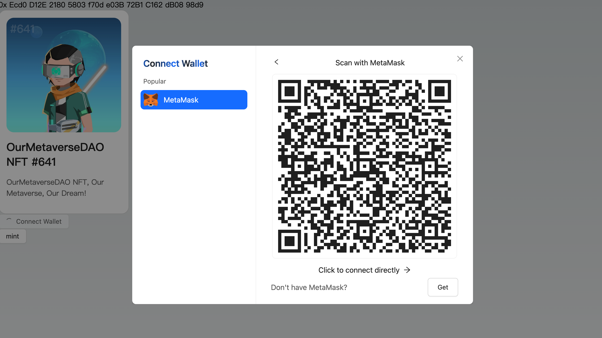

This session will guide you on using [WalletConnect](https://walletconnect.com/) for linking mobile app wallets, a key aspect of improving the user experience in decentralized applications (DApps).

---

## Understanding WalletConnect

In earlier lessons, we explored how to connect browser extension wallets within DApps. However, many users prefer to link their mobile wallet apps to a DApp accessed on a computer or connect the wallet on their phone when using a DApp through a mobile browser.

In these scenarios, since users are not on a PC browser, it's not feasible to connect wallets via browser extensions. The WalletConnect protocol addresses this challenge by using server-side relays to establish a connection between the wallet and the DApp.

WalletConnect is an open-source protocol, developed and maintained by the non-profit WalletConnect Foundation. It allows users to connect their mobile wallet applications to DApps without needing any browser extensions.

## How WalletConnect Functions

Let's begin by exploring what the WalletConnect protocol involves. It adheres to the [EIP-1328](https://eips.ethereum.org/EIPS/eip-1328) standard, which defines its framework. 

```
request       = "wc" ":" topic [ "@" version ][ "?" parameters ]
topic         = STRING
version       = 1*DIGIT
parameters    = parameter *( "&" parameter )
parameter     = key "=" value
key           = STRING
value         = STRING
```

This document specifies the parameters for a URI, with distinctions between versions 1.0 and 2.0.

Here's a breakdown of the parameters for version 2.0:

- `symKey`: This is the symmetric key utilized for message encryption through the relay.
- `methods`: Lists the supported JSON-RPC methods.
- `relay-protocol`: Indicates the transport protocol employed by the relay messaging service.
- `relay-data (optional)`: Contains data relevant to the relay messaging protocol, potentially including configuration details required by specific protocols.
- `expiryTimestamp (optional)`: Specifies when the pairing will expire, generally aligning with the expiration of the symmetric key for the relay service.

For illustration, consider the following example: 

```
wc:02c2d94b12d9fde35a149a3620544892b98ea14d45832c9bbd903af9d57d3ea9@2?expiryTimestamp=1710298160&relay-protocol=irn&symKey=8327616fa992557f5d125fe5397116c73ace7f368ac6183724052b1bcb917414
```

In this context, `relay-protocol` refers to the protocol being used, which is typically `irn`. This protocol is defined by WalletConnect, as detailed in their [documentation](https://specs.walletconnect.com/2.0/specs/servers/relay/relay-server-rpc). Let's explore how this protocol facilitates wallet connections.

When you connect a wallet to a DApp using WalletConnect, you might notice that the browser sends requests to `wss://relay.walletconnect.com`.


These requests use the WebSocket protocol, which allows for two-way communication. The requests are routed through WalletConnect's relay server, establishing a connection between the wallet and the DApp. The address `wss://relay.walletconnect.com` is the default for the `irn` protocol. For those interested, WalletConnect's official documentation offers guidance on setting up your own relay server.

According to [EIP-1328](https://eips.ethereum.org/EIPS/eip-1328), WalletConnect 2.0 is highly flexible because it primarily defines a URI specification. The `irn` protocol, however, specifies additional details like message formats, encryption methods, and transmission protocols. Most wallets currently support the `irn` protocol, making it the standard choice for connections. When we refer to the WalletConnect protocol, we're often including aspects of the `irn` protocol. While the protocol is complex, DApps typically don't need to worry about these intricacies. We'll now look at how to integrate WalletConnect into a DApp.

## How to Use WalletConnect

Here's a guide on using WalletConnect to connect wallets within the DApp for this course.

In wagmi, WalletConnect support is built-in through the [WalletConnect SDK integration](https://wagmi.sh/core/api/connectors/walletConnect). Integration is straightforward when combined with Ant Design Web3's [ConnectModal](https://web3.ant.design/components/connect-modal-cn) component.

First, include `walletConnect` in the wagmi configuration.

```diff
- import { injected } from "wagmi/connectors";
+ import { injected, walletConnect } from "wagmi/connectors";

const config = createConfig({
  chains: [mainnet],
  transports: {
    [mainnet.id]: http(),
  },
  connectors: [
    injected({
      target: "metaMask",
    }),
+    walletConnect({
+      projectId: 'c07c0051c2055890eade3556618e38a6',
+      showQrModal: false,
+    }),
  ],
});
```

For testing purposes, Ant Design Web3 provides a `projectId`. If you're working on a real project, you'll need to obtain your own `projectId` by registering at [https://cloud.walletconnect.com/](https://cloud.walletconnect.com/). The `showQrModal` setting is used to turn off the default ConnectModal popup, preventing multiple popups from appearing.

Once you incorporate `walletConnect`, it's ready for immediate use. Ant Design Web3 automatically checks if the wallet supports WalletConnect. If it does, a QR code will appear in the ConnectModal, allowing users to connect by scanning it, even if the wallet plugin isn't installed on their device.



Additionally, you have the option to add a separate WalletConnect wallet selection. This can be useful for providing users with more connectivity options or for specific project requirements.

```diff
import {
  Address,
  ConnectButton,
  Connector,
  NFTCard,
  useAccount,
} from "@ant-design/web3";
import {
  MetaMask,
  WagmiWeb3ConfigProvider,
+  WalletConnect,
} from "@ant-design/web3-wagmi";
import { Button, message } from "antd";
import { parseEther } from "viem";
import { createConfig, http, useReadContract, useWriteContract } from "wagmi";
import { mainnet } from "wagmi/chains";
import { injected, walletConnect } from "wagmi/connectors";

//...

export default function Web3() {
  return (
    <WagmiWeb3ConfigProvider
      config={config}
-      wallets={[MetaMask()]}
+      wallets={[MetaMask(), WalletConnect()]}
    >
      <Address format address="0xEcd0D12E21805803f70de03B72B1C162dB0898d9" />
      <NFTCard
        address="0xEcd0D12E21805803f70de03B72B1C162dB0898d9"
        tokenId={641}
      />
      <Connector>
        <ConnectButton />
      </Connector>
      <CallTest />
    </WagmiWeb3ConfigProvider>
  );
}
```

The full code is available in [web3.tsx](./web3.tsx) for cross-examination.
