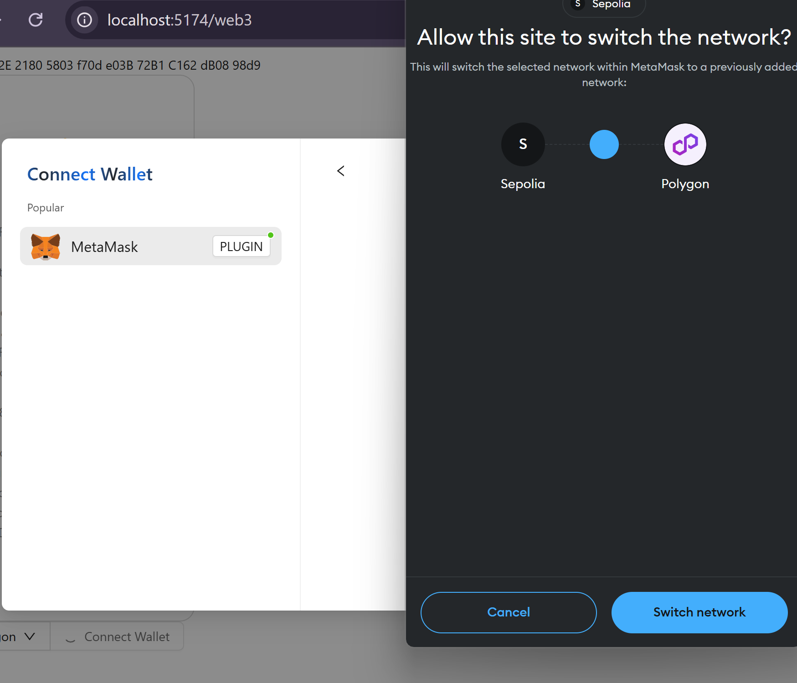

## Multi-Chain Support in DApps

Ethereum offers not only a mainnet and various testnets but also a rich Layer 2 ecosystem. For certain decentralized applications (DApps), there may be a need to connect with different blockchain networks. This session will guide developers on integrating multiple blockchains within a DApp.

### What is Multi-Chain Support?

Supporting multiple blockchains in a DApp allows it to function and interact across different blockchain platforms. Rather than being confined to a single blockchain ecosystem, the DApp can leverage the unique advantages of each platform, such as enhanced functionality, improved user experience, or increased efficiency. This capability enables users to transfer assets like tokens from one blockchain to another using technologies like blockchain bridges. As a result, DApps can utilize these assets across different chains. Each blockchain has its own set of features, like varying transaction speeds and fees, and distinct user communities. By supporting multiple blockchains, a DApp can attract and unify users from these diverse communities.

### How to Implement Multi-Chain Support

To enable multi-chain functionality in a DApp, developers typically use technologies such as cross-chain bridges, multi-version smart contract management, and inter-chain communication protocols. Although this can make development and maintenance more complex, the scalability and diversity benefits encourage many DApps to adopt multi-chain support.

### Coding for Multi-Chain NFT Contracts

Let's consider a multi-chain NFT (Non-Fungible Token) contract. Several strategies can enable NFTs to operate across multiple blockchains:

1. **Cross-Chain Bridges**: These are commonly used to transfer assets between blockchains. An NFT can be "wrapped" and moved from one chain to another, allowing the DApp to use the "wrapped" asset on the target chain.

2. **Sidechains**: These auxiliary chains extend the main chain’s capabilities. NFTs can move between the main chain and its sidechains, providing liquidity across related blockchains.

3. **Cross-Chain Protocols**: Protocols like Cosmos or Polkadot create interoperable ecosystems between blockchains, facilitating easy movement of NFTs across compatible networks.

4. **Multi-Chain Smart Contracts**: Some projects use smart contracts that function on multiple blockchains, ensuring the NFT's attributes and ownership remain consistent across all chains.

5. **Decentralized Identity and Metadata Storage**: Using decentralized storage solutions like IPFS (InterPlanetary File System) ensures that, even if NFT tokens exist on different blockchains, their associated content remains unified and persistent.

In previous sessions [Lecture 4](./04_CallContract/readme.md) and [Lecture 5](./05_Events/readme.md), we covered how to invoke contracts and listen for events. Building on this foundation, we will now explore how to modify code to support multiple blockchains in a DApp.

```diff
import { createConfig, http, useReadContract, useWriteContract } from "wagmi";
- import { mainnet, sepolia } from "wagmi/chains";
+ import { mainnet, sepolia, polygon } from "wagmi/chains";
import {
  WagmiWeb3ConfigProvider,
  MetaMask,
  Sepolia,
+ Polygon
} from "@ant-design/web3-wagmi";
import {
  Address,
  NFTCard,
  Connector,
  ConnectButton,
  useAccount,
+ useProvider
} from "@ant-design/web3";
import { injected } from "wagmi/connectors";
import { Button, message } from "antd";
import { parseEther } from "viem";

const config = createConfig({
- chains: [mainnet, sepolia],
+ chains: [mainnet, sepolia, polygon],
  transports: {
    [mainnet.id]: http(),
    [sepolia.id]: http(),
+   [polygon.id]: http(),
  },
  connectors: [
    injected({
      target: "metaMask",
    }),
  ],
});

+ const contractInfo = [
+  {
+    id:1,
+    name: "Ethereum",
+    contractAddress: "0xEcd0D12E21805803f70de03B72B1C162dB0898d9"
+  }, {
+    id:5,
+    name: "Sepolia",
+    contractAddress: "0x418325c3979b7f8a17678ec2463a74355bdbe72c"
+  }, {
+    id:137,
+    name: "Polygon",
+    contractAddress: "0x418325c3979b7f8a17678ec2463a74355bdbe72c"
+  }
+ ]

const CallTest = () => {
  const { account } = useAccount();
+ const { chain } = useProvider();
  const result = useReadContract({
    abi: [
      {
        type: "function",
        name: "balanceOf",
        stateMutability: "view",
        inputs: [{ name: "account", type: "address" }],
        outputs: [{ type: "uint256" }],
      },
    ],
-   // Sepolia test contract 0x418325c3979b7f8a17678ec2463a74355bdbe72c
-   address: "0xEcd0D12E21805803f70de03B72B1C162dB0898d9",
+   address: contractInfo.find((item) => item.id === chain?.id)?.contractAddress as `0x${string}`,
    functionName: "balanceOf",
    args: [account?.address as `0x${string}`],
  });
  const { writeContract } = useWriteContract();

  return (
    <div>
      {result.data?.toString()}
      <Button
        onClick={() => {
          writeContract(
            {
              abi: [
                {
                  type: "function",
                  name: "mint",
                  stateMutability: "payable",
                  inputs: [
                    {
                      internalType: "uint256",
                      name: "quantity",
                      type: "uint256",
                    },
                  ],
                  outputs: [],
                },
              ],
-             address: "0xEcd0D12E21805803f70de03B72B1C162dB0898d9",
+             address: contractInfo.find((item) => item.id === chain?.id)?.contractAddress as `0x${string}`,
              functionName: "mint",
              args: [1],
              value: parseEther("0.01"),
            },
            {
              onSuccess: () => {
                message.success("Mint Success");
              },
              onError: (err) => {
                message.error(err.message);
              },
            }
          );
        }}
      >
        mint
      </Button>
    </div>
  );
};

export default function Web3() {
  return (
    <WagmiWeb3ConfigProvider
      config={config}
-     chains={[Sepolia]}
+     chains={[Sepolia, Polygon]}
      wallets={[MetaMask()]}
    >
      <Address format address="0xEcd0D12E21805803f70de03B72B1C162dB0898d9" />
      <NFTCard
        address="0xEcd0D12E21805803f70de03B72B1C162dB0898d9"
        tokenId={641}
      />
      <Connector>
        <ConnectButton />
      </Connector>
      <CallTest />
    </WagmiWeb3ConfigProvider>
  );
}
```
When you click to switch the network to `Polygon`, a popup window will appear:



The `useProvider` feature from `@ant-design/web3` gives us access to information about the current blockchain network. With the chain ID acquired after switching, we can identify the contract addresses for various networks stored in our `contractInfo`. This functionality allows us to check balances and execute transactions on different networks by using the `mint` button, directing actions to the appropriate contract addresses on those networks.
