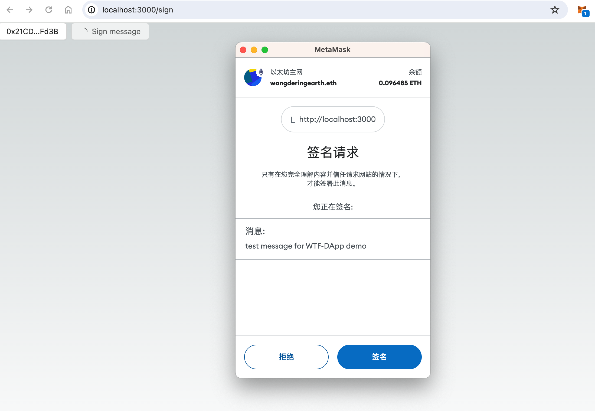

Signature verification is a crucial process in ensuring secure transactions. In this lesson, we'll explore how to implement client-side signing and server-side verification.

---

## Why are Signatures Important?

In decentralized applications (DApps), user identities are typically tied to blockchain addresses, with each address representing a unique user. In traditional systems, we authenticate users using methods like passwords and SMS codes. But how do we confirm that someone is the rightful owner of a blockchain address in a DApp?

Previously, we demonstrated how to connect to a blockchain address by accessing the user's wallet, allowing the DApp to retrieve the address. However, just having access to an address doesn't confirm ownership. Should we permit users to manage related assets in the DApp simply because they've connected their address?

For assets that exist on the blockchain, this could work, as smart contract interactions require signing with the private key linked to the address. But not all assets are on-chain. If your DApp interacts with assets stored in a traditional database, you must verify that the user has the appropriate permissions.

Relying solely on wallet connections to verify ownership is unreliable because the process of retrieving an address can be deceived by client-side spoofing. Therefore, we require users to authenticate their identity by signing a message with their private key. The DApp's server then uses the corresponding public key to verify the signature, ensuring the user has the right permissions.

In this lesson, we'll create a simple example where you can sign a message and verify your identity after connecting to a wallet.



### Implementing Frontend Signature

Let's start by implementing the frontend logic. Following the steps from the previous lesson, we will quickly set up [wallet connection](../03_ConnectWallet/readme.md).

Begin by creating a new file named `pages/sign/index.tsx`. Copy the relevant code from the previous example and modify it to build a new component called `components/SignDemo`. 

This approach ensures continuity and builds on the existing framework, making it easier to integrate the new functionality.

```diff
import React from 'react';
- import { Address, ConnectButton, Connector, NFTCard } from "@ant-design/web3";
import { MetaMask, WagmiWeb3ConfigProvider } from "@ant-design/web3-wagmi";
import { createConfig, http } from 'wagmi';
import { injected } from "wagmi/connectors";
import { mainnet } from 'wagmi/chains';
+ import SignDemo from '../../components/SignDemo';


const config = createConfig({
  chains: [mainnet],
  transports: {
    [mainnet.id]: http(),
  },
  connectors: [
    injected({
      target: "metaMask",
    }),
  ],
});
const Demo:React.FC = () => {
  return (
    <WagmiWeb3ConfigProvider eip6963 config={config} wallets={[MetaMask()]}>
+       <SignDemo />
-           <Address format address="0xEcd0D12E21805803f70de03B72B1C162dB0898d9" />
-           <NFTCard
-             address="0xEcd0D12E21805803f70de03B72B1C162dB0898d9"
-             tokenId={641}
-           />
-           <Connector>
-         <ConnectButton />
-      </Connector>
    </WagmiWeb3ConfigProvider>
  );
}
export default Demo;

```
In the `SignDemo` component, you'll create a simple button for connecting a wallet. Below is the code for this button:

```tsx
import React from "react";
import { ConnectButton, Connector } from "@ant-design/web3";

const SignDemo: React.FC = () => {
  return (
    <Connector>
      <ConnectButton />
    </Connector>
  );
};
export default SignDemo;
```
We have now established the fundamental connection logic.

Next, we will enhance the logic for the signature section. To do this, we first need to utilize the `useSignMessage` hook from `wagmi` and the `useAccount` hooks from Ant Design Web3 to implement the `doSignature` function.

```diff
import React from "react";
- import { ConnectButton, Connector } from "@ant-design/web3";
+ import { ConnectButton, Connector, useAccount } from "@ant-design/web3";
+ import { useSignMessage } from "wagmi";
+ import { message } from "antd";

const SignDemo: React.FC = () => {
+  const { signMessageAsync } = useSignMessage();
+  const { account } = useAccount();

+  const doSignature = async () => {
+    try {
+      const signature = await signMessageAsync({
+        message: "test message for WTF-DApp demo",
+      });
+    } catch (error: any) {
+      message.error(`Signature failed: ${error.message}`);
+    }
+  };

  return (
    <Connector>
      <ConnectButton />
    </Connector>
  );
};
export default SignDemo;
```
Let's create a button that activates the `doSignature` method when clicked. To ensure functionality, we've configured the button's `disabled` attribute so that it only becomes active after a successful connection is established.

```diff
import React from "react";
import { ConnectButton, Connector, useAccount } from "@ant-design/web3";
import { useSignMessage } from "wagmi";
- import { message } from "antd";
+ import { message, Space, Button } from "antd";

const SignDemo: React.FC = () => {

// ...

  return (
+    <Space>
      <Connector>
        <ConnectButton />
      </Connector>
+      <Button
+        disabled={!account?.address}
+        onClick={doSignature}
+      >
+        Sign message
+      </Button>
+    </Space>
  );
};
export default SignDemo;
```

To implement the client-side signature logic, we must also handle server-side verification. As previously discussed, signatures created on the client need to be verified by the server. Let's set up the server-side verification endpoint next.

## Setting Up Server-Side Signature Verification

For verifying signatures on the server, libraries like `viem` or `ethers` are commonly used. We'll start by creating a new file named `/pages/api/signatureCheck.ts`. In Next.js, any file within the `/api` directory is automatically treated as a server-side [Vercel Function](https://vercel.com/docs/functions/quickstart).

We'll use the `viem` library to implement the server-side signature verification:

```ts
// /pages/api/signatureCheck.ts
import type { NextApiRequest, NextApiResponse } from "next";
import { createPublicClient, http } from "viem";
import { mainnet } from "viem/chains";

export const publicClient = createPublicClient({
  chain: mainnet,
  transport: http(),
});

export default async function handler(
  req: NextApiRequest,
  res: NextApiResponse
) {
  try {
    const body = req.body;
    const valid = await publicClient.verifyMessage({
      address: body.address,
      message: "test message for WTF-DApp demo",
      signature: body.signature,
    });
    res.status(200).json({ data: valid });
  } catch (err: any) {
    res.status(500).json({ error: err.message });
  }
}
```

If you're proficient with `ethers`, you can use the following code:

```tsx
const verifyMessage = async (signerAddress, signature) => {
  const recoveredAddress = ethers.utils.verifyMessage(
    "test message for WTF-DApp demo",
    signature
  );
  return recoveredAddress === signerAddress;
};
```

## Front-end API Call Signature Verification

To conclude, let's implement the logic needed to handle front-end API call signature verification. Simply copy the code provided below and paste it into the `SignDemo` component:

```tsx
const checkSignature = async (params: {
  address?: string;
  signature: string;
}) => {
  try {
    const response = await fetch("/api/signatureCheck", {
      method: "POST",
      headers: { "Content-Type": "application/json" },
      body: JSON.stringify(params),
    });
    const result = await response.json();
    if (result.data) {
      message.success("Signature success");
    } else {
      message.error("Signature failed");
    }
  } catch (error) {
    message.error("An error occurred");
  }
};
```

In the `doSignature` method, the next step is to call this function and incorporate a Loading state to indicate progress.

```diff
import React from "react";
import { ConnectButton, Connector, useAccount } from "@ant-design/web3";
import { useSignMessage } from "wagmi";
import { message, Space, Button } from "antd";

const SignDemo: React.FC = () => {
  const { signMessageAsync } = useSignMessage();
  const { account } = useAccount();
+  const [signLoading, setSignLoading] = React.useState(false);

  const doSignature = async () => {
+    setSignLoading(true);
    try {
      const signature = await signMessageAsync({
        message: "test message for WTF-DApp demo",
      });
+      await checkSignature({
+        address: account?.address,
+        signature,
+      });
    } catch (error: any) {
      message.error(`Signature failed: ${error.message}`);
    }
+    setSignLoading(false);
  };

// checkSignature here

  return (
    <Space>
      <Connector>
        <ConnectButton />
      </Connector>
      <Button
+        loading={signLoading}
        disabled={!account?.address}
        onClick={doSignature}
      >
        Sign message
      </Button>
    </Space>
  );
};
export default SignDemo;
```

To access all the relevant source files, the complete code is available in the [sign directory](../demo/pages/sign).
