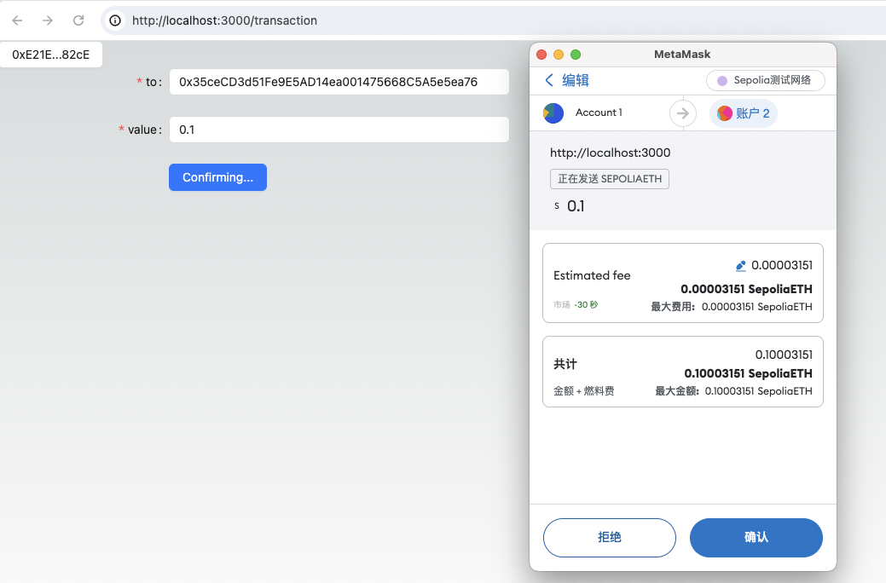

This lecture will explain how to make transfers and receive payments using blockchain technology.

---

## Transfers

In the world of blockchain, a transfer involves moving assets between participants. These assets can be cryptocurrencies like Bitcoin or Ethereum, or other digital assets such as tokens and NFTs. Transfers are logged on the blockchain and secured through the network's consensus mechanism, making them a fundamental operation in any blockchain system. Here are the key elements involved in a transfer:

- **Source Address (Sender):** The blockchain address from which the assets will be sent.
- **Destination Address (Receiver):** The blockchain address that will receive the assets.
- **Amount of Assets:** The specific amount or value of assets to be transferred.
- **Transaction Fee:** This fee is usually charged by miners or validator nodes that process the transaction. The size of this fee can affect how quickly the transaction is confirmed.
- **Network:** The specific blockchain network where the transfer takes place, such as Bitcoin or Ethereum.

Once a transfer is initiated, it must be confirmed by miners or participants in the consensus mechanism. After confirmation, the transaction is recorded in a block, which is then added to the blockchain.

The general steps for making a transfer on a blockchain are as follows:

1. The person initiating the transfer signs the transaction details with their private key and sends this information to the network.

2. Nodes (miners or validators) in the network receive and verify the transaction request, checking the validity of both the signature and the transaction itself.

3. After verification, the transfer is bundled with other transactions to create a new block.

4. This block is confirmed via the network's consensus mechanism and then added to the blockchain.

5. Upon completion, the balance at the destination address is updated to reflect the transferred assets.

The specifics of this transfer process can vary depending on the particular blockchain technology and type of asset being used.

### Initiate a Transfer

Let's start by implementing the frontend logic. Referring to the previous lessons, we will quickly set up the wallet connection as outlined [here](../03_ConnectWallet/readme.md).

Begin by creating a new file named `pages/transaction/index.tsx`. Copy the code from the previous example into this file. Then, modify it to develop a new component called `SendEth.tsx` within the `pages/transaction` directory.

```diff
  import React from "react";
  import { MetaMask, WagmiWeb3ConfigProvider} from "@ant-design/web3-wagmi";
  import { createConfig, http } from "wagmi";
  import { injected } from "wagmi/connectors";
  import { mainnet, sepolia } from "wagmi/chains";
  import { ConnectButton, Connector } from '@ant-design/web3';
+ import { SendEth } from "../../components/SendEth";


  const config = createConfig({
    chains: [mainnet, sepolia],
    transports: {
      [mainnet.id]: http(),
      [sepolia.id]: http(),
    },
    connectors: [
      injected({
        target: "metaMask",
      }),
    ],
  });
  const TransactionDemo: React.FC = () => {

    return (
      <WagmiWeb3ConfigProvider
        config={config}
        eip6963={{
          autoAddInjectedWallets: true,
        }}
        wallets={[MetaMask()]}
      >
        <Connector>
          <ConnectButton />
        </Connector>
+       <SendEth />
      </WagmiWeb3ConfigProvider>
    );
  };
  export default TransactionDemo;

```
In the `SendEth` component, set up input fields for the recipient's address (`to`) and the transaction amount (`value`). Also, include a button to execute the transfer. Here's the code for reference:

```tsx
import * as React from "react";
import { Button, Checkbox, Form, type FormProps, Input } from "antd";
import {
  type BaseError,
  useSendTransaction,
  useWaitForTransactionReceipt,
} from "wagmi";
import { parseEther } from "viem";

type FieldType = {
  to: `0x${string}`;
  value: string;
};

export const SendEth: React.FC = () => {
  const {
    data: hash,
    error,
    isPending,
    sendTransaction,
  } = useSendTransaction();

  const { isLoading: isConfirming, isSuccess: isConfirmed } =
    useWaitForTransactionReceipt({ hash });

  const onFinish: FormProps<FieldType>["onFinish"] = (values) => {
    console.log("Success:", values);
    sendTransaction({ to: values.to, value: parseEther(values.value) });
  };

  const onFinishFailed: FormProps<FieldType>["onFinishFailed"] = (
    errorInfo
  ) => {
    console.log("Failed:", errorInfo);
  };

  return (
    <Form
      name="basic"
      labelCol={{ span: 8 }}
      wrapperCol={{ span: 16 }}
      style={{ maxWidth: 600 }}
      initialValues={{ remember: true }}
      onFinish={onFinish}
      onFinishFailed={onFinishFailed}
      autoComplete="off"
    >
      <Form.Item<FieldType>
        label="to"
        name="to"
        rules={[{ required: true, message: "Please input!" }]}
      >
        <Input />
      </Form.Item>

      <Form.Item<FieldType>
        label="value"
        name="value"
        rules={[{ required: true, message: "Please input!" }]}
      >
        <Input />
      </Form.Item>

      <Form.Item wrapperCol={{ offset: 8, span: 16 }}>
        <Button type="primary" htmlType="submit">
          {isPending ? "Confirming..." : "Send"}
        </Button>
      </Form.Item>

      {hash && <div>Transaction Hash: {hash}</div>}
      {isConfirming && <div>Waiting for confirmation...</div>}
      {isConfirmed && <div>Transaction confirmed.</div>}
      {error && (
        <div>Error: {(error as BaseError).shortMessage || error.message}</div>
      )}
    </Form>
  );
};
```
In the code, we used the `Form` component from [Ant Design](https://ant.design/components/form) and hooks from `wagmi` to start a transaction and track its status. To see how this works, fill in the `to` and `value` fields, then click 'initiate'. The outcome will appear as shown in the image below:



With this, we've successfully implemented a basic transfer feature. You can try out the complete demo by visiting [https://wtf-dapp.vercel.app/transaction](https://wtf-dapp.vercel.app/transaction). Please proceed cautiously to avoid potential financial loss.

## Receiving Payments

Receiving payments on the blockchain usually involves accepting cryptocurrencies or other blockchain-based assets like tokens (including NFTs). To receive payments, provide your public address to the sender. This can be done by sharing the address directly or generating a QR code that can be easily scanned by mobile wallets.

Key points to remember:

1. Never share your private key or mnemonic phrase; this information should remain private.
2. Double-check that the address you provide is correct. An incorrect address can result in lost funds.
3. The sender is responsible for network fees (also known as "miner fees"), which can influence how fast a transaction is processed.
4. Once a blockchain transaction is initiated, it cannot be canceled; you must wait for it to be confirmed by the network.
5. Ensure you're using the correct blockchain network. For instance, only send Ether (ETH) to an Ethereum network address and Bitcoin (BTC) to a Bitcoin network address.

### QR Code Payments

`ant-design-web3` is developing a quick payment feature to facilitate QR code payments for specific wallets. This will allow users to select a blockchain, choose a wallet, and enter an amount easily. Stay tuned for updates!
