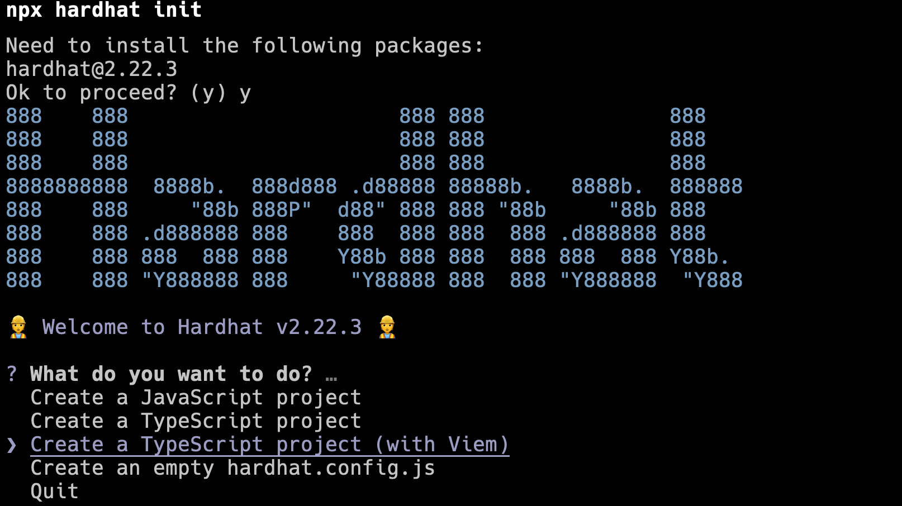
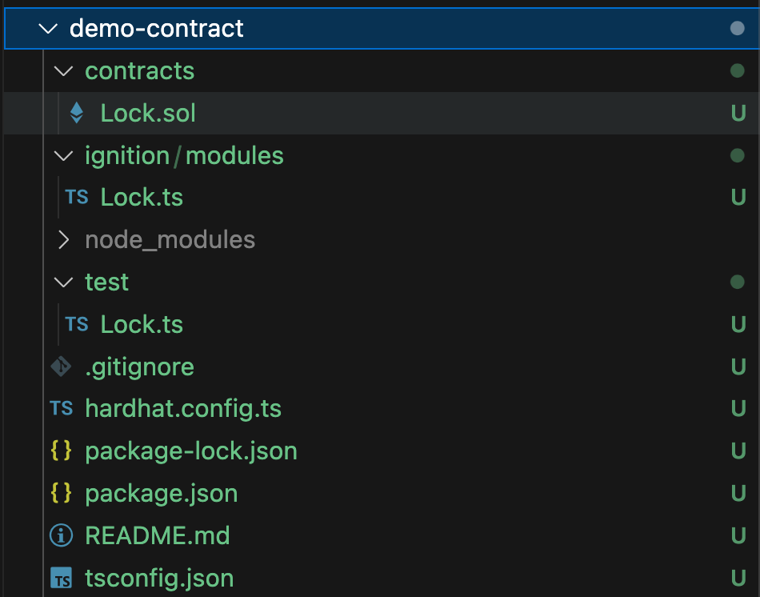
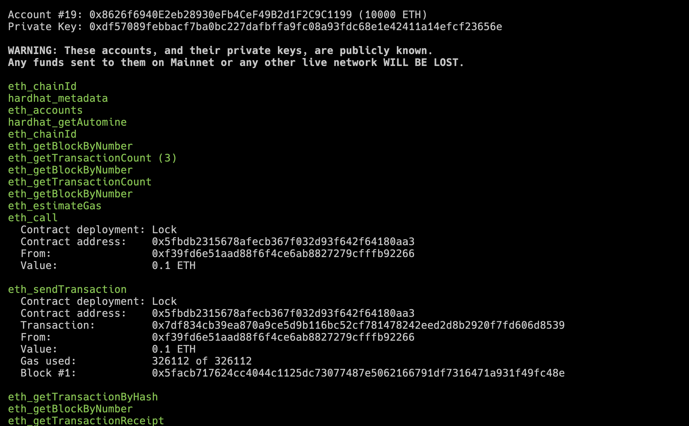
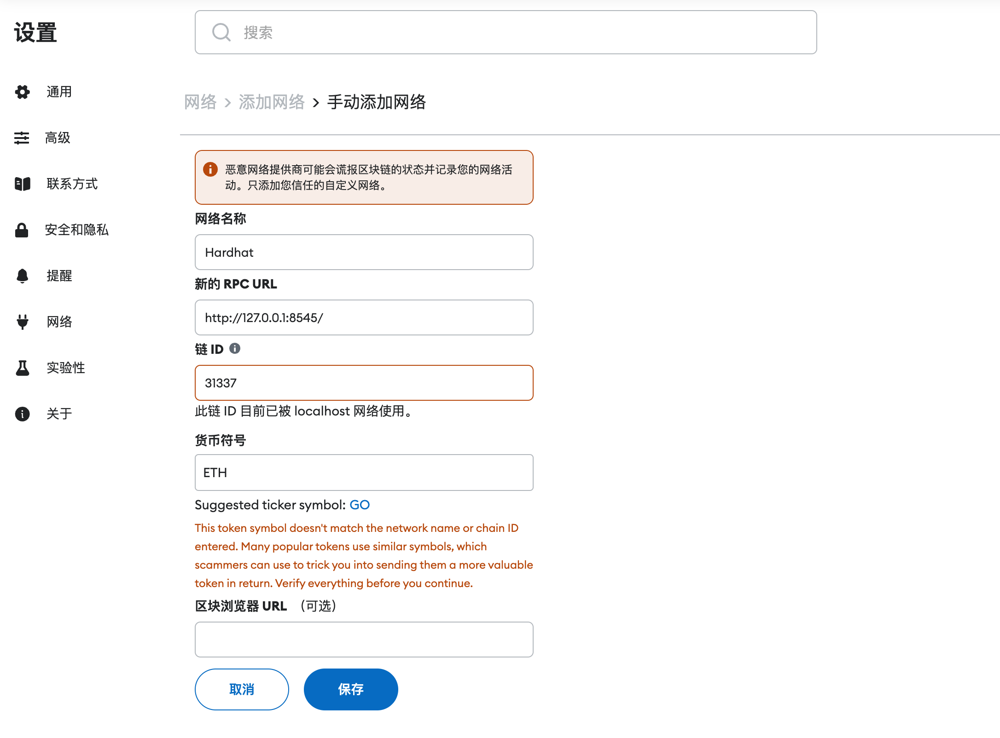
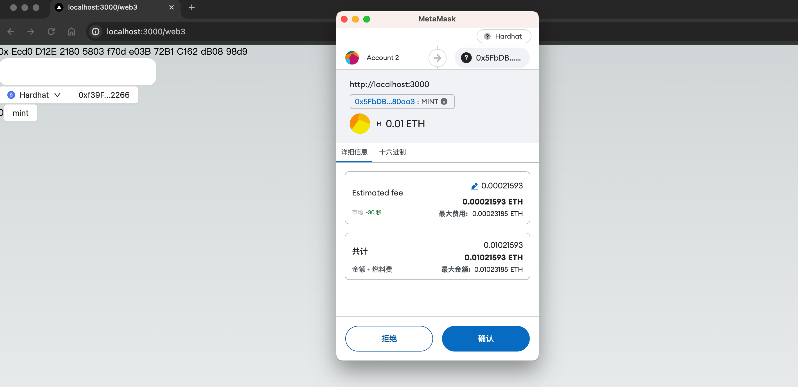

In previous lessons, we explored how to develop contracts using Remix through CloudIDE. In a local development setting, we can leverage additional tools like Git for version control to enhance development efficiency. This lesson will guide you through the process of developing and debugging contracts locally, as well as writing unit tests to verify smart contract logic.

---

## Setting Up the Project

The Ethereum ecosystem provides a variety of development tools, including [Hardhat](https://hardhat.org/) and [Foundry](https://getfoundry.sh/). For this lesson, we'll use Hardhat to establish a local development environment and transfer the contracts developed in earlier lessons to this setup.

We'll follow the [Hardhat quick start guide](https://hardhat.org/hardhat-runner/docs/getting-started) and use the following commands to quickly initialize a project:

```bash
mkdir demo-contract
cd demo-contract
npx hardhat@2.22.3 init
```

Similar to how we initialized a Next.js project in [Chapter 1](../01_QuickStart/readme.md), `npx` is a command-line tool included with Node.js. The command above automatically downloads the [Hardhat npm package](https://www.npmjs.com/package/hardhat) and runs the `init` command. We specify version `2.22.3` to ensure compatibility with this course's setup, but you can omit the version number to use the latest version available.

We select the third option, "Typescript + viem," to ensure consistency with the technical stack used in previous lessons. (Note: "viem" is a tool for Ethereum development, similar to ethers.js, used for interacting with the blockchain.)



After the setup, your project directory will look like this:



Here's what each file and folder is for:

- `contracts`: Contains Solidity contract code.
- `test`: Contains test scripts for your contracts.
- `ignition`: Houses deployment scripts for contracts, including deployment parameters.
- `hardhat.config.ts`: The configuration file for Hardhat.

## Local Development and Debugging

When you initialize the project, dependencies are installed automatically. If not, you can install them manually by running `npm i`. Once the dependencies are in place, compile the contracts using:

```bash
npx hardhat compile
```

To run the test cases, use the following command:

```bash
npx hardhat test
```

To start a local test network for debugging, execute:

```bash
npx hardhat node
```

Once the local node is running, it will automatically allocate a set of accounts for testing purposes. You can deploy your contracts to this local node with:

```bash
npx hardhat ignition deploy ./ignition/modules/Lock.ts --network localhost
```

Upon successful deployment, you can check the transaction details in the logs of your local test network. These logs are typically visible in the terminal where Hardhat node is running.



With the local environment set up, we can proceed to deploy our previously developed NFT for debugging within this environment.

## Migrating Contracts

Transfer the contract code from previous lessons, specifically [MyToken.sol](../07_ContractDev/MyToken.sol), into the `contracts` directory, and remove the example code `Lock.sol`.

Our contract depends on `@openzeppelin/contracts`, so we need to install this dependency by running:

```bash
npm install @openzeppelin/contracts
```

This ensures all necessary libraries are available for your contract. By following these steps, you'll have a fully operational local development environment ready for testing and refining your smart contracts.

```bash
npm install @openzeppelin/contracts --save
```

When creating the test file `test/MyToken.ts`, we use `test/Lock.ts` as a reference. The content of `test/MyToken.ts` is as follows:

```ts
import { loadFixture } from "@nomicfoundation/hardhat-toolbox-viem/network-helpers";
import { expect } from "chai";
import hre from "hardhat";

describe("MyToken", function () {
  async function deployFixture() {
    const token = await hre.viem.deployContract("MyToken");
    return {
      token,
    };
  }

  describe("ERC721", function () {
    describe("name", function () {
      it("Get NFT name", async function () {
        const { token } = await loadFixture(deployFixture);
        expect(await token.read.name()).to.equal("MyToken");
      });
    });
  });
});
```

This test case retrieves the name of the NFT by invoking the `name` method from the contract. This method is part of the ERC721 standard for NFT contracts.

Next, we add the file `ignition/modules/MyToken.ts` for deployment, with the following content:

```ts
import { buildModule } from "@nomicfoundation/hardhat-ignition/modules";

const MyTokenModule = buildModule("MyTokenModule", (m) => {
  const lock = m.contract("MyToken");

  return { lock };
});

export default MyTokenModule;
```

To test the contract, run `npx hardhat test`. This command will automatically compile your contract.

Next, run the following command to deploy the contract:

```bash
npx hardhat ignition deploy ./ignition/modules/MyToken.ts --network localhost
```

Once the deployment is successful, we will try to call the contract from our earlier NFT project. To proceed, follow the instructions in the previous lesson to set up the front-end project using Vite.

To add a `Hardhat` network in your code:

```diff
- import { mainnet, sepolia, polygon } from "wagmi/chains";
+ import { mainnet, sepolia, polygon, hardhat } from "wagmi/chains";
import {
  WagmiWeb3ConfigProvider,
  MetaMask,
  Sepolia,
  Polygon,
+  Hardhat,
  WalletConnect,
} from "@ant-design/web3-wagmi";

// ...

const config = createConfig({
-  chains: [mainnet, sepolia, polygon],
+  chains: [mainnet, sepolia, polygon, hardhat],
  transports: {
    [mainnet.id]: http(),
    [sepolia.id]: http(),
    [polygon.id]: http(),
+    [hardhat.id]: http("http://127.0.0.1:8545/"),
  },
  connectors: [
    injected({
      target: "metaMask",
    }),
    walletConnect({
      projectId: "c07c0051c2055890eade3556618e38a6",
      showQrModal: false,
    }),
  ],
});

const contractInfo = [
  {
    id: 1,
    name: "Ethereum",
    contractAddress: "0xe7f1725E7734CE288F8367e1Bb143E90bb3F0512",
  },
  {
    id: 5,
    name: "Sepolia",
    contractAddress: "0x418325c3979b7f8a17678ec2463a74355bdbe72c",
  },
  {
    id: 137,
    name: "Polygon",
    contractAddress: "0x418325c3979b7f8a17678ec2463a74355bdbe72c",
  },
+  {
+    id: hardhat.id,
+    name: "Hardhat",
+    contractAddress: "0x5FbDB2315678afecb367f032d93F642f64180aa3", // 这里需要替换为你本地部署后获得的地址
+  },
];

// ...

export default function Web3() {
  return (
    <WagmiWeb3ConfigProvider
      config={config}
      wallets={[MetaMask(), WalletConnect()]}
      eip6963={{
        autoAddInjectedWallets: true,
      }}
      chains={[
        Sepolia,
        Polygon,
+       Hardhat,
      ]}
    >
      <Address format address="0xEcd0D12E21805803f70de03B72B1C162dB0898d9" />
      <NFTCard
        address="0xEcd0D12E21805803f70de03B72B1C162dB0898d9"
        tokenId={641}
      />
      <Connector>
        <ConnectButton />
      </Connector>
      <CallTest />
    </WagmiWeb3ConfigProvider>
  );
}
```
To add a network in MetaMask:



You can import a test account into MetaMask using the private key shown in the console when you start with `npx hardhat node`. This will allow you to test with an account that has a balance of 10,000 ETH.

Next, open the front-end page you've launched locally at [http://localhost:3000/web3](http://localhost:3000/web3). Switch the network to Hardhat and proceed to mint NFTs.



Please note that if you restart your local Hardhat test network, you might encounter an error in MetaMask when connecting to the local RPC. An example of such an error is: `Received invalid block tag 1. Latest block number is 0`. To resolve this, go to the advanced settings in your MetaMask account and select 'Clear activity and nonce data.' If you're unsure where to find this option, it is typically located under the settings menu in MetaMask.
